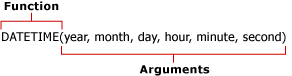

# Formulas in Report Model Queries (Report Builder and SSRS)
  Formulas are calculations performed on values in a report that use a report model as a data source. A formula can contain functions, operators, constants, and references to fields or entities. Formulas allow you to combine, aggregate, filter, and evaluate both numeric and text data. You can create formulas and save them as new fields or you can modify the formulas of existing fields.  
  
 Formulas are not RDL expressions and do not begin with an equals sign (=). For more information about RDL expressions, see [Expressions &#40;Report Builder and SSRS&#41;](expressions-report-builder-and-ssrs.md).  
  
 Formulas can look similar to any of the following:  
  
-   **Sum Line Total**  
  
-   6+12  
  
-   `SUM`(`IF`(**Finished Goods Flag**, "Finished", "Unfinished"))  
  
 After you define a formula, you can see the result in the query designer.  
  
> [!NOTE]  
>  [!INCLUDE[ssRBRDDup](../../includes/ssrbrddup-md.md)]  
  
## References  
 A reference is a field name. This can be an existing field name within the entity, or a calculated field name that you have created and added to the Fields list. The reference tells Report Builder where to look for the values, or data, you want to use within a formula. You can refer to fields within your context entity and to fields in other entities within one formula or use the value from one field in several formulas.  
  
 When you use references, the report processor runs the formula against each value within the field. For example, suppose a field contains the yearly sales total for the past five years. This field contains five values, each representing the sales total for a given year. If your formula contains a reference to this field, the formula calculates the new value using each individual value.  
  
## Operators  
 Operators specify the type of calculation that you want to perform on the values of a formula. There are three different types of calculation operators: arithmetic, comparison, and text. Operators are indicated using symbols, such as the plus sign (+).  
  
 **Arithmetic Operators.** Arithmetic operators perform basic mathematical operations such as addition, subtraction or multiplication, combine numbers, and produce numeric results.  
  
 **Comparison Operators.** You can compare two values using comparison operators. When two values are compared by using these operators, the result is a logical value, either TRUE or FALSE.  
  
 **Text Concatenation Operator.** Use the ampersand (&) to join, or concatenate, one or more text strings to produce a single piece of text.  
  
##   Constants  
 A constant is a value that is not calculated and, therefore, does not change. Report Builder uses the following constants: `True`, `False`, and `Empty`. These constants are used to evaluate Boolean fields. For example, suppose you have a field called IsDiscontinued. The only valid values for this field are True, False, or Empty (" ").  
  
##   Functions  
 Functions are predefined formulas that perform calculations by using specific values, called *arguments*, specified in a particular order. Arguments can be literal values or fields, or combinations of both. When fields are used in formulas, the field name represents each instance of the field. If the argument is a literal value, you might need to indicate that the argument is a literal value using specific characters.  
  
 Functions can be used to perform simple or complex calculations. The structure of a function begins with the function name, followed by an opening parenthesis, the arguments for the function separated by commas, and a closing parenthesis.  
  
   
  
 Arguments can be field references, numbers, text, and logical values such as `TRUE` or `FALSE`. Arguments can also be constants, formulas, or other functions. The arguments that you enter must produce a valid value for that argument. For example, if the formula is multiplying two integers, the result cannot be a text string.  
  
 Report Builder comes with the following nine categories of commonly used functions:  
  
|||  
|-|-|  
|Aggregate functions|`AVG`, `COUNT`, `COUNTDISTINCT`, `MAX`, `MIN`, `STDEV`, `STDEVP`, `SUM`, `VAR`, `VARP`|  
|Conditional functions|`IF`, `IN`, `SWITCH`|  
|Conversion functions|`INT`, `DECIMAL`, `FLOAT`, `TEXT`|  
|Date and time functions|`DATE`, `DATEADD`, `DATEDIFF`, `DATETIME`, `DATEONLY`, `DAY`, `DAYOFWEEK`, `DAYOFYEAR`, `HOUR`, `MINUTE`, `MONTH`, `NOW`, `QUARTER`, `SECOND`, `TIMEONLY`, `TODAY`, `WEEK`, `YEAR`|  
|Information functions|`GETUSERCULTURE`, `GETUSERID`|  
|Logical functions|`AND`, `NOT`, `OR`|  
|Math functions|`MOD`, `ROUND`, `TRUNC`|  
|Operators|Add (+), Divide (/), Equal to (=), Exponentiation (^), Greater than (>), Greater than or equal to (>=), Less than (<), Less than or equal to (<=), Multiply (*), Negate (-), Not equal to (<>), Subtract (-)|  
|Text functions|`CONCAT`, `FIND`, `LEFT`, `LENGTH`, `LOWER`, `LTRIM`, `REPLACE`, `RIGHT`, `RTRIM`, `SUBSTRING`, `UPPER`|  
  
  
