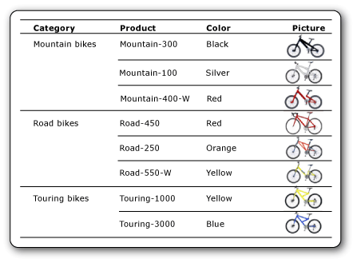

# Images (Report Builder and SSRS)
  An image is a report item that contains a reference to an image that is embedded in the report, stored in a database, stored on the report server, or stored elsewhere on the Web. An image can be a picture that is repeated with rows of data. You can also use an image as a background for certain report items.  
  
 Storing logos on a server is a good idea because you can use the same logo in many reports.  
  
> [!NOTE]  
>  [!INCLUDE[ssRBRDDup](../../includes/ssrbrddup-md.md)]  
  
##   Comparing External, Embedded, and Data-Bound Images  
 When you use a server-based or other external image in a report, the image item contains a path that points to an image on the report server or wherever it exists on the Web. When you use an embedded image, however, the image data is stored within the report definition and does not exist as a separate file.  
  
 Server-based images work well for logos and static pictures that are shared among several reports or Web pages. Embedded images ensure that the images are always available to the report, but they cannot be shared. Report definitions with external images are smaller than definitions with embedded images.  
  
 Data-bound images can also be displayed from binary data stored in a database. For example, the pictures that appear alongside product names in a product list are database images. In the following picture, the images of bicycles are stored in a database and retrieved in the report to illustrate each product.  
  
   
  

  
##   Images as Report Parts  
 You can save images separately from a report as report parts. [!INCLUDE[ssRBrptparts](../../includes/ssrbrptparts-md.md)]  
  
 
  
##   Embedding Images  
 You can embed images in a report so that all image data is stored within the report definition. When you embed an image, the image is MIME-encoded and stored as text in the report definition. Using an embedded image ensures that the image is always available to the report, but it also increases the size of the report definition.  
  
 For more information about embedding an image, see [Embed an Image in a Report &#40;Report Builder and SSRS&#41;](embed-an-image-in-a-report-report-builder-and-ssrs.md).  
  

  
##   External Images  
 You can include stored images in a report by specifying a URL to the image. When you use an external image in a report, the image source is set to `External` and the value for the image is the URL address or path to the image.  
  
 For more information, see [Specifying Paths to External Items &#40;Report Builder and SSRS&#41;](specifying-paths-to-external-items-report-builder-and-ssrs.md).  
  
 When the report is run in Report Builder or Report Designer, preview uses the credentials of the user to display the image. When the report is run on the report server, the image in the report may not be displayed if the server credentials are not sufficient to access the image. In that case, contact your system administrator.  
  
 For more information about adding an external image to a report, see [Add an External Image &#40;Report Builder and SSRS&#41;](add-an-external-image-report-builder-and-ssrs.md).  
  
 
  
##   Background Images  
 You can use an image as a background image in the body of the report or in a rectangle, text box, list, matrix, or table. A background image and an image have similar properties. You can also specify how the image is repeated to fill the background of the item.  
  
> [!NOTE]  
>  Some rendering extensions, like the HTML rendering extension, render the background image for the report body in the body, the page header, and the page footer. You can define a separate background image for the page header and footer, but if no image is defined, the report uses the background image of the body. Other rendering extensions, like the Image rendering extension, do not render the body background image in the page header and footer.  
  
 For more information about adding a background image, see [Add a Background Image &#40;Report Builder and SSRS&#41;](add-a-background-image-report-builder-and-ssrs.md).  
  
 
  
##   Data-bound Images  
 You can add images that are stored in a database to your report. You use the same image report item as the one used for static images, but with a set of properties that indicate that the image is stored in a database. To view instructions about working with data-bound images, see [Add a Data-Bound Image &#40;Report Builder and SSRS&#41;](add-a-data-bound-image-report-builder-and-ssrs.md).  
  

  
##   How-to Topics  
 [Add an External Image &#40;Report Builder and SSRS&#41;](add-an-external-image-report-builder-and-ssrs.md)  
  
 [Embed an Image in a Report &#40;Report Builder and SSRS&#41;](embed-an-image-in-a-report-report-builder-and-ssrs.md)  
  
 [Add a Background Image &#40;Report Builder and SSRS&#41;](add-a-background-image-report-builder-and-ssrs.md)  
  
 [Add a Data-Bound Image &#40;Report Builder and SSRS&#41;](add-a-data-bound-image-report-builder-and-ssrs.md)  
  
  
  
## See Also  
 [Exporting to an Image File &#40;Report Builder and SSRS&#41;](../report-builder/exporting-to-an-image-file-report-builder-and-ssrs.md)   
 [Rendering Behaviors &#40;Report Builder  and SSRS&#41;](rendering-behaviors-report-builder-and-ssrs.md)  
  
  
