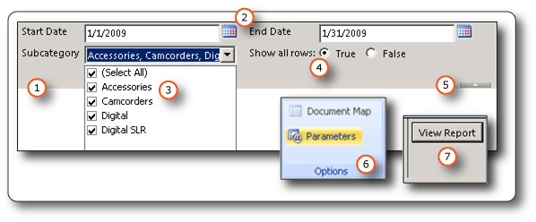
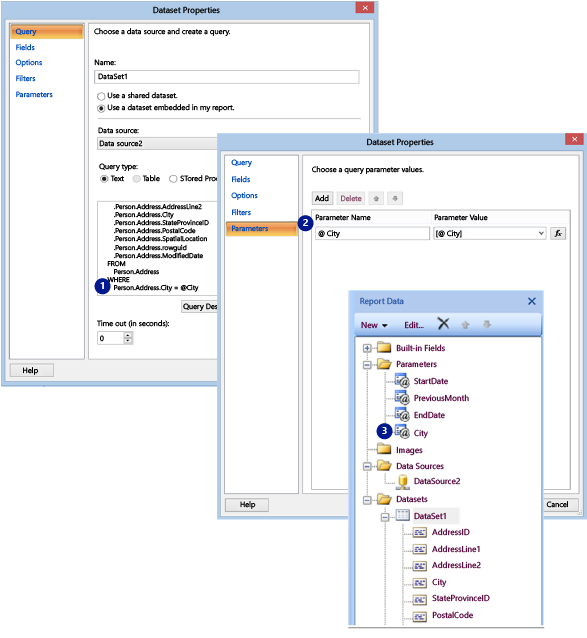

# Report Parameters (Report Builder and Report Designer)
  This topic describes the common uses for SSRS report parameters, the properties you can set, and much more about parameters. Report parameters enable you to control report data, connect related reports together, and vary report presentation.  
  
[!INCLUDE[applies](../../includes/applies-md.md)] SharePoint mode and Native mode
  
 For a demonstration on how to add a parameter to a report, see [Tutorial: Adding Parameters to a Report (SSRS)](https://technet.microsoft.com/library/aa337432\(v=SQL.105\).aspx)  

  
##   Common Uses for Parameters  
 Here are some of the most common ways to use parameters.  
  
 **Control Report Data**  
  
-   Filter report data at the data source by writing dataset queries that contain variables.  
  
-   Filter data from a shared dataset. When you add a shared dataset to a report, you cannot change the query. In the report, you can add a dataset filter that includes a reference to a report parameter that you create.  
  
-   Enable users to specify values to customize the data in a report. For example, provide two parameters for the start date and end date for sales data.  
  
 **Connect Related Reports**  
  
-   Use parameters to relate main reports to drillthrough reports, to subreports, and to linked reports. When you design a set of reports, you can design each report to answer certain questions. Each report can provide a different view or a different level of detail for related information. To provide a set of interrelated reports, create parameters for the related data on target reports.  
  
     For more information, see [Drillthrough Reports &#40;Report Builder and SSRS&#41;](drillthrough-reports-report-builder-and-ssrs.md), [Subreports &#40;Report Builder and SSRS&#41;](subreports-report-builder-and-ssrs.md), and [Create a Linked Report](../reports/create-a-linked-report.md).  
  
-   Customize sets of parameters for multiple users. Create two linked reports based on a sales report on the report server. One linked report uses predefined parameter values for sales persons and the second linked report uses predefined parameter values for sales managers. Both reports use the same report definition.  
  
 **Vary Report Presentation**  
  
-   Send commands to a report server through a URL request, to customize the rendering of a report. For more information, see [URL Access &#40;SSRS&#41;](../url-access-ssrs.md) and [Pass a Report Parameter Within a URL](../pass-a-report-parameter-within-a-url.md).  
  
-   Enable users to specify values to help customize the appearance of a report. For example, provide a Boolean parameter to indicate whether to expand or collapse all nested row groups in a table.  
  
-   Enable users to customize report data and appearance by including parameters in an expression.  
  
     For more information, see [Parameters Collection References &#40;Report Builder and SSRS&#41;](built-in-collections-parameters-collection-references-report-builder.md).  
  
##   Parameter Pane  
 When you view a report, the report viewer toolbar displays each parameter so that a user can interactively specify values. The following illustration shows the parameter area for a report that has parameters @StartDate, @EndDate, @Subcategory, and @ShowAllRows.  
  
   
  
1.  **Parameters pane** The report viewer toolbar displays a prompt and default value for each parameter. Parameter layout on the toolbar is formatted automatically. The order is determined by the order that parameters appear in the Report Data pane.  
  
2.  **@StartDate and @EndDate parameters** The parameter @StartDate is data type `DateTime`. The prompt Start Date appears next to the text box. To modify the date, type a new date in the text box or use the calendar control.  
  
     The parameter @EndDate appears next to @StartDate.  
  
3.  **@Subcategory parameter** The parameter @Subcategory is data type `Text`. Because @Subcategory has an available values list, valid values appear in a drop-down list. You must choose values from this list. Because @Subcategory is multivalued, a **Select All** option appears that enables you to clear all and select all values in the list.  
  
4.  **@ShowAllRows parameter** The parameter @ShowAllRows is data type `Boolean`. Use the radio buttons to specify `True` or `False`.  
  
5.  **Show or Hide Parameter Area handle** On the report viewer toolbar, click this arrow to show or hide the parameters pane.  
  
6.  **Parameters button** In Report Builder preview, on the Ribbon, click the **Parameters** button to show or hide the parameters pane.  
  
7.  **View Report button** On the report viewer toolbar, click **View Report** to run the report after you enter parameter values. If all parameters have default values, the report runs automatically on first view.  
  
##   Creating Parameters  
 You can create report parameters in the following ways:  
  
-   Add a dataset query that contains variables or a dataset stored procedure that contains input parameters. A dataset parameter is created for each variable or input parameter, and a report parameter is created for each dataset parameter.  
  
     The following image from Report Builder shows a dataset query with a variable (1), and the corresponding dataset parameter (2) and report parameter (3).  
  
       
  
    > **NOTE!** Not all data sources support parameters.  
  
     The dataset can be embedded or shared. When you add a shared dataset to a report, dataset parameters that are marked internal cannot be overridden in the report. You can override dataset parameters that are not marked internal.  
  
     For more information, see [Dataset Query](#bkmk_Dataset_Parameters) in this topic.  
  
-   Create a parameter manually from the Report Data pane.  
  
     You can configure report parameters so that a user can interactively enter values to help customize the contents or appearance of a report. You can also configure report parameters so that a user cannot change preconfigured values.  
  

  > **NOTE!** Because parameters are managed independently on the server, republishing a main report with new parameter settings does not overwrite the existing parameters settings on the report.  
  
-   Add a report part that contains references to a parameter or to a shared dataset that contains variables.  
  
     Report parts are stored on the report server and available for others to use in their reports. Report parts that are parameters cannot be managed from the report server. You can search for parameters in the Report Part Gallery and after you add them, configure them in your report. For more information, see [Report Parts &#40;Report Builder and SSRS&#41;](../report-parts-report-builder-and-ssrs.md).  
     
   > **NOTE!** Parameters can be published as a separate report part for data regions that have dependent datasets with parameters. Although parameters are listed as a report part, you cannot add a report part parameter directly to a report. Instead, add the report part, and any necessary report parameters are automatically generated from dataset queries that are contained or referenced by the report part. For more information about report parts, see [Report Parts &#40;Report Builder and SSRS&#41;](../report-parts-report-builder-and-ssrs.md) and [Report Parts in Report Designer &#40;SSRS&#41;](report-parts-in-report-designer-ssrs.md).  
  
### Parameter Values  
 The following are options for selecting parameter values in the report.  
  
-   Select a single parameter value from a drop-down list.  
  
-   Select multiple parameter values from a drop-down list.  
  
-   Select a value from a drop-down list for one parameter, which determines the values that are available in the drop-down list for another parameter. These are cascading parameters. Cascading parameters enables you to successively filter parameter values from thousands of values to a manageable number.  
  
     For more information, see [Add Cascading Parameters to a Report &#40;Report Builder and SSRS&#41;](add-cascading-parameters-to-a-report-report-builder-and-ssrs.md).  
  
-   Run the report without having to first select a parameter value because a default value has been created for the parameter.  
  
##   Report Parameter Properties  
 You can change the report parameter properties by using the Report Properties dialog box. The following table summarizes the properties that you can set for each parameter:  
  
|Property|Description|  
|--------------|-----------------|  
|Name|Type a case-sensitive name for the parameter. The name must begin with a letter and can have letters, numbers, an underscore (_). The name cannot have spaces. For automatically-generated parameters, the name matches the parameter in the dataset query. By default, manually-created parameters are similar to ReportParameter1.|  
|Prompt|The text that appears next to the parameter on the report viewer toolbar.|  
|Data type|When available values are defined for a parameter, the user chooses values from a drop-down list, even when the data type is `DateTime`. A report parameter must be one of the following data types:   `Boolean`. The user selects True or False from a radio button.   `DateTime`. The user selects a date from a calendar control.   **Integer**. The user types values in a text box.   **Float**. The user types values in a text box.   `Text`. The user types values in a text box.   For more information about report data types, see [RDL Data Types](../reports/report-definition-language-ssrs.md#bkmk_RDL_Data_Types).|  
|Allow blank value|Select this option if the value of the parameter can be an empty string or a blank.   If you specify valid values for a parameter, and you want a blank value to be one of the valid values, you must include it as one of the values that you specify. Selecting this option does not automatically include a blank for available values.|  
|Allow null value|Select this option if the value of the parameter can be a null.   If you specify valid values for a parameter, and you want null to be one of the valid values, you must include null as one of the values that you specify. Selecting this option does not automatically include a null for available values.|  
|Allow multiple values|Provide available values to create a drop-down list that your users can choose from. This is a good way to ensure that only valid values are submitted in the dataset query.   Select this option if the value for the parameter can be multiple values that are displayed in a drop-down list. Null values are not allowed. When this option is selected, check boxes are added to the list of available values in a parameter drop-down list. The top of the list includes a check box for **Select All**. Users can check the values that they want.   If the data that provides values changes rapidly, the list the user sees might not be the most current.|  
|Visible|Select this option to display the report parameter at the top of the report when it is run. This option allows users to select parameter values at run time.|  
|Hidden|Select this option to hide the report parameter in the published report. The report parameter values can still be set on a report URL, in a subscription definition, or on the report server.|  
|Internal|Select this option to hide the report parameter. In the published report, the report parameter can only be viewed in the report definition.|  
|Available values|If you have specified available values for a parameter, the valid values always appear as a drop-down list. For example, if you provide available values for a `DateTime` parameter, a drop-down list for dates appears in the parameter pane instead of a calendar control. To ensure that a list of values is consistent among a report and subreports, you can set an option on the data source to use a single transaction for all queries in the datasets that are associated with a data source.   **\*\* Security Note \*\*** In any report that includes a parameter of data type `Text`, be sure to use an available values list (also known as a valid values list) and ensure that any user running the report has only the permissions necessary to view the data in the report. For more information, see [Security &#40;Report Builder&#41;](../report-builder/security-report-builder.md).|  
|Default values|Set default values from a query or from a static list.   When each parameter has a default value, the report runs automatically on first view.|  
|Advanced|Set the report definition attribute `UsedInQuery`, a value that indicates whether this parameter directly or indirectly affects the data in a report.   **Automatically determine when to refresh**  Choose this option when you want the report processor to determine a setting for this value. The value is `True` if the report processor detects a dataset query with a direct or indirect reference to this parameter, or if the report has subreports.   **Always refresh**  Choose this option when the report parameter is used directly or indirectly in a dataset query or parameter expression. This option sets `UsedInQuery` to True.   **Never refresh**  Choose this option when the report parameter is not used directly or indirectly in a dataset query or parameter expression. This option sets `UsedInQuery` to False.   **\*\* Caution \*\*** Use **Never Refresh** with caution. On the report server, `UsedInQuery` is used to help control cache options for report data and for rendered reports, and parameter options for snapshot reports. If you set **Never Refresh** incorrectly, you could cause incorrect report data or reports to be cached, or cause a snapshot report to have inconsistent data. For more information, see [Report Definition Language &#40;SSRS&#41;](../reports/report-definition-language-ssrs.md).|  
  
##   Dataset Query  
 To filter data in the dataset query, you can include a restriction clause that limits the retrieved data by specifying values to include or exclude from the result set.  
  
 Use the query designer for the data source to help build a parameterized query.  
  
-   For [!INCLUDE[tsql](../../includes/tsql-md.md)] queries, different data sources support different syntax for parameters. Support ranges from parameters that are identified in the query by position or by name. For more information, see topics for specific external data source types in [Add Data to a Report &#40;Report Builder and SSRS&#41;](../report-data/report-datasets-ssrs.md). In the relational query designer, you must select the parameter option for a filter to create a parameterized query. For more information, see [Relational Query Designer User Interface &#40;Report Builder&#41;](../report-data/relational-query-designer-user-interface-report-builder.md).  
  
-   For queries that are based on a multidimensional data source such as Microsoft SQL Server Analysis Services, SAP NetWeaver BI, or Hyperion Essbase, you can specify whether to create a parameter based on a filter that you specify in the query designer. For more information, see the query designer topic in [Query Designers &#40;Report Builder&#41;](../query-designers-report-builder.md) that corresponds to the data extension.  
  
##   Parameter Management for a Published Report  
 When you design a report, report parameters are saved in the report definition. When you publish a report, report parameters are saved and managed separately from the report definition.  
  
 For a published report, you can use the following:  
  
-   **Report parameter properties.** Change report parameter values directly on the report server independently from the report definition.  
  
-   **Cached reports.** To create a cache plan for a report, each parameter must have a default value. For more information, see [Caching Reports &#40;SSRS&#41;](../report-server/caching-reports-ssrs.md).  
  
-   **Cached shared datasets.** To create a cache plan for a shared dataset, each parameter must have a default value. For more information, see [Caching Reports &#40;SSRS&#41;](../report-server/caching-reports-ssrs.md).  
  
-   **Linked reports.** You can create linked reports with preset parameter values to filter data for different audiences. For more information, see [Create a Linked Report](../reports/create-a-linked-report.md).  
  
-   **Report subscriptions.** You can specify parameter values to filter data and deliver reports through subscriptions. For more information, see [Subscriptions and Delivery &#40;Reporting Services&#41;](../subscriptions/subscriptions-and-delivery-reporting-services.md).  
  
-   **URL access.** You can specify parameter values in a URL to a report. You can also run reports and specify parameter values using URL access. For more information, see [URL Access &#40;SSRS&#41;](../url-access-ssrs.md).  
  
 Parameter properties for a published report are generally preserved if you republish the report definition. If the report definition is republished as the same report, and parameter names and data types remain the same, your property settings are retained. If you add or delete parameters in the report definition, or change the data type or name of an existing parameter, you may need to change the parameter properties in the published report.  
  
 Not all parameters can be modified in all cases. If a report parameter gets a default value from a dataset query, that value cannot be modified for a published report and cannot be modified on the report server. The value that is used at run time is determined when the query runs, or in the case of expression-based parameters, when the expression is evaluated.  
  
 Report execution options can affect how parameters are processed. A report that runs as a snapshot cannot use parameters that are derived from a query unless the query includes default values for the parameters.  
  
##   Parameters for a Subscription  
 You can define a subscription for an on demand or for a snapshot and specify parameter values to use during subscription processing.  
  
-   **On demand report.**  For an on demand report, you can specify a different parameter value than the published value for each parameter listed for the report. For example, suppose you have a Call Service report that uses a *Time Period* parameter to return customer service requests for the current day, week, or month. If the default parameter value for the report is set to **today**, your subscription can use a different parameter value (such as **week** or **month**) to produce a report that contains weekly or monthly figures.  
  
-   **Snapshot.**  For a snapshot, your subscription must use the parameter values defined for the snapshot. Your subscription cannot override a parameter value that is defined for a snapshot. For example, suppose you are subscribing to a Western regional sales report that runs as a report snapshot, and the snapshot specifies **Western** as a regional parameter value. In this case, if you create a subscription to this report, you must use the parameter value **Western** in your subscription. To provide a visual indication that the parameter is ignored, the parameter fields on the subscription page are set to read-only fields.  
  
     Report execution options can affect how parameters are processed. Parameterized reports that run as report snapshots use the parameter values defined for the report snapshot. Parameter values are defined in the parameter properties page of the report. A report that runs as a snapshot cannot use parameters that are derived from a query unless the query includes default values for the parameters.  
  
     If a parameter value changes in the report snapshot after the subscription is defined, the report server deactivates the subscription. Deactivating the subscription indicates that the report has been modified. To activate the subscription, open and then save the subscription.  
  
> [!NOTE]  
>  Data-driven subscriptions can use parameter values that are obtained from a subscriber data source. For more information, see [Use an External Data Source for Subscriber Data &#40;Data-Driven Subscription&#41;](../subscriptions/use-an-external-data-source-for-subscriber-data-data-driven-subscription.md).  
  
 For more information, see [Subscriptions and Delivery &#40;Reporting Services&#41;](../subscriptions/subscriptions-and-delivery-reporting-services.md).  
  
##   Parameters and Securing Data  
 Use caution when distributing parameterized reports that contain confidential or sensitive information. A user can easily replace a report parameter with a different value, resulting in information disclosure that you did not intend.  
  
 A secure alternative to using parameters for employee or personal data is to select data based on expressions that include the **UserID** field from the Users collection. The Users collection provides a way to get the identity of the user running the report, and use that identity to retrieve user-specific data.  
  
> [!IMPORTANT]  
>  In any report that includes a parameter of type `String`, be sure to use an available values list (also known as a valid values list) and ensure that any user running the report has only the permissions necessary to view the data in the report. When you define a parameter of type `String`, the user is presented with a text box that can take any value. An available values list limits the values that can be entered. If the report parameter is tied to a dataset parameter and you do not use an available values list, it is possible for a report user to type SQL syntax into the text box, potentially opening the report and your server to a SQL injection attack. If the user has sufficient permissions to execute the new SQL statement, it may produce unwanted results on the server.  
>   
>  If a report parameter is not tied to a dataset parameter and the parameter values are included in the report, it is possible for a report user to type expression syntax or a URL into the parameter value, and render the report to Excel or HTML. If another user then views the report and clicks the rendered parameter contents, the user may inadvertently execute the malicious script or link.  
>   
>  To mitigate the risk of inadvertently running malicious scripts, open rendered reports only from trusted sources. For more information about securing reports, see [Secure Reports and Resources](../security/secure-reports-and-resources.md).  
  
##   How-To Topics  
 This section lists procedures that show you, step by step, how to work with parameters and filters.  
  
-   [Add, Change, or Delete a Report Parameter &#40;Report Builder and SSRS&#41;](add-change-or-delete-a-report-parameter-report-builder-and-ssrs.md)  
  
-   [Add, Change, or Delete Available Values for a Report Parameter &#40;Report Builder and SSRS&#41;](add-change-or-delete-available-values-for-a-report-parameter.md)  
  
-   [Add, Change, or Delete Default Values for a Report Parameter &#40;Report Builder and SSRS&#41;](add-change-or-delete-default-values-for-a-report-parameter.md)  
  
-   [Change the Order of a Report Parameter &#40;Report Builder and SSRS&#41;](change-the-order-of-a-report-parameter-report-builder-and-ssrs.md)  
  
-   [Add Cascading Parameters to a Report &#40;Report Builder and SSRS&#41;](add-cascading-parameters-to-a-report-report-builder-and-ssrs.md)  
  
-   [Add a Filter to a Dataset &#40;Report Builder and SSRS&#41;](../report-data/add-a-filter-to-a-dataset-report-builder-and-ssrs.md)  
  
-   [Add a Subreport and Parameters &#40;Report Builder and SSRS&#41;](add-a-subreport-and-parameters-report-builder-and-ssrs.md)  
  
-   [How to use SSRS parameters with stored procedures](https://go.microsoft.com/fwlink/p/?LinkId=396970)  
  
## Did this Article Help You? We're Listening  
 What information are you looking for, and did you find it? We're listening to your feedback to improve the content. Please submit your comments to [sqlfeedback@microsoft.com](mailto:sqlfeedback@microsoft.com?subject=Your%20feedback%20about%20the%20Report%20Parameters%20page)  
  
##   Related Content  
 [Configuring SSRS Report Parameters (quiz)](https://go.microsoft.com/fwlink/p/?LinkID=306443)  
  
 [Tutorial: Add a Parameter to Your Report &#40;Report Builder&#41;](../tutorial-add-a-parameter-to-your-report-report-builder.md)  
  
 [Bursting the mysteries of InvalidReportParameterException in Reporting service](https://go.microsoft.com/fwlink/p/?LinkId=393118)  
  
 [Report Samples (Report Builder and SSRS)](https://go.microsoft.com/fwlink/?LinkId=198283)  
  
 [Expression Uses in Reports &#40;Report Builder and SSRS&#41;](expression-uses-in-reports-report-builder-and-ssrs.md)  
  
 [Expressions &#40;Report Builder and SSRS&#41;](expressions-report-builder-and-ssrs.md)  
  
 [Filter, Group, and Sort Data &#40;Report Builder and SSRS&#41;](filter-group-and-sort-data-report-builder-and-ssrs.md)  
  
 [Security &#40;Report Builder&#41;](../report-builder/security-report-builder.md)  
  
 [Interactive Sort, Document Maps, and Links &#40;Report Builder and SSRS&#41;](interactive-sort-document-maps-and-links-report-builder-and-ssrs.md)  
  
 [Drillthrough, Drilldown, Subreports, and Nested Data Regions &#40;Report Builder and SSRS&#41;](drillthrough-drilldown-subreports-and-nested-data-regions.md)  
  
  
