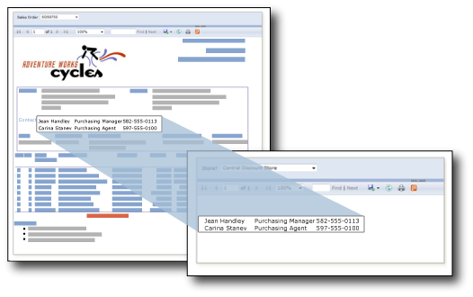

# Subreports (Report Builder and SSRS)
  A subreport is a report item that displays another report inside the body of a main report. Conceptually, a subreport in a report is similar to a frame in a Web page. It is used to embed a report within a report. Any report can be used as a subreport. The report that is displayed as the subreport is stored on a report server, usually in the same folder as the parent report. You can design the parent report to pass parameters to the subreport. A subreport can be repeated within data regions, using a parameter to filter data in each instance of the subreport.  
  
> [!NOTE]  
>  If you use a subreport in a tablix data region, the subreport and its parameters will be processed for every row. If there are many rows, consider whether a drillthrough report is more appropriate.  
  
   
  
 In this illustration, the contact information displayed in the main Sales Order report actually comes from a Contacts subreport.  
  
> [!NOTE]  
>  [!INCLUDE[ssRBRDDup](../../includes/ssrbrddup-md.md)]  
  
## Comparing Subreports and Nested Data Regions  
 If you're thinking of using subreports to display separate groups of data, consider using data regions, such as tables, matrices, and charts, instead. Reports with data regions only may perform better than reports that include subreports.  
  
 Use data regions to nest groups of data from the same data source within a single data region. Use subreports to nest groups of data from different data sources within a single data region, reuse a subreport in multiple parent reports, or display a standalone report inside of another report. For example, you can create a "briefing book" by placing multiple subreports inside the body of another report.  
  
 Data regions provide much of the same functionality and flexibility as subreports, but with better performance. Because the report server processes each instance of a subreport as a separate report, performance can be impacted. For more information, see [Nested Data Regions &#40;Report Builder and SSRS&#41;](nested-data-regions-report-builder-and-ssrs.md).  
  
## Using Parameters in Subreports  
 To pass parameters from the parent report to the subreport, define a report parameter in the report that you use as the subreport. When you place the subreport in the parent report, you can select the report parameter and a value to pass from the parent report to the report parameter in the subreport.  
  
> [!NOTE]  
>  The parameter that you select from the subreport is a report parameter, not a query parameter.  
  
 You can place a subreport in the main body of the report, or in a data region. If you place a subreport in a data region, the subreport will repeat with each instance of the group or row in the data region. To pass a value from the group or row to the subreport, in the subreport value property, use a field expression for the field containing the value you want to pass to the subreport parameter.  
  
 For more information about working with subreports, see [Add a Subreport and Parameters &#40;Report Builder and SSRS&#41;](add-a-subreport-and-parameters-report-builder-and-ssrs.md).  
  
## Specifying Subreport Names and Locations  
 You can design a main report to specify a subreport in a different folder on the same report server.  
  
 The syntax you use to specify the subreport depends on whether the report server is in native mode or SharePoint integrated mode. For more information, see [Specifying Paths to External Items &#40;Report Builder and SSRS&#41;](specifying-paths-to-external-items-report-builder-and-ssrs.md).  
  
 In Report Builder, to preview a subreport in a main report, both reports must be located in the same report server, or you must specify a full path to the subreport.  
  
## See Also  
 [Drillthrough, Drilldown, Subreports, and Nested Data Regions &#40;Report Builder and SSRS&#41;](drillthrough-drilldown-subreports-and-nested-data-regions.md)  
  
  
