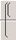
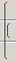
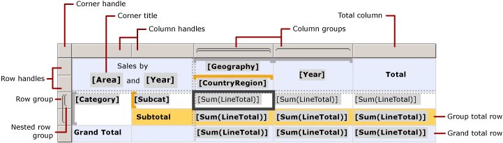

# Tablix Data Region Cells, Rows, and Columns (Report Builder) and SSRS
  To control how the rows and columns of a tablix data region display data in a report, you must understand how to specify rows and columns for detail data, for group data, and for labels and totals. In many cases, you can use the default structures for a table, matrix, or list to display your data. For more information, see [Tables &#40;Report Builder  and SSRS&#41;](tables-report-builder-and-ssrs.md), [Matrices &#40;Report Builder and SSRS&#41;](create-a-matrix-report-builder-and-ssrs.md), or [Lists &#40;Report Builder and SSRS&#41;](create-invoices-and-forms-with-lists-report-builder-and-ssrs.md).  
  
 A tablix data region displays detail data on detail rows and detail columns and grouped data on group rows and group columns. When you add row groups and column groups to a tablix data region, rows and columns on which to display the data are automatically added. You can manually add and remove rows and columns to customize a tablix data region and control the way your data displays in the report.  
  
 To understand how to customize a tablix data region, you should first understand how to interpret the visual cues you see when you select a tablix data region on the design surface.  
  
> [!NOTE]  
>  [!INCLUDE[ssRBRDDup](../../includes/ssrbrddup-md.md)]  
  
## Understanding Tablix Visual Cues  
 Visual cues on a tablix data region help you work with a tablix data region to display the data you want.  
  
### Row and Column Handles  
 When you select a tablix data region, the row and column handle graphics indicate the purpose of each row and column. Handles indicate rows and columns that are inside a group or outside a group. The following table shows a variety of handle displays.  
  
|Icon|Description|  
|----------|-----------------|  
||Only the details group on the row group hierarchy|  
||One outer group and the child details group|  
||One outer group, one inner group; no details group|  
||One outer group, one inner group, and the child details group|  
||One outer group with a footer row for totals and one inner group|  
||One outer group with a footer row for totals, one inner group with a footer row for totals, and one details row|  
||One outer group with a header for labels and a footer for totals, and an inner group; no details group|  
  
### Group Rows  
 Rows inside a group repeat once per unique group value and are typically used for aggregate summaries. Rows outside a group repeat once with respect to the group and are used for labels or subtotals. When you select a tablix cell, row and column handles and brackets inside the tablix data region show the groups to which a cell belongs. This figure displays the following visual cues:  
  
-   Row and column handles that indicate group associations.  
  
-   Highlighted group indicators that show the innermost group membership for a selected cell.  
  
-   Group indicators that show all group memberships for a selected cell.  
  
   
  
### Total Rows  
 After you add row and column groups, you can add a row to display totals for columns and a column to display totals for rows. The following figure shows a matrix with both row and column groups, and a total row and a total column.  
  
   
  
### Grouping Pane  
 The Grouping pane displays the row and column groups for the currently selected tablix data region on the design surface. The following figure shows the Grouping pane for this tablix data region.  
  
   
  
 The Row Groups pane shows the parent group Category and child group Subcat. The Column groups pane shows the parent group Geography and child group CountryRegion, and also the Year group, which is an adjacent group to the Geography group. When you select the Subcat group in the Row Groups pane, the group bar turns a darker shade of orange, and the corresponding row group member cell is selected on the design surface.  
  
## Displaying Data on Rows and Columns  
 Rows and row groups and columns and column groups have identical relationships. The following discussion describes how to add rows to display detail and group data on rows in a tablix data region, but the same principles apply to adding columns to display detail and grouped data.  
  
 For each row in a tablix data region, a row is either inside or outside each row group. If the row is inside a row group, it repeats once for every unique value of the group, known as a *group instance*. If the row is outside a row group, it repeats only once in relation to that group. Rows outside all row groups are static and repeat only once for the data region. For example, a table header or footer row is a static row. Rows that repeat with at least one group are dynamic.  
  
 When you have nested groups, a row can be inside a parent group but outside a child group. The row repeats for every group value in the parent group, but displays only once in relation to the child group. To display labels or totals for a group, add a row outside the group. To display data that changes for every group instance, add a row inside the group.  
  
 When you have detail groups, each detail row is inside the detail group. The row repeats for every value in the dataset query result set.  
  
 For more information about group hierarchies, see [Understanding Groups &#40;Report Builder and SSRS&#41;](understanding-groups-report-builder-and-ssrs.md).  
  
 The following figure shows a tablix data region with nested row groups and a details group.  
  
   
  
 For a tablix data region that displays detail data, the details group is the innermost child group. Rows that you add to a details group repeat once per row in the result set for the query for the dataset linked to this tablix data region. The following figure shows the last page of the rendered report. In this figure, you can see the last detail rows and the subtotal row for the last order.  
  
   
  
 For each column in a tablix data region, the same principles apply. For example, a column is either inside or outside each column group; to display totals, add a column outside the group.  
  
 To remove rows and columns associated to a group, you can delete the group. When you delete a group, you have the choice between deleting the group definition only or deleting the group and all its associated rows and columns. By deleting just the group, you preserve the row and column layout on the data region. When you delete the group and its related rows and columns, you are deleting all static rows and columns (including group headers and footers) and dynamic rows and columns (including group instances) that are associated with that group.  
  
 For step-by-step instructions about adding or deleting rows and columns, see [Insert or Delete a Row &#40;Report Builder and SSRS&#41;](insert-or-delete-a-row-report-builder-and-ssrs.md) and [Insert or Delete a Column &#40;Report Builder and SSRS&#41;](insert-or-delete-a-column-report-builder-and-ssrs.md).  
  
## Understanding Tablix Cells  
 Tablix cells belong to one of four tablix areas: the tablix body, tablix row or tablix column group areas, or the tablix corner. Although each cell can potentially display any value in the dataset, the default function for each cell is determined by its location. For detailed information about tablix areas, see [Tablix Data Region Areas &#40;Report Builder and SSRS&#41;](tablix-data-region-areas-report-builder-and-ssrs.md).  
  
 By default, cells in tablix row and column group areas represent group members. Group members are organized into multiple tree structures in the report definition. The row group hierarchy expands horizontally. The column group hierarchy expands vertically. These cells are added automatically when you create a group, and display the unique values for a group at run time.  
  
 Cells in the tablix corner are created when there are both row and column group areas. You can merge cells in this area to create a label or embed another report item.  
  
 Cells in the tablix body area can display detail data when the cell is in a detail row or column and aggregated group data when the cell is in a group row or column. The scope for the data in a cell is the intersection of the innermost row group and innermost column group to which the cell belongs.  
  
> [!NOTE]  
>  The actual data that is displayed for each cell is the evaluated expression for the report item that the cell contains, which is typically a text box. In a cell that belongs to a detail row or column, the expression defaults to the detail data (for example, **[LineTotal])**. In a cell that does not belong to a detail row or column, the expression defaults to an aggregate function (for example, **Sum[LineTotal])**. If an expression does not specify an aggregate function even though the cell belongs to a group row or column, the first value in the group is displayed. For more information about aggregates, see [Expression Scope for Totals, Aggregates, and Built-in Collections &#40;Report Builder and SSRS&#41;](expression-scope-for-totals-aggregates-and-built-in-collections.md).  
  
### Merging and Splitting Cells  
 Inside a tablix area, you can merge multiple adjacent cells together. For example, you can create cells for labels that span multiple columns or rows.  
  
 In the tablix corner area, cells can be combined in only one direction at a time: horizontally across columns or vertically down rows. To merge a block of cells, merge the cells horizontally first. After all cells have been merged into a single cell in each row, select adjacent cells (you can select all adjacent cells in a column) and merge them.  
  
 In the tablix body area, cells can only be merged horizontally. Merging cells vertically is not supported.  
  
 For more information, see [Merge Cells in a Data Region &#40;Report Builder and SSRS&#41;](merge-cells-in-a-data-region-report-builder-and-ssrs.md).  
  
 You can split a cell that was previously merged. You can split cells horizontally across columns or vertically down rows. To split a cell into a block of cells, split the cell horizontally first, and then split vertically as many times as necessary.  
  
## See Also  
 [Tablix Data Region &#40;Report Builder and SSRS&#41;](../tablix-data-region-report-builder-and-ssrs.md)  
  
  
