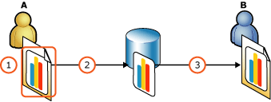
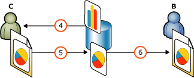

# Report Parts (Report Builder and SSRS)
  Report items such as tables, matrices, charts, and images can be published as *report parts*. Report parts are report items that have been published separately to a report server and that can be reused in other reports. Report parts have an .rsc file extension.  
  
 With report parts, work groups can now take advantage of the different strengths and roles of their team members. For example, if you are responsible for creating charts, you can save your charts as separate parts that you and your coworkers can reuse in other reports. You can publish report parts on a report server or SharePoint site integrated with a report server. You can reuse them in multiple reports, and you can update them on the server.  
  
 The report part that you add to your report maintains a relationship to the instance of the report part on the site or server by means of a unique ID. After you add report parts from a site or server to a report, you can modify them, independent of the original report part on the site or server. You can accept updates that others have made to the report part on the site or server, and you can save the modified report part back to the site or server, either adding a new report part or writing over the original, if you have sufficient permissions.  
  
 To quickly get started with report parts, see the videos [Report Builder 3 Report Parts in SQL Server 2008 R2](https://technet.microsoft.com/edge/Video/ff711300) and [How Do I: Create Reusable Report Parts with SQL Server Report Builder](https://technet.microsoft.com/sqlserver/ff634166.aspx).  
  
##   Life Cycle of a Report Part  
   
  
1.  Person A creates a report with a chart that depends on an embedded dataset.  
  
2.  Person A chooses to publish the chart to the report server. Report Builder assigns a unique ID to the published chart. Person A does not choose to share the dataset, so the dataset remains embedded in the chart.  
  
3.  Person B creates a blank report, searches the Report Part Gallery, finds the chart, and adds it to the report . The chart is now part of Person B's report, along with the embedded dataset. Person B can modify the instances of the chart and dataset that are in the report. This will have no effect on the instances of the chart and dataset on the report server, nor will it break the relationship between the instances in the report and on the report server.  
  
       
  
4.  Person C adds the chart to a report and changes this chart in the report from a bar to a pie chart.  
  
5.  Person C has permissions to overwrite the chart on the server and does so, republishing it to the server. This updates the published copy of the chart on the server. Person C does not choose to share the dataset either, so it remains embedded in the chart.  
  
6.  Person B accepts the updated chart from the server. This overwrites the changes that Person B had made to the chart in Person B's report.  
  
  [Back to Top](#BackToTop)  
  
##   Publishing Report Parts  
 When you publish a report part, Report Builder assigns it a unique ID, which is distinct from the report part name. Report Builder maintains that ID, no matter what else you change about the report part. The ID links the original report item in your report to the report part. When other report authors reuse the report part, the ID also links the report part in their report to the report part on the report server.  
  
 These are the report items you can publish as report parts:  
  
-   Charts  
  
-   Gauges  
  
-   Images  
  
-   Maps  
  
-   Parameters  
  
-   Rectangles  
  
-   Tables  
  
-   Matrices  
  
-   Lists  
  
 When you publish a report item that displays data, such as a table, matrix, or chart, the dataset that the report item depends on is saved with it, as a dataset embedded in it. You can also save the dataset separately, as a shared dataset that you and others can use as a basis for other report parts. For more information, see [Report Parts and Datasets in Report Builder](report-data/report-parts-and-datasets-in-report-builder.md).  
  
 Some report parts can contain other report items. For example, a table can contain a chart, and a rectangle can contain a matrix and a chart. When you publish a report item that contains other report items, they are saved as a unit. The other report items are saved embedded in the container report part. You cannot update them separately, and you cannot save the items in the container as separate report parts.  
  
 For more information on publishing report parts, see [Publish and Republish Report Parts &#40;Report Builder and SSRS&#41;](report-parts-report-builder-and-ssrs.md).  
  
### Modifying Report Part Metadata  
 You can publish report parts with default settings to a default location, or you can save each report part to a different location, and modify the metadata, such as the title and description.  
  
 It is a good idea to give the report part a clear name and description when you publish it to help people identify it when searching. You could end up with a lot of report parts with similar names on your site or server. Consider using naming conventions to illustrate relationships between report parts and their dependent items.  
  
 Also, consider saving shared data sources, shared datasets, and the report parts that depend on them in the same folder.  
  
 You can also edit the description in the Properties pane.  
  
  [Back to Top](#BackToTop)  
  
##   Reusing Report Parts  
 The easiest way to create a report is to add an existing report part, like a table or chart, to your report from the Report Part Gallery. After you add it to your report, you can modify it as much as you need, or accept updates from the server. Changing the report item in your report will not affect the instance of the report part published on the site or server, nor will it break the relationship between the instance in the report and on the site or server. If you have sufficient permissions, you can save the updated copy back to the site or server. If someone else modifies the copy on the site or server, you can decide to keep your copy as it is, or you can update it to be like the copy on the site or server.  
  
### Searching for Report Parts  
 You look for report parts to add to your report in the Report Part Gallery. You can filter the report parts by all or part of the name of the part, who created it, who last modified it, when it was last modified, where it's stored, or what type of report part it is. For example, you could search for all charts created last week by one of your coworkers.  
  
 You can view the search results either as thumbnails or as a list, and sort the search results by name, created and modified dates, and creator. For more information, see [Browse for Report Parts and Set a Default Folder &#40;Report Builder and SSRS&#41;](report-design/browse-for-report-parts-and-set-a-default-folder-report-builder-and-ssrs.md).  
  
### What Comes with a Report Part  
 When you add a report part to your report, you are also adding everything it must have to work. For example, any object that displays data is dependent on a dataset - a query and a connection to a data source. It may also have one or more parameters. All of the items it is dependent on are its *dependencies*, and all of them, or pointers to them, are included with the report part when you add it to your report. The dataset and parameters are listed in the Report Data pane of your report.  
  
 The dataset for the report part may be embedded in the report part, or it may be a separate, shared dataset that the report part points to. If it is embedded in the report part, you may be able to modify it. If it is a shared dataset, it is a separate object that you would need permissions for. For more information about shared and embedded datasets, see [Add Data to a Report &#40;Report Builder and SSRS&#41;](report-data/report-datasets-ssrs.md).  
  
### Resolving Naming Conflicts  
 When you add a report part, Report Builder fixes any name conflicts. For example, if you have a Chart1 in your report already and you add a report part called Chart1, Report Builder automatically renames the new report part Chart2. If you have a Dataset1 in your report already, and you add a report part that refers to a different dataset that is also called Dataset1, Report Builder renames the new dataset Dataset2 and updates the references.  
  
### Adding More Than One Report Part  
 You can add an unlimited number of report parts to your report. However, you can only add one report part at a time. You can even add multiple instances of one report part to the same report. They will all have unique names, but will all be instances of the same report part on the server and have the same unique ID.  
  
 When you add another report part that uses a dataset identical to a dataset already in your report, the wizard does not add another version of that dataset to your report; it redirects the references in the report part to go to the existing dataset. For more information, see [Report Parts and Datasets in Report Builder](report-data/report-parts-and-datasets-in-report-builder.md).  
  
  [Back to Top](#BackToTop)  
  
##   Updating Report Parts with Changes from the Server  
 Every time you open a report, Report Builder checks to see if the server instances of report parts in that report have been updated on the server. It also checks for changes in the report parts' dependent items, such as the dataset and parameters. If any published report parts or their dependencies have been updated on the server, an information bar in your report displays the number that have been updated. You can choose to view and accept or reject the updates, or dismiss the information bar. If you choose to view the updates, you see a thumbnail of the report part, who last modified it, and when. Then you can accept any or all of the updated items.  
  
> [!NOTE]  
>  You can disable the information bar and not be informed if a report part has changed. You set this option when you add the report part to your report. Even if you have disabled the information bar, you can still check for updates. For more information, see [Check for Updates or Turn Updates Off &#40;Report Builder and SSRS&#41;](../../2014/reporting-services/check-for-updates-or-turn-updates-off-report-builder-and-ssrs.md).  
  
 Report Builder checks for differences between the date the report part was last updated on the server and the date when you last synchronized the report part with the server. It does not check the date that you modified the report part in your report. Thus, the report part in your report and the report part on the server could be quite different, but when Report Builder checks for updates, it will not find any.  
  
### Accepting Updates  
 When you accept an update for a report part, it completely replaces the copy of the report part already in your report. You cannot combine features of the report part in the report with features of the published report part on the server. However, if you have changed one of the report part's dependencies, such as an embedded dataset, Report Builder does not copy over the dependency already in your report. It downloads a new copy of the dependency, and updates the report part to point to the new copy.  
  
### Reverting to a Previous Version of a Report Part  
 If you have changed a version of a report part in your report and decide you want to replace it with the version that is on the server, you cannot use the **Update** dialog box to do that. Updating is only for report parts that have changed on the server since you downloaded them.  
  
 To revert to the version on the server, just delete the version you have in your report and add it again.  
  
  [Back to Top](#BackToTop)  
  
##   Updating Report Parts Already on the Server  
 You can choose to update an existing report part on the server, or to publish it as a new report part without replacing the existing one. When you update the report part on the server, it does not automatically modify copies of the report part in other reports. If other report authors have added that report part to a report, they are informed of the change the next time they open that report. They can choose to accept your changes or not.  
  
 If you choose to publish it as a new report part, Report Builder gives it a new unique ID, and it no longer links to the original report part.  
  
 If the dataset is embedded in the report part, then every time you publish the report part, the dataset will be displayed in the **Publish Report Parts** dialog box. Shared datasets are not displayed in the **Publish Report Parts** dialog box.  
  
  [Back to Top](#BackToTop)  
  
##   Working with Report Parts in Report Designer  
 Report parts work a little differently in Report Designer in [!INCLUDE[ssNoVersion](../../includes/ssnoversion-md.md)][!INCLUDE[ssBIDevStudioFull](../../includes/ssbidevstudiofull-md.md)]. In Report Designer, publishing is one-way: you can publish a report part from Report Designer, but you cannot reuse an existing report part in Report Designer. For more information, see [Report Parts in Report Designer &#40;SSRS&#41;](report-design/report-parts-in-report-designer-ssrs.md).  
  
##   How-to Topics  
 [Publish and Republish Report Parts &#40;Report Builder and SSRS&#41;](report-parts-report-builder-and-ssrs.md)  
  
 [Browse for Report Parts and Set a Default Folder &#40;Report Builder and SSRS&#41;](report-design/browse-for-report-parts-and-set-a-default-folder-report-builder-and-ssrs.md)  
  
 [Check for Updates or Turn Updates Off &#40;Report Builder and SSRS&#41;](../../2014/reporting-services/check-for-updates-or-turn-updates-off-report-builder-and-ssrs.md)  
  
## See Also  
 [Report Parts and Datasets in Report Builder](report-data/report-parts-and-datasets-in-report-builder.md)   
 [Troubleshoot Report Parts &#40;Report Builder and SSRS&#41;](../../2014/reporting-services/troubleshoot-report-parts-report-builder-and-ssrs.md)   
 [Managing Report Parts](report-design/managing-report-parts.md)   
 [Report Builder 3 Report Parts in SQL Server 2008 R2 (video)](https://technet.microsoft.com/edge/Video/ff711300)   
 [How Do I: Create Reusable Report Parts with SQL Server Report Builder (video)](https://technet.microsoft.com/sqlserver/ff634166.aspx)  
  
  
