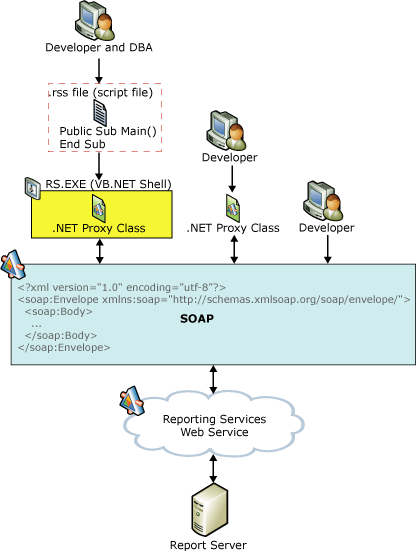

# Report Server Web Service
  [!INCLUDE[ssNoVersion](../../includes/ssnoversion-md.md)] [!INCLUDE[ssRSnoversion](../../includes/ssrsnoversion-md.md)] provides access to the full functionality of the report server through the Report Server Web service. The Report Server Web service is an XML Web service with a SOAP API. It uses SOAP over HTTP and acts as a communications interface between client programs and the report server. The Web service provides two endpoints - one for report execution and one for report management - with methods that expose the functionality of the report server and enable you to create custom tools for any part of the report life cycle.  
  
 There are three primary ways to develop [!INCLUDE[ssRSnoversion](../../includes/ssrsnoversion-md.md)] applications based on the Web service. You can:  
  
-   Develop applications using [!INCLUDE[msCoName](../../includes/msconame-md.md)] [!INCLUDE[vsprvs](../../includes/vsprvs-md.md)] and the [!INCLUDE[msCoName](../../includes/msconame-md.md)] [!INCLUDE[dnprdnshort](../../includes/dnprdnshort-md.md)] SDK. For more information about using the [!INCLUDE[dnprdnshort](../../includes/dnprdnshort-md.md)] to build Web service applications, see [Building Applications Using the Web Service and the .NET Framework](../report-server-web-service/net-framework/building-applications-using-the-web-service-and-the-net-framework.md).  
  
-   Develop applications using the **rs** utility (RS.exe), the [!INCLUDE[ssRSnoversion](../../includes/ssrsnoversion-md.md)] script environment. With [!INCLUDE[ssRSnoversion](../../includes/ssrsnoversion-md.md)] and [!INCLUDE[vbprvb](../../includes/vbprvb-md.md)] scripts, you can run any of the Report Server Web service operations. For more information about scripting in [!INCLUDE[ssRSnoversion](../../includes/ssrsnoversion-md.md)], see [Script with the rs.exe Utility and the Web Service](../tools/script-with-the-rs-exe-utility-and-the-web-service.md).  
  
-   Develop applications using any SOAP-enabled set of development tools. For more information, see [The Role of SOAP in Reporting Services](../report-server-web-service/the-role-of-soap-in-reporting-services.md).  
  
## Programming Diagram  
   
Reporting Services available Web service development options  
  
## In This Section  
 [Report Server Web Service Methods](../report-server-web-service/methods/report-server-web-service-methods.md)  
 Describes the features and methods of each Report Server Web service.  
  
 [The Role of SOAP in Reporting Services](../report-server-web-service/the-role-of-soap-in-reporting-services.md)  
 Provides an overview of SOAP and how it is used in the Report Server Web services.  
  
 [Accessing the SOAP API](../report-server-web-service/accessing-the-soap-api.md)  
 Describes the Web Service Description Language (WSDL) and provides URLs for accessing a Reporting Services WSDL file.  
  
 [Building Applications Using the Web Service and the .NET Framework](../report-server-web-service/net-framework/building-applications-using-the-web-service-and-the-net-framework.md)  
 Contains information about developing applications and Web services that call the Reporting Services SOAP API.  
  
 [Script with the rs.exe Utility and the Web Service](../tools/script-with-the-rs-exe-utility-and-the-web-service.md)  
 Provides an overview of the [!INCLUDE[ssRSnoversion](../../includes/ssrsnoversion-md.md)] scripting environment.  
  
 [Technical Reference &#40;SSRS&#41;](../../../2014/reporting-services/technical-reference-ssrs.md)  
 Contains reference material specific to Report Server Web services methods and corresponding complex types.  
  
## User Requirements for Web Service Development  
 To develop applications using the Report Server Web service, you need:  
  
-   [!INCLUDE[msCoName](../../includes/msconame-md.md)] Internet Explorer 5.5 or later installed on a computer with an Internet connection to and access to the report server.  
  
-   [!INCLUDE[msCoName](../../includes/msconame-md.md)] [!INCLUDE[vsprvs](../../includes/vsprvs-md.md)] or the [!INCLUDE[msCoName](../../includes/msconame-md.md)] [!INCLUDE[dnprdnshort](../../includes/dnprdnshort-md.md)] SDK installed on a computer if you want to develop and deploy [!INCLUDE[ssRSnoversion](../../includes/ssrsnoversion-md.md)] applications using the [!INCLUDE[msCoName](../../includes/msconame-md.md)] [!INCLUDE[dnprdnshort](../../includes/dnprdnshort-md.md)].  
  
-   An in-depth understanding of [!INCLUDE[msCoName](../../includes/msconame-md.md)] [!INCLUDE[ssNoVersion](../../includes/ssnoversion-md.md)] [!INCLUDE[ssRSnoversion](../../includes/ssrsnoversion-md.md)] features and capabilities.  
  
-   A firm understanding of SOAP and [!INCLUDE[vstecwebservices](../../includes/vstecwebservices-md.md)].  
  
-   Development experience in a [!INCLUDE[dnprdnshort](../../includes/dnprdnshort-md.md)]-compatible language such as [!INCLUDE[msCoName](../../includes/msconame-md.md)] [!INCLUDE[csprcs](../../includes/csprcs-md.md)] or [!INCLUDE[msCoName](../../includes/msconame-md.md)] [!INCLUDE[vbprvb](../../includes/vbprvb-md.md)], if you plan to use the [!INCLUDE[dnprdnshort](../../includes/dnprdnshort-md.md)] as your development platform.  
  
## See Also  
 [Report Server Web Service](../report-server-web-service/report-server-web-service.md)  
  
  
