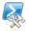

# Turn on Reporting Services events for the SharePoint trace log (ULS)
  Starting with [!INCLUDE[ssKilimanjaro](../../includes/sskilimanjaro-md.md)], [!INCLUDE[ssRSnoversion](../../../includes/ssrsnoversion-md.md)] servers in SharePoint mode can write [!INCLUDE[ssRSnoversion](../../../includes/ssrsnoversion-md.md)] events to the SharePoint Unified Logging Service (ULS) trace log. [!INCLUDE[ssRSnoversion](../../../includes/ssrsnoversion-md.md)] specific categories are available on the Monitoring page of SharePoint Central Administration.  
  
 In this Topic:  
  
-   [General ULS Log Recommendations](#bkmk_general)  
  
-   [To turn on and off Reporting Services events in the Reporting Services Category](#bkmk_turnon)  
  
-   [Recommended Configuration](#bkmk_recommended)  
  
-   [Reading the logs entries](#bkmk_readentries)  
  
-   [List of SQL Server Reporting Services Events](#bkmk_list)  
  
-   [View a Log file with PowerShell](#bkmk_powershell)  
  
-   [Trace Log Location](#bkmk_trace)  
  
##  <a name="bkmk_general"></a> General ULS Log Recommendations  
 The following table lists event categories and levels that are recommended for monitoring a [!INCLUDE[ssRSnoversion](../../../includes/ssrsnoversion-md.md)] environment.. When an event is logged, each entry includes the time the event was logged, the process name, and the thread ID.  
  
|Category|Level|Description|  
|--------------|-----------|-----------------|  
|Database|Verbose|Logs events that involve database access.|  
|General|Verbose|Logs events that involve access to the following items:<br /><br /> [!INCLUDE[ssRSnoversion](../../../includes/ssrsnoversion-md.md)] Web pages<br /><br /> Report Viewer HTTP handler<br /><br /> Report access (.rdl files)<br /><br /> Data sources (.rsds files)<br /><br /> URLs on the SharePoint site (.smdl files)|  
|Office Server General|Exception|Logs logon failures.|  
|Topology|Verbose|Logs current user information.|  
|Web Parts|Verbose|Logs events that involve access to the Report Viewer Web Part.|  
  
##  <a name="bkmk_turnon"></a> To turn on and off Reporting Services events in the Reporting Services Category  
  
1.  From SharePoint Central Administration  
  
2.  Click **Monitoring**.  
  
3.  Click **Configure Diagnostic Logging** in the **Reporting** group.  
  
4.  Find **SQL Server Reporting Services** in the category list.  
  
5.  Click the plus symbol (+) to expand the sub categories under **SQL Server Reporting Services**.  
  
6.  Select the subcategories to be added to the trace log.  
  
7.  At the bottom of the categories list, select an event level for the **Least critical event to report to the trace log**. Select **None** to disable tracing.  
  
> [!NOTE]  
>  The option **Least critical event to report to the event log** is not supported by [!INCLUDE[ssRSnoversion](../../../includes/ssrsnoversion-md.md)]. The option is ignored.  
  
##  <a name="bkmk_recommended"></a> Recommended Configuration  
 The following logging options are recommended as a standard configuration:  
  
-   **HTTP Redirector**  
  
-   **SOAP Client Proxy**  
  
-   If you are experiencing issues with configuration, add **Configuration Pages**.  
  
 You can review all of the current farm diagnostic log settings with the following PowerShell cmdlet:  
  
```  
Get-SPDiagnosticConfig  
```  
  
##  <a name="bkmk_readentries"></a> Reading the logs entries  
 The [!INCLUDE[ssRSnoversion](../../../includes/ssrsnoversion-md.md)] entries in the log are formatted in the following way.  
  
1.  **Product:SQL Server Reporting Services**  
  
2.  **Category:** Events related to the server will have the characters "Report Server", at the beginning of the name. For example "Report Server Alerting Runtime" These events are also logged to the report server log files.  
  
3.  **Category:** Events related to or communicated from a web front-end component do not contain "Report Server". For example "Service Application Proxy" Report Server Alerting Runtime". The WFE entries do contain a CorrelationID but the server entries do not.  
  
##  <a name="bkmk_list"></a> List of SQL Server Reporting Services Events  
 The following table is a list of the events in the SQL Server Reporting Services Category:  
  
|Area Name|Description or sample entries|  
|---------------|-----------------------------------|  
|Configuration Pages||  
|HTTP Redirector||  
|Local Mode Processing||  
|Local Mode Rendering||  
|SOAP Client Proxy||  
|UI Pages||  
|Power View|Log entries that were written to the **LogClientTraceEvents** API. These entries are sourced from client applications, including [!INCLUDE[ssCrescent](../../includes/sscrescent-md.md)], a feature of [!INCLUDE[ssCurrent](../../includes/sscurrent-md.md)] [!INCLUDE[ssRSnoversion](../../../includes/ssrsnoversion-md.md)] Add-in for [!INCLUDE[msCoName](../../includes/msconame-md.md)][!INCLUDE[SPS2010](../../includes/sps2010-md.md)] Enterprise Edition.<br /><br /> All log entries from the LogClientTraceEvents API will be logged under the **Category** of "SQL Server Reporting Services" and the **Area** of "Power View".<br /><br /> The content of entries logged with the area of "Power View" is determined by the client application.|  
|Report Server Alerting Runtime||  
|Report Server App Domain Manager||  
|Report Server Buffered Response||  
|Report Server Cache||  
|Report Server Catalog||  
|Report Server Chunk||  
|Report Server Cleanup||  
|Report Server Configuration Manager|Sample entries:<br /><br /> MediumUsing report server internal url http://localhost:80/ReportServer.<br /><br /> UnexpectedMissing or Invalid ExtendedProtectionLevel setting|  
|Report Server Crypto||  
|Report Server Data Extension||  
|Report Server DB Polling||  
|Report Server Default||  
|Report Server Email Extension||  
|Report Server Excel Renderer||  
|Report Server Extension Factory||  
|Report Server HTTP Runtime||  
|Report Server Image Renderer||  
|Report Server Memory Monitoring||  
|Report Server Notification||  
|Report Server Processing||  
|Report Server Provider||  
|Report Server Rendering||  
|Report Server Report Preview||  
|Report Server Resource Utility|Sample Entries:<br /><br /> MediumReporting Services starting SKU: Evaluation<br /><br /> MediumEvaluation copy: 180 days left|  
|Report Server Running Jobs||  
|Report Server Running Requests||  
|Report Server Schedule||  
|Report Server Security||  
|Report Server Service Controller||  
|Report Server Session||  
|Report Server Subscription||  
|Report Server WCF Runtime||  
|Report Server Web Server||  
|Service Application Proxy||  
|Shared Service|Sample entries:<br /><br /> MediumUpdating ReportingWebServiceApplication<br /><br /> MediumGranting access to content databases.<br /><br /> MediumProvisioning instances for ReportingWebServiceApplication<br /><br /> MediumProcessing service account change for ReportingWebServiceApplication<br /><br /> MediumSetting database permissions.|  
  
##  <a name="bkmk_powershell"></a> View a Log file with PowerShell  
 You can use PowerShell to return a list of the [!INCLUDE[ssRSnoversion](../../../includes/ssrsnoversion-md.md)] related events from a ULS Log file. Type the following command from the SharePoint 2010 Management Shell to return a filtered list of rows from the file a ULS log file UESQL11SPOINT-20110606-1530.log, that contain "**sql server reporting services**":  
  
```  
Get-content -path "C:\Program Files\Common Files\Microsoft Shared\Web Server Extensions\14\LOGS\UESQL11SPOINT-20110606-1530.log" | select-string "sql server reporting services"  
```  
  
 There are also many tools you can download which will allow you read ULS logs. For example, the [SharePoint LogViewer](http://sharepointlogviewer.codeplex.com/) or [SharePoint ULS Log Viewer](http://ulsviewer.codeplex.com/workitem/list/basic). Both are available on CodePlex.  
  
 For more information on how to use PowerShell to view log data, see [View diagnostic logs (SharePoint Server 2010)](https://technet.microsoft.com/library/ff463595.aspx)  
  
##  <a name="bkmk_trace"></a> Trace Log Location  
 The Trace Log files are usually found in the folder **c:\Program Files\Common files\Microsoft Shared\Web Server Extensions\14\logs** but you can verify or change the path from the **Diagnostic Logging** page in SharePoint Central Administration.  
  
 For more information and steps to configure diagnostic logging on a SharePoint server in SharePoint 2010 Central Administration, see [Configure diagnostic logging settings (Windows SharePoint Services)](https://go.microsoft.com/fwlink/?LinkID=114423).  
  
  
