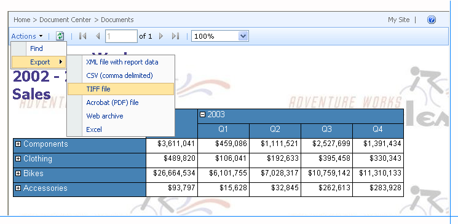

# Report Viewer Web Part on a SharePoint Site
  The Report Viewer Web Part is a custom Web Part that is installed by the [!INCLUDE[ssRSnoversion](../includes/ssrsnoversion-md.md)] Add-in for SharePoint Products. You can use the Web Part to view, navigate, print, and export reports on a report server that is configured to run in SharePoint integrated mode. The Report Viewer Web Part is associated with report definition (.rdl) files that are processed by a [!INCLUDE[msCoName](../includes/msconame-md.md)] [!INCLUDE[ssNoVersion](../includes/ssnoversion-md.md)] [!INCLUDE[ssRSnoversion](../includes/ssrsnoversion-md.md)] report server. You cannot use it with other report documents that you create in other software products.  
  
 To install the Web Part, you must run Setup for the [!INCLUDE[ssRSnoversion](../includes/ssrsnoversion-md.md)] Add-in. You should not install or uninstall the Web Part independently. It is part of the add-in and can only be installed through the add-in setup package. The Report Viewer Web Part file name is ReportViewer.dwp. It is located in the Program Files\Common Files\Microsoft Shared\web server extensions\12\template\features\reportserver folder and should not be moved to other folders.  
  
 To use the Web Part, you must have installed and configured the [!INCLUDE[ssRSnoversion](../includes/ssrsnoversion-md.md)] Add-in and configured the report server for SharePoint integration. You must also have reports to display in the viewer. You can only open reports that are in a library, a library folder, report history, or a link from a Library Web Part to a Report Viewer Web Part. You cannot open reports that are saved as an attachment to an item in a custom list.  
  
 You can set properties on the Report Viewer Web Part to control the appearance of the toolbar and view areas, and to link the Web Part to a specific report. The Report Viewer either shows a report that you explicitly link to it, or it shows any .rdl file that you open.  
  
 You cannot link multiple reports to a single Report Viewer instance, but if you want to group reports together, you can create a dashboard or a Web Part page that embeds multiple Report Viewer Web Part instances on a single page.  
  
 The Web Part includes a view area, a toolbar, a collapsible area for setting credentials and parameters, and properties. The following image shows the Web Part with the sample Company Sales report and the export options that you can select from the toolbar.  
  
   
  
## Web Part components  
 The view area displays a report in HTML. Depending on how the Web Part is configured, the view area might be maximized to show the report in full-page mode, or it might share the available space with adjacent panes and a toolbar.  
  
 The toolbar provides page navigation, search, zoom, and export features so that you can view a report in another application format. It also provides optional print functionality, offering paginated print output for HTML reports and the ability to change page layout and margin settings. **Open with Report Builder, Subscribe**, **Export**, and **Print** are provided in the **Actions** menu on the toolbar. Page navigation and zoom controls are directly on the toolbar.  
  
> [!NOTE]  
>  You cannot customize the toolbar unless you write code to do so, but you can set properties to hide all or some of its controls.  
  
### Export Action on the Report Toolbar  
 **Export** on the **Actions** menu shows application formats that are associated with rendering extensions deployed on a report server. To determine the availability of a specific format, you can add or remove a rendering extension on the report server, or you can modify configuration settings to remove a particular export format from the list. You can also specify configuration settings on the report server to control which formats are available. You can modify the default behavior of a specific format by adding and modifying configuration settings for that rendering extension.  
  
### Print Action on the Report Toolbar  
 **Print** on the **Actions** menu is custom print functionality that is provided through [!INCLUDE[ssRSnoversion](../includes/ssrsnoversion-md.md)]. When you click **Print**, an ActiveX client-side print control is downloaded to the client computer. In most cases, the user who clicks **Print** must have Administrator permissions on the local computer. It is common practice to restrict ActiveX control downloads to only those users who have Administrator permissions. You can use SharePoint Central Administration to enable or disable the download of the client-side print control.  
  
### Find Action on the Report Toolbar  
 **Find** on the **Actions** menu provides a way to move to a target location in the report. You can search for content in a report by typing a word or phrase that you want to find. The maximum value of a search term is 256 characters. When your search finds a matching value in the report, focus is moved to the part of the report that contains that value.  
  
 When you enter a value to search on, type the value as you expect it to appear in the report. Do not pose a question, such as "what is the average profit for this month" unless you expect every word in the sentence to be in the report.  
  
 You can only search for one term or value at a time. You cannot use search operators (such as `AND` or `OR`), or symbols and wildcards. You cannot perform a search on a cross-section of the data (for example, searching for net sales for specific month for a particular product). For that kind of analysis, use Report Builder to create clickthrough reports.  
  
 Database and model security settings that restrict access to report data apply to search operations. If you are searching for a value in a clickthrough report that uses a model as a data source, and you do not have access to part of the model, data that is represented by that part of the model will be excluded from the search.  
  
### Panes for Specifying Credentials and Parameters  
 **Credentials** and **Parameters** are panes that appear next to the view area. **Credentials** appears when the data source connection for the report is configured to prompt the user for an account and password that has rights to access the data source. **Parameters** appears when the report accepts user input for parameters defined in the report.  
  
### Setting Properties on the Report Viewer Web Part  
 Properties on the Web Part include custom properties that are specific to Report Viewer and general properties that you can set for any Web Part. For more information, see [Customize the Report Viewer Web Part](../../2014/reporting-services/customize-the-report-viewer-web-part.md).  
  
 Reports open in full-page mode by default. Full-page mode shows the toolbar that provides page navigation, search, and other functionality. You can customize the Web Part to change appearance or default behavior.  
  
## See Also  
 [Install or Uninstall the Reporting Services Add-in for SharePoint &#40;SharePoint 2010 and SharePoint 2013&#41;](install-windows/install-or-uninstall-the-reporting-services-add-in-for-sharepoint.md)   
 [Add the Report Viewer Web Part to a Web Page &#40;Reporting Services in SharePoint Integrated Mode&#41;](report-server-sharepoint/add-reporting-services-content-types-to-a-sharepoint-library.md)  
  
  
