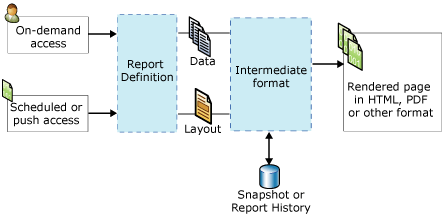

# Reporting Services Concepts (SSRS)
  This topic provides a brief summary of [!INCLUDE[ssNoVersion](../includes/ssnoversion-md.md)] [!INCLUDE[ssRSnoversion](../includes/ssrsnoversion-md.md)] concepts.  
  
||  
|-|  
|**[!INCLUDE[applies](../includes/applies-md.md)]**  [!INCLUDE[ssRSnoversion](../includes/ssrsnoversion-md.md)] SharePoint mode &#124; [!INCLUDE[ssRSnoversion](../includes/ssrsnoversion-md.md)] Native mode|  
  
 **In this topic:**  
  
-   [Report server concepts](#bkmk_ReportServerConcepts)  
  
-   [Reports and related item concepts](#bkmk_ReportsandRelatedItemConcepts)  
  
-   [Types of reports](#bkmk_TypesofReports)  
  
-   [Stages of report development](#bkmk_StagesofReports)  
  
##   Report server concepts  
 A report server is a computer that has an instance of [!INCLUDE[ssRSnoversion](../includes/ssrsnoversion-md.md)] installed. A report server internally stores items such as reports, report-related items and resources, schedules, and subscriptions. A report server can be configured as a stand-alone single server or as a scale out farm, or it can be integrated with SharePoint Server. You interact with report server items through the [!INCLUDE[ssRSnoversion](../includes/ssrsnoversion-md.md)] Web service, WMI provider, URL access, or programmatically through scripts. The way that you interact with a report server depends on the deployment topology and the configuration.  
  
 **A Native mode report server**  
 A report server configured in native mode is a computer that has [!INCLUDE[ssNoVersion](../includes/ssnoversion-md.md)] [!INCLUDE[ssRSnoversion](../includes/ssrsnoversion-md.md)] installed and configured as a stand-alone server. You interact with the report server, reports, and report related items by using a browser with Report Manager or URL access commands, SQL Server Management Studio, or programmatically through scripts. For more information, see [Reporting Services Report Server &#40;Native Mode&#41;](report-server/reporting-services-report-server-native-mode.md).  
  
 **A SharePoint mode report server**  
 A report server integrated with SharePoint has two possible configurations. In [!INCLUDE[ssRSCurrent](../includes/ssrscurrent-md.md)], [!INCLUDE[ssRSnoversion](../includes/ssrsnoversion-md.md)] is installed with SharePoint Server as a SharePoint shared service. In earlier releases, the report server integrates with SharePoint Server by installing the [!INCLUDE[ssRSnoversion](../includes/ssrsnoversion-md.md)] SharePoint Add-in. In both cases, you interact with the report server, reports, and report related items by using application pages on the SharePoint site. You use the SharePoint document library and other libraries that you create to store the content types related to reports. For more information, see [Reporting Services Report Server &#40;SharePoint Mode&#41;](../../2014/reporting-services/reporting-services-report-server-sharepoint-mode.md).  
  
 **Report server items**  
 Report server items include reports, models, shared data sources, shared datasets, and other items that you can publish, upload, or save to a report server. Organize items in the report server hierarchical folder structure on a native report server, or in SharePoint content libraries on a SharePoint site. For more information, see [Report Server Content Management &#40;SSRS Native Mode&#41;](report-server/report-server-content-management-ssrs-native-mode.md).  
  
 **Folders**  
 On a native report server, folders provide the hierarchical navigation structure and path of all addressable items stored in a report server. You use the folder hierarchy and site and folder permissions to help control access to report server items, known as *item-level security*. By default, role assignments that you define for specific folders are inherited by child folders in the folder hierarchy. If you assign specific roles to a folder, the inheritance rules no longer apply. The folder structure consists of a root node named **Home**, and reserved folders that support the optional **My Reports** feature. In a browser, the root node is the name of the report server virtual directory, for example, http://myreportserver/reports. For more information, see [Folders](report-server/report-server-content-management-ssrs-native-mode.md#bkmk_Folders).  
  
 On a SharePoint site, use SharePoint folders in document libraries and content libraries to organize items.  
  
 **Roles and Permissions**  
 On a native report server, the report server system administrator manages access permissions, configures the report server to process report requests, maintain snapshot histories, and manage permissions for reports, data sources, datasets, and subscriptions. For example, a published report is secured through role assignments using the [!INCLUDE[ssRSnoversion](../includes/ssrsnoversion-md.md)] role-based security model. For more information, see [Roles and Permissions &#40;Reporting Services&#41;](security/roles-and-permissions-reporting-services.md).  
  
 On a SharePoint site, use the SharePoint site administrators page to manage access permissions on reports and report-related site content.  
  
 **Schedules**  
 On a native report server, you can schedule reports, shared datasets, and subscriptions to retrieve data and deliver reports and dataset queries at specific times or during off-peak hours. Schedules can run once or on a continuous basis at intervals of hours, days, weeks, or months. For more information, see [Schedules](subscriptions/schedules.md).  
  
 **Subscriptions and delivery**  
 A subscription is a standing request to deliver a report at a specific time or in response to an event, and in an application file format that you specify in the subscription. Subscriptions provide an alternative to running a report on demand. On-demand reporting requires that you actively select the report each time you want to view the report. In contrast, subscriptions can be used to schedule and then automate the delivery of a report. You can deliver reports to an e-mail inbox or a file share. For more information, see [Subscriptions and Delivery &#40;Reporting Services&#41;](subscriptions/subscriptions-and-delivery-reporting-services.md).  
  
 **Extensions**  
 [!INCLUDE[ssNoVersion](../includes/ssnoversion-md.md)] [!INCLUDE[ssRSnoversion](../includes/ssrsnoversion-md.md)] provides an extensible architecture that you can use to customize report solutions. The report server supports custom authentication extensions, data processing extensions, report processing extensions, rendering extensions, and delivery extensions, and the extensions that are available to the users are configurable in the RSReportServer.config configuration file. For example, you can limit the export formats the report viewer is allowed to use. Delivery and report processing extensions are optional, but necessary if you want to support report distribution or custom controls. For more information, see [Extensions &#40;SSRS&#41;](extensions-ssrs.md).  
  
 **Report access**  
 On-demand access allows users to select the reports from a report viewing tool. Depending on your report server configuration, you can use Report Manager, a [!INCLUDE[msCoName](../includes/msconame-md.md)] SharePoint 2.0 Web part, a SharePoint library when [!INCLUDE[ssRSnoversion](../includes/ssrsnoversion-md.md)] is installed in SharePoint integrated mode, an embedded ReportViewer control, or a browser using URL access. For more information about on-demand access to reports, see [Finding, Viewing, and Managing Reports &#40;Report Builder and SSRS &#41;](report-builder/finding-viewing-and-managing-reports-report-builder-and-ssrs.md).  
  
 Subscriptions provide an alternative to running a report on demand. For more information, see [Subscriptions and Delivery &#40;Reporting Services&#41;](subscriptions/subscriptions-and-delivery-reporting-services.md).  
  
 For the list of tools to use to interact with the report server, see [Reporting Services Tools](tools/reporting-services-tools.md).  
  
##   Reports and related item concepts  
 **Reports and report definitions**  
 **RDL.** A report definition is an XML file that conforms to an XML grammar called Report Definition Language (RDL). In [!INCLUDE[ssRSnoversion](../includes/ssrsnoversion-md.md)], you create a report definition in a tool such as Report Builder or Report Designer. It includes elements that define data source connections, queries used to retrieve data, expressions, parameters, images, text boxes, tables, and any other design-time layout. For more information, see [Report Definition Language &#40;SSRS&#41;](reports/report-definition-language-ssrs.md).  
  
 **RDLX.** A report definition in RDLX is an RDL file with internal extensions that enable the [!INCLUDE[ssCrescent](../includes/sscrescent-md.md)] visualization experience. For more information, see [Power View Overview](https://blogs.msdn.com/b/microsoft_business_intelligence1/archive/2012/02/07/power-view-overview.aspx).  
  
 **RDLC.** The Visual Studio Report Designer produces client report definition (.rdlc) files in XML format for use with the ReportViewer control.  
  
 **Report data connections and data sources**  
 Reports use data connections to retrieve data for a report when a query runs or when the report is processed. In a report definition, a data connection is the same as a data source. You choose from a list of built-in data connection types to connect to a relational database, a multidimensional database, a Web service, or some other source of data. The following terms are used when describing data connections.  
  
-   **Data connection.** Also known as a *data source*. A data connection includes a name and connection properties that are dependent on the connection type. By design, a data connection does not include credentials. A data connection does not specify which data to retrieve from the external data source. To do that, you specify a query when you create a dataset.  
  
-   **Data source definition.** A file that contains the XML representation of a report data source. When a report is published, its data sources are saved on the report server or SharePoint site as data source definitions, independently from the report definition. For example, a report server administrator might update the connection string or credentials. On a native report server, the file type is .rds. On a SharePoint site, the file type is .rsds.  
  
-   **Connection string.** A connection string is a string version of the connection properties that are needed to connect to a data source. Connection properties differ based on data connection type.  
  
-   **Shared data source.** A data source that is available on a report server or SharePoint site to be used by multiple reports.  
  
     Shared data sources are useful when you have data sources that you use often. It is recommended that you use shared data sources as much as possible. They make reports and report access easier to manage, and help to keep reports and the data sources they access more secure. If you need a shared data source, ask your system administrator to create one for you.  
  
     In Report Builder, you cannot create a shared data source. You can browse to and select a shared data source from the report server.  
  
     In Report Designer, you cannot browse to a shared data source on the report server. You can create shared data sources as part of a project in Solution Explorer and choose whether to deploy them to a report server. You might choose to use them locally only because of differences in credentials required from your computer or from the report server.  
  
-   **Embedded data source.** Also known as a *report-specific data source*, an embeddeddata source is defined in a report and used only by that report.  
  
     An embedded data source is a data connection that is saved in the report definition. Embedded data source connection information can be used only by the report in which it is embedded.  
  
-   **Credentials.** Credentials are the authentication information that must be provided to allow you access to external data.  
  
     Credentials are used to create an embedded data source, to run a query, or to retrieve data during report processing. The owner of the data source determines the type of credentials that you must use to access the data. Credentials are managed independently from the data connection on a report server, a SharePoint site, or on a local computer in a report authoring environment. Depending on the type of data source, credentials can be saved to avoid prompting or set to prompt each user. The credentials that you need might differ depending on whether you are connecting to the data source from your computer or from the report server. For more information, see [Specify Credentials in Report Builder](../../2014/reporting-services/specify-credentials-in-report-builder.md).  
  
 **Report Datasets**  
 In a report, a dataset represents report data that is returned from running a query on an external data source. The dataset depends on the data connection that contains information about the external data source. The data itself is not included in the report definition. The dataset contains a query command, a field collection, parameters, filters, and data options that include case sensitivity and collation. There are two types of datasets:  
  
-   **Shared datasets.** A shared dataset is published on a report server and can be used by multiple reports. A shared dataset must be based on a shared data source. A shared dataset can be cached and scheduled by creating a cache refresh plan.  
  
-   **Embedded datasets.** Embedded datasets are defined in and used by a single report.  
  
 For more information, see [Report Embedded Datasets and Shared Datasets &#40;Report Builder and SSRS&#41;](report-data/report-embedded-datasets-and-shared-datasets-report-builder-and-ssrs.md).  
  
 **Report parameters**  
 Report parameters are a part of a report definition. You can add parameters to a report to link related reports, to control the report appearance, to filter report data, or to narrow the scope of a report to specific users or locations. When a report is published to a native report server or SharePoint site, report parameters are saved as a separate report server item. Parameters can be managed independently from the report definition. To create multiple sets of parameters for the same report, create *linked reports*.  
  
 **Report items**  
 A report item is an internal but basic concept in a report definition. Properties of a report item apply to data regions, maps, text boxes, images, and other design elements that you add to a report. Understanding the properties of a report item can help you to design customized report content and appearance. For example, all report items have a Hidden property to control visibility.  
  
 **Data regions and maps**  
 A data region is a layout element that displays data from a single dataset. Data region types include tablix, chart, gauge, and indicator. Map is a special type of data region because it can display data from two datasets: one that contains spatial data and one that contains analytical data.  
  
 Use data regions to enable common data visualizations: numbers and text in a table, matrix, or list; graphical displays in a chart or gauge; and geographic displays against a map. Tables, matrices, and lists are all based on the tablix data region, which expands as needed to display all the data from the dataset. A tablix data region supports multiple row and column groups and both static and dynamic rows and columns. A chart displays multiple series and category groups in a variety of chart formats. A gauge displays a single value or an aggregated value for a dataset. A map displays spatial data as map elements that can vary in appearance based on aggregated data from a dataset.  
  
-   **Table.** A table is a data region that presents data row by row. Table columns are static: you determine the number of columns when you design your report. Table rows are dynamic: they expand downwards to accommodate the data. You can add groups to tables, which organize data by selected fields or expressions. For more information, see [Tables &#40;Report Builder  and SSRS&#41;](report-design/tables-report-builder-and-ssrs.md).  
  
-   **Matrix.** A matrix is also known as a crosstab. A matrix data region contains both dynamic columns and rows: they expand to accommodate the data. A matrix can have dynamic columns and rows and static columns and rows. Columns or rows can contain other columns or rows, and can be used to group data. For more information, see [Matrices &#40;Report Builder and SSRS&#41;](report-design/create-a-matrix-report-builder-and-ssrs.md).  
  
-   **List.** A list is a data region that presents data arranged in a freeform fashion. You can arrange report items to create a form with text boxes, images, and other data regions placed anywhere within the list. For more information, see [Lists &#40;Report Builder and SSRS&#41;](report-design/create-invoices-and-forms-with-lists-report-builder-and-ssrs.md).  
  
-   **Chart.** A chart presents data graphically. Examples of charts include bar, pie, and line charts, but many more styles are supported. For more information, see [Charts &#40;Report Builder and SSRS&#41;](report-design/charts-report-builder-and-ssrs.md).  
  
-   **Gauge.** A gauge presents data as a range with an indicator pointing to a specific value within the range. Gauges are used to display key performance indicators (KPIs) and other metrics. Examples of gauges include linear and circular. For more information, see [Gauges &#40;Report Builder and SSRS&#41;](report-design/gauges-report-builder-and-ssrs.md).  
  
-   **Map.** A map enables you to present data against a geographical background. Map data can be spatial data from a [!INCLUDE[ssNoVersion](../includes/ssnoversion-md.md)] query, an ESRI shapefile, or [!INCLUDE[msCoName](../includes/msconame-md.md)] Bing map tiles. Spatial data consists of sets of coordinates that define polygons that represent shapes or areas, lines that represent routes or paths, and points represented by markers. You can associate aggregate data with map elements to automatically vary their color and size. For example, you can vary the marker type for a store based on sales amount or the color for a road based on speed limit. For more information, see [Maps &#40;Report Builder and SSRS&#41;](report-design/maps-report-builder-and-ssrs.md).  
  
 You can also include values from datasets that are not linked to the data region in the following ways:  
  
-   Expressions that include calls to aggregate functions that specify a different dataset as the scope parameter, for example, `=Max(Fields!Sales.Value, "AnnualSales")`.  
  
-   Use the function `Lookup` to look up values from name/value pairs in a different dataset.  
  
 **Report parts**  
 A report part definition (.rsc) is a report server item that is an XML fragment of a report definition file. You create report parts by creating a report definition, and then selecting report items in the report to publish separately as report parts. Report parts include data regions, rectangles and their contained items, and images. You can save a report part with its dependent datasets and shared data source references so it can be reused in other reports. For more information, see [Report Parts in Report Designer &#40;SSRS&#41;](report-design/report-parts-in-report-designer-ssrs.md).  
  
 **Data alerts**  
 A data alert is an item stored internally in an alerting database. A data alert definition includes which data to use from existing report data feeds, the conditions to be met, a schedule, and recipients for the alert. Data alerts are available only on reports published to a report server integrated with SharePoint Server. Data alerts are not available on a native report server installation. For more information, see [Reporting Services Data Alerts](../ssms/agent/alerts.md).  
  
##   Types of reports  
 In [!INCLUDE[ssRSnoversion](../includes/ssrsnoversion-md.md)], the term *report* can apply to a specific type of report server item, a layout design, or a solution design. A single report can have characteristics from more than one type; for example, a report can be, at the same time, a stand-alone report, a subreport referenced by a main report, the target of a drillthrough report in a different main report, and a linked report.  
  
 **Drilldown reports**  
 A drilldown report is a layout design that at first hides complexity and enables the user to toggle conditionally hidden report items to control how much detail data they want to see. Drilldown reports must retrieve all possible data that can be shown in the report. For reports that use large amounts of data, consider drillthrough reports instead. For more information, see [Drilldown Action &#40;Report Builder and SSRS&#41;](report-design/drilldown-action-report-builder-and-ssrs.md).  
  
 **Subreports**  
 A subreport is a report item that you add to a report as a layout element. A subreport points to a different report and displays inside the body of a main report as an subreport instance. The subreport can use different data sources than the main report. Although a subreport can be repeated in data regions by using a parameter to filter data in each instance of the subreport, subreports are typically used with a main report as a briefing book or as a container for a collection of related reports. Each instance of a subreport switches context for report processing between the main report and the subreport. For reports that use many instances of subreports, consider using drillthrough reports instead. For more information, see [Subreports &#40;Report Builder and SSRS&#41;](report-design/subreports-report-builder-and-ssrs.md).  
  
 **Main/detail reports and drillthrough reports**  
 A main/detail report solution includes a main report that displays summary information with hyperlinks to one or more reports that display detailed information.  The detail report runs only if a report reader clicks a link to it. The drillthrough report opens separately from the main report. A hyperlink can be defined on any report item that has an Action property, for example, text box, placeholder text, or chart series. For more information, see [Drillthrough Reports &#40;Report Builder and SSRS&#41;](report-design/drillthrough-reports-report-builder-and-ssrs.md).  
  
 **Linked reports**  
 A linked report is a report server item that contains a pointer to the report definition but has its own set of report properties and settings. These include security, parameters, location, subscriptions, and schedules. Because parameters are managed independently on the server, republishing a main report that uses new parameter settings does not overwrite the existing parameters settings for either the main report or the linked report.  
  
 For more information, see [Create a Linked Report](reports/create-a-linked-report.md).  
  
 **History reports**  
 Report history is a collection of report snapshots. You can use report history to maintain a record of a report over time. Report history is not intended for reports that contain confidential or personal data. For this reason, report history can include only those reports that query a data source using a single set of credentials. Alternatively, you can create a history of a report by defining a schedule and subscription to deliver the report in an exported file format to a file share. For more information, see [Performance, Snapshots, Caching &#40;Reporting Services&#41;](report-server/performance-snapshots-caching-reporting-services.md).  
  
 **Cached reports**  
 A cached report is a saved copy of a compiled report and report data. Cached reports are used to improve performance by reducing the number of processing requests to the report processor and by reducing the time that is required to retrieve large report datasets. They have a mandatory expiration period, usually in minutes. For more information about how to use cached reports, see [Caching Reports &#40;SSRS&#41;](report-server/caching-reports-ssrs.md).  
  
 You can also cache query results for a shared dataset. For more information, see [Cache Shared Datasets &#40;SSRS&#41;](report-server/cache-shared-datasets-ssrs.md).  
  
 **Snapshots**  
 A report snapshot is a report that contains layout information and query results that were retrieved at a specific point in time. Unlike on-demand reports, which get up-to-date query results when you view the report, the report server retrieves the compiled report and report data that were current for the report at the time the snapshot was created. Report snapshots are not saved in a particular rendering format. Instead, report snapshots are rendered in a final viewing format (such as HTML) only when a user or an application requests it. For more information, see [Performance, Snapshots, Caching &#40;Reporting Services&#41;](report-server/performance-snapshots-caching-reporting-services.md).  
  
 **Model reports and Clickthrough reports**  
 -   **Report model.** A report model is a user-friendly description of an underlying database, with pre-established data relationships and auto-generated queries. Report models can be used as data sources for reports created in Report Designer and Report Builder.  
  
-   **Clickthrough report.** A clickthrough report is a report that displays related data from a report model when you click the interactive data contained in the model-based report. Clickthrough reports are autogenerated. For more information, see [Clickthrough Reports &#40;SSRS&#41;](reports/clickthrough-reports-ssrs.md).  
  
 For more information about SMDL models, see [Breaking Changes in SQL Server Reporting Services in SQL Server 2014](breaking-changes-in-sql-server-reporting-services-in-sql-server-2016.md).  
  
 **Saved reports**  
 A saved report is a report definition (.rdl) file. A report definition can be saved locally or uploaded to a report server. If you upload a report definition instead of publishing it, no version validation or expression validation occurs. You will not see errors until the report runs. For more information, see [Save and Deploy](tools/design-reporting-services-paginated-reports-with-report-designer-ssrs.md#bkmk_SaveandDeploy).  
  
 **Published reports**  
 A published report is a report server item that you publish to a report server from a [!INCLUDE[ssRSnoversion](../includes/ssrsnoversion-md.md)] tool. On a native report server, you publish the report to a folder that you have permissions to. On a SharePoint report server, you can publish the report to a document library that is enabled with report content type. To share the report that uses others, they must have been granted permission to view the report. For more information, see [Save and Deploy](tools/design-reporting-services-paginated-reports-with-report-designer-ssrs.md#bkmk_SaveandDeploy).  
  
 **Upgraded reports**  
 An upgraded report is a published report definition that is converted to a newer schema when a report server is upgraded from one version of [!INCLUDE[ssRSnoversion](../includes/ssrsnoversion-md.md)] to a later version. The original report definition is preserved. The report is upgraded in memory, compiled, and the compiled version is saved internally. For more information, see [Upgrade Reports](install-windows/upgrade-reports.md).  
  
##   Stages of report development  
 A report definition can be created, published or saved, compiled, processed, cached, rendered, viewed, exported, and saved as history. When you run a report, the report server processes a report in three steps: report processing, data processing, and rendering. Data and report processing are performed on a report definition; the results are in an internal intermediate format. Reports that are in intermediate format are subsequently rendered to a specific viewing format. The following diagram shows the stages and elements of report processing.  
  
   
Report processing diagram  
  
 **Report definition**  
 The report definition file (.rdl) stored on a report server. For more information, see [Report Definition Language &#40;SSRS&#41;](reports/report-definition-language-ssrs.md).  
  
 **Compiled report and intermediate report format**  
 The report that uses evaluated expressions, parameters and parameter properties evaluated.  
  
 **Snapshot or Report History**  
 A snapshot is the set of report data at a specific point in time plus the intermediate format that contains report layout information. For more information, see [Performance, Snapshots, Caching &#40;Reporting Services&#41;](report-server/performance-snapshots-caching-reporting-services.md).  
  
 **Processed report**  
 A fully processed report that contains both data and layout information.  
  
 **Rendered report**  
 A fully processed report is sent to a report renderer to combine the data and layout on each page of the targeted rendering format. Rendering extensions are customizable and extensible. The default rendering format for a report is HTML 4.0. For more information, see [Page Layout and Rendering &#40;Report Builder and SSRS&#41;](report-design/page-layout-and-rendering-report-builder-and-ssrs.md) and [Extensions &#40;SSRS&#41;](extensions-ssrs.md).  
  
 **Exported report**  
 An exported report is a fully paged report saved in a specific file format. Export formats depend on installed rendering extensions and can be customized. By default, export formats include Excel, Word, XML, PDF, TIFF, and CSV. For more information, see [Exporting Reports &#40;Report Builder and SSRS&#41;](report-builder/export-reports-report-builder-and-ssrs.md).  
  
## See Also  
 [Reporting Services Features and Tasks &#40;SSRS&#41;](reporting-services-features-and-tasks-ssrs.md)   
 [Technical Reference &#40;SSRS&#41;](../../2014/reporting-services/technical-reference-ssrs.md)   
 [Reporting Services &#40;SSRS&#41;](create-deploy-and-manage-mobile-and-paginated-reports.md)  
  
  
