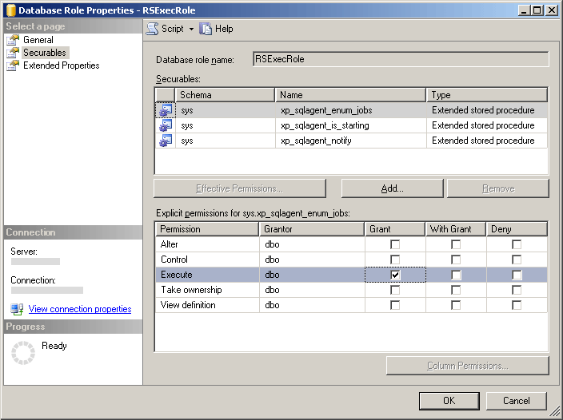

# Create the RSExecRole
  [!INCLUDE[ssRSnoversion](../../../includes/ssrsnoversion-md.md)] uses a predefined database role called `RSExecRole` to grant report server permissions to the report server database. The `RSExecRole` role is created automatically with the report server database. As a rule, you should never modify it or assign other users to the role. However, when you move a report server database to a new or different [!INCLUDE[ssNoVersion](../../../includes/ssnoversion-md.md)] [!INCLUDE[ssDE](../../../includes/ssde-md.md)], must re-create the role in the Master and MSDB system databases.  
  
 Using the following instructions, you will perform the following steps:  
  
-   Create and provision the `RSExecRole` in the Master system database.  
  
-   Create and provision the `RSExecRole` in the MSDB system database.  
  
> [!NOTE]  
>  The instructions in this topic are intended for users who do not want to run a script or write WMI code to provision the report server database. If you manage a large deployment and will be moving databases routinely, you should write a script to automate these steps. For more information, see [Access the Reporting Services WMI Provider](../tools/access-the-reporting-services-wmi-provider.md).  
  
## Before you start  
  
-   Back up the encryption keys so that you can restore them after the database is moved. This is step does not directly affect your ability to create and provision the `RSExecRole`, but you must have a backup of the keys in order to verify your work. For more information, see [Back Up and Restore Reporting Services Encryption Keys](../install-windows/ssrs-encryption-keys-back-up-and-restore-encryption-keys.md).  
  
-   Verify you are logged on as a user account that has `sysadmin` permissions on the [!INCLUDE[ssNoVersion](../../../includes/ssnoversion-md.md)] instance.  
  
-   Verify [!INCLUDE[ssNoVersion](../../../includes/ssnoversion-md.md)] Agent service is installed and running on the instance of the [!INCLUDE[ssDE](../../../includes/ssde-md.md)] instance that you plan to use.  
  
-   Attach the reportservertempdb and reportserver databases. You are not required to attach the databases to create the actual role, but they must be attached before you can test your work.  
  
 The instructions for manually creating the `RSExecRole` are intended to be used within the context of migrating a report server installation. Important tasks such as backing up and moving the report server database are not addressed in this topic, but are documented in the Database Engine documentation.  
  
## Create RSExecRole in Master  
 [!INCLUDE[ssRSnoversion](../../../includes/ssrsnoversion-md.md)] uses extended stored procedures for [!INCLUDE[ssNoVersion](../../../includes/ssnoversion-md.md)] Agent service to support scheduled operations. The following steps explain how to grant Execute permissions for the procedures to the `RSExecRole` role.  
  
#### To create RSExecRole in the Master system database using Management Studio  
  
1.  Start [!INCLUDE[ssNoVersion](../../../includes/ssnoversion-md.md)] [!INCLUDE[ssManStudio](../../includes/ssmanstudio-md.md)] and connect to the [!INCLUDE[ssDE](../../../includes/ssde-md.md)] instance that hosts the report server database.  
  
2.  Open **Databases**.  
  
3.  Open **System Databases**.  
  
4.  Open `Master`.  
  
5.  Open **Security**.  
  
6.  Open **Roles**.  
  
7.  Right-click **Database Roles**, and select **New Database Role**. The General page appears.  
  
8.  In **Role name**, type `RSExecRole`.  
  
9. In **Owner**, type **DBO**.  
  
10. Click **Securables**.  
  
11. Click **Search**. The **Add Objects** dialog box appears. The **Specific Objects** option is selected by default.  
  
12. Click **OK**. The **Select Objects** dialog box appears.  
  
13. Click **Object Types**.  
  
14. Click **Extended Stored Procedures**.  
  
15. Click **OK**.  
  
16. Click **Browse**.  
  
17. Scroll down the list of extended stored procedures and select the following:  
  
    1.  xp_sqlagent_enum_jobs  
  
    2.  xp_sqlagent_is_starting  
  
    3.  xp_sqlagent_notify  
  
18. Click **OK**, and the click **OK** again.  
  
19. In the **Execute** row, in the **Grant** column, click the check box, and then click **OK**.  
  
20. Repeat for each of the remaining stored procedures. `RSExecRole` must be granted Execute permissions for all three stored procedures.  
  
   
  
## Create RSExecRole in MSDB  
 Reporting Services uses stored procedures for SQL Server Agent service and retrieves job information from system tables to support scheduled operations. The following steps explain how to grant Execute permissions for the procedures and Select permissions on the tables to the RSExecRole.  
  
#### To create RSExecRole in the MSDB system database  
  
1.  Repeat similar steps for granting permissions to stored procedures and tables in MSDB. To simplify the steps, you will provision the stored procedures and tables separately.  
  
2.  Open `MSDB`.  
  
3.  Open **Security**.  
  
4.  Open **Roles**.  
  
5.  Right-click **Database Roles**, and select **New Database Role**. The General page appears.  
  
6.  In Role name, type `RSExecRole`.  
  
7.  In Owner, type **DBO**.  
  
8.  Click **Securables**.  
  
9. Click **Add**. The **Add Objects** dialog box appears. The **Specify Objects** option is selected by default.  
  
10. Click **OK**.  
  
11. Click **Object Types**.  
  
12. Click **Stored Procedures.**  
  
13. Click **OK**.  
  
14. Click **Browse**.  
  
15. Scroll down the list of items and select the following:  
  
    1.  sp_add_category  
  
    2.  sp_add_job  
  
    3.  sp_add_jobschedule  
  
    4.  sp_add_jobserver  
  
    5.  sp_add_jobstep  
  
    6.  sp_delete_job  
  
    7.  sp_help_category  
  
    8.  sp_help_job  
  
    9. sp_help_jobschedule  
  
    10. sp_verify_job_identifiers  
  
16. Click **OK**, and the click **OK** again.  
  
17. Select the first stored procedure: sp_add_category.  
  
18. In the **Execute** row, in the **Grant** column, click the checkbox, and then click **OK**.  
  
19. Repeat for each of the remaining stored procedures. RSExecRole must be granted Execute permissions for all ten stored procedures.  
  
20. On the Securables tab, and click **Add** again. The **Add Objects** dialog box appears. The **Specify Objects** option is selected by default.  
  
21. Click **OK**.  
  
22. Click **Object Types**.  
  
23. Click **Tables.**  
  
24. Click **OK**.  
  
25. Click **Browse**.  
  
26. Scroll down the list of items and select the following:  
  
    1.  syscategories  
  
    2.  sysjobs  
  
27. Click **OK**, and the click **OK** again.  
  
28. Select the first table: syscategories.  
  
29. In the **Select** row, in the **Grant** column, click the checkbox, and then click **OK**.  
  
30. Repeat for the sysjobs table. RSExecRole must be granted Select permissions for both tables.  
  
## Move the Report Server Database  
 After you create the roles, you can move the report server database to new SQL Server instance. For more information, see [Moving the Report Server Databases to Another Computer &#40;SSRS Native Mode&#41;](../report-server/moving-the-report-server-databases-to-another-computer-ssrs-native-mode.md).  
  
 If you are upgrading the [!INCLUDE[ssDE](../../../includes/ssde-md.md)] to [!INCLUDE[ssCurrent](../../../includes/sscurrent-md.md)], you can upgrade it before or after moving the database.  
  
 The report server database will be upgraded to the [!INCLUDE[ssCurrent](../../../includes/sscurrent-md.md)] automatically when the report server connects to it. There are no specific steps required for upgrading the database.  
  
## Restore Encryption Keys and Verify Your Work  
 If you have attached the report server databases, you should now be able to complete the following steps to verify your work.  
  
#### To verify report server operability after a database move  
  
1.  Start the Reporting Services Configuration tool and connect to the report server.  
  
2.  Click **Database**.  
  
3.  Click **Change Database**.  
  
4.  Click **Choose an existing report server database**.  
  
5.  Enter the server name of the Database Engine. If you attached the report server databases to a named instance, you must type the instance name in this format: \<servername>\\<instancename\>.  
  
6.  Click **Test Connection**.  
  
7.  Click **Next**.  
  
8.  On the Database, select the report server database.  
  
9. Click **Next** and complete the wizard.  
  
10. Click **Encryption Keys**.  
  
11. Click **Restore**.  
  
12. Select the strong file (.snk) that has the backup copy of the symmetric key used to decrypt stored credentials and connection information in the report server database.  
  
13. Enter the password and click **OK**.  
  
14. Click **Report Manager URL**.  
  
15. Click the link to open Report Manager. You should see the report server items from the report server database.  
  
## See Also  
 [Moving the Report Server Databases to Another Computer &#40;SSRS Native Mode&#41;](../report-server/moving-the-report-server-databases-to-another-computer-ssrs-native-mode.md)   
 [Reporting Services Configuration Manager &#40;Native Mode&#41;](../../sql-server/install/reporting-services-configuration-manager-native-mode.md)   
 [Create a Native Mode Report Server Database  &#40;SSRS Configuration Manager&#41;](../install-windows/ssrs-report-server-create-a-native-mode-report-server-database.md)   
 [Back Up and Restore Reporting Services Encryption Keys](../install-windows/ssrs-encryption-keys-back-up-and-restore-encryption-keys.md)  
  
  
