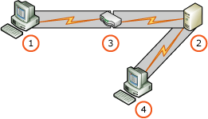

# Extended Protection for Authentication with Reporting Services
  Extended Protection is a set of enhancements to recent versions of the [!INCLUDE[msCoName](../../includes/msconame-md.md)] Windows operating system. Extended protection enhances how credentials and authentication can be protected by applications. The feature itself does not directly provide protection against specific attacks such as credential forwarding, but it provides an infrastructure for applications such as [!INCLUDE[ssRSnoversion](../../../includes/ssrsnoversion-md.md)] to enforce Extended Protection for Authentication.  
  
 The main authentication enhancements that are part of extended protection are service binding and channel binding. Channel binding uses a channel binding token (CBT), to verify that the channel established between two end points was not compromised. Service binding uses Service Principal Names (SPN) to validate the intended destination of authentication tokens. For more background information about extended protection, see [Integrated Windows Authentication with Extended Protection](https://go.microsoft.com/fwlink/?LinkId=179922).  
  
 [!INCLUDE[ssCurrent](../../../includes/sscurrent-md.md)] [!INCLUDE[ssRSnoversion](../../../includes/ssrsnoversion-md.md)] supports and enforces Extended Protection that has been enabled in the operating system and configured in [!INCLUDE[ssRSnoversion](../../../includes/ssrsnoversion-md.md)]. By default, [!INCLUDE[ssRSnoversion](../../../includes/ssrsnoversion-md.md)] accepts requests that specify Negotiate or NTLM authentication and could therefore benefit from Extended Protection support in the operating system and the [!INCLUDE[ssRSnoversion](../../../includes/ssrsnoversion-md.md)] extended protection features.  
  
> [!IMPORTANT]  
>  By default, Windows does not enable Extended Protection. For information about how to enable Extended Protection in Windows, see [Extended Protection for Authentication](https://go.microsoft.com/fwlink/?LinkID=178431). Both the operating system and client authentication stack must support Extended Protection so that authentication succeeds. For older operating systems you may need to install more than one update for a complete, Extended Protection ready computer. For information on recent developments with Extended Protection, see [updated information with Extended Protection](https://go.microsoft.com/fwlink/?LinkId=183362).  
  
## Reporting Services Extended Protection Overview  
 [!INCLUDE[ssCurrent](../../../includes/sscurrent-md.md)] [!INCLUDE[ssRSnoversion](../../../includes/ssrsnoversion-md.md)] supports and enforces extended protection that has been enabled in the operating system. If the operating system does not support extended protection or the feature in the operating system has not been enabled, the [!INCLUDE[ssRSnoversion](../../../includes/ssrsnoversion-md.md)] extended protection feature will fail authentication. [!INCLUDE[ssRSnoversion](../../../includes/ssrsnoversion-md.md)] Extended Protection also requires an SSL Certificate. For more information, see [Configure SSL Connections on a Native Mode Report Server](configure-ssl-connections-on-a-native-mode-report-server.md)  
  
> [!IMPORTANT]
>  By default, [!INCLUDE[ssRSnoversion](../../../includes/ssrsnoversion-md.md)] does not enable Extended Protection. The feature can be enabled by modifying the `rsreportserver.config` configuration file or using WMI APIs to update the configuration file. [!INCLUDE[ssCurrent](../../../includes/sscurrent-md.md)][!INCLUDE[ssRSnoversion](../../../includes/ssrsnoversion-md.md)] does not provide a user interface to modify or view extended protection settings. For more information, see the [configuration settings](#ConfigurationSettings) section in this topic.  
  
 Common issues that occur because of changes in extended protection settings or incorrectly configured settings are not be exposed with obvious error messages or dialog windows. Issues related to extended protection configuration and compatibility result in authentication failures and errors in the [!INCLUDE[ssRSnoversion](../../../includes/ssrsnoversion-md.md)] trace logs.  
  
> [!IMPORTANT]
>  Some data access technologies may not support extended protection. A data access technology is used to connect to SQL Server data sources and to the [!INCLUDE[ssRSnoversion](../../../includes/ssrsnoversion-md.md)] catalog database. Failure of a data access technology to support extended protection impacts [!INCLUDE[ssRSnoversion](../../../includes/ssrsnoversion-md.md)] in the following ways:  
> 
>  -   The SQL Server that runs the [!INCLUDE[ssRSnoversion](../../../includes/ssrsnoversion-md.md)] catalog database cannot have extended protection enabled or the report server will not successfully connect to the catalog database and return authentication errors.  
> -   SQL Servers that are used as [!INCLUDE[ssRSnoversion](../../../includes/ssrsnoversion-md.md)] report data sources cannot have extended protection enabled or tries by the report server to connect to the report data source will fail and return authentication errors.  
> 
>  The documentation for a data access technology should have information about support for extended protection.  
  
### Upgrade  
  
-   Upgrading a [!INCLUDE[ssRSnoversion](../../../includes/ssrsnoversion-md.md)] server to [!INCLUDE[ssCurrent](../../../includes/sscurrent-md.md)] adds configuration settings with default values to the `rsreportserver.config` file. If the settings were already present, the [!INCLUDE[ssCurrent](../../../includes/sscurrent-md.md)] installation will preserve them in the `rsreportserver.config` file.  
  
-   When the configuration settings are added to the `rsreportserver.config` configuration file, the default behavior is for the [!INCLUDE[ssRSnoversion](../../../includes/ssrsnoversion-md.md)] extended protection feature to be off and you must enable the feature as described in this topic. For more information, see the [configuration settings](#ConfigurationSettings) section in this topic.  
  
-   The default value for the setting `RSWindowsExtendedProtectionLevel` is `Off`.  
  
-   The default value for the setting `RSWindowsExtendedProtectionScenario` is `Proxy`.  
  
-   [!INCLUDE[ssCurrent](../../../includes/sscurrent-md.md)] Upgrade Advisor does not verify that the operating system or the current installation of [!INCLUDE[ssRSnoversion](../../../includes/ssrsnoversion-md.md)] has Extended Protection support enabled.  
  
### What Reporting Services extended protection does not cover  
 The following feature areas and scenarios are not supported by the [!INCLUDE[ssRSnoversion](../../../includes/ssrsnoversion-md.md)] extended protection feature:  
  
-   Authors of [!INCLUDE[ssRSnoversion](../../../includes/ssrsnoversion-md.md)] custom security extensions must add support for extended protection to their custom security extension.  
  
-   Third-party components added to or used by a [!INCLUDE[ssRSnoversion](../../../includes/ssrsnoversion-md.md)] installation must be updated by the third-party vendor, to support extended protection. For more information, contact the third-party vendor.  
  
## Deployment Scenarios and recommendations  
 The following scenarios illustrate different deployments and topologies and the recommended configuration to secure them with [!INCLUDE[ssRSnoversion](../../../includes/ssrsnoversion-md.md)] Extended Protection.  
  
### Direct  
 This scenario describes directly connecting to a report server, for example, an intranet environment.  
  
|Scenario|Scenario Diagram|How to secure|  
|--------------|----------------------|-------------------|  
|Direct SSL communication.<br /><br /> The report server will enforce client to report server Channel Binding.|<br /><br /> 1) Client application<br /><br /> 2) Report server|Service Binding is not necessary because the SSL channel will be used for Channel Binding.<br /><br /> Set `RSWindowsExtendedProtectionLevel` to `Allow` or `Require`.<br /><br /> Set `RSWindowsExtendedProtectionScenario` to `Direct`.|  
|Direct HTTP communication. The report server will enforce Client to report server Service Binding.|<br /><br /> 1) Client application<br /><br /> 2) Report server|There is no SSL Channel therefore no enforcement of Channel Binding is possible.<br /><br /> Service Binding can be validated, however, it is not a complete defense without Channel binding and Service Binding on its own will only protect from basic threats.<br /><br /> Set `RSWindowsExtendedProtectionLevel` to `Allow` or `Require`.<br /><br /> Set `RSWindowsExtendedProtectionScenario` to `Any`.|  
  
### Proxy and Network Load Balancing  
 Client applications connect to a device or software that performs SSL and passes through the credentials to the server for authentication, for example, an extranet, Internet, or Secure Intranet. The client connects to a Proxy or all clients use a proxy.  
  
 The situation is the same when you are using a Network Load Balancing (NLB) device.  
  
|Scenario|Scenario Diagram|How to secure|  
|--------------|----------------------|-------------------|  
|HTTP communication. The report server will enforce client to report server Service Binding.|<br /><br /> 1) Client application<br /><br /> 2) Report server<br /><br /> 3) Proxy|There is no SSL Channel therefore no enforcement of Channel Binding is possible.<br /><br /> Set `RSWindowsExtendedProtectionLevel` to `Allow` or `Require`.<br /><br /> Set `RSWindowsExtendedProtectionScenario` to `Any`.<br /><br /> Note that the report server must be configured to know the name of the proxy server to make sure that the service binding is correctly enforced.|  
|HTTP communication.<br /><br /> The report server will enforce client to Proxy Channel Binding and client to report server Service Binding.|<br /><br /> 1) Client application<br /><br /> 2) Report server<br /><br /> 3) Proxy|SSL channel to proxy is available therefore channel binding to the proxy can be enforced.<br /><br /> Service Binding can also be enforced.<br /><br /> The Proxy name must be known to the report server and the report server administrator should either create a URL reservation for it, with a host header or configure the Proxy name in the Windows registry entry `BackConnectionHostNames`.<br /><br /> `RSWindowsExtendedProtectionLevel` to `Allow` or `Require`.<br /><br /> Set `RSWindowsExtendedProtectionScenario` to `Proxy`.|  
|Indirect HTTPS communication with a secure proxy. Report server will enforce client to proxy Channel Binding and Client to report server Service Binding.|<br /><br /> 1) Client application<br /><br /> 2) Report server<br /><br /> 3) Proxy|SSL channel to proxy is available therefore channel binding to the proxy can be enforced.<br /><br /> Service Binding can also be enforced.<br /><br /> The Proxy name must be known to the report server and the report server administrator should either create a URL reservation for it, with a host header or configure the Proxy name in the Windows registry entry `BackConnectionHostNames`.<br /><br /> `RSWindowsExtendedProtectionLevel` to `Allow` or `Require`.<br /><br /> Set `RSWindowsExtendedProtectionScenario` to `Proxy`.|  
  
### Gateway  
 This scenario describes Client applications connecting to a device or software that performs SSL and authenticates the user. Then the device or software impersonates the user context or a different user context before it makes a request to the report server.  
  
|Scenario|Scenario Diagram|How to secure|  
|--------------|----------------------|-------------------|  
|Indirect HTTP communication.<br /><br /> Gateway will enforce Client to Gateway channel binding. There is a Gateway to report server Service Binding.|<br /><br /> 1) Client application<br /><br /> 2) Report server<br /><br /> 3) Gateway device|Channel Binding from client to report server is not possible because the gateway impersonates a context and therefore creates a new NTLM token.<br /><br /> There is no SSL from the Gateway to report server therefore channel binding cannot be enforced.<br /><br /> Service Binding can be enforced.<br /><br /> Set `RSWindowsExtendedProtectionLevel` to `Allow` or `Require`.<br /><br /> Set `RSWindowsExtendedProtectionScenario` to `Any`.<br /><br /> The Gateway device should be configured by your administrator to enforce channel binding.|  
|Indirect HTTPS communication with a Secure Gateway. The Gateway will enforce Client to Gateway Channel Binding and the report server will enforce Gateway to report server Channel Binding.|<br /><br /> 1) Client application<br /><br /> 2) Report server<br /><br /> 3) Gateway device|Channel Binding from client to report server is not possible because the gateway impersonates a context and therefore creates a new NTLM token.<br /><br /> SSL from Gateway to the report server means channel binding can be enforced.<br /><br /> Service Binding is not required.<br /><br /> Set `RSWindowsExtendedProtectionLevel` to `Allow` or `Require`.<br /><br /> Set `RSWindowsExtendedProtectionScenario` to `Direct`.<br /><br /> The Gateway device should be configured by your administrator to enforce channel binding.|  
  
### Combination  
 This scenario describes Extranet or Internet environments where the client connects a Proxy. This is in combination with an intranet environment where a client connects to report server.  
  
|Scenario|Scenario Diagram|How to secure|  
|--------------|----------------------|-------------------|  
|Indirect and direct access from client to report server service without SSL on either of the client to proxy or client to report server connections.|1) Client application<br /><br /> 2) Report server<br /><br /> 3) Proxy<br /><br /> 4) Client application|Service Binding from client to report server can be enforced.<br /><br /> The Proxy name must be known to the report server and the report server administrator should either create a URL reservation for it, with a host header or configure the Proxy name in the Windows registry entry `BackConnectionHostNames`.<br /><br /> Set `RSWindowsExtendedProtectionLevel` to `Allow` or `Require`.<br /><br /> Set `RSWindowsExtendedProtectionScenario` to `Any`.|  
|Indirect and direct access from client to report server where the client establishes an SSL connection to the proxy or report server.|<br /><br /> 1) Client application<br /><br /> 2) Report server<br /><br /> 3) Proxy<br /><br /> 4) Client application|Channel Binding can be used<br /><br /> The Proxy name must be known to the report server and the report server administrator should either create a URL reservation for the proxy, with a host header or configure the Proxy name in the Windows registry entry `BackConnectionHostNames`.<br /><br /> Set `RSWindowsExtendedProtectionLevel` to `Allow` or `Require`.<br /><br /> Set `RSWindowsExtendedProtectionScenario` to `Proxy`.|  
  
## Configuring Reporting Rervices extended protection  
 The `rsreportserver.config` file contains the configuration values that control the behavior of [!INCLUDE[ssRSnoversion](../../../includes/ssrsnoversion-md.md)] extended protection.  
  
 For more information on using and editing the `rsreportserver.config` file, see [RSReportServer Configuration File](../report-server/rsreportserver-config-configuration-file.md). The extended protection settings can also be changed and inspected using WMI APIs. For more information, see [SetExtendedProtectionSettings Method &#40;WMI MSReportServer_ConfigurationSetting&#41;](../wmi-provider-library-reference/configurationsetting-method-setextendedprotectionsettings.md).  
  
 When validation of the configuration settings fail, the authentication types `RSWindowsNTLM`, `RSWindowsKerberos` and `RSWindowsNegotiate` are disabled on the report server.  
  
###  <a name="ConfigurationSettings"></a> Configuration Settings for reporting services extended protection  
 The following table provides information about configuration settings that appear in the `rsreportserver.config` for extended protection.  
  
|Setting|Description|  
|-------------|-----------------|  
|`RSWindowsExtendedProtectionLevel`|Specifies the degree of enforcement of extended protection. Valid values are `Off`, `Allow`, and `Require`.<br /><br /> The default value is `Off`.<br /><br /> The value `Off` specifies no channel binding or service binding verification.<br /><br /> The value `Allow` supports extended protection but does not require it. The value Allow specifies:<br /><br /> Extended protection will be enforced for client applications that are running on operating systems that support extended protection. How protection is enforced is determined by setting `RsWindowsExtendedProtectionScenario`.<br /><br /> Authentication will be allowed for applications that are running on operating systems which do not support extended protection.<br /><br /> The value `Require` specifies:<br /><br /> Extended protection will be enforced for client applications that are running on operating systems that support extended protection.<br /><br /> Authentication will **not** be allowed for applications that are running on operating systems which do not support extended protection.|  
|`RsWindowsExtendedProtectionScenario`|Specifies what forms of extended protection are validated: Channel binding, Service Binding, or both. Valid values are `Any`, `Proxy`, and `Direct`.<br /><br /> The default value is `Proxy`.<br /><br /> The value `Any` specifies:<br /><br /> -Windows NTLM, Kerberos, and Negotiate authentication and a channel binding are not required.<br /><br /> -Service binding is enforced.<br /><br /> The value `Proxy` specifies:<br /><br /> -Windows NTLM, Kerberos, and Negotiate authentication when a channel binding token is present.<br /><br /> -Service Binding is enforced.<br /><br /> The value `Direct` specifies:<br /><br /> -Windows NTLM, Kerberos, and Negotiate authentication when a CBT is present, an SSL connection to the current service is present, and the CBT for the SSL connection matches the CBT of the NTLM, Kerberos or negotiate token.<br /><br /> -Service Binding is not enforced.<br /><br /> <br /><br /> Note: This setting is ignored if `RsWindowsExtendedProtectionLevel` is set to `OFF`.|  
  
 Example entries in the `rsreportserver.config` configuration file:  
  
```  
<Authentication>  
         <RSWindowsExtendedProtectionLevel>Allow</RSWindowsExtendedProtectionLevel>  
         <RSWindowsExtendedProtectionScenario>Proxy</RSWindowsExtendedProtectionLevel>  
</Authentication>  
```  
  
## Service Binding and included SPNs  
 Service binding uses Service Principal Names or SPN to validate the intended destination of authentication tokens. [!INCLUDE[ssRSnoversion](../../../includes/ssrsnoversion-md.md)] uses the existing URL reservation information to build a list of SPNs that are considered valid. Using the URL reservation information for validation of both SPN and URL reservations enables system administrators to manage both from a single location.  
  
 The list of valid SPNs is updated when the report server starts, the configuration settings for extended protection are changed, or when the application domain is recycled.  
  
 The valid list of SPNs is specific for each application. For example, Report Manager and Report Server will each have a different list of valid SPNs calculated.  
  
 The list of valid SPNs calculated for an application is determined by the following factors:  
  
-   Each URL reservation.  
  
-   Each SPN retrieved from the domain controller for the reporting services service account.  
  
-   If a URL reservation includes wildcard characters ('*' or '+'), then Report Server will add each entry from the hosts collection.  
  
### Hosts collection sources.  
 The following table lists the potential sources for the Hosts collection.  
  
|Type of source|Description|  
|--------------------|-----------------|  
|ComputerNameDnsDomain|The name of the DNS domain assigned to the local computer. If the local computer is a node in a cluster, the DNS domain name of the cluster virtual server is used.|  
|ComputerNameDnsFullyQualified|The fully qualified DNS name that uniquely identifies the local computer. This name is a combination of the DNS host name and the DNS domain name, using the form *HostName*.*DomainName*. If the local computer is a node in a cluster, the fully qualified DNS name of the cluster virtual server is used.|  
|ComputerNameDnsHostname|The DNS host name of the local computer. If the local computer is a node in a cluster, the DNS host name of the cluster virtual server is used.|  
|ComputerNameNetBIOS|The NetBIOS name of the local computer. If the local computer is a node in a cluster, the NetBIOS name of the cluster virtual server is used.|  
|ComputerNamePhysicalDnsDomain|The name of the DNS domain assigned to the local computer. If the local computer is a node in a cluster, the DNS domain name of the local computer is used, not the name of the cluster virtual server.|  
|ComputerNamePhysicalDnsFullyQualified|The fully qualified DNS name that uniquely identifies the computer. If the local computer is a node in a cluster, the fully qualified DNS name of the local computer, is used not the name of the cluster virtual server.<br /><br /> The fully qualified DNS name is a combination of the DNS host name and the DNS domain name, using the form *HostName*.*DomainName*.|  
|ComputerNamePhysicalDnsHostname|The DNS host name of the local computer. If the local computer is a node in a cluster, the DNS host name of the local computer is used, not the name of the cluster virtual server.|  
|ComputerNamePhysicalNetBIOS|The NetBIOS name of the local computer. If the local computer is a node in a cluster, the NetBIOS name of the local computer, not the name of the cluster virtual server.|  
  
 As SPNs are added, an entry is added to the trace log that resembles the following:  
  
 `rshost!rshost!10a8!01/07/2010-19:29:38:: i INFO: SPN Whitelist Added <ComputerNamePhysicalNetBIOS> - <theservername>.`  
  
 `rshost!rshost!10a8!01/07/2010-19:29:38:: i INFO: SPN Whitelist Added <ComputerNamePhysicalDnsHostname> - <theservername>.`  
  
 For more information, see [Register a Service Principal Name &#40;SPN&#41; for a Report Server](../report-server/register-a-service-principal-name-spn-for-a-report-server.md) and [About URL Reservations and Registration  &#40;SSRS Configuration Manager&#41;](../install-windows/about-url-reservations-and-registration-ssrs-configuration-manager.md).  
  
## See Also  
 [Connect to the Database Engine Using Extended Protection](../../database-engine/configure-windows/connect-to-the-database-engine-using-extended-protection.md)   
 [Extended Protection for Authentication Overview](https://go.microsoft.com/fwlink/?LinkID=177943)   
 [Integrated Windows Authentication with Extended Protection](https://go.microsoft.com/fwlink/?LinkId=179922)   
 [Microsoft Security Advisory: Extended protection for authentication](https://go.microsoft.com/fwlink/?LinkId=179923)   
 [Report Server Service Trace Log](../report-server/report-server-service-trace-log.md)   
 [RSReportServer Configuration File](../report-server/rsreportserver-config-configuration-file.md)   
 [SetExtendedProtectionSettings Method &#40;WMI MSReportServer_ConfigurationSetting&#41;](../wmi-provider-library-reference/configurationsetting-method-setextendedprotectionsettings.md)  
  
  
