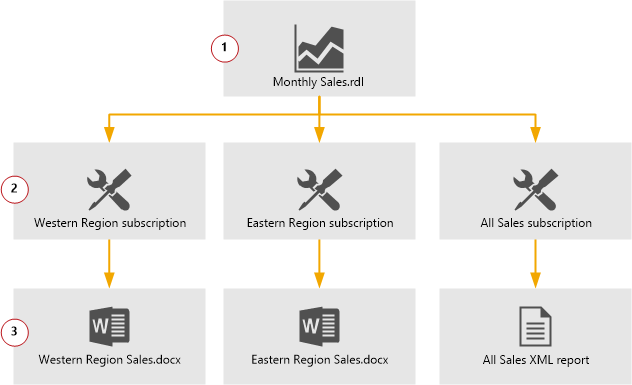

# Subscriptions and Delivery (Reporting Services)
  A [!INCLUDE[ssRSnoversion](../../../includes/ssrsnoversion-md.md)] subscription is a configuration that delivers a report at a specific time or in response to an event, and in a file format that you specify. For example, every Wednesday, save the MonthlySales.rdl report as a Microsoft Word document to a file share. Subscriptions can be used to schedule and automate the delivery of a report and with a specific set of report parameter values.  
  
 You can create multiple subscriptions for a single report to vary the subscription options; for example, you can specify different parameter values to produce three versions of a report, such as a Western region sales report, Eastern region sales, and all sales.  
  
   
  
 Subscriptions are not available in every edition of [!INCLUDE[ssNoVersion](../../../includes/ssnoversion-md.md)]. For a list of features that are supported by the editions of [!INCLUDE[ssNoVersion](../../../includes/ssnoversion-md.md)], see [Features Supported by the Editions of SQL Server 2014](../../getting-started/features-supported-by-the-editions-of-sql-server-2014.md).  
  
> [!NOTE]
>  Starting with [!INCLUDE[ssKilimanjaro](../../includes/sskilimanjaro-md.md)][!INCLUDE[ssRSnoversion](../../../includes/ssrsnoversion-md.md)] you can transfer the ownership of a subscription programmatically. There is no user interface you can use to transfer ownership of subscriptions. For more information, see <xref:ReportService2010.ReportingService2010.ChangeSubscriptionOwner%2A>and [Use PowerShell to Change and List Reporting Services Subscription Owners and Run a Subscription](manage-subscription-owners-and-run-subscription-powershell.md).  
  
 **In this topic:**  
  
-   [Subscription and Delivery Scenarios](#bkmk_subscription_scenarios)  
  
-   [Standard and Data-Driven Subscriptions](#bkmk_standard_and_datadriven)  
  
-   [Subscription Requirements](#bkmk_subscription_requirements)  
  
-   [Delivery Extensions](#bkmk_delivery_extensions)  
  
-   [Parts of a Subscription](#bkmk_parts_of_subscription)  
  
-   [How subscriptions are processed](#bkmk_subscription_processing)  
  
-   [How subscriptions are processed](#bkmk_subscription_processing)  
  
 **Topics In this section:**  
  
-   [E-Mail Delivery in Reporting Services](e-mail-delivery-in-reporting-services.md) Describes report server e-mail delivery operation and configuration.  
  
-   [File Share Delivery in Reporting Services](file-share-delivery-in-reporting-services.md) Describes report server file share delivery operation and configuration.  
  
-   [SharePoint Library Delivery in Reporting Services](sharepoint-library-delivery-in-reporting-services.md) Describes subscription delivery to a SharePoint library.  
  
-   [Data-Driven Subscriptions](data-driven-subscriptions.md) Provides information about using data-driven subscriptions to customize report output at run time.  
  
-   [Create and Manage Subscriptions for Native Mode Report Servers](../create-manage-subscriptions-native-mode-report-servers.md)  
  
-   [Create and Manage Subscriptions for SharePoint Mode Report Servers](create-and-manage-subscriptions-for-sharepoint-mode-report-servers.md)  
  
-   [Monitor Reporting Services Subscriptions](monitor-reporting-services-subscriptions.md)  
  
-   [Use PowerShell to Change and List Reporting Services Subscription Owners and Run a Subscription](manage-subscription-owners-and-run-subscription-powershell.md)  
  
##   Subscription and Delivery Scenarios  
 For each subscription, you configure delivery options and the available options are determined by the delivery extension you choose. A delivery extension is a module that supports some manner of distribution. [!INCLUDE[ssRSnoversion](../../../includes/ssrsnoversion-md.md)] includes several delivery extensions and delivery extension may be available through third-party vendors.  
  
 If you are a developer, you can create custom delivery extensions to support additional scenarios. For more information, see [Implementing a Delivery Extension](../extensions/delivery-extension/implementing-a-delivery-extension.md).  
  
 The following table describes the common [!INCLUDE[ssRSnoversion](../../../includes/ssrsnoversion-md.md)] subscription scenarios.  
  
|Scenario|Description|  
|--------------|-----------------|  
|E-mail Reports|E-mail reports to individual users and groups. Create a subscription and specify a group alias or e-mail alias to receive a report that you want to distribute. You can have [!INCLUDE[ssRSnoversion](../../../includes/ssrsnoversion-md.md)] determine the subscription data at run time. If you want to send the same report to a group that has a changing list of members, you can use a query to derive the subscription list at run time.|  
|View Reports off-line|Reports that you want to archive can be sent directly to a shared folder that you back up on a nightly schedule. Large reports that take too long to load in a browser can be sent to a shared folder in a format that can be viewed in a desktop application. Users can select one of the following formats for subscription output:   XML file with report data   CSV (comma delimited)   PDF   MHTML (web archive)   Microsoft Excel   TIFF file   Microsoft Word|  
|Pre-load cache|If you have multiple instances of a parameterized report or a large number of report users who view reports, you can preload reports in the cache to reduce processing time required to display the report.|  
|Data-driven reports|Use data-driven subscriptions to customize report output, delivery options, and report parameter settings at run time. The subscription uses a query to get input values from a data source at run time. You can use data-driven subscriptions to perform a mail-merge operation that sends a report to a list of subscribers that is determined at the time the subscription is processed.|  
  
##   Standard and Data-Driven Subscriptions  
 [!INCLUDE[ssRSnoversion](../../../includes/ssrsnoversion-md.md)] supports two kinds of subscriptions: **standard** and **data-driven**. Standard subscriptions are created and managed by individual users. A standard subscription consists of static values that cannot be varied during subscription processing. For each standard subscription, there is exactly one set of report presentation options, delivery options, and report parameters.  
  
 Data-driven subscriptions get subscription information at run time by querying an external data source that provides values used to specify a recipient, report parameters, or application format. You might use data-driven subscriptions if you have a very large recipient list or if you want to vary report output for each recipient. To use data-driven subscriptions, you must have expertise in building queries and an understanding of how parameters are used. Report server administrators typically create and manage these subscriptions. For more information, see the following:  
  
-   [Data-Driven Subscriptions](data-driven-subscriptions.md)  
  
-   [Create a Data-Driven Subscription &#40;SSRS Tutorial&#41;](../create-a-data-driven-subscription-ssrs-tutorial.md)  
  
##   Subscription Requirements  
 Before you can create a subscription to a report, the following prerequisites must be met:  
  
|Requirement|Description|  
|-----------------|-----------------|  
|Permissions|You must have access to the report. Before you can subscribe to a report, you must have permission to view it.   Your role assignment must include the "Manage individual subscriptions" task.|  
|Stored credentials|To create a subscription, the report must use stored credentials or no credentials to retrieve data at run time. You cannot subscribe to a report that is configured to use the impersonated or delegated credentials of the current user to connect to an external data source. The stored credentials can be a Windows account or a database user account. For more information, see [Specify Credential and Connection Information for Report Data Sources](../report-data/specify-credential-and-connection-information-for-report-data-sources.md)   You must have permission to view the report and create individual subscriptions. **Scheduled Events and Report Delivery** must be enabled on the report server. For more information, see [Create and Manage Subscriptions for Native Mode Report Servers](../create-manage-subscriptions-native-mode-report-servers.md).|  
|User dependent values in a report|For standard subscriptions only, you can create subscriptions to reports that incorporate user account information in a filter or as text that appears on the report. In the report, the user account name is specified through a `User!UserID` expression that resolves to the current user. When you create a subscription, the user who creates the subscription is the considered the current user.|  
|No model item security|You cannot subscribe to a Report Builder report that uses a model as a data source if the model contains model item security settings. Only reports that use model item security are included in this restriction.|  
|Parameter values|If the report uses parameters, a parameter value must be specified with the report itself, or in the subscription you define. If default values have been defined in the report, you can set the parameter value to use the default.|  
  
##   Delivery Extensions  
 Subscriptions are processed on the report server and are distributed through delivery extensions that are deployed on the server. By default, you can create subscriptions that send reports to a shared folder or to an e-mail address. If the report server is configured for SharePoint integrated mode, you can also send a report to a SharePoint library.  
  
 When a user creates a subscription, he or she can choose one of the available delivery extensions to determine how the report is delivered. [!INCLUDE[ssRSnoversion](../../../includes/ssrsnoversion-md.md)] includes the following delivery extensions.  
  
|Delivery Extension|Description|  
|------------------------|-----------------|  
|Windows File Share|Delivers a report as a static application file to a shared folder that is accessible on the network.|  
|E-mail|Delivers a notification or a report as an e-mail attachment or URL link.|  
|SharePoint library|Delivers a report as a static application file to a SharePoint library that is accessible from a SharePoint site. The site must be integrated with a report server that runs in SharePoint integrated mode.|  
|Null|The null delivery provider is a highly specialized delivery extension that is used to preload a cache with ready-to-view parameterized reports This method is not available to users in individual subscriptions. Null delivery is used by administrators in data-driven subscriptions to improve report server performance by preloading the cache.|  
  
> [!NOTE]  
>  Report delivery is an extensible part of [!INCLUDE[ssRSnoversion](../../../includes/ssrsnoversion-md.md)] architecture. Third-party vendors can create custom delivery extensions to route reports to different locations or devices. For more information about custom delivery extensions, see [Implementing a Delivery Extension](../extensions/delivery-extension/implementing-a-delivery-extension.md).  
  
##   Parts of a Subscription  
 A subscription definition consists of the following parts:  
  
-   A pointer to a report that can run unattended (that is, a report that uses stored credentials or no credentials).  
  
-   A delivery method (for example, e-mail) and settings for the mode of delivery (such as an e-mail address).  
  
-   A rendering extension to present the report in a specific format.  
  
-   Conditions for processing the subscription, which is expressed as an event.  
  
     Usually, the conditions for running a report are time-based. For example, you may want to run a particular report every Tuesday at 3:00 P.M. UTC. However, if the report runs as a snapshot, you can specify that the subscription runs whenever the snapshot is refreshed.  
  
-   Parameters used when running the report.  
  
     Parameters are optional and are specified only for reports that accept parameter values. Because a subscription is typically user-owned, the parameter values that are specified vary from subscription to subscription. For example, sales managers for different divisions will use parameters that return data for their division. All parameters must have a value explicitly defined, or have a valid default value.  
  
 Subscription information is stored with individual reports in a report server database. You cannot manage subscriptions separately from the report to which they are associated. Note that subscriptions cannot be extended to include descriptions, other custom text, or other elements. Subscriptions can contain only the items listed earlier.  
  
##   How subscriptions are processed  
 [!INCLUDE[ssRSnoversion](../../../includes/ssrsnoversion-md.md)] includes a scheduling and delivery processor, which provides functionality for scheduling reports and delivering them to users. The report server responds to events that it monitors on an ongoing basis. When an event occurs that matches the conditions defined for a subscription, the report server reads the subscription to determine how to process and deliver the report. The report server requests the delivery extension that is specified in the subscription. After the delivery extension is running, the report server extracts delivery information from the subscription and passes it to the delivery extension for processing.  
  
 The delivery extension renders the report in the format defined in the subscription and then delivers the report or notification to the specified destination. If a report cannot be delivered, an entry is logged to the report server log file. If you want to support retry operations, you can configure the report server to re-attempt the delivery if the first attempt fails.  
  
### Processing a Standard Subscription  
 Standard subscriptions produce one instance of a report. The report is delivered to a single shared folder or to the e-mail addresses specified in the subscription. The report layout and data do not vary. If the report uses parameters, a standard subscription is processed with a single value for each parameter in the report.  
  
### Processing a Data-Driven Subscription  
 Data-driven subscriptions can produce many report instances that are delivered to multiple destinations. The report layout does not vary, but the data in a report can vary if parameter values are passed in from a subscriber result set. Delivery options that affect how the report is rendered and whether the report is attached or linked to the e-mail can also vary from subscriber to subscriber when the values are passed in from the row set.  
  
 Data-driven subscriptions can produce a large number of deliveries. The report server creates a delivery for each row in the row set that is returned from the subscription query.  
  
### Report Delivery Characteristics  
 Reports that are delivered through standard subscriptions are typically rendered as static reports. These reports are either based on the most recent report execution snapshot, or generated as a static report for the purpose of completing a delivery. If you choose the **Include Link** option in a subscription to a report that runs on demand, the report server runs the report when you click the hyperlink.  
  
> [!NOTE]  
>  Reports that are delivered through a URL remain connected to the report server and can be updated or deleted between viewings. The delivery options you choose for your subscription determine whether the report is delivered as a URL, embedded within the body of an e-mail message, or sent as an attachment.  
  
 Reports that are delivered through a data-driven subscription may be regenerated while the subscription is being processed. The report server does not lock in a specific instance of a report or its dataset to complete a data-driven subscription. If the subscription uses different parameter values for different subscribers, the report server regenerates the report to produce the required result. If the underlying data is updated after the first report copy is created and delivered, users who get reports later in the process may see data that is based on different result set. You can use a report that runs as a snapshot to ensure that the same report instance is delivered to all subscribers. However, if a scheduled update to the snapshot occurs while the subscription is processing, users may still get different data in their reports.  
  
### Triggering Subscription Processing  
 The report server uses two kinds of events to trigger subscription processing: a time-driven event that is specified in a schedule or a snapshot update event.  
  
 A time-driven trigger uses a report-specific schedule or a shared schedule to specify when a subscription runs. For on-demand and cached reports, schedules are the only trigger option.  
  
 A snapshot update event uses the scheduled update of a report snapshot to trigger a subscription. You can define a subscription that is triggered whenever the report is updated with new data, based on report execution properties that are set on the report.  
  
## See Also  
 [Create a Data-Driven Subscription &#40;SSRS Tutorial&#41;](../create-a-data-driven-subscription-ssrs-tutorial.md)   
 [Schedules](schedules.md)   
 [Reporting Services Report Server &#40;Native Mode&#41;](../report-server/reporting-services-report-server-native-mode.md)   
 [Create and Manage Subscriptions for Native Mode Report Servers](../create-manage-subscriptions-native-mode-report-servers.md)   
 [Monitor Reporting Services Subscriptions](monitor-reporting-services-subscriptions.md)  
  
  
