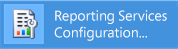
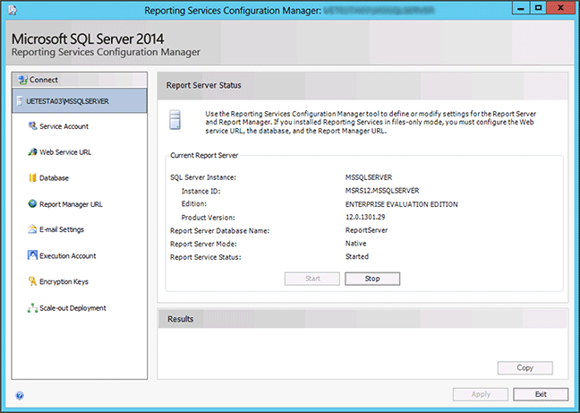
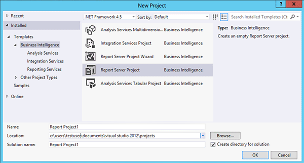

# Tutorial: How to Locate and Start Reporting Services Tools (SSRS)
  This tutorial introduces the tools used to configure a report server, manage report server content and operations, and create and publish reports. The purpose of this tutorial is to help new users understand how to find and open each tool. If you are already familiar with the tools, you can move on to other tutorials that can help you learn important skills for using [!INCLUDE[ssRSnoversion](../../../includes/ssrsnoversion-md.md)]. For more information about other tutorials, see [Reporting Services Tutorials &#40;SSRS&#41;](../reporting-services-tutorials-ssrs.md).  
  
 In this topic:  
  
-   [Reporting Services Configuration Manager (Native Mode)](#bkmk_configuration_manager)  
  
-   [Report Manager (Native Mode)](#bkmk_report_manager)  
  
-   [Management Studio](#bkmk_managements_studio)  
  
-   [SQL Server Data Tools with Report Designer and Report Wizard](#bkmk_ssdt)  
  
-   [Report Builder](#bkmk_report_builder)  
  
##   Reporting Services Configuration Manager (Native Mode)  
 Use the Native mode configuration manager to complete the following:, , , , , and.  
  
-   Specify the service account.  
  
-   Create or upgrade the report server database.  
  
-   Modify the connection properties.  
  
-   Specify URLs.  
  
-   Manage encryption keys.  
  
-   Configure unattended report processing and e-mail report delivery.  
  
 **Installation:** [!INCLUDE[ssRSnoversion](../../../includes/ssrsnoversion-md.md)] Configuration Manager is installed when you install [!INCLUDE[ssRSnoversion](../../../includes/ssrsnoversion-md.md)] Native mode. For more information, see [Install Reporting Services Native Mode Report Server](../install-windows/install-reporting-services-native-mode-report-server.md)  
  
#### To start the Reporting Services Configuration Manager  
  
1.  On the Windows start screen, type `reporting` and in the **Apps** search results, click **Reporting Services Configuration Manager**.  
  
       
  
     **Or**  
  
     Click **Start**, then click **Programs**, then click [!INCLUDE[ssCurrentUI](../../../includes/sscurrentui-md.md)], then click **Configuration Tools**, and then click **Reporting Services Configuration Manager**.  
  
     The **Report Server Installation Instance Selection** dialog box appears so that you can select the report server instance you want to configure.  
  
2.  In **Server Name**, specify the name of the computer on which the report server instance is installed. The name of the local computer is specified by default, but you can also type the name of a remote [!INCLUDE[ssNoVersion](../../../includes/ssnoversion-md.md)] instance.  
  
     If you specify a remote computer, click **Find** to establish a connection. The report server must be configured for remote administration in advance. For more information, see [Configure a Report Server for Remote Administration](../report-server/configure-a-report-server-for-remote-administration.md).  
  
3.  In **Instance Name**, choose the [!INCLUDE[ssNoVersion](../../../includes/ssnoversion-md.md)] [!INCLUDE[ssRSnoversion](../../../includes/ssrsnoversion-md.md)] instance that you want to configure. Only [!INCLUDE[ssKatmai](../../includes/sskatmai-md.md)], [!INCLUDE[ssKilimanjaro](../../includes/sskilimanjaro-md.md)], and [!INCLUDE[ssCurrent](../../includes/sscurrent-md.md)] report server instances appear in the list. You cannot configure earlier versions of [!INCLUDE[ssRSnoversion](../../../includes/ssrsnoversion-md.md)].  
  
4.  Click **Connect**.  
  
5.  To verify that you launched the tool, compare your results to the following image:  
  
       
  
 **Next Steps:** [Configure and Administer a Report Server &#40;SSRS Native Mode&#41;](../report-server/configure-and-administer-a-report-server-ssrs-native-mode.md) and [Reporting Services Configuration Manager &#40;Native Mode&#41;](../../sql-server/install/reporting-services-configuration-manager-native-mode.md).  
  
##   Report Manager (Native Mode)  
 Use [Report Manager  &#40;SSRS Native Mode&#41;](../report-manager-ssrs-native-mode.md) to set permissions, manage subscriptions and schedules, and work with reports. You can also use Report Manager to view reports.  
  
 **Installation:** Report Manager Is installed when you install [!INCLUDE[ssRSnoversion](../../../includes/ssrsnoversion-md.md)] Native mode: [Install Reporting Services Native Mode Report Server](../install-windows/install-reporting-services-native-mode-report-server.md)  
  
 Before you can open Report Manager, you must have sufficient permissions (initially, only members of the local Administrators group have permissions that provide access to Report Manager features). Report Manager provides different pages and options depending on the role assignments of the current user. Users who have no permissions will get an empty page. Users with permissions to view reports will get links that they can click to open the reports. To learn more about permissions, see [Roles and Permissions &#40;Reporting Services&#41;](../security/roles-and-permissions-reporting-services.md).  
  
#### To start Report Manager  
  
1.  Open your browser. For information on supported browsers and browser versions, see [Planning for Reporting Services and Power View Browser Support &#40;Reporting Services 2014&#41;](../browser-support-for-reporting-services-and-power-view.md).  
  
2.  In the address bar of the Web browser, type the Report Manager URL. By default, the URL is **http://\<serverName>/reports**. You can use the Reporting Services Configuration tool to confirm the server name and URL. For more information about URLs used in [!INCLUDE[ssRSnoversion](../../../includes/ssrsnoversion-md.md)], see [Configure Report Server URLs  &#40;SSRS Configuration Manager&#41;](../install-windows/configure-report-server-urls-ssrs-configuration-manager.md).  
  
3.  Report Manager opens in the browser window. The startup page is the Home folder. Depending on permissions, you might see additional folders, hyperlinks to reports, and resource files within the startup page. You might also see additional buttons and commands on the toolbar.  
  
4.  If you run Report Manager on the local report server, see [Configure a Native Mode Report Server for Local Administration &#40;SSRS&#41;](../report-server/configure-a-native-mode-report-server-for-local-administration-ssrs.md).  
  
 **Next Steps:** [Configure Report Manager &#40;Native Mode&#41;](../report-server/configure-web-portal.md).  
  
##   Management Studio  
 Report server administrators can use [!INCLUDE[ssManStudio](../../includes/ssmanstudio-md.md)] to manage a report server alongside other [!INCLUDE[ssNoVersion](../../../includes/ssnoversion-md.md)] component servers. For more information, see [Use SQL Server Management Studio](../../database-engine/use-sql-server-management-studio.md).  
  
#### To Start SQL Server Management Studio  
  
1.  From the Windows Start Screen type `sql server` and in the **Apps** search results, click **SQL Server Management Studio**.  
  
       
  
     **Or**  
  
     Click **Start**, then click **All Programs**, then click [!INCLUDE[ssCurrentUI](../../../includes/sscurrentui-md.md)], and then click **SQL Server Management Studio**. The **Connect to Server** dialog box appears.  
  
2.  If the **Connect to Server** dialog box does not appear, in **Object Explorer**, click **Connect** and then select **Reporting Services**.  
  
3.  In the **Server type** list, select **Reporting Services**. If [!INCLUDE[ssRSnoversion](../../../includes/ssrsnoversion-md.md)] is not on the list, it is not installed.  
  
4.  In the **Server name** list, select a report server instance. Local instances appear in the list. You can also type the name of a remote [!INCLUDE[ssNoVersion](../../../includes/ssnoversion-md.md)] instance.  
  
5.  Click **Connect**. You can expand the root node to set server properties, modify role definitions, or turn off report server features.  
  
##   SQL Server Data Tools with Report Designer and Report Wizard  
 Report Designer is available within [!INCLUDE[ssBIDevStudioFull](../../../includes/ssbidevstudiofull-md.md)] - Business Intelligence for Visual Studio 2012. The design surface in the tool includes tabbed windows, wizards, and menus used to access report authoring features. The report designer tool becomes available when you choose a Report Server Project or a Report Server Wizard template. To learn more, see [Reporting Services in SQL Server Data Tools &#40;SSDT&#41;](reporting-services-in-sql-server-data-tools-ssdt.md).  
  
#### To start Report Designer  
  
1.  From the Windows start screen, type **data** and in the **Apps** search results, click **SQL Server Data Tools for Visual Studio 2012**.  
  
     **Or**  
  
     Click **Start**, point to **All Programs**, point to [!INCLUDE[ssCurrentUI](../../../includes/sscurrentui-md.md)], and then click **SQL Server Data Tools (SSDT)**.  
  
2.  On the **File** menu, point to **New**, and then click **Project**.  
  
3.  In the **Project Types** list, click **Business Intelligence Projects**.  
  
4.  In the **Templates** list, click **Report Server Project**. The following diagram shows how the project templates appear in the dialog box:  
  
       
  
5.  Type a name and location for the project, or click **Browse** and select a location.  
  
6.  [!INCLUDE[clickOK](../../includes/clickok-md.md)] [!INCLUDE[ssBIDevStudioFull](../../../includes/ssbidevstudiofull-md.md)] opens with the [!INCLUDE[vsprvs](../../includes/vsprvs-md.md)] start page. Solution Explorer provides categories for creating reports and data sources. You can use these categories to create new reports and data sources. Tabbed windows appear when you create a report definition. The tabbed windows are Data, Layout, and Preview..  
  
 To get started on your first report, see [Create a Basic Table Report &#40;SSRS Tutorial&#41;](../create-a-basic-table-report-ssrs-tutorial.md). To learn more about query designers you can use within Report Designer, see [Query Design Tools in Report Designer SQL Server Data Tools &#40;SSRS&#41;](../report-data/query-design-tools-ssrs.md).  
  
##   Report Builder  
 Use [Report Builder &#40;SSRS&#41;](report-builder-authoring-environment-ssrs.md) to create reports in a [!INCLUDE[msCoName](../../includes/msconame-md.md)] Office-like authoring environment. You can customize and update all existing reports, regardless of whether they were created in Report Designer or in the previous versions of Report Builder. Contact your administrator for the location of the ReportBuilder3.msi file that you run to install Report Builder on your local computer.  
  
 **Installation:** The click-once version of report builder is installed by either [!INCLUDE[ssRSnoversion](../../../includes/ssrsnoversion-md.md)] Native mode or SharePoint mode. The Stand-alone version of Report Builder is a separate download.  See [Install the Stand-Alone Version of Report Builder &#40;Report Builder&#41;](../install-windows/install-report-builder.md)  
  
#### To start Report Builder ClickOnce from Report Manager (Native Mode)  
  
1.  In your Web browser, type the Report Manager URL for your report server. By default, the URL is http://\<*servername*>/reports. Report Manager opens.  
  
2.  Click **Report Builder**.  
  
     Report Builder opens and you can create a report or open a report on the report server.  
  
#### To start Report Builder ClickOnce using a URL  
  
1.  In your Web browser, type the following URL in the address bar:  
  
     **http://\<servername>/reportserver/reportbuilder/ReportBuilder_3_0_0_0.application**  
  
2.  Press ENTER.  
  
     Report Builder opens and you can create a report or open a report on the report server.  
  
#### To start Report Builder ClickOnce in Reporting Services SharePoint mode  
  
1.  Navigate to the site that contains the library where you want to create a new report.  
  
2.  Open the library.  
  
3.  On the **New** menu, click **Report Builder Report**.  
  
     Report Builder opens and you can create a report or open a report on the report server.  
  
#### To start Report Builder Stand-alone  
  
1.  From the Windows start screen, type **report builder** and then click **Report Builder 3.0**.  
  
     **Or**  
  
     On the Start menu, click **All Programs**, and then click **Microsoft SQL Server 2014 Report Builder**.  
  
2.  Click **Report Builder**.  
  
     Report Builder opens and you can create or open a report.  
  
3.  Click **Report Builder Help** to open the documentation for Report Builder.  
  
## See Also  
 [Install, Uninstall, and Report Builder Support](../install-uninstall-and-report-builder-support.md)   
 [Reporting Services SharePoint Mode Installation &#40;SharePoint 2010 and SharePoint 2013&#41;](../install-windows/install-reporting-services-sharepoint-mode.md)   
 [Reporting Services Report Server](../reporting-services-report-server.md)   
 [Query Design Tools in Report Designer SQL Server Data Tools &#40;SSRS&#41;](../report-data/query-design-tools-ssrs.md)   
 [Reporting Services Tutorials &#40;SSRS&#41;](../reporting-services-tutorials-ssrs.md)  
  
  
