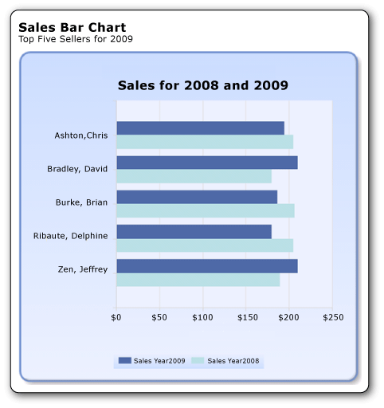

# Tutorial: Add a Bar Chart to Your Report (Report Builder)
  A bar chart displays category data horizontally. This can help to:  
  
-   Improve readability of long category names.  
  
-   Improve understandability of times plotted as values.  
  
-   Compare the relative value of multiple series.  
  
 The following illustration shows the bar chart that you will create, with sales for 2008 and 2009 for the top five salespeople, in alphabetical order.  
  
   
  
##  <a name="BackToTop"></a> What You Will Learn  
 In this tutorial you will learn how to do the following:  
  
1.  [Create a Chart from the Chart Wizard](#Chart)  
  
2.  [Choose the Chart Type](#ChartType)  
  
3.  [Display all Category Values on the Vertical Axis](#AllValues)  
  
4.  [Modify the Display of Names on the Vertical Axis](#Sort)  
  
5.  [Move the Legend](#Legend)  
  
6.  [Move the Chart Title](#ChartTitle)  
  
7.  [Format and Label the Horizontal Axis](#Horizontal)  
  
8.  [Add a Filter to Display the Top Five Values](#Filter)  
  
9. [Add a Report Title](#Title)  
  
10. [Save the Report](#Save)  
  
> [!NOTE]  
>  In this tutorial, the steps for the wizard are consolidated into one procedure. For step-by-step instructions about how to browse to a report server, create a dataset, and choose a data source, see the first tutorial in this series: [Tutorial: Creating a Basic Table Report &#40;Report Builder&#41;](../reporting-services/tutorial-creating-a-basic-table-report-report-builder.md).  
  
 Estimated time to complete this tutorial: 15 minutes.  
  
## Requirements  
 For more information about requirements, see [Prerequisites for Tutorials &#40;Report Builder&#41;](../reporting-services/report-builder-tutorials.md).  
  
##  <a name="Chart"></a> 1. Create a Chart Report from the Chart Wizard  
 From the **Getting Started** dialog box, create an embedded dataset, choose a shared data source, and create a bar chart by using the Chart Wizard.  
  
> [!NOTE]  
>  In this tutorial, the query contains the data values so that it does not need an external data source. This makes the query quite long. In a business environment, a query would not contain the data. This is for learning purposes only.  
  
#### To create a new chart report  
  
1.  Click **Start**, point to **Programs**, point to **Microsoft SQL Server 2012 Report Builder**, and then click **Report Builder**.  
  
     The **Getting Started** dialog box appears.  
  
    > [!NOTE]  
    >  If the **Getting Started** dialog box does not appear, click the Report Builder button, and then click **New**.  
  
2.  In the left pane, verify that **New Report** is selected.  
  
3.  In the right pane, click **Chart Wizard**.  
  
4.  On the **Choose a dataset** page, click **Create a dataset**, and then click **Next**.  
  
5.  On the **Choose a connection to a data source** page, select an existing data source or browse to the report server and select a data source, and then click **Next**. You may need to enter a user name and password.  
  
    > [!NOTE]  
    >  The data source you choose is unimportant, as long as you have adequate permissions. You will not be getting data from the data source. For more information, see [Alternative Ways to Get a Data Connection &#40;Report Builder&#41;](../reporting-services/alternative-ways-to-get-a-data-connection-report-builder.md).  
  
6.  On the **Design a query** page, click **Edit as Text**.  
  
7.  Paste the following query into the query pane:  
  
    ```  
    SELECT 'Luis' as FirstName, 'Alverca' as LastName, CAST(170000.00 AS money) AS SalesYear2009, CAST(150000. AS money) AS SalesYear2008  
    UNION SELECT 'Jeffrey' as FirstName, 'Zeng' as LastName, CAST(210000. AS money) AS SalesYear2009, CAST(190000. AS money) AS SalesYear2008  
    UNION SELECT 'Houman' as FirstName, 'Pournasseh' as LastName, CAST(150000. AS money) AS SalesYear2009, CAST(180000. AS money) AS SalesYear2008  
    UNION SELECT 'Robin' as FirstName, 'Wood' as LastName, CAST(75000. AS money) AS SalesYear2009, CAST(175000. AS money) AS SalesYear2008  
    UNION SELECT 'Daniela' as FirstName, 'Guaita' as LastName,  CAST(170000. AS money) AS SalesYear2009, CAST(175000. AS money) AS SalesYear2008  
    UNION SELECT 'John' as FirstName, 'Yokim' as LastName, CAST(160000. AS money) AS SalesYear2009, CAST(195000. AS money) AS SalesYear2008  
    UNION SELECT 'Delphine' as FirstName, 'Ribaute' as LastName, CAST(180000. AS money) AS SalesYear2009, CAST(205000. AS money) AS SalesYear2008  
    UNION SELECT 'Robert' as FirstName, 'Hernady' as LastName, CAST(140000. AS money) AS SalesYear2009, CAST(180000. AS money) AS SalesYear2008  
    UNION SELECT 'Tanja' as FirstName, 'Plate' as LastName, CAST(150000. AS money) AS SalesYear2009, CAST(160000. AS money) AS SalesYear2008  
    UNION SELECT 'David' as FirstName, 'Bradley' as LastName, CAST(210000. AS money) AS SalesYear2009, CAST(180000. AS money) AS SalesYear2008  
    UNION SELECT 'Michal' as FirstName, 'Jaworski' as LastName, CAST(175000. AS money) AS SalesYear2009, CAST(220000. AS money) AS SalesYear2008  
    UNION SELECT 'Chris' as FirstName, 'Ashton' as LastName, CAST(195000. AS money) AS SalesYear2009, CAST(205000. AS money) AS SalesYear2008  
    UNION SELECT 'Pongsiri' as FirstName, 'Hirunyanitiwatna' as LastName, CAST(175000. AS money) AS SalesYear2009, CAST(215000. AS money) AS SalesYear2008  
    UNION SELECT 'Brian' as FirstName, 'Burke' as LastName, CAST(187000. AS money) AS SalesYear2009, CAST(207000. AS money) AS SalesYear2008  
    ```  
  
8.  (Optional) Click the Run button (**!**) to see the data your chart will be based on.  
  
9. Click **Next**.  
  
##  <a name="ChartType"></a> 2. Choose the Chart Type  
 You can choose from a variety of predefined chart types.  
  
#### To add a column chart  
  
1.  On the **Choose a chart type** page, the column chart is the default chart type.  
  
2.  Click **Bar**, and then click **Next**.  
  
     On the **Arrange chart fields** page, there are four fields in the **Available fields** pane: FirstName, LastName, SalesYear2009, and SalesYear2008.  
  
3.  Drag LastName to the Categories pane.  
  
4.  Drag SalesYear2009 to the Values pane. SalesYear2009 represents the sales amount for each salesperson for the year 2009. The Values pane displays `[Sum(SalesYear2009)]` because the chart displays the aggregate for each product.  
  
5.  Drag SalesYear2008 to the Values pane under SalesYear2009. SalesYear2008 represents the sales amount for each salesperson for the year 2008.  
  
6.  Click **Next**.  
  
7.  On the **Choose a style** page, in the Styles pane, select a style.  
  
     A style specifies a font style, a set of colors, and a border style. When you select a style, the Preview pane displays a sample of the chart with that style.  
  
8.  Click **Finish**.  
  
     The chart is added to the design surface.  
  
9. Click the chart to display the chart handles. Drag the bottom-right corner of the chart to increase the size of the chart.  
  
10. Click **Run** to preview the report.  
  
 The report displays the bar chart for sales for each sales person for the years 2008 and 2009. The length of the bar corresponds to the sales total.  
  
##  <a name="AllValues"></a> 3. Modify the Display of Names on the Vertical Axis  
 By default, only some of the values on the vertical axis appear. You can change the chart to display all categories.  
  
#### To display all sales persons along the category axis of a bar chart  
  
1.  Switch to report design view.  
  
2.  Right-click the vertical axis, and then click **Vertical Axis Properties**.  
  
3.  Under **Axis range and interval**, in the **Interval** box, type **1**.  
  
4.  [!INCLUDE[clickOK](../includes/clickok-md.md)]  
  
5.  Right-click the vertical **Axis Title** and clear the **Show Axis Title** check box.  
  
6.  Click **Run** to preview the report.  
  
> [!NOTE]  
>  If you cannot read the salesperson names on the vertical axis, you can make your chart taller or change the formatting options for the axis labels.  
  
###  <a name="CategoryExpression"></a> Display Last Name and First Name on Vertical Axis  
 You can change the category expression to include last name followed by first name of each sales person.  
  
##### To change the category expression  
  
1.  Switch to report design view.  
  
2.  Double-click the chart to display the **Chart Data** pane.  
  
3.  In the **Category Groups** area, right-click [LastName], and then click **Category Group Properties**.  
  
4.  In Label, click the expression (Fx) button.  
  
5.  Type the following expression: `=Fields!LastName.Value & ", " & Fields!FirstName.Value`  
  
     This expression concatenates the last name, a comma, and the first name.  
  
6.  [!INCLUDE[clickOK](../includes/clickok-md.md)]  
  
7.  [!INCLUDE[clickOK](../includes/clickok-md.md)]  
  
8.  Click **Run** to preview the report.  
  
 If the first names do not appear when you run the report, you can refresh the data manually. While still in preview mode, on the **Run** tab in the **Navigation** group, click **Refresh**.  
  
> [!NOTE]  
>  If you cannot read the salesperson names on the vertical axis, you can make your chart taller or change the formatting options for the axis labels.  
  
##  <a name="Sort"></a> 4. Change the Sort Order for Names on the Vertical Axis  
 When you sort the data on a chart, you are changing the order of values on the category axis.  
  
#### To sort the names in alphabetical order on the bar chart  
  
1.  Switch to report design view.  
  
2.  Double-click the chart to display the **Chart Data** pane.  
  
3.  In the **Category Groups** area, right-click [LastName], and then click **Category Group Properties**.  
  
4.  Click **Sorting**. The **Change sorting options** page displays a list of sort expressions. By default, this list has one sort expression that is the same as the original category group expression.  
  
5.  In Sort by, click the expression (**Fx**) button.  
  
6.  Type the following expression: `=Fields!LastName.Value & ", " & Fields!FirstName.Value`  
  
7.  Click **OK**.  
  
8.  Back on the **Category Group Properties** page, in the **Order** drop-down list, select **Z to A**. This selects reverse alphabetical order so that the names appear in order from top to bottom.  
  
9. [!INCLUDE[clickOK](../includes/clickok-md.md)]  
  
10. Click **Run** to preview the report.  
  
 The names on the horizontal axis are sorted in reverse order, with **Alerca** at the top and **Zeng** at the bottom.  
  
##  <a name="Legend"></a> 5. Move the Legend  
 To improve the readability of the chart values, you might want to move the chart legend. For example, in a bar chart where bars are shown horizontally, you can change the position of the legend so that it is above or below the chart area. This gives more horizontal space to the bars.  
  
#### To display the legend below the chart area of a bar chart  
  
1.  Switch to report design view.  
  
2.  Right-click the legend on the chart.  
  
3.  Select **Legend Properties**.  
  
4.  For **Legend position**, select a different position. For example, set the position to the middle bottom option.  
  
     When the legend is placed at the top or bottom of a chart, the layout of the legend changes from vertical to horizontal. You can select a different layout from the **Layout** drop-down list.  
  
5.  [!INCLUDE[clickOK](../includes/clickok-md.md)]  
  
6.  Click **Run** to preview the report.  
  
##  <a name="ChartTitle"></a> 6. Title the Chart  
  
#### To change the chart title above the chart area of a bar chart  
  
1.  Switch to report design view.  
  
2.  Select the words **Chart Title** at the top of the chart, and then type the following text: **Sales for 2008 and 2009**.  
  
3.  Click anywhere outside the text.  
  
4.  Click **Run** to preview the report.  
  
##  <a name="Horizontal"></a> 7. Format and Label the Horizontal Axis  
 By default, the horizontal axis displays values in a general format that is automatically scaled to fit the size of the chart.  
  
#### To format the numbers on the horizontal axis  
  
1.  Switch to report design view.  
  
2.  Click the horizontal axis along the bottom of the chart to select it.  
  
     On the ribbon, on the **Home** tab, in the **Number** group, click the **Currency** button. The horizontal axis labels change to currency.  
  
3.  (Optional) Remove the decimal digits. Near the **Currency** button, click the **Decrease Decimal** button twice.  
  
4.  Right-click the horizontal axis, and click **Horizontal Axis Properties**.  
  
5.  On the **Number** tab, select **Show values in Thousands.**  
  
6.  [!INCLUDE[clickOK](../includes/clickok-md.md)]  
  
7.  Right-click **Axis Title** and click **Axis Title Properties**.  
  
8.  In the **Title text** box, type **Sales in thousands** and click **OK**.  
  
9. Click **Run** to preview the report.  
  
 The report displays the sales amount on the horizontal axis as currency in thousands, and has no decimal digits.  
  
##  <a name="Filter"></a> 8. Add a Filter to Display the Top Five Values  
 You can add a filter to the chart to specify which data from the dataset to include or exclude in the chart.  
  
#### To add a filter and display the top five values  
  
1.  Switch to report design view.  
  
2.  Double-click the chart to display the **Chart Data** pane.  
  
3.  In the **Category Groups** area, right-click the [LastName] field, and then click **Category Group Properties**.  
  
4.  Click **Filters**. The **Change filters** page can display a list of filter expressions. By default, this list is empty.  
  
5.  Click **Add**. A new blank filter appears.  
  
6.  In **Expression**, type **[Sum(SalesYear2009)]**. This creates the underlying expression `=Sum(Fields!SalesYear2009.Value)`, which you can see if you click the **fx** button.  
  
7.  Verify that the data type is **Text**.  
  
8.  In **Operator**, select **Top N** from the drop-down list.  
  
9. In **Value**, type the following expression: **=5**  
  
10. [!INCLUDE[clickOK](../includes/clickok-md.md)]  
  
11. Click **Run** to preview the report.  
  
 If the results are not filtered when you run the report, you can refresh the data manually. On the **Run** tab in the **Navigation** group, click **Refresh**.  
  
 The chart shows the top five salesperson names from the 2009 sales data.  
  
##  <a name="Title"></a> 9. Add a Report Title  
  
#### To add a report title  
  
1.  On the design surface, click **Click to add title**.  
  
2.  Type **Sales Bar Chart**, press ENTER, and then type **Top Five Sellers for 2009**, so it looks like this:  
  
     **Sales Bar Chart**  
  
     **Top Five Sellers for 2009**  
  
3.  Select **Sales Bar Chart**, and click the **Bold** button.  
  
4.  Select **Top Five Sellers for 2009**, and in the **Font** section on the **Home** tab, set the font size to **10**.  
  
5.  (Optional) You may need to make the Title text box taller to accommodate the two lines of text.  
  
     This title will appear at the top of the report. When there is no page header defined, items at the top of the report body are the equivalent of a report header.  
  
6.  Click **Run** to preview the report.  
  
##  <a name="Save"></a> 10. Save the Report  
  
#### To save the report  
  
1.  Switch to report design view.  
  
2.  From the **Report Builder** button, click **Save As**.  
  
3.  In **Name**, type **Sales Bar Chart**.  
  
4.  Click **Save**.  
  
 Your report is saved on the report server.  
  
## Next Steps  
 You have successfully completed the Adding a Bar Chart to Your Report tutorial. To learn more about charts, see [Charts &#40;Report Builder and SSRS&#41;](report-design/charts-report-builder-and-ssrs.md) and [Sparklines and Data Bars &#40;Report Builder and SSRS&#41;](report-design/sparklines-and-data-bars-report-builder-and-ssrs.md).  
  
## See Also  
 [Tutorials &#40;Report Builder&#41;](report-builder-tutorials.md)   
 [Report Builder in SQL Server 2014](report-builder/report-builder-in-sql-server-2016.md)  
  
  
