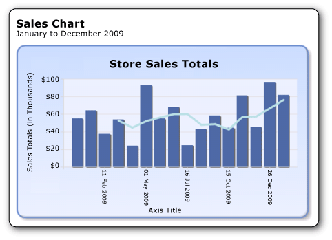

# Tutorial: Add a Column Chart to Your Report (Report Builder)
  A column chart displays a series as a set of vertical bars that are grouped by category. A column chart can be useful to:  
  
-   Show data changes over a period of time.  
  
-   Compare the relative value of multiple series.  
  
-   Display a moving average to show trends.  
  
 The following illustration shows the column chart you will create, with a moving average.  
  
   
  
##  <a name="BackToTop"></a> What You Will Learn  
 In this tutorial you will learn how to do the following:  
  
1.  [Create a Chart from the Chart Wizard](#Chart)  
  
2.  [Choose the Chart Type](#ChartType)  
  
3.  [Format and Label the Horizontal Axis](#Horizontal)  
  
4.  [Move the Legend](#Legend)  
  
5.  [Title the Chart](#ChartTitle)  
  
6.  [Format and Label the Vertical Axis](#Vertical)  
  
7.  [Add a Moving Average](#Average)  
  
8.  [Add a Report Title](#Title)  
  
9. [Save the Report](#Save)  
  
> [!NOTE]  
>  In this tutorial, the steps for the wizard are consolidated into one procedure. For step-by-step instructions about how to browse to a report server, choose a data source, and create a dataset, see the first tutorial in this series: [Tutorial: Creating a Basic Table Report &#40;Report Builder&#41;](../reporting-services/tutorial-creating-a-basic-table-report-report-builder.md).  
  
 Estimated time to complete this tutorial: 15 minutes.  
  
## Requirements  
 For information about requirements, see [Prerequisites for Tutorials &#40;Report Builder&#41;](../reporting-services/report-builder-tutorials.md).  
  
##  <a name="Chart"></a> 1. Create a Chart Report from the Chart Wizard  
 From the **Getting Started** dialog box, use the Chart Wizard to create an embedded dataset, choose a shared data source, and create a column chart.  
  
> [!NOTE]  
>  In this tutorial, the query contains the data values, so that it does not need an external data source. This makes the query quite long. In a business environment, a query would not contain the data. This is for learning purposes only.  
  
#### To create a new chart report  
  
1.  Click **Start**, point to **Programs**, point to **Microsoft SQL Server 2012 Report Builder**, and then click **Report Builder**.  
  
     The **Getting Started** dialog box appears.  
  
    > [!NOTE]  
    >  If the **Getting Started** dialog box does not appear, from the **Report Builder** button, click **New**.  
  
2.  In the left pane, verify that **New Report** is selected.  
  
3.  In the right pane, click **Chart Wizard**.  
  
4.  On the **Choose a dataset page**, click **Create a dataset**, and then click **Next**.  
  
5.  On the **Choose a connection to a data source** page, select an existing data source or browse to the report server and select a data source, and then click **Next**. You may need to enter a user name and password.  
  
    > [!NOTE]  
    >  The data source you choose is unimportant, as long as you have adequate permissions. You will not be getting data from the data source. For more information, see [Alternative Ways to Get a Data Connection &#40;Report Builder&#41;](../reporting-services/alternative-ways-to-get-a-data-connection-report-builder.md).  
  
6.  On the **Design a query** page, click **Edit as Text**.  
  
7.  Paste the following query into the query pane:  
  
    ```  
    SELECT CAST('2009-01-01' AS date) AS SalesDate, CAST(54995.21 AS money) AS Sales  
    UNION SELECT CAST('2009-01-05' AS date) AS SalesDate, CAST(64499.04 AS money) AS Sales  
    UNION SELECT CAST('2009-02-11' AS date) AS SalesDate, CAST(37821.79 AS money) AS Sales  
    UNION SELECT CAST('2009-03-18' AS date) AS SalesDate, CAST(53633.08 AS money) AS Sales  
    UNION SELECT CAST('2009-04-23' AS date) AS SalesDate, CAST(24019.3 AS money) AS Sales  
    UNION SELECT CAST('2009-05-01' AS date) AS SalesDate, CAST(93245.5 AS money) AS Sales  
    UNION SELECT CAST('2009-06-06' AS date) AS SalesDate, CAST(55288.0 AS money) AS Sales  
    UNION SELECT CAST('2009-06-16' AS date) AS SalesDate, CAST(68733.5 AS money) AS Sales  
    UNION SELECT CAST('2009-07-16' AS date) AS SalesDate, CAST(24750.85 AS money) AS Sales  
    UNION SELECT CAST('2009-08-23' AS date) AS SalesDate, CAST(43452.3 AS money) AS Sales  
    UNION SELECT CAST('2009-09-24' AS date) AS SalesDate, CAST(58656. AS money) AS Sales  
    UNION SELECT CAST('2009-10-15' AS date) AS SalesDate, CAST(44583. AS money) AS Sales  
    UNION SELECT CAST('2009-11-21' AS date) AS SalesDate, CAST(81568. AS money) AS Sales  
    UNION SELECT CAST('2009-12-15' AS date) AS SalesDate, CAST(45973. AS money) AS Sales  
    UNION SELECT CAST('2009-12-26' AS date) AS SalesDate, CAST(96357. AS money) AS Sales  
    UNION SELECT CAST('2009-12-31' AS date) AS SalesDate, CAST(81946. AS money) AS Sales  
    ```  
  
8.  (Optional) Click the Run button (**!**) to see the data your chart will be based on.  
  
9. Click **Next**.  
  
##  <a name="ChartType"></a> 2. Choose the Chart Type  
 You can choose from a variety of predefined chart types.  
  
#### To add a column chart  
  
1.  On the **Choose a chart type** page, the column chart is the default chart type. Click **Next**.  
  
2.  On the **Arrange chart fields** page, drag the SalesDate field to **Categories**. Categories display on the horizontal axis.  
  
3.  Drag the Sales field to **Values**. The **Values** box displays Sum(Sales) because the sum of the sales total value is aggregated for each date. Values display on the vertical axis.  
  
4.  Click **Next**.  
  
5.  On the **Choose a Style** page, in the Styles box, select a style.  
  
     A style specifies a font style, a set of colors, and a border style. When you select a style, the Preview pane displays a sample of the chart with that style.  
  
6.  Click **Finish**.  
  
     The chart is added to the design surface.  
  
7.  Click the chart to display the chart handles. Drag the bottom-right corner of the chart to increase the size of the chart. Note that the report design surface increases in size to accommodate the chart size.  
  
8.  Click **Run** to preview the report.  
  
##  <a name="Horizontal"></a> 3. Format and Label the Horizontal Axis  
 By default, the horizontal axis displays values in a general format that is automatically scaled to fit the size of the chart.  
  
#### To format a date on the horizontal axis  
  
1.  Switch to report design view.  
  
2.  Right-click the horizontal axis, and then click **Horizontal Axis Properties**.  
  
3.  Click **Number**.  
  
4.  In **Category**, select **Date**.  
  
5.  In the **Type** box, select **31 Jan 2000**.  
  
6.  [!INCLUDE[clickOK](../includes/clickok-md.md)]  
  
7.  On the Home tab, click **Run** to preview the report.  
  
 The date displays in the date format that you selected. Notice that the chart does not label every category on the horizontal axis. By default, only labels that fit next to the axis are included.  
  
 You can customize the label display by rotating the labels and specifying the interval.  
  
#### To rotate the axis labels and change the display interval along the horizontal axis  
  
1.  Switch to report design view.  
  
2.  Right-click the horizontal axis title, and then click **Show Axis Title** to remove the title. Because the horizontal axis displays dates, the title is not needed.  
  
3.  Right-click the horizontal axis and then click **Horizontal Axis Properties**.  
  
4.  In the **Axis Options** page under **Axis range and interval**, type **3** for **Interval**. The chart will display every third date.  
  
5.  Click **Labels**.  
  
6.  In **Change axis label auto-fit options**, select **Disable auto-fit**.  
  
7.  In **Label rotation angle**, select **-90**.  
  
8.  [!INCLUDE[clickOK](../includes/clickok-md.md)]  
  
     The sample text for the horizontal axis rotates by 90 degrees.  
  
9. Click **Run** to preview the report.  
  
 On the chart, the labels are rotated and the label for every third date is shown.  
  
##  <a name="Legend"></a> 4. Move the Legend  
 The legend is automatically created from category and series data.  
  
#### To move the legend below the chart area of a column chart  
  
1.  Switch to report design view.  
  
2.  Right-click the legend on the chart, and then click **Legend Properties**.  
  
3.  For **Layout and Position**, select a different position. For example, set the position to the middle bottom option.  
  
     When the legend is placed at the top or bottom of a chart, the layout of the legend changes from vertical to horizontal. You can select a different layout from the **Layout** drop-down list.  
  
4.  [!INCLUDE[clickOK](../includes/clickok-md.md)]  
  
5.  (Optional) Because there is only one category in this tutorial, the legend is not needed. To remove the legend, right-click the legend and then click **Delete Legend**.  
  
6.  Click **Run** to preview the report.  
  
##  <a name="ChartTitle"></a> 5. Title the Chart  
  
#### To change the chart title above the chart area  
  
1.  Switch to report design view.  
  
2.  Select the words **Chart Title** at the top of the chart, and then type the following text: **Store Sales Order Totals**.  
  
3.  Click **Run** to preview the report.  
  
##  <a name="Vertical"></a> 6. Format and Label the Vertical Axis  
 By default, the vertical axis displays values in a general format that is automatically scaled to fit the size of the chart.  
  
#### To format as currency the numbers on the vertical axis  
  
1.  Switch to report design view.  
  
2.  Double-click the labels on the vertical axis along the side of the chart to select them.  
  
3.  On the ribbon, on the **Home** tab, in the **Number** group, click the **Currency** button. The axis labels change to show the currency format.  
  
4.  On the ribbon, on the **Home** tab, in the **Number** group, click the **Decrease Decimal** button two times, to show the number rounded to the nearest dollar.  
  
5.  Right-click the vertical axis and click **Vertical Axis Properties**.  
  
6.  Click **Number**. Note that **Currency** is already selected in the **Category** box, and **Decimal places** is already **0** (zero).  
  
7.  In the **Show Values in** box, click **Thousands**.  
  
8.  [!INCLUDE[clickOK](../includes/clickok-md.md)]  
  
9. Right-click the vertical axis title along the side of the chart and click **Axis Title Properties**.  
  
10. Replace the text in the **Title text** field with the following text: **Sales Total (in Thousands)**. You can also specify a variety of options related to how the title is formatted.  
  
11. [!INCLUDE[clickOK](../includes/clickok-md.md)]  
  
12. Click **Run** to preview the report.  
  
##  <a name="Average"></a> 7. Add a Moving Average  
  
#### To add a moving average  
  
1.  Switch to report design view.  
  
2.  Double-click the chart to display the **Chart Data** pane.  
  
3.  Right-click the **[Sum(Sales)]** field that is in the **Values** area, and then click **Add Calculated Series**.  
  
4.  In **Formula**, verify that **Moving average** is selected.  
  
5.  In **Set Formula Parameters**, for **Period**, select **4**.  
  
6.  Click **Border**.  
  
7.  In **Line width**, select **3pt**.  
  
8.  [!INCLUDE[clickOK](../includes/clickok-md.md)]  
  
9. Click **Run** to preview the report.  
  
 The chart displays a line that shows the moving average for total sales by date, averaged over every four dates.  
  
##  <a name="Title"></a> 8. Add a Report Title  
  
#### To add a report title  
  
1.  Switch to report design view.  
  
2.  On the design surface, click **Click to add title**.  
  
3.  Type **Sales Chart**, press ENTER, and then type **January to December 2009**, so it looks like this:  
  
     **Sales Chart**  
  
     **January to December 2009**  
  
4.  Select **Sales Chart**, and click the **Bold** button in the **Font** section on the **Home** tab of the ribbon.  
  
5.  Select **January to December 2009**, and in the **Font** section on the **Home** tab, set the font size to **10**.  
  
6.  (Optional) You may need to make the **Title** text box taller to accommodate the two lines of text by pulling down on the double-headed arrows when you click in the middle of the bottom edge.  
  
     This title will appear at the top of the report. When there is no page header defined, items at the top of the report body are the equivalent of a report header.  
  
7.  Click **Run** to preview the report.  
  
##  <a name="Save"></a> 9. Save the Report  
  
#### To save the report  
  
1.  Switch to report design view.  
  
2.  From the Report Builder button, click **Save As**.  
  
3.  In **Name**, type **Sales Order Column Chart**.  
  
4.  Click **Save**.  
  
## Next Steps  
 You have successfully completed the Adding a Column Chart to Your Report tutorial. To learn more about charts, see [Charts &#40;Report Builder and SSRS&#41;](report-design/charts-report-builder-and-ssrs.md) and [Sparklines and Data Bars &#40;Report Builder and SSRS&#41;](report-design/sparklines-and-data-bars-report-builder-and-ssrs.md).  
  
## See Also  
 [Tutorials &#40;Report Builder&#41;](report-builder-tutorials.md)   
 [Report Builder in SQL Server 2014](report-builder/report-builder-in-sql-server-2016.md)  
  
  
