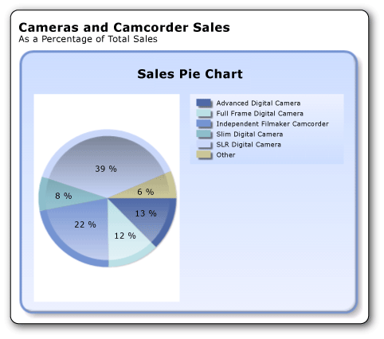
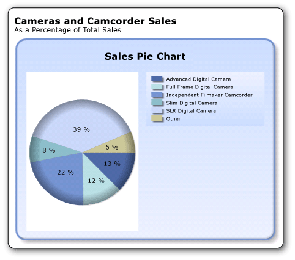

# Tutorial: Add a Pie Chart to Your Report (Report Builder)
  Pie charts and doughnut charts display data as a proportion of the whole. Pie charts are most commonly used to make comparisons between groups. Pie and doughnut charts, along with pyramid and funnel charts, constitute a group of charts known as shape charts. Shape charts have no axes. When a numeric field is dropped on a shape chart, the chart calculates the percentage of each value to the total.  
  
 If there are too many data points on a pie chart, your data point labels might be too crowded to read. In that case, consider using a line chart. Consider using pie charts only after you have aggregated your data into a few data points.  
  
 The following illustration shows the pie chart you will create.  
  
   
  
##  <a name="BackToTop"></a> What You Will Learn  
 In this tutorial, you will learn how to:  
  
1.  [Create a Pie Chart from the Chart Wizard](#Chart)  
  
2.  [Choose the Chart Type](#ChartType)  
  
3.  [Display Percentages in Each Slice](#Percentages)  
  
4.  [Combine Small Slices into One Slice](#CombineSlices)  
  
5.  [Customize the Drawing Effect](#DrawingEffect)  
  
6.  [Add a Report Title](#Title)  
  
7.  [Save the Report](#Save)  
  
> [!NOTE]  
>  In this tutorial, the steps for the wizard are consolidated into two procedures. For step-by-step instructions about how to browse to a report server, add a data source, and add a dataset, see the first tutorial in this series: [Tutorial: Creating a Basic Table Report &#40;Report Builder&#41;](../reporting-services/tutorial-creating-a-basic-table-report-report-builder.md).  
  
 Estimated time to complete this tutorial: 10 minutes  
  
## Requirements  
 For more information about requirements, see [Prerequisites for Tutorials &#40;Report Builder&#41;](../reporting-services/report-builder-tutorials.md).  
  
##  <a name="Chart"></a> 1. Create a Pie Chart from the Chart Wizard  
 From the Getting Started dialog box, use the Chart Wizard to create an embedded dataset, choose a shared data source, and create a pie chart.  
  
> [!NOTE]  
>  In this tutorial, the query contains the data values, so that it does not need an external data source. This makes the query quite long. In a business environment, a query would not contain the data. This is for learning purposes only.  
  
#### To create a new chart report  
  
1.  Click **Start**, point to **Programs**, point to **Microsoft SQL Server 2012 Report Builder**, and then click **Report Builder**.  
  
     The Getting Started dialog box appears.  
  
    > [!NOTE]  
    >  If the Getting Started dialog box does not appear, from the Report Builder button, click **New**.  
  
2.  In the left pane, verify that **New Report** is selected.  
  
3.  In the right pane, click **Chart Wizard**.  
  
4.  On the **Choose a dataset** page, click **Create a dataset**, and then click **Next**.  
  
5.  On the **Choose a connection to a data source** page, select an existing data source or browse to the report server and select a data source, and then click **Next**. You may need to enter a user name and password.  
  
    > [!NOTE]  
    >  The data source you choose is unimportant, as long as you have adequate permissions. You will not be getting data from the data source. For more information, see [Alternative Ways to Get a Data Connection &#40;Report Builder&#41;](../reporting-services/alternative-ways-to-get-a-data-connection-report-builder.md).  
  
6.  On the **Design a Query** page, click **Edit as Text**.  
  
7.  Paste the following query into the query pane:  
  
    ```  
    SELECT 'Advanced Digital Camera' AS Product, CAST(254995.21 AS money) AS Sales  
    UNION SELECT 'Slim Digital Camera' AS Product, CAST(164499.04 AS money) AS Sales  
    UNION SELECT 'SLR Digital Camera' AS Product, CAST(782176.79 AS money) AS Sales  
    UNION SELECT 'Lens Adapter' AS Product, CAST(36333.08 AS money) AS Sales  
    UNION SELECT 'Macro Zoom Lens' AS Product, CAST(40199.3 AS money) AS Sales  
    UNION SELECT 'USB Cable' AS Product, CAST(53245.5 AS money) AS Sales  
    UNION SELECT 'Independent Filmmaker Camcorder' AS Product, CAST(452288.0 AS money) AS Sales  
    UNION SELECT 'Full Frame Digital Camera' AS Product, CAST(247250.85 AS money) AS Sales  
    ```  
  
8.  (Optional) Click the Run button (**!**) to see the data your chart will be based on.  
  
9. Click **Next**.  
  
##  <a name="ChartType"></a> 2. Choose the Chart Type  
 You can choose from a variety of predefined chart types.  
  
#### To add a pie chart  
  
1.  On the **Choose a chart type** page, click **Pie**, and then click **Next**. The **Arrange chart fields** page opens.  
  
     On the **Arrange chart fields** page, drag the Product field to the **Categories** pane. Categories define the number of slices in the pie chart. In this example, there will be eight slices, one for each product.  
  
2.  Drag the Sales field to the **Values** pane. Sales represents the sales amount for the subcategory. The **Values** pane displays `[Sum(Sales)]` because the chart displays the aggregate for each product.  
  
3.  Click **Next**.  
  
4.  On the **Choose a style** page, in the Styles pane, select a style.  
  
     A style specifies a font style, a set of colors, and a border style. When you select a style, the Preview pane displays a sample of the chart with that style.  
  
5.  Click **Finish**.  
  
     The chart is added to the design surface.  
  
6.  Click the chart to display the chart handles. Drag the bottom-right corner of the chart to increase the size of the chart. Note that the report design surface increases in size to accommodate the chart size.  
  
7.  Click **Run** to preview the report.  
  
 The report displays the pie chart with eight slices, one for each product. The size of each slice represents the sales for that product. Three of the slices are quite thin.  
  
##  <a name="Percentages"></a> 3. Display Percentages in Each Slice  
 On each slice of the pie, you can display a percentage for this slice compared to the whole pie.  
  
#### To display percentages in each slice of the pie chart  
  
1.  Switch to report design view.  
  
2.  Right-click the pie chart and click **Show Data Labels**. The data labels appear on the chart.  
  
3.  Right-click a label, and then click **Series Label Properties**.  
  
4.  In Label data, from the drop-down box, select **#PERCENT**.  
  
     To display values as percentages, the UseValueAsLabel property must be false. If you are prompted to set this value in the **Confirm Action** dialog, click **Yes**.  
  
5.  (Optional) To specify how many decimal places the label shows, type `#PERCENT{Pn}` where *n* is the number of decimal places to display. For example, to display no decimal places, type `#PERCENT{P0}`.  
  
    > [!NOTE]  
    >  **Number Format** in the **Series Label Properties** dialog box has no effect when you format percentages. This formats the labels as percentages, but does not calculate the percentage of the pie that each slice represents.  
  
6.  [!INCLUDE[clickOK](../includes/clickok-md.md)]  
  
7.  Click **Run** to preview the report.  
  
 The report displays the percentage of the whole for each pie slice.  
  
##  <a name="CombineSlices"></a> 4. Combine Small Slices into One Slice  
 Three of the slices in the pie are quite small. You can combine multiple small slices into one larger slice that represents all of them.  
  
#### To combine any slices on the pie chart smaller than 5 percent into one slice  
  
1.  Switch to report design view.  
  
2.  On the **View** tab, in the **Show/Hide** group, select **Properties**.  
  
3.  On the design surface, click on any slice of the pie chart. The properties for the series are displayed in the Properties pane.  
  
4.  In the **General** section, expand the **CustomAttributes** node.  
  
5.  Set the **CollectedStyle** property to **SingleSlice**.  
  
6.  Verify that the **CollectedThreshold** property is set to 5.  
  
7.  Verify that the **CollectedThresholdUsePercent** property is set to **True**.  
  
8.  On the Ribbon, on the **Home** tab, click **Run** to preview the report.  
  
 In the legend, the category "Other" now exists. The new pie slice combines all the slices that were under 5% into one slice that is 6% of the whole pie.  
  
##  <a name="DrawingEffect"></a> 5. Customize the Drawing Effect  
 In the Chart Wizard, the default style for a pie chart is Ocean, which features a Concave drawing effect. You can change that after you run the wizard.  
  
#### To add a drawing effect to the pie chart  
  
1.  Switch to report design view.  
  
2.  If the Properties pane is not already opened, on the **View** tab, select **Properties**.  
  
3.  Double-click the pie chart itself. The series properties for the pie chart are shown in the Properties pane.  
  
4.  In the Properties pane, expand the **CustomAttributes** node.  
  
5.  Set the **PieDrawingStyle** to **SoftEdge**.  
  
    > [!NOTE]  
    >  Drawing effects and three-dimensional effects are exclusive options. If a chart has three-dimensional effects applied, **PieDrawingStyle** is not available on the Properties pane.  
  
6.  Click **Run** to preview the report.  
  
 The following illustration shows the pie chart with the soft edge effect.  
  
   
  
##  <a name="Title"></a> 6. Add a Report Title  
  
#### To add a report title  
  
1.  On the design surface, click **Click to add title**.  
  
2.  Type **Camera and Camcorder Sales**, press ENTER, and then type **As a Percentage of Total Sales**, so it looks like this:  
  
     **Camera and Camcorder Sales**  
  
     **As a Percentage of Total Sales**  
  
3.  Select **Camera and Camcorder Sales**, and click the **Bold** button from the **Font** section of the **Home** tab of the ribbon.  
  
4.  Select **As a Percentage of Total Sales**, and in the **Font** section on the **Home** tab, set the font size to **10**.  
  
5.  (Optional) You may need to make the Title text box taller to accommodate the two lines of text.  
  
     This title will appear at the top of the report. When there is no page header defined, items at the top of the report body are the equivalent of a report header.  
  
6.  Click **Run** to preview the report.  
  
##  <a name="Save"></a> 7. Save the Report  
  
#### To save the report  
  
1.  Switch to report design view.  
  
2.  From the Report Builder button, click **Save As**.  
  
3.  In **Name**, type **Sales Pie Chart**.  
  
4.  Click **Save**.  
  
 Your report is saved on the report server.  
  
## Next Steps  
 You have successfully completed the Adding a Pie Chart to Your Report tutorial. To learn more about charts, see [Charts &#40;Report Builder and SSRS&#41;](report-design/charts-report-builder-and-ssrs.md) and [Sparklines and Data Bars &#40;Report Builder and SSRS&#41;](report-design/sparklines-and-data-bars-report-builder-and-ssrs.md).  
  
## See Also  
 [Tutorials &#40;Report Builder&#41;](report-builder-tutorials.md)   
 [Report Builder in SQL Server 2014](report-builder/report-builder-in-sql-server-2016.md)  
  
  
