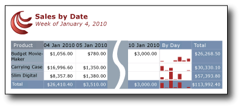
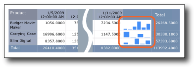

# Tutorial: Add a Sparkline to Your Report (Report Builder)
  In this tutorial, you create a basic table report based on sample sales data, and then add a sparkline chart to a cell in the table.  
  
 An enhanced version of the report you create in this tutorial is available as a sample [!INCLUDE[ssCurrent](../includes/sscurrent-md.md)] Report Builder report. For more information about downloading this sample report and others, see [Report Builder sample reports](https://go.microsoft.com/fwlink/?LinkId=184851). The following illustration shows the sample report similar to the one that you will create.  
  
   
  
 The video [How to: Create a Sparkline in a Table (Report Builder Video)](https://technet.microsoft.com/bi/ff871942.aspx) illustrates how to create a similar report with sparklines.  
  
##  <a name="BackToTop"></a> What You Will Learn  
 In this tutorial, you will learn how to do the following:  
  
 1. [Create a Report with a Table](#CreateTable)  
  
 2. [Create a Query in the Table or Matrix Wizard](#Query)  
  
 3. [Add a Sparkline to the Table](#Sparkline)  
  
 4. [Align the Sparklines Vertically and Horizontally](#AlignSparklines)  
  
### Other Optional Steps  
 5. [Format Data as Currency](#FormatCurrency)  
  
 6. [Format Data as Dates](#FormatDates)  
  
 7. [Change Column Widths](#Width)  
  
 8. [Add a Report Title](#Title)  
  
 9. [Save the Report](#Save)  
  
 Estimated time to complete this tutorial: 30 minutes.  
  
## Requirements  
 For more information about requirements, see [Prerequisites for Tutorials &#40;Report Builder&#41;](../reporting-services/report-builder-tutorials.md).  
  
##  <a name="CreateTable"></a> 1. Create a Report with a Table  
  
#### To create a report  
  
1.  Click **Start**, point to **Programs**, point to **Microsoft SQL Server 2012 Report Builder**, and then click **Report Builder**.  
  
     The **Getting Started** dialog box opens.  
  
    > [!NOTE]  
    >  If the **Getting Started** dialog box does not appear, from the **Report Builder** button, click **New**.  
  
2.  In the left pane, verify that **New Report** is selected.  
  
3.  In the right pane, click **Table or Matrix Wizard**.  
  
4.  On the **Choose a dataset** page, select **Create a dataset**, and then click **Next**. The **Choose a connection to a data source** page opens.  
  
    > [!NOTE]  
    >  This tutorial does not need specific data; it just needs a connection to a [!INCLUDE[ssCurrent](../includes/sscurrent-md.md)] database. If you already have a data source connection listed under **Data Source Connections**, you can select it and go to step 10. For more information, see [Alternative Ways to Get a Data Connection &#40;Report Builder&#41;](../reporting-services/alternative-ways-to-get-a-data-connection-report-builder.md).  
  
5.  Click **New**. The **Data Source Properties** dialog box opens.  
  
6.  In **Name**, type **Product Sales**, a name for the data source.  
  
7.  In **Select a connection type**, verify that **Microsoft SQL Server** is selected.  
  
8.  In **Connection string**, type the following text:  
  
     **Data Source=\<servername>**  
  
     The expression \<servername>, for example Report001, specifies a computer on which an instance of the SQL Server Database Engine is installed. Because the report data is not extracted from a SQL Server database, you need not include the name of a database. The default database on the specified server is used to parse the query.  
  
9. Click **Credentials**. Enter the credentials that you need to access the external data source.  
  
10. [!INCLUDE[clickOK](../includes/clickok-md.md)]  
  
     You are back on the **Choose a connection to a data source** page.  
  
11. To verify that you can connect to the data source, click **Test Connection**.  
  
     The message "Connection created successfully" appears.  
  
12. [!INCLUDE[clickOK](../includes/clickok-md.md)]  
  
13. Click **Next**.  
  
##  <a name="Query"></a> 2. Create a Query in the Table Wizard  
 In a report, you can use a shared dataset that has a predefined query, or you can create an embedded dataset for use only in your report. In this tutorial, you will create an embedded dataset.  
  
> [!NOTE]  
>  In this tutorial, the query contains the data values, so that it does not need an external data source. This makes the query quite long. In a business environment, a query would not contain the data. This is for learning purposes only.  
  
#### To create a query  
  
1.  On the **Design a query** page, the relational query designer is open. For this tutorial, you will use the text-based query designer.  
  
2.  Click **Edit As Text**. The text-based query designer displays a query pane and a results pane.  
  
3.  Paste the following [!INCLUDE[tsql](../includes/tsql-md.md)] query into the **Query** box.  
  
    ```  
    SELECT CAST('2010-01-04' AS date) as SalesDate, 'Accessories' as Subcategory,   
       'Carrying Case' as Product, CAST(16996.60 AS money) AS Sales, 68 as Quantity  
    UNION SELECT CAST('2010-01-05' AS date) as SalesDate, 'Accessories' as Subcategory,  
       'Carrying Case' as Product, CAST(1350.00 AS money) AS Sales, 18 as Quantity  
    UNION SELECT CAST('2010-01-10' AS date) as SalesDate, 'Accessories' as Subcategory,  
       'Carrying Case' as Product, CAST(1147.50 AS money) AS Sales, 17 as Quantity  
    UNION SELECT CAST('2010-01-04' AS date) as SalesDate, 'Accessories' as Subcategory,  
       'Budget Movie-Maker' as Product, CAST(1056.00 AS money) AS Sales, 44 as Quantity  
    UNION SELECT CAST('2010-01-05' AS date) as SalesDate,  'Accessories' as Subcategory,  
       'Slim Digital' as Product, CAST(1380.00 AS money) AS Sales, 18 as Quantity  
    UNION SELECT CAST('2010-01-05' AS date) as SalesDate,'Accessories' as Subcategory,    
       'Budget Movie-Maker' as Product, CAST(780.00 AS money) AS Sales, 26 as Quantity  
    UNION SELECT CAST('2010-01-07' AS date) as SalesDate, 'Accessories' as Subcategory,   
       'Budget Movie-Maker' as Product, CAST(3798.00 AS money) AS Sales, 9 as Quantity  
    UNION SELECT CAST('2010-01-08' AS date) as SalesDate, 'Camcorders' as Subcategory,   
       'Budget Movie-Maker' as Product, CAST(10400.00 AS money) AS Sales, 13 as Quantity  
    UNION SELECT CAST('2010-01-09' AS date) as SalesDate, 'Camcorders' as Subcategory,   
       'Budget Movie-Maker' as Product, CAST(3000.00 AS money) AS Sales, 60 as Quantity  
    UNION SELECT CAST('2010-01-10' AS date) as SalesDate,  'Digital' as Subcategory,   
       'Budget Movie-Maker' as Product, CAST(7234.50 AS money) AS Sales, 39 as Quantity  
    UNION SELECT CAST('2010-01-06' AS date) as SalesDate,  'Digital' as Subcategory,   
       'Carrying Case' as Product, CAST(10836.00 AS money) AS Sales, 84 as Quantity  
    UNION SELECT CAST('2010-01-07' AS date) as SalesDate,  'Digital' as Subcategory,   
       'Slim Digital' as Product, CAST(2550.00 AS money) AS Sales, 17 as Quantity  
    UNION SELECT CAST('2010-01-04' AS date) as SalesDate, 'Digital' as Subcategory,   
       'Slim Digital' as Product, CAST(8357.80 AS money) AS Sales, 44 as Quantity  
    UNION SELECT CAST('2010-01-08' AS date) as SalesDate, 'Digital SLR' as Subcategory,   
       'Slim Digital' as Product, CAST(18530.00 AS money) AS Sales, 34 as Quantity  
    UNION SELECT CAST('2010-01-06' AS date) as SalesDate, 'Digital SLR' as Subcategory,   
       'Slim Digital' as Product, CAST(26576.00 AS money) AS Sales, 88 as Quantity  
    ```  
  
4.  On the query designer toolbar, click Run  (**!**).  
  
     The query runs and displays the result set for the fields **SalesDate**, **Subcategory**, **Product**, **Sales**, and **Quantity**.  
  
5.  Click **Next**.  
  
6.  On the **Arrange fields** page, drag **Sales** to **Values**.  
  
     **Sales** is aggregated by the Sum function. The value is [Sum(Sales)].  
  
7.  Drag **Product** to **Row groups**.  
  
8.  Drag **SalesDate** to **Column groups**.  
  
9. Click **Next**.  
  
10. On the **Choose the layout** page, under **Options**, verify that **Show subtotals and grand totals** is selected.  
  
     The wizard Preview pane displays a table with three rows. When you run the report, each row will display in the following way:  
  
    1.  The first row will appear once for the table to show column headings.  
  
    2.  The second row will repeat once for each product and display the product name, total per day, and line total.  
  
    3.  The third row will appear once for the table to display the grand totals.  
  
11. Click **Next**.  
  
12. On the **Choose a Style** page, in the **Styles** pane, select **Slate**.  
  
     The Preview pane displays a sample of the table with that style.  
  
13. Click **Finish**.  
  
14. The table is added to the design surface. The table has three columns and three rows.  
  
     Look in the Grouping pane. If you can't see the Grouping pane, on the **View** menu, click **Grouping**. The Row Groups pane shows one row group: **Product**. The Column Groups pane shows one column group: **SalesDate**. Detail data is all the data that is retrieved by the dataset query.  
  
15. Click **Run** to preview the report.  
  
##  <a name="Sparkline"></a> 3. Add a Sparkline  
  
#### To add a sparkline chart to a table  
  
1.  Click **Design** to return to design view.  
  
2.  Select the Total column in your table.  
  
3.  Right-click, point to **Insert Column**, and then click **Left**.  
  
4.  In the new column, right-click in the [Product] row, point to the **Insert** ribbon tab, and then click **Sparkline**.  
  
5.  Make sure the first sparkline in the **Column** row is selected and then click **OK**.  
  
6.  Click the sparkline to show the Chart Data pane.  
  
7.  Click the plus (+) sign in the Values box, and then click **Sales**.  
  
     The values in the **Sales** field are now the values for the sparkline.  
  
8.  Click the plus (+) sign in the Category Groups box, and then click **SalesDate**.  
  
9. Click **Run** to preview your report.  
  
     Note that there are sparkline charts in each row of the table, but they're not correct. The bars in the charts don't line up with each other. There are only four bars in the second row of data, so the bars are wider than the bars in the first row, which has six. You can't compare values for each product per day. They need to line up with each other.  
  
     Also note that for each row, the tallest bar for that row is the height of the row. This is misleading, too, because the largest values for each row are not equal: the largest value for Budget Movie-Maker is $10,400, but the largest value for Slim Digital is $26,576-more than twice as large. And yet the largest bars in those two rows are about the same height. That also needs to be made to scale with the other sparklines.  
  
       
  
##  <a name="AlignSparklines"></a> 4. Align the Sparklines Vertically and Horizontally  
 The sparklines are hard to read when they don't all use the same measurements. Both the horizontal and vertical axes for each need to match the rest.  
  
#### To set alignment for the sparklines in the table  
  
1.  Click **Design** to return to design view.  
  
2.  Right-click the sparkline and click **Vertical Axis Properties**.  
  
3.  Check the **Align axes in** check box.  
  
     Tablix1 is showing in the list. That is the only option. This sets the height of the bars in each sparkline relative to the others.  
  
4.  Click **OK**.  
  
5.  Right-click the sparkline and click **Horizontal Axis Properties**.  
  
6.  Check the **Align axes in** check box.  
  
     Tablix1 is showing in the list. That is the only option. This sets the width of the bars in each sparkline relative to the others. If some sparklines have fewer bars than others, then those sparklines will have blank spaces for the missing data.  
  
7.  Click **OK**.  
  
8.  Click **Run** to preview your report again.  
  
 Note that all the bars are now aligned with the bars in the other rows.  
  
##  <a name="FormatCurrency"></a> 5. (Optional) Format Data as Currency  
 By default, the summary data for the **Sales** field displays a general number. Format it to display the number as currency. Toggle **Placeholder Styles** to display formatted text boxes and placeholder text as sample values.  
  
#### To format a currency field  
  
1.  Click **Design** to switch to design view.  
  
2.  Click the cell in the second row (under the column headings row) in the **SalesDate** column and drag to select all cells that contain `[Sum(Sales)]`.  
  
3.  On the **Home** tab, in the **Number** group, click the **Currency** button. The cells change to show the formatted currency.  
  
     If your regional setting is English (United States), the default sample text is [**$12,345.00**]. If you do not see an example currency value, click **Placeholder Styles** in the **Numbers** group, and then click **Sample Values**.  
  
4.  Click **Run** to preview your report.  
  
 The summary values for **Sales** display as currency.  
  
##  <a name="FormatDates"></a> 6. (Optional) Format Data as Dates  
 By default, the **SalesDate** field displays both date and time information. You can format them to display only the date.  
  
#### To format a date field as the default format  
  
1.  Click **Design** to return to design view.  
  
2.  Click the cell that contains `[SalesDate]`.  
  
3.  On the Ribbon, on the **Home** tab, in the **Number** group, from the drop-down list, select **Date**.  
  
     The cell displays the example date **[1/31/2000]**. If you do not see an example date, click **Placeholder Styles** in the **Numbers** group, and then click **Sample Values**.  
  
4.  Click **Run** to preview the report.  
  
 The **SalesDate** values display in the default date format.  
  
##  <a name="Width"></a> 7. (Optional) Change Column Widths  
 By default, each cell in a table contains a text box. A text box expands vertically to accommodate text when the page is rendered. In the rendered report, each row expands to the height of the tallest rendered text box in the row. The height of the row on the design surface has no affect on the height of the row in the rendered report.  
  
 To reduce the amount of vertical space each row takes, expand the column width to accommodate the expected contents of the text boxes in the column on one line.  
  
#### To change the width of columns  
  
1.  Click **Design** to return to design view.  
  
2.  Click the table so that column and row handles appear above and next to the table.  
  
     The gray bars along the top and side of the table are the column and row handles.  
  
3.  Point to the line between column handles so that the cursor changes into a double arrow. Drag the columns to the size you want. For example, expand the column for **Product** so that the product name displays on one line.  
  
4.  Click **Run** to preview your report.  
  
##  <a name="Title"></a> 8. (Optional) Add a Report Title  
 A report title appears at the top of the report. You can place the report title in a report header or if the report does not use one, in a text box at the top of the report body. In this tutorial, you will use the text box that is automatically placed at the top of the report body.  
  
 The text can be further enhanced by applying different font styles, sizes, and colors to phrases and individual characters of the text. For more information, see [Format Text in a Text Box &#40;Report Builder and SSRS&#41;](report-design/format-text-in-a-text-box-report-builder-and-ssrs.md).  
  
#### To add a report title  
  
1.  On the design surface, click **Click to add title**.  
  
2.  Type **Product Sales**, and then click outside the text box.  
  
3.  Right-click the text box that contains **Product Sales** and click **Text Box Properties**.  
  
4.  In the **Text Box Properties** dialog box, click **Font**.  
  
5.  In the **Size** list, select **18pt**.  
  
6.  In the **Color** list, select **Maroon**.  
  
7.  Select **Bold**.  
  
8.  [!INCLUDE[clickOK](../includes/clickok-md.md)]  
  
##  <a name="Save"></a> 9. Save the Report  
 Save the report to a report server or your computer. If you do not save the report to the report server, a number of [!INCLUDE[ssRSnoversion](../includes/ssrsnoversion-md.md)] features such as report parts and subreports are not available.  
  
#### To save the report on a report server  
  
1.  From the **Report Builder** button, click **Save As**.  
  
2.  Click **Recent Sites and Servers**.  
  
3.  Select or type the name of the report server where you have permission to save reports.  
  
     The message "Connecting to report server" appears. When the connection is complete, you see the contents of the report folder that the report server administrator specified as the default location for reports.  
  
4.  In **Name**, replace the default name with **Product Sales**.  
  
5.  Click **Save**.  
  
 The report is saved to the report server. The name of report server that you are connected to appears in the status bar at the bottom of the window.  
  
#### To save the report on your computer  
  
1.  From the **Report Builder** button, click **Save As**.  
  
2.  Click **Desktop**, **My Documents**, or **My computer**, and browse to the folder where you want to save the report.  
  
3.  In **Name**, replace the default name with **Product Sales**.  
  
4.  Click **Save**.  
  
## Next Steps  
 This concludes the tutorial for creating a table report with sparkline charts. For more information about sparklines, see [Sparklines and Data Bars &#40;Report Builder and SSRS&#41;](report-design/sparklines-and-data-bars-report-builder-and-ssrs.md).  
  
## See Also  
 [Tutorials &#40;Report Builder&#41;](report-builder-tutorials.md)   
 [Report Builder in SQL Server 2014](report-builder/report-builder-in-sql-server-2016.md)  
  
  
