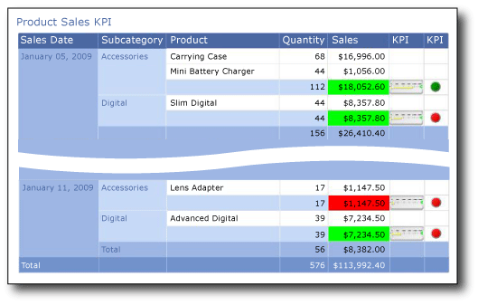

# Tutorial: Adding a KPI to Your Report (Report Builder)
  A key performance indicator (KPI) is a measurable value that has business significance. This tutorial teaches you how to include a (KPI) in a report. In this scenario, the sales summary by product subcategories is the KPI. The current state of the KPI is shown by using colors, gauges, and indicators.  
  
 The following illustration shows the report that you will create.  
  
   
  
##  <a name="BackToTop"></a> What You Will Learn  
 In this tutorial, you will learn to add a KPI by setting the background color of table cells based on cell value and add and configure a gauge and an indicator. You also learn to write the expression that sets the background color of the table cells.  
  
 This tutorial contains the following procedures:  
  
1.  [Create a Table Report and Dataset from the Table or Matrix Wizard](#Table)  
  
2.  [Organize Data, Choose Layout, and Style from the Table or Matrix Wizard](#CompleteWizard)  
  
3.  [Use Background Colors to Display a KPI](#BackgroundColors)  
  
4.  [Display a KPI by Using a Gauge](#Gauge)  
  
5.  [Display a KPI by Using an Indicator](#Indicator)  
  
6.  [Add a Report Title](#Title)  
  
7.  [Save the Report](#Save)  
  
> [!NOTE]  
>  In this tutorial, the steps for the wizard are consolidated into two procedures: one to create the dataset and one to create a table. For step-by-step instructions about how to browse to a report server, choose a data source, create a dataset, and run the wizard, see the first tutorial in this series: [Tutorial: Creating a Basic Table Report &#40;Report Builder&#41;](../reporting-services/tutorial-creating-a-basic-table-report-report-builder.md).  
  
 Estimated time to complete this tutorial: 15 minutes.  
  
## Requirements  
 For more information about requirements, see [Prerequisites for Tutorials &#40;Report Builder&#41;](../reporting-services/report-builder-tutorials.md).  
  
##  <a name="Table"></a> 1. Create a Table Report and Dataset from the Table or Matrix Wizard  
 From the **Getting Started** dialog box, choose a shared data source, create an embedded dataset, and display the data in a table.  
  
> [!NOTE]  
>  In this tutorial, the query contains the data values, so that it does not need an external data source. This makes the query quite long. In a business environment, a query would not contain the data. This is for learning purposes only.  
  
#### To create a new table  
  
1.  Click **Start**, point to **Programs**, point to **Microsoft SQL Server 2012 Report Builder**, and then click **Report Builder**.  
  
     The **Getting Started** dialog box appears.  
  
    > [!NOTE]  
    >  If the **Getting Started** dialog box does not appear, from the Report Builder button, click **New**.  
  
2.  In the left pane, verify that **New Report** is selected.  
  
3.  In the right pane, click **Table or Matrix Wizard**.  
  
4.  On the Choose a dataset page, click **Create a dataset**.  
  
5.  Click **Next**.  
  
6.  On the **Choose a connection to a data source** page, select an existing data source or browse to the report server and select a data source. If there no data source is available or you do not have access to a report server, you can use an embedded data source instead. For more information, see [Tutorial: Creating a Basic Table Report &#40;Report Builder&#41;](../reporting-services/tutorial-creating-a-basic-table-report-report-builder.md).  
  
7.  Click **Next**.  
  
8.  On the **Design a query** page, click **Edit as Text**.  
  
9. Copy and paste the following query into the query pane:  
  
    ```  
    SELECT CAST('2009-01-05' AS date) as SalesDate, 'Accessories' as Subcategory,   
       'Carrying Case' as Product, CAST(16996.60 AS money) AS Sales, 68 as Quantity  
    UNION SELECT CAST('2009-01-06' AS date) as SalesDate, 'Accessories' as Subcategory,  
       'Tripod' as Product, CAST(1350.00 AS money) AS Sales, 18 as Quantity  
    UNION SELECT CAST('2009-01-11' AS date) as SalesDate, 'Accessories' as Subcategory,  
       'Lens Adapter' as Product, CAST(1147.50 AS money) AS Sales, 17 as Quantity  
    UNION SELECT CAST('2009-01-05' AS date) as SalesDate, 'Accessories' as Subcategory,  
       'Mini Battery Charger' as Product, CAST(1056.00 AS money) AS Sales, 44 as Quantity  
    UNION SELECT CAST('2009-01-06' AS date) as SalesDate,  'Accessories' as Subcategory,  
       'Telephoto Conversion Lens' as Product, CAST(1380.00 AS money) AS Sales, 18 as Quantity  
    UNION SELECT CAST('2009-01-06' AS date) as SalesDate,'Accessories' as Subcategory,    
       'USB Cable' as Product, CAST(780.00 AS money) AS Sales, 26 as Quantity  
    UNION SELECT CAST('2009-01-08' AS date) as SalesDate, 'Accessories' as Subcategory,   
       'Budget Movie-Maker' as Product, CAST(3798.00 AS money) AS Sales, 9 as Quantity  
    UNION SELECT CAST('2009-01-09' AS date) as SalesDate, 'Camcorders' as Subcategory,   
       'Business Videographer' as Product, CAST(10400.00 AS money) AS Sales, 13 as Quantity  
    UNION SELECT CAST('2009-01-10' AS date) as SalesDate, 'Camcorders' as Subcategory,   
       'Social Videographer' as Product, CAST(3000.00 AS money) AS Sales, 60 as Quantity  
    UNION SELECT CAST('2009-01-11' AS date) as SalesDate,  'Digital' as Subcategory,   
       'Advanced Digital' as Product, CAST(7234.50 AS money) AS Sales, 39 as Quantity  
    UNION SELECT CAST('2009-01-07' AS date) as SalesDate,  'Digital' as Subcategory,   
       'Compact Digital' as Product, CAST(10836.00 AS money) AS Sales, 84 as Quantity  
    UNION SELECT CAST('2009-01-08' AS date) as SalesDate,  'Digital' as Subcategory,   
       'Consumer Digital' as Product, CAST(2550.00 AS money) AS Sales, 17 as Quantity  
    UNION SELECT CAST('2009-01-05' AS date) as SalesDate, 'Digital' as Subcategory,   
       'Slim Digital' as Product, CAST(8357.80 AS money) AS Sales, 44 as Quantity  
    UNION SELECT CAST('2009-01-09' AS date) as SalesDate, 'Digital SLR' as Subcategory,   
       'SLR Camera 35mm' as Product, CAST(18530.00 AS money) AS Sales, 34 as Quantity  
    UNION SELECT CAST('2009-01-07' AS date) as SalesDate, 'Digital SLR' as Subcategory,   
       'SLR Camera' as Product, CAST(26576.00 AS money) AS Sales, 88 as Quantity  
    ```  
  
10. Click **Next**.  
  
##  <a name="CompleteWizard"></a> 2. Organize Data, Choose Layout, and Style from the Table or Matrix Wizard  
 Use the wizard to provide a starting design on which to display data. The preview pane in the wizard helps you to visualize the result of grouping data before you complete the table or matrix design.  
  
#### To organize data into groups, choose a layout and a style  
  
1.  On the Arrange fields page, drag Product to **Values**.  
  
2.  Drag Quantity to **Values** and place below Product.  
  
     Quantity is summarized with the Sum function, the default function to summarize numeric fields.  
  
3.  Drag Sales to **Values** and place below Quantity.  
  
     Steps 1, 2, and 3 specify the data to display in the table.  
  
4.  Drag SalesDate to **Row groups**.  
  
5.  Drag Subcategory to **Row groups** and place below SalesDate.  
  
     Steps 4 and 5 organize the values for the fields first by date, and then by all sales for that date.  
  
6.  Click **Next**.  
  
     When you run the report, the table displays each date, all orders for each date, and all products, quantities, and sales totals for each order.  
  
7.  On the Choose the Layout page, under **Options**, verify that **Show subtotals and grand totals** is selected.  
  
8.  Verify that **Blocked, subtotal below** is selected.  
  
9. Clear the option **Expand/collapse groups**.  
  
     In this tutorial, the report you create does not use the drilldown feature that lets a user expand a parent group hierarchy to display child group rows and detail rows.  
  
10. Click **Next**.  
  
11. On the Choose a Style page, in the Styles pane, select a style.  
  
     The illustration of the completed report shows the report using the Ocean style.  
  
12. Click **Finish**.  
  
     The table is added to the design surface. The table has five columns and five rows. The Row Groups pane shows three row groups: SalesDate, Subcategory, and Details. Detail data is all the data that is retrieved by the dataset query.  
  
13. Click **Run** to preview the report.  
  
 For each product that is sold on a specific date, the table displays the product name, the quantity sold, and the sales total. The data is organized first by sales date and then by subcategory.  
  
##  <a name="BackgroundColors"></a> 3. Use Background Colors to Display a KPI  
 Background colors can be set to an expression that is evaluated when you run the report.  
  
#### To display the present state of a KPI by using background colors  
  
1.  In the table, right-click two cells down from the `[Sum(Sales)]` cell (the subtotal row that displays the sales for a subcategory), and then click **Text Box Properties**.  
  
2.  In **Fill**, click the **fx** button next to the **Fill color** option and enter the following expression in the **Set expression for: BackgroundColor** field:  
  
 `=IIF(Sum(Fields!Sales.Value) >= 5000 ,"Lime", IIF(Sum(Fields!Sales.Value) < 2500, "Red","Yellow"))`  
  
 This changes the background color to green, using the shade of green named "Lime", for each cell that contains an aggregated sum for `[Sum(Sales)]` that is greater than or equal to 5000. Values of `[Sum(Sales)]` between 2500 and 5000 are colored yellow. Values less than 2500 are colored red.  
  
1.  [!INCLUDE[clickOK](../includes/clickok-md.md)]  
  
2.  Click **Run** to preview the report.  
  
 In the subtotal row that displays the sales for a subcategory, the background color of the cell is red, yellow, or green depending on value of the sales sum.  
  
##  <a name="Gauge"></a> 4. Display a KPI by Using a Gauge  
 A gauge depicts a single value in a dataset. This tutorial uses a horizontal linear gauge because its shape and simplicity makes it easy to read, even in when it is a small size and used within a table cell. For more information, see [Gauges &#40;Report Builder and SSRS&#41;](report-design/gauges-report-builder-and-ssrs.md).  
  
#### To display the present state of a KPI using a gauge  
  
1.  Switch to Design view.  
  
2.  In the table, right-click the column handler for the cell that you changed in the previous procedure, point to **Insert Column**, and then click **Right**. A new column is added to the table.  
  
3.  Type **KPI** in the column heading.  
  
4.  On the **Insert** tab, in the **Data Regions** group, click **Gauge**, and then click the design surface outside the table. The **Select Gauge Type** dialog box appears.  
  
5.  Click **Linear**. The first linear gauge type, **Horizontal**, is selected.  
  
6.  [!INCLUDE[clickOK](../includes/clickok-md.md)]  
  
     A gauge is added to the design surface.  
  
7.  From the Report Data pane, drag Sales to the gauge. When you drag Sales across the gauge, the Gauge Data pane opens.  
  
8.  Drop Sales in the **Values** list.  
  
     When you drop the field onto the gauge, the field is aggregated by using the built-in Sum function.  
  
9. Right-click the pointer in the gauge and click **Pointer Properties**.  
  
10. In **Pointer Type**, select **Bar**. This changes the pointer from a marker to a bar that will be more visible when the gauge is added to the table.  
  
11. Click **Pointer Fill**. In **Secondary Color,** pick **Yellow**. The gradient fill pattern will change from white to yellow.  
  
12. Right-click the scale in the gauge and click **Scale Properties**.  
  
13. Set the **Maximum** option to 25000.  
  
    > [!NOTE]  
    >  Instead of a constant such as 25000, you can use an expression to dynamically calculate the value of the **Maximum** option. The expression would use the aggregate of aggregate feature and look similar to the expression `=Max(Sum(Fields!Sales.value), "Tablix1")`.  
  
14. Drag the gauge inside the table into the third cell in the subtotal row that displays the sales for a subcategory of the column that you inserted.  
  
    > [!NOTE]  
    >  You might have to resize the column so that the horizontal linear gauge fits into the cell. To resize the column, click a column header and use the handles to resize the cells horizontally and vertically.  
  
15. Click **Run** to preview the report.  
  
     The horizontal length of the bar in the gauge changes depending on the value of the KPI.  
  
16. (Optional) Add a maximum pin to handle overflow so that any value over the scale maximum always points to the maximum pin:  
  
    1.  Open the Properties pane.  
  
    2.  Click the scale. The properties for the linear scale are displayed in the Properties pane.  
  
    3.  In the **Scale Pins** category, expand the **MaximumPin** node.  
  
    4.  Set the **Enable** property to `True`. A pin appears after the maximum value on the scale.  
  
    5.  Set **BorderColor** to `Lime`.  
  
17. Click **Run** to preview the report.  
  
##  <a name="Indicator"></a> 5. Display a KPI by Using an Indicator  
 Indicators are small simple gauges that communicate data values at a glance. Because of their size and simplicity, indicators are often used in tables and matrices. For more information, see [Indicators &#40;Report Builder and SSRS&#41;](report-design/indicators-report-builder-and-ssrs.md).  
  
#### To display the present state of a KPI using an indicator  
  
1.  Switch to Design view.  
  
2.  In the table, right-click the column handler for the cell that you changed in the previous procedure, point to **Insert Column**, and then click **Right**. A new column is added to the table.  
  
3.  Type **KPI** in the column heading.  
  
4.  Click the cell for the subcategory subtotal.  
  
5.  On the **Insert** tab, in the **Data Regions** group, double-click **Indicator.**  
  
     The **Select Indicator Type** dialog box opens.  
  
6.  Click **Shapes**. The first shape type, **3 Traffic Lights (Unrimmed),** is selected.  
  
     You will use this indicator in the tutorial.  
  
7.  [!INCLUDE[clickOK](../includes/clickok-md.md)]  
  
     The indicator is added to the design surface.  
  
8.  Right-click the indicator and click **Indicator Properties**.  
  
9. Click **Values and States**.  
  
10. In the Value drop-down list, select **[Sum(Sales)]**, but do not change any other options.  
  
     By default, data synchronization occurs across the data region and you see the value **Tablix1**, the name of the table data region in the report, in the **Synchronization scope** box.  
  
     In this report, you can also change the scope of an indicator placed in the cell of the subcategory subtotal to synchronize across the SalesDate field.  
  
11. Click **Run** to preview the report.  
  
##  <a name="Title"></a> 6. Add a Report Title  
 A report title appears at the top of the report. You can place the report title in a report header or if the report does not use one, in a text box at the top of the report body. You will use the text box that is automatically placed at the top of the report body.  
  
 The text can be further enhanced by applying different font styles, sizes, and colors to phrases and individual characters of the text. For more information, see [Format Text in a Text Box &#40;Report Builder and SSRS&#41;](report-design/format-text-in-a-text-box-report-builder-and-ssrs.md).  
  
#### To add a report title  
  
1.  On the design surface, click **Click to add title**.  
  
2.  Type **Product Sales KPI**, and then click outside the text box.  
  
3.  Optionally, right-click the text box that contains **Product Sales KPI**, click **Text Box Properties**, and then on the Font tab select the different font styles, sizes and colors.  
  
4.  Click **Run** to preview the report.  
  
##  <a name="Save"></a> 7. Save the Report  
 Save the report to a report server or your computer. If you do not save the report to the report server, a number of [!INCLUDE[ssRSnoversion](../includes/ssrsnoversion-md.md)] features such as report parts and subreports are not available.  
  
#### To save the report on a report server  
  
1.  From the **Report Builder** button, click **Save As**.  
  
2.  Click **Recent Sites and Servers**.  
  
3.  Select or type the name of the report server where you have permission to save reports.  
  
     The message "Connecting to report server" appears. When the connection is complete, you see the contents of the report folder that the report server administrator specified as the default location for reports.  
  
4.  In **Name**, replace the default name with **Product Sales KPI**.  
  
5.  Click **Save**.  
  
 The report is saved to the report server. The name of report server that you are connected to appears in the status bar at the bottom of the window.  
  
#### To save the report on your computer  
  
1.  From the **Report Builder** button, click **Save As**.  
  
2.  Click **Desktop**, **My Documents**, or **My computer**, and browse to the folder where you want to save the report.  
  
> [!NOTE]  
>  If you do not have access to a report server, click **Desktop**, **My Documents**, or **My computer** and save the report to your computer.  
  
1.  In **Name**, replace the default name with **Product Sales KPI**.  
  
2.  Click **Save**.  
  
## Next Steps  
 You have successfully completed the Adding a KPI to Your Report tutorial. For more information, see Gauges (Report Builder) [Indicators &#40;Report Builder and SSRS&#41;](report-design/indicators-report-builder-and-ssrs.md).  
  
## See Also  
 [Tutorials &#40;Report Builder&#41;](report-builder-tutorials.md)   
 [Report Builder in SQL Server 2014](report-builder/report-builder-in-sql-server-2016.md)  
  
  
