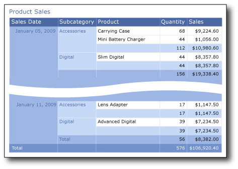

# Tutorial: Creating a Basic Table Report (Report Builder)
  This tutorial teaches you to create a basic table report based on sample sales data. The following illustration shows the report you will create.  
  
   
  
##  <a name="BackToTop"></a> What You Will Learn  
 In this tutorial, you will learn how to do the following:  
  
1.  [Create a New Report from Getting Started](#CreateTable)  
  
    1.  [Specify a Data Connection in the Table Wizard](#DataConnection)  
  
    2.  [Create a Query in the Table Wizard](#Query)  
  
    3.  [Organize Data into Groups in the Table Wizard](#Groups)  
  
    4.  [Add Subtotal and Total Rows in the Table Wizard](#Subtotals)  
  
    5.  [Choose a Style in the Table Wizard](#Style)  
  
2.  [Format Data as Currency](#FormatCurrency)  
  
3.  [Format Data as Date](#FormatDate)  
  
4.  [Change Column Widths](#Width)  
  
5.  [Add a Report Title](#Title)  
  
6.  [Save the Report](#Save)  
  
7.  [Export the Report](#Export)  
  
 Estimated time to complete this tutorial: 20 minutes.  
  
## Requirements  
 For more information about requirements, see [Prerequisites for Tutorials &#40;Report Builder&#41;](../reporting-services/report-builder-tutorials.md).  
  
##  <a name="CreateTable"></a> 1. Create a New Report from Getting Started  
 Create a table report from the **Getting Started** dialog box. There are two modes: report design and shared dataset design. In report design mode, you specify data in the Report Data pane and the report layout on the design surface. In shared dataset design mode, you create dataset queries to share with others. In this tutorial, you will be using report design mode.  
  
#### To create a new report  
  
1.  Click **Start**, point to **Programs**, point to **Microsoft SQL Server 2012 Report Builder**, and then click **Report Builder**.  
  
     The **Getting Started** dialog box opens.  
  
    > [!NOTE]  
    >  If the **Getting Started** dialog box does not appear, from the **Report Builder** button, click **New**.  
  
2.  In the left pane, verify that **New Report** is selected.  
  
3.  In the right pane, verify that **Table or Matrix Wizard** is selected.  
  
##  <a name="DataConnection"></a> 1a. Specify a Data Connection in the Table Wizard  
 A data connection contains the information to connect to an external data source such as a [!INCLUDE[ssNoVersion](../includes/ssnoversion-md.md)] database. Usually, you get the connection information and the type of credentials to use from the data source owner. To specify a data connection, you can use a shared data source from the report server or create an embedded data source that is used only in this report.  
  
 In this tutorial, you will use an embedded data source. To learn more about using a shared data sources, see [Alternative Ways to Get a Data Connection &#40;Report Builder&#41;](../reporting-services/alternative-ways-to-get-a-data-connection-report-builder.md).  
  
#### To create an embedded data source  
  
1.  On the **Choose a dataset** page, select **Create a dataset**, and then click **Next**. The **Choose a connection to a data source** page opens.  
  
2.  Click **New**. The **Data Source Properties** dialog box opens.  
  
3.  In **Name**, type **Product Sales** a name for the data source.  
  
4.  In **Select a connection type**, verify that **Microsoft SQL Server** is selected.  
  
5.  In **Connection string**, type the following text, where *\<servername>* is the name of an instance of [!INCLUDE[ssNoVersion](../includes/ssnoversion-md.md)]:  
  
    ```  
    Data Source=<servername>  
    ```  
  
     Because you will use a query that contains the data instead of retrieving the data from a database, the connection string does not include the database name. For more information, see [Prerequisites for Tutorials &#40;Report Builder&#41;](../reporting-services/report-builder-tutorials.md).  
  
6.  Click **Credentials**. Enter the credentials that you need to access the external data source.  
  
7.  [!INCLUDE[clickOK](../includes/clickok-md.md)]  
  
     You are back on the **Choose a connection to a data source** page.  
  
8.  To verify that you can connect to the data source, click **Test Connection**.  
  
     The message "Connection created successfully" appears.  
  
9. [!INCLUDE[clickOK](../includes/clickok-md.md)]  
  
10. Click **Next**.  
  
##  <a name="Query"></a> 1b. Create a Query in the Table Wizard  
 In a report, you can use a shared dataset that has a predefined query, or you can create an embedded dataset for use only in your report. In this tutorial, you will create an embedded dataset.  
  
> [!NOTE]  
>  In this tutorial, the query contains the data values, so that it does not need an external data source. This makes the query quite long. In a business environment, a query would not contain the data. This is for learning purposes only.  
  
#### To create a query  
  
1.  On the **Design a query** page, the relational query designer is open. For this tutorial, you will use the text-based query designer.  
  
     Click **Edit As Text**. The text-based query designer displays a query pane and a results pane.  
  
2.  Paste the following [!INCLUDE[tsql](../includes/tsql-md.md)] query into the **Query** box.  
  
    ```  
    SELECT CAST('2009-01-05' AS date) as SalesDate, 'Accessories' as Subcategory,   
       'Carrying Case' as Product, CAST(9924.60 AS money) AS Sales, 68 as Quantity  
    UNION SELECT CAST('2009-01-06' AS date) as SalesDate, 'Accessories' as Subcategory,  
       'Tripod' as Product, CAST(1350.00 AS money) AS Sales, 18 as Quantity  
    UNION SELECT CAST('2009-01-11' AS date) as SalesDate, 'Accessories' as Subcategory,  
       'Lens Adapter' as Product, CAST(1147.50 AS money) AS Sales, 17 as Quantity  
    UNION SELECT CAST('2009-01-05' AS date) as SalesDate, 'Accessories' as Subcategory,  
       'Mini Battery Charger' as Product, CAST(1056.00 AS money) AS Sales, 44 as Quantity  
    UNION SELECT CAST('2009-01-06' AS date) as SalesDate,  'Accessories' as Subcategory,  
       'Telephoto Conversion Lens' as Product, CAST(1380.00 AS money) AS Sales, 18 as Quantity  
    UNION SELECT CAST('2009-01-06' AS date) as SalesDate,'Accessories' as Subcategory,    
       'USB Cable' as Product, CAST(780.00 AS money) AS Sales, 26 as Quantity  
    UNION SELECT CAST('2009-01-08' AS date) as SalesDate, 'Accessories' as Subcategory,   
       'Budget Movie-Maker' as Product, CAST(3798.00 AS money) AS Sales, 9 as Quantity  
    UNION SELECT CAST('2009-01-09' AS date) as SalesDate, 'Camcorders' as Subcategory,   
       'Business Videographer' as Product, CAST(10400.00 AS money) AS Sales, 13 as Quantity  
    UNION SELECT CAST('2009-01-10' AS date) as SalesDate, 'Camcorders' as Subcategory,   
       'Social Videographer' as Product, CAST(3000.00 AS money) AS Sales, 60 as Quantity  
    UNION SELECT CAST('2009-01-11' AS date) as SalesDate,  'Digital' as Subcategory,   
       'Advanced Digital' as Product, CAST(7234.50 AS money) AS Sales, 39 as Quantity  
    UNION SELECT CAST('2009-01-07' AS date) as SalesDate,  'Digital' as Subcategory,   
       'Compact Digital' as Product, CAST(10836.00 AS money) AS Sales, 84 as Quantity  
    UNION SELECT CAST('2009-01-08' AS date) as SalesDate,  'Digital' as Subcategory,   
       'Consumer Digital' as Product, CAST(2550.00 AS money) AS Sales, 17 as Quantity  
    UNION SELECT CAST('2009-01-05' AS date) as SalesDate, 'Digital' as Subcategory,   
       'Slim Digital' as Product, CAST(8357.80 AS money) AS Sales, 44 as Quantity  
    UNION SELECT CAST('2009-01-09' AS date) as SalesDate, 'Digital SLR' as Subcategory,   
       'SLR Camera 35mm' as Product, CAST(18530.00 AS money) AS Sales, 34 as Quantity  
    UNION SELECT CAST('2009-01-07' AS date) as SalesDate, 'Digital SLR' as Subcategory,   
       'SLR Camera' as Product, CAST(26576.00 AS money) AS Sales, 88 as Quantity  
  
    ```  
  
3.  On the query designer toolbar, click **Run** (**!**).  
  
     The query runs and displays the result set for the fields SalesDate, Subcategory, Product, Sales, and Quantity.  
  
     In the result set, the column headings are based on the names in the query. In the dataset, the column headings become the field names, and are saved in the report. After you complete the wizard, you can use the Report Data pane to view the collection of dataset fields.  
  
4.  Click **Next**.  
  
##  <a name="Groups"></a> 1c. Organize Data into Groups in the Table Wizard  
 When you select fields to group on, you design a table that has rows and columns that display detail data and aggregated data.  
  
#### To organize data into groups  
  
1.  On the **Arrange fields** page, drag Product to **Values**.  
  
2.  Drag Quantity to **Values** and place below Product.  
  
     Quantity is automatically aggregated by the Sum function, the default aggregate for numeric fields. The value is [Sum(Quantity)].  
  
     You can open the drop-down list to view the other aggregate functions available. Do not change the aggregate function.  
  
3.  Drag Sales to **Values** and place below [Sum(Quantity)].  
  
     Sales is aggregated by the Sum function. The value is [Sum(Sales)].  
  
     Steps 1, 2, and 3 specify the data to display in the table.  
  
4.  Drag SalesDate to **Row groups**.  
  
5.  Drag Subcategory to **Row groups** and place below SalesDate.  
  
     Steps 4 and 5 organize the values for the fields first by date, and then by product subcategory for that date.  
  
6.  Click **Next**.  
  
##  <a name="Subtotals"></a> 1d. Add Subtotal and Total Rows in the Table Wizard  
 After you create groups, you can add and format rows on which to display aggregate values for the fields. You can choose whether to show all the data or to let a user expand and collapse grouped data interactively.  
  
#### To add subtotals and totals  
  
1.  On the **Choose the layout** page, under **Options**, verify that **Show subtotals and grand totals** is selected.  
  
2.  Verify that **Blocked, subtotal below** is selected.  
  
     The wizard Preview pane displays a table with five rows. When you run the report, each row will display in the following way:  
  
    1.  The first row will repeat once for the table to show column headings.  
  
    2.  The second row will repeat once for each line item in the sales order and display the product name, order quantity, and line total.  
  
    3.  The third row will repeat once for each sales order to display subtotals per order.  
  
    4.  The fourth row will repeat once for each order date to display the subtotals per day.  
  
    5.  The fifth row will repeat once for the table to display the grand totals.  
  
3.  Clear the option **Expand/collapse groups**. In this tutorial, the report you create does not use the drilldown feature that lets a user expand a parent group hierarchy to display child group rows and detail rows.  
  
4.  Click **Next**.  
  
##  <a name="Style"></a> 1e. Choose a Style in the Table Wizard  
 A style specifies a font style, a set of colors, and a border style.  
  
#### To specify a table style  
  
1.  On the **Choose a Style** page, in the Styles pane, select Ocean.  
  
     The Preview pane displays a sample of the table with that style.  
  
2.  Optionally, click the other styles to see the sample with them applied.  
  
3.  Click **Finish**.  
  
 The table is added to the design surface. The table has 5 columns and 5 rows. The Row Groups pane shows three row groups: SalesDate, Subcategory, and Details. Detail data is all the data that is retrieved by the dataset query.  
  
##  <a name="FormatCurrency"></a> 2. Format Data as Currency  
 By default, the summary data for the Sales field displays a general number. Format it to display the number as currency. Toggle **Placeholder Styles** to display formatted text boxes and placeholder text as sample values.  
  
#### To format a currency field  
  
1.  Click **Design** to switch to design view.  
  
2.  Click the cell in the second row (under the column headings row) in the Sales column and drag down to select all cells that contain `[Sum(Sales)]`.  
  
3.  On the **Home** tab, in the **Number** group, click the **Currency** button. The cells change to show the formatted currency.  
  
     If your regional setting is English (United States), the default sample text is [**$12,345.00**]. If you do not see an example currency value, click **Placeholder Styles** in the **Numbers** group, and then click **Sample Values**.  
  
4.  Click **Run** to preview your report.  
  
 The summary values for Sales display as currency.  
  
##  <a name="FormatDate"></a> 3. Format Data as Date  
 By default, the SalesDate field displays both date and time information. You can format them to display only the date.  
  
#### To format a date field as the default format  
  
1.  Click **Design** to return to design view.  
  
2.  Click the cell that contains `[SalesDate]`.  
  
3.  On the Ribbon, on the **Home** tab, in the **Number** group, from the drop-down list, select **Date**.  
  
     The cell displays the example date **[1/31/2000]**. If you do not see an example date, click **Placeholder Styles** in the **Numbers** group, and then click **Sample Values**.  
  
4.  Click **Run** to preview the report.  
  
 The SalesDate values display in the default date format.  
  
#### To change the date format to a custom format  
  
1.  Click **Design** to return to design view.  
  
2.  Click the cell that contains `[SalesDate]`.  
  
3.  On the **Home** tab, in the **Number** group, click the dialog box launcher.  
  
     The launcher is the small arrow in the right-hand corner of the group. The **Text Box Properties** dialog box opens.  
  
4.  In the Category pane, verify that **Date** is selected.  
  
5.  In the **Type** pane, select **January 31, 2000**.  
  
6.  [!INCLUDE[clickOK](../includes/clickok-md.md)]  
  
     The cell displays the example date **[January 31, 2000]**.  
  
7.  Click **Run** to preview your report.  
  
 The SalesDate value displays with the name of the month instead of the number for the month.  
  
##  <a name="Width"></a> 4. Change Column Widths  
 By default, each cell in a table contains a text box. A text box expands vertically to accommodate text when the page is rendered. In the rendered report, each row expands to the height of the tallest rendered text box in the row. The height of the row on the design surface has no affect on the height of the row in the rendered report.  
  
 To reduce the amount of vertical space each row takes, expand the column width to accommodate the expected contents of the text boxes in the column on one line.  
  
#### To change the width of table columns  
  
1.  Click **Design** to return to design view.  
  
2.  Click the table so that column and row handles appear above and next to the table.  
  
     The gray bars along the top and side of the table are the column and row handles.  
  
3.  Point to the line between column handles so that the cursor changes into a double arrow. Drag the columns to the size you want. For example, expand the column for Product so that the product name displays on one line.  
  
4.  Click **Run** to preview your report.  
  
##  <a name="Title"></a> 5. Add a Report Title  
 A report title appears at the top of the report. You can place the report title in a report header or if the report does not use one, in a text box at the top of the report body. In this tutorial, you will use the text box that is automatically placed at the top of the report body.  
  
 The text can be further enhanced by applying different font styles, sizes, and colors to phrases and individual characters of the text. For more information, see [Format Text in a Text Box &#40;Report Builder and SSRS&#41;](report-design/format-text-in-a-text-box-report-builder-and-ssrs.md).  
  
#### To add a report title  
  
1.  On the design surface, click **Click to add title**.  
  
2.  Type **Product Sales**, and then click outside the text box.  
  
3.  Right-click the text box that contains **Product Sales** and click **Text Box Properties**.  
  
4.  In the **Text Box Properties** dialog box, click **Font**.  
  
5.  In the **Size** list, select **18pt**.  
  
6.  In the **Color** list, select **Cornflower Blue**.  
  
7.  Select **Bold**.  
  
8.  [!INCLUDE[clickOK](../includes/clickok-md.md)]  
  
##  <a name="Save"></a> 6. Save the Report  
 Save the report to a report server or your computer. If you do not save the report to the report server, a number of [!INCLUDE[ssRSnoversion](../includes/ssrsnoversion-md.md)] features such as report parts and subreports are not available.  
  
#### To save the report on a report server  
  
1.  From the **Report Builder** button, click **Save As**.  
  
2.  Click **Recent Sites and Servers**.  
  
3.  Select or type the name of the report server where you have permission to save reports.  
  
     The message "Connecting to report server" appears. When the connection is complete, you see the contents of the report folder that the report server administrator specified as the default location for reports.  
  
4.  In **Name**, replace the default name with **Product Sales**.  
  
5.  Click **Save**.  
  
 The report is saved to the report server. The name of report server that you are connected to appears in the status bar at the bottom of the window.  
  
#### To save the report on your computer  
  
1.  From the **Report Builder** button, click **Save As**.  
  
2.  Click **Desktop**, **My Documents**, or **My computer**, and browse to the folder where you want to save the report.  
  
3.  In **Name**, replace the default name with **Product Sales**.  
  
4.  Click **Save**.  
  
##  <a name="Export"></a> 7. Export the Report  
 Reports can be exported to different formats such Microsoft Excel and comma separated value (CSV). For more information, see [Exporting Reports &#40;Report Builder and SSRS&#41;](report-builder/export-reports-report-builder-and-ssrs.md).  
  
 In this tutorial, you will export the report to Excel and set a property on the report to provide a custom name for the workbook tab.  
  
#### To specify the workbook tab name  
  
1.  Click **Design** to return to design view.  
  
2.  Click anywhere outside the report.  
  
3.  .In the Properties pane, locate the InitialPageName property and type **Product Sales Excel**.  
  
    > [!NOTE]  
    >  If the Properties pane is not visible, click the View tab on the ribbon, and then click **Properties**.  
  
#### To export a report to Excel  
  
1.  Click **Run** to preview the report.  
  
2.  .On the ribbon, click **Export**, and then click **Excel**.  
  
     The **Save As** dialog box opens.  
  
3.  Browse to the **Documents** folder.  
  
4.  In the **File name** text box, type **Product Sales Excel**.  
  
5.  Verify that the file type is **Excel Workbook**.  
  
6.  Click **Save**.  
  
#### To view the report in Excel  
  
1.  Open the **Documents** folder and double click **Product Sales Excel.xlsx**.  
  
2.  Verify that the name of the workbook tab is **Product Sales Excel**.  
  
## Next Steps  
 This concludes the walkthrough for how to create a basic table report. For more information about tables, see [Tables, Matrices, and Lists &#40;Report Builder and SSRS&#41;](report-design/create-invoices-and-forms-with-lists-report-builder-and-ssrs.md).  
  
## See Also  
 [Tutorials &#40;Report Builder&#41;](report-builder-tutorials.md)   
 [Report Builder in SQL Server 2014](report-builder/report-builder-in-sql-server-2016.md)  
  
  
