# Tutorial: Creating a Free Form Report (Report Builder)
  This tutorial teaches you how to create an SSRS free form report that resembles a forms letter. You can arrange report items to create a form with text boxes, images and other data regions.  
  
 The report you create in this tutorial is based on sample sales data that is included in the tutorial. The report groups information by territory and displays the name of the sales manager for the territory as well as detailed and summary sales information. You will use the list data region as the foundation for the free form report, and then add a decorative panel with an image, static text with data inserted, a table to show detailed information, and optionally, pie and column charts to display summary information.  
  
##  <a name="BackToTop"></a> What You Will Learn  
 In this tutorial, you will learn how to do the following:  
  
-   [Create a Blank Report, Data Source, and Dataset](#BlankReport)  
  
-   [Add and Configure a List](#List)  
  
-   [Add Graphics](#Graphics)  
  
-   [Add Free Form Text](#Text)  
  
-   [Add a Table to Show Details](#Table)  
  
-   [Format Data](#Format)  
  
-   [Save the Report](#Save)  
  
### Other Optional Steps  
  
-   [Add a Line to Separate Areas of Report](#Line)  
  
-   [Add Summary Data Visualization](#Visualization)  
  
 Estimated time to complete this tutorial: 20 minutes.  
  
## Requirements  
 For more information about requirements, see [Prerequisites for Tutorials &#40;Report Builder&#41;](../reporting-services/report-builder-tutorials.md).  
  
##  <a name="BlankReport"></a> 1. Create a Blank Report, Data Source, and Dataset  
  
> [!NOTE]  
>  In this tutorial, the query contains the data values so that the report does not need an external data source. The use of this type of internal data is great for learning purposes, but the approach makes the query long. .  
  
#### To create a blank report  
  
1.  Click **Start**, point to **Programs**, point to **Microsoft SQL Server 2012 Report Builder**, and then click **Report Builder**.  
  
    > [!NOTE]  
    >  The **Getting Started** dialog box should appear. If it does not, from the Report Builder button, click **New**.  
  
2.  In the left pane of the **Getting Started** dialog box, verify that **New Report** is selected.  
  
3.  In the right pane, click **Blank Report**.  
  
#### To create a new data source  
  
1.  In the Report Data pane, click **New**, and then click **Data Source**.  
  
2.  In the `Name` box, type: **ListDataSource**  
  
3.  Click **Use a connection embedded in my report**.  
  
4.  Verify that the connection type is Microsoft SQL Server, and then in the **Connection string** box type: **Data Source = \<servername>**  
  
     \<servername>, for example Report001, specifies a computer on which an instance of the SQL Server Database Engine is installed. Because the report data is not extracted from a SQL Server database, you need not include the name of a database. The default database on the specified server is used to parse the query.  
  
5.  Click **Credentials**, and enter the credentials needed to connect to the instance of the SQL Server Database Engine.  
  
6.  Click **OK**.  
  
#### To create a new dataset  
  
1.  In the Report Data pane, click **New**, and then click **Dataset**.  
  
2.  In the `Name` box, type: **ListDataset.**  
  
3.  Click **Use a dataset embedded in my report**, and verify that the data source is **ListDataSource**.  
  
4.  Verify that the **Text** query type is selected, and then click **Query Designer**.  
  
5.  Click **Edit as Text**.  
  
6.  Copy and paste the following query into the query pane:  
  
    ```  
    SELECT CAST('2009-01-05' AS date) as SalesDate, 'Lauren Johnson' as FullName,'Central' as Territory, 'Accessories' as Subcategory,'Carrying Case' as Product, CAST(16996.60 AS money) AS Sales, 68 as Quantity  
    UNION SELECT CAST('2009-01-05' AS date) as SalesDate, 'Warren Pal' as FullName,'North' as Territory, 'Accessories' as Subcategory, 'Carrying Case' as Product, CAST(13747.25 AS money) AS Sales, 55 as Quantity  
    UNION SELECT CAST('2009-01-05' AS date) as SalesDate, 'Fernando Ross' as FullName,'South' as Territory, 'Accessories' as Subcategory,'Carrying Case' as Product, CAST(9248.15 AS money) As Sales, 37 as Quantity  
    UNION SELECT CAST('2009-01-05' AS date) as SalesDate, 'Lauren Johnson' as FullName,'Central' as Territory, 'Accessories' as Subcategory,'Tripod' as Product, CAST(1350.00 AS money) AS Sales, 18 as Quantity  
    UNION SELECT CAST('2009-01-05' AS date) as SalesDate, 'Warren Pal' as FullName,'North' as Territory, 'Accessories' as Subcategory,'Tripod' as Product, CAST(1800.00 AS money) AS Sales, 24 as Quantity  
    UNION SELECT CAST('2009-01-05' AS date) as SalesDate, 'Fernando Ross' as FullName,'South' as Territory, 'Accessories' as Subcategory,'Tripod' as Product, CAST(1125.00 AS money) AS Sales, 15 as Quantity  
    UNION SELECT CAST('2009-01-05' AS date) as SalesDate, 'Lauren Johnson' as FullName,'Central' as Territory, 'Accessories' as Subcategory,'Lens Adapter' as Product, CAST(1147.50 AS money) AS Sales, 17 as Quantity  
    UNION SELECT CAST('2009-01-05' AS date) as SalesDate, 'Warren Pal' as FullName,'North' as Territory, 'Accessories' as Subcategory,  'Lens Adapter' as Product, CAST(742.50 AS money) AS Sales, 11 as Quantity  
    UNION SELECT CAST('2009-01-05' AS date) as SalesDate, 'Fernando Ross' as FullName,'South' as Territory, 'Accessories' as Subcategory,'Lens Adapter' as Product, CAST(1417.50 AS money) AS Sales, 21 as Quantity  
    UNION SELECT CAST('2009-01-06' AS date) as SalesDate, 'Lauren Johnson' as FullName,'Central' as Territory, 'Accessories' as Subcategory, 'Carrying Case' as Product, CAST(13497.30 AS money) AS Sales, 54 as Quantity  
    UNION SELECT CAST('2009-01-06' AS date) as SalesDate, 'Warren Pal' as FullName,'North' as Territory, 'Accessories' as Subcategory, 'Carrying Case' as Product, CAST(11997.60 AS money) AS Sales, 48 as Quantity  
    UNION SELECT CAST('2009-01-06' AS date) as SalesDate, 'Fernando Ross' as FullName,'South' as Territory, 'Accessories' as Subcategory, 'Carrying Case' as Product, CAST(10247.95 AS money) As Sales, 41 as Quantity  
    UNION SELECT CAST('2009-01-06' AS date) as SalesDate, 'Lauren Johnson' as FullName,'Central' as Territory, 'Accessories' as Subcategory, 'Tripod' as Product, CAST(1200.00 AS money) AS Sales, 16 as Quantity  
    UNION SELECT CAST('2009-01-06' AS date) as SalesDate, 'Warren Pal' as FullName,'North' as Territory, 'Accessories' as Subcategory,'Tripod' as Product, CAST(2025.00 AS money) AS Sales, 27 as Quantity  
    UNION SELECT CAST('2009-01-06' AS date) as SalesDate, 'Fernando Ross' as FullName,'South' as Territory, 'Accessories' as Subcategory,'Tripod' as Product, CAST(1425.00 AS money) AS Sales, 19 as Quantity  
    UNION SELECT CAST('2009-01-06' AS date) as SalesDate, 'Lauren Johnson' as FullName,'Central' as Territory, 'Accessories' as Subcategory,'Lens Adapter' as Product, CAST(887.50 AS money) AS Sales, 13 as Quantity  
    UNION SELECT CAST('2009-01-06' AS date) as SalesDate, 'Warren Pal' as FullName,'North' as Territory, 'Accessories' as Subcategory, 'Lens Adapter' as Product, CAST(607.50 AS money) AS Sales, 9 as Quantity  
    UNION SELECT CAST('2009-01-06' AS date) as SalesDate, 'Fernando Ross' as FullName,'South' as Territory, 'Accessories' as Subcategory,'Lens Adapter' as Product, CAST(1215.00 AS money) AS Sales, 18 as Quantity  
    UNION SELECT CAST('2009-01-05' AS date) as SalesDate,  'Lauren Johnson' as FullName,'Central' as Territory, 'Digital' as Subcategory,'Compact Digital' as Product, CAST(10191.00 AS money) AS Sales, 79 as Quantity  
    UNION SELECT CAST('2009-01-05' AS date) as SalesDate,  'Warren Pal' as FullName,'North' as Territory, 'Digital' as Subcategory, 'Compact Digital' as Product, CAST(8772.00 AS money) AS Sales, 68 as Quantity  
    UNION SELECT CAST('2009-01-05' AS date) as SalesDate,  'Fernando Ross' as FullName,'South' as Territory, 'Digital' as Subcategory, 'Compact Digital' as Product, CAST(10578.00 AS money) AS Sales, 82 as Quantity  
    UNION SELECT CAST('2009-01-05' AS date) as SalesDate, 'Lauren Johnson' as FullName,'Central' as Territory,'Digital' as Subcategory, 'Slim Digital' as Product, CAST(7218.10 AS money) AS Sales, 38 as Quantity  
    UNION SELECT CAST('2009-01-05' AS date) as SalesDate, 'Warren Pal' as FullName,'North' as Territory,'Digital' as Subcategory, 'Slim Digital' as Product, CAST(8357.80 AS money) AS Sales, 44 as Quantity  
    UNION SELECT CAST('2009-01-05' AS date) as SalesDate, 'Fernando Ross' as FullName,'South' as Territory,'Digital' as Subcategory,'Slim Digital' as Product, CAST(9307.55 AS money) AS Sales, 49 as Quantity  
    UNION SELECT CAST('2009-01-06' AS date) as SalesDate,  'Lauren Johnson' as FullName,'Central' as Territory, 'Digital' as Subcategory,'Compact Digital' as Product, CAST(3870.00 AS money) AS Sales, 30 as Quantity  
    UNION SELECT CAST('2009-01-06' AS date) as SalesDate,  'Warren Pal' as FullName,'North' as Territory, 'Digital' as Subcategory,'Compact Digital' as Product, CAST(5805.00 AS money) AS Sales, 45 as Quantity  
    UNION SELECT CAST('2009-01-06' AS date) as SalesDate,  'Fernando Ross' as FullName,'South' as Territory, 'Digital' as Subcategory, 'Compact Digital' as Product, CAST(8643.00 AS money) AS Sales, 67 as Quantity  
    UNION SELECT CAST('2009-01-06' AS date) as SalesDate, 'Lauren Johnson' as FullName,'Central' as Territory, 'Digital' as Subcategory, 'Slim Digital' as Product, CAST(9877.40 AS money) AS Sales, 52 as Quantity  
    UNION SELECT CAST('2009-01-06' AS date) as SalesDate, 'Warren Pal' as FullName,'North' as Territory, 'Digital' as Subcategory, 'Slim Digital' as Product, CAST(12536.70 AS money) AS Sales, 66 as Quantity  
    UNION SELECT CAST('2009-01-06' AS date) as SalesDate, 'Fernando Ross' as FullName,'South' as Territory, 'Digital' as Subcategory, 'Slim Digital' as Product, CAST(6648.25 AS money) AS Sales, 35 as Quantity  
    ```  
  
7.  Click Run icon to run the query.  
  
     The query results are the data available to display in your report.  
  
       
  
8.  [!INCLUDE[clickOK](../includes/clickok-md.md)]  
  
##  <a name="List"></a> 2. Add and Configure a List  
 [!INCLUDE[ssRSnoversion](../includes/ssrsnoversion-md.md)] provides three data region templates: table, matrix, and list. These templates are all based on a tablix data region.  
  
 In this tutorial, you will use a list to display the sales information for sales territories in a report that resembles a newsletter. The information is grouped by territory. You will add a new row group that groups data by territory, and then delete the built-in Details row group. The list template is ideal for creating free form reports. For more information, see [Lists &#40;Report Builder and SSRS&#41;](report-design/create-invoices-and-forms-with-lists-report-builder-and-ssrs.md).  
  
> [!NOTE]  
>  This report uses the paper size Letter (8.5 X11) and 1 inch margins. A report page taller than 9 inches or wider than 6 1/2 inches might generate blank pages.  
  
#### To add a list  
  
1.  On the **Insert** tab of the ribbon, in the **Data Regions** area, click **List** and then drag the list inside the report body. Make the list 7 inches tall and 6.25 inches wide.  
  
2.  Click inside the list, right-click the top of the list, and then click **Tablix Properties**.  
  
     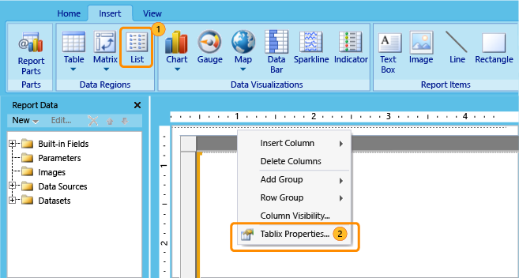  
  
3.  In the **Dataset name** drop-down list, select **ListDataset**.  
  
4.  [!INCLUDE[clickOK](../includes/clickok-md.md)]  
  
5.  Right-click inside the list, and then click **Rectangle Properties**.  
  
     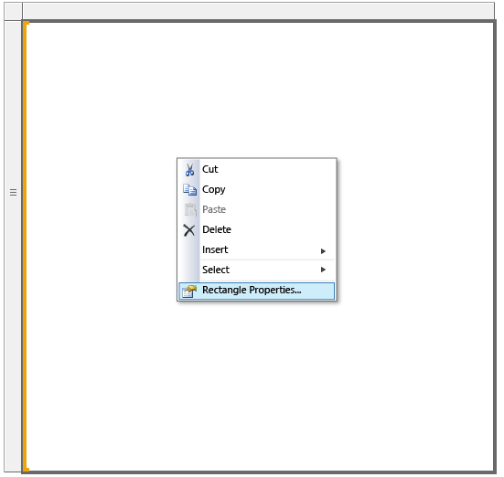  
  
6.  On the **General** tab, select the **Add a page break after** checkbox.  
  
7.  [!INCLUDE[clickOK](../includes/clickok-md.md)]  
  
#### To add a new row group and to delete the Details group  
  
1.  In the Row Groups pane, right-click the Details group, point to **Add Group**, and then click **Parent Group**.  
  
     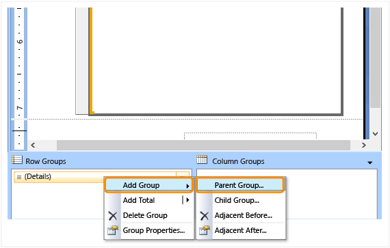  
  
2.  In the drop-down list, select `[Territory].`  
  
3.  [!INCLUDE[clickOK](../includes/clickok-md.md)]  
  
     A column is added to the list. The column contains the cell `[Territory].`  
  
4.  Right-click the Territory column in the list, and then click **Delete Columns**.  
  
     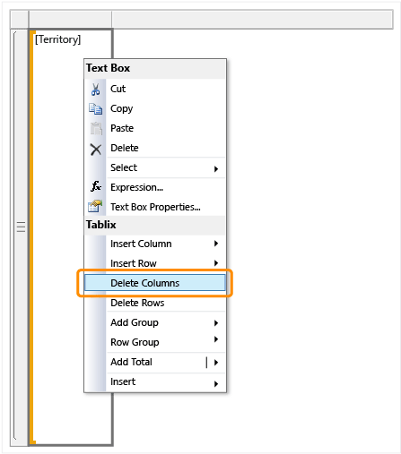  
  
5.  Click **Delete Columns only**.  
  
     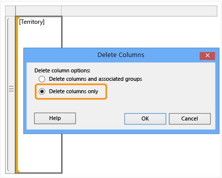  
  
6.  In the Row Groups pane, right-click the **Details** group, and then click **Delete Group**.  
  
     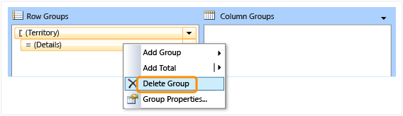  
  
7.  Click **Delete Group only**.  
  
8.  [!INCLUDE[clickOK](../includes/clickok-md.md)]  
  
##  <a name="Graphics"></a> 3. Add Graphics  
 One of the advantages of using a list data region is that you can add report items such as rectangles and text boxes anywhere, instead of being limited to a tabular layout. You will enhance the appearance of the report by adding a graphic (a rectangle filled with a color).  
  
#### To add graphic elements to the report  
  
1.  On the **Insert** tab of the ribbon, click **Rectangle**,and then drag a rectangle to the upper left corner of the list. Make the rectangle 7 inches tall and 1 inch wide.  
  
2.  Right-click the rectangle, and then click **Rectangle Properties**.  
  
3.  Click the **Fill** tab.  
  
4.  In the **Fill color** drop-down list, click **More Colors**, and then select the **DarkGray** color.  
  
     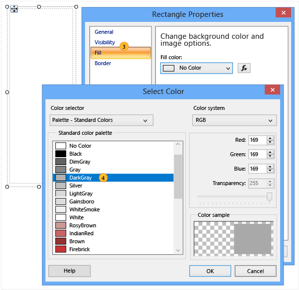  
  
5.  [!INCLUDE[clickOK](../includes/clickok-md.md)]  
  
6.  Click **Run** to preview the report.  
  
 The left side of the report now has vertical graphic that consists of a dark gray rectangle.  
  
##  <a name="Text"></a> 4. Add Free Form Text  
 A text box contains static text that is repeated on each report page as well as data fields.  
  
#### To add text to the report  
  
1.  Click **Design** to return to design view.  
  
2.  On the **Insert** tab of the ribbon, click **Text Box**, and then drag a text box to the upper left corner of the list, but inside of the rectangle you added previously. Make the text box about 3 inches tall and 5 inches wide.  
  
3.  Place the cursor in the upper part of the text box, and then type: **Newsletter for** .  
  
     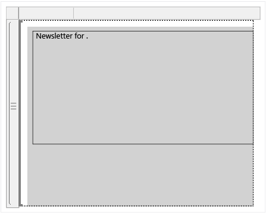  
  
    > [!NOTE]  
    >  Be sure to include the extra space after the word "for". The space separates the text and the field that you will add in the next step.  
  
4.  Drag the Territory field to the text box and place it after the text you typed in step 3.  
  
     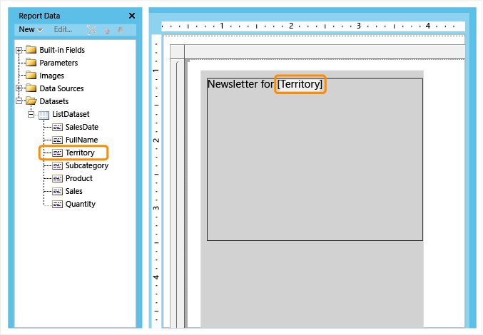  
  
5.  Select all text, right-click, and then click **Text Properties**.  
  
6.  Click the **Font** tab.  
  
7.  In the **Font** list, select **Times New Roman**; in **Size** select **20 pt**, in **Color** select **Red**.  
  
       
  
8.  [!INCLUDE[clickOK](../includes/clickok-md.md)]  
  
9. Place the cursor below the text you typed in step 3 and type: **Hello** .  
  
    > [!NOTE]  
    >  Be sure to include the extra space after the word "Hello". The space separates the text and the field that you will add in the next step.  
  
10. Drag the FullName field to the text box and place it after the text you typed in step 9, and then type a comma (,).  
  
     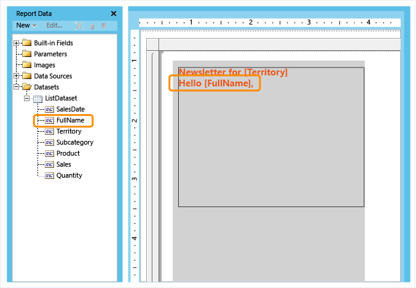  
  
11. Select the text you added in steps 9 and 10, right-click, and then click **Text Properties**.  
  
12. Click the **Font** tab.  
  
13. In the **Font** list, select **Times New Roman**; in **Size** select **16 pt**, in **Color** select **Black** color.  
  
14. [!INCLUDE[clickOK](../includes/clickok-md.md)]  
  
15. Place the cursor below the text you added in steps 9 through 13, and then copy and paste the following "greeked" text:  
  
    ```  
    Lorem ipsum dolor sit amet, consectetur adipiscing elit. Proin sed dolor in ipsum pulvinar egestas. Sed sed lacus at leo ornare ultricies. Vivamus velit risus, euismod nec sodales gravida, gravida in dui. Etiam ullamcorper elit vitae justo fermentum ut ullamcorper augue sodales. Ut placerat, nisl quis feugiat adipiscing, nibh est aliquet est, mollis faucibus mauris lectus quis arcu. In mollis tincidunt lacinia. In vitae erat ut lorem tincidunt luctus. Curabitur et magna nunc, sit amet adipiscing nisi. Nulla rhoncus elementum orci nec tincidunt. Aliquam imperdiet cursus erat vel tincidunt. Donec et neque ac urna rutrum sodales. In id purus et nisl dignissim dapibus. Sed rhoncus metus at felis feugiat eu tempor dolor vehicula. Lorem ipsum dolor sit amet, consectetur adipiscing elit. Nullam faucibus consectetur diam eu pellentesque.   
    Nulla facilisi. Proin ligula enim, porta ut tincidunt id, adipiscing sit amet eros. Ut purus sem, bibendum et vulputate sit amet, facilisis eget magna. Sed aliquam erat non erat eleifend hendrerit. Ut a ligula est, sit amet eleifend enim. Ut et nisl enim, sit amet adipiscing augue. Vivamus eu arcu ac libero posuere elementum. Integer condimentum bibendum venenatis. Integer odio tellus, feugiat in pellentesque semper, interdum nec sem. Sed cursus euismod sem, ut elementum sapien placerat vel.   
    ```  
  
16. Select the text you added in steps 15, right-click, and then click **Text Properties**.  
  
17. Click the **Font** tab.  
  
18. In the **Font** list, select **Arial**; in **Size** select **10 pt**, in **Color** select **Black**.  
  
19. [!INCLUDE[clickOK](../includes/clickok-md.md)]  
  
       
  
20. Place the cursor below the text you pasted in step 15, and then type: **Congratulations on your total sales of** .  
  
    > [!NOTE]  
    >  Be sure to include the extra space after the word "of". The space separates the text and the field that you will add in the next step.  
  
21. Drag the Sales field to the text box, place it after the text you typed in step 20, and then type an exclamation mark (!).  
  
22. Highlight the Sales field, right-click the field, and then click **Expression**.  
  
23. In the expression box, change the expression to include the Sum function as follows:  
  
    ```  
    =Sum(Fields!Sales.value)  
    ```  
  
24. [!INCLUDE[clickOK](../includes/clickok-md.md)]  
  
     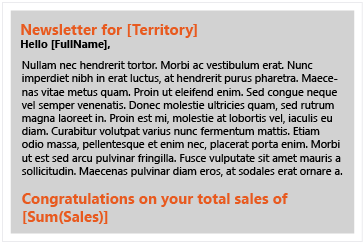  
  
25. Select the text you added in steps 20 through 23, right-click, and then click **Text Properties**.  
  
26. Click the **Font** tab.  
  
27. In the **Font** list, select **Times New Roman**; in **Size** select **16 pt**, in **Color** select **Red**.  
  
28. [!INCLUDE[clickOK](../includes/clickok-md.md)]  
  
29. Select `[Sum(Sales)]` and on the **Home** tab, in the **Number** group, click the **Currency** button.  
  
     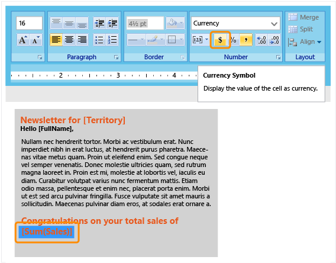  
  
30. Right-click the text box with the "Click to add title" text, and then click **Delete**.  
  
31. Select the list box and using the arrow keys, move it to the top of the page.  
  
32. Click **Run** to preview the report.  
  
 The report displays static text and each report page includes data that pertains to a territory. Sales are formatted as currency.  
  
 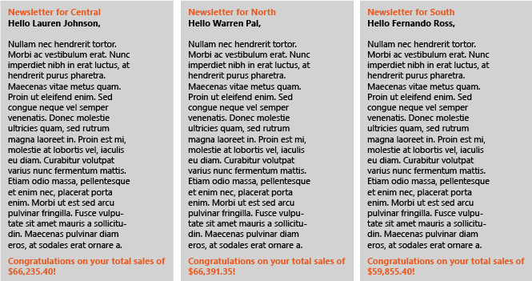  
  
##  <a name="Table"></a> 5. Add a Table to Show Sales Details  
 Use the New Table and Matrix Wizard to add a table to the free form report. After you complete the wizard, you will manually add a row for totals.  
  
#### To add a table  
  
1.  On the **Insert** tab of the ribbon, in the **Data Regions** area, click **Table**, and then click **Table Wizard**.  
  
2.  On the Choose a dataset page, click **ListDataset**.  
  
3.  Click **Next**.  
  
4.  On the **Arrange fields** page, drag the Product field from **Available fields** to **Values.**  
  
5.  Repeat step 4, for SalesDate, Quantity, and Sales. Place SalesDate below Product, Quantity below SalesDate, and Sales below SalesDate.  
  
6.  Click **Next**.  
  
7.  On the **Choose the layout** page, view the layout of the table.  
  
     The table is very simple. It consists of five columns and has no row or column groups. Because it has no groups, the layout options related to groups, are not available. You will manually update the table to include a total later in the tutorial.  
  
8.  Click **Next**.  
  
9. On the **Choose a Style** page, in the **Styles** pane, select **Slate**.  
  
10. Click **Finish**.  
  
11. Drag the table to below the text box that you added in lesson 4.  
  
    > [!NOTE]  
    >  Make sure the table is inside the list.  
  
12. Confirmed that the table is selected, then in the Row Group pane right-click Details, point to **Add Total**, and then click **After**.  
  
     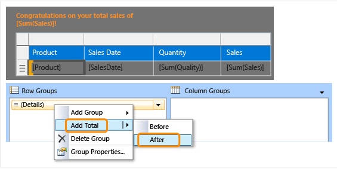  
  
13. Click **Run** to preview the report.  
  
 The report displays a table with sales details and totals.  
  
 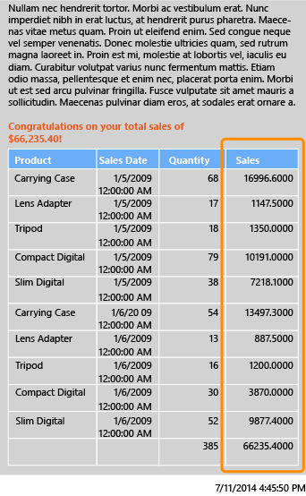  
  
##  <a name="Format"></a> 6. Format Data  
 Format numeric data as currency and dates as day and time only.  
  
#### To format fields table  
  
1.  Click **Design** to switch to design view.  
  
2.  Click the table cells that contain `[Sum(SalesSales)]` and on the **Home** tab, in the **Number** group, click the **Currency** button.  
  
     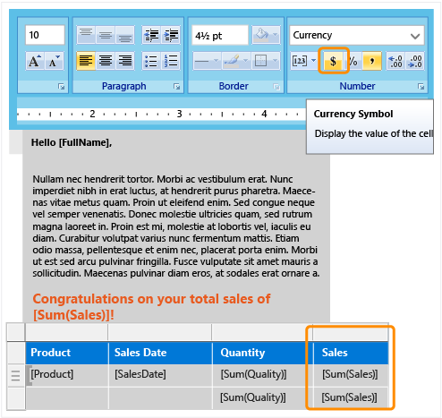  
  
3.  Click the cell that contains `[SalesDate]` and in the **Number** group, from the drop-down list, select **Date**.  
  
4.  Click **Run** to preview the report.  
  
 The report now displays formatted data and is easier to read.  
  
 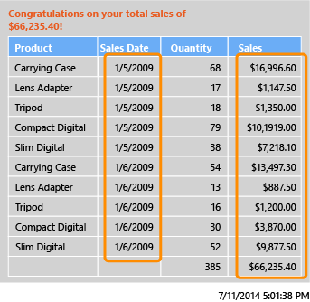  
  
##  <a name="Save"></a> 7. Save the Report  
 You can save reports to a report server, SharePoint library, or your computer. You can also export the report to a variety of formats such as Word and PDF, by running the report and selecting the format from the **Export** menu.  
  
 In this tutorial, save the report to a report server. If you do not have access to a report server, save the report to your computer.  
  
#### To save the report on a report server  
  
1.  From the **Report Builder** button, click **Save As**.  
  
2.  Click **Recent Sites and Servers**.  
  
3.  Select or type the name of the report server where you have permission to save reports.  
  
     The message "Connecting to report server" appears. When the connection is complete, you see the contents of the report folder that the report server administrator specified as the default location for reports.  
  
4.  In `Name`, replace the default name with **SalesInformationByTerritory**.  
  
5.  Click **Save**.  
  
 The report is saved to the report server. The name of report server that you are connected to appears in the status bar at the bottom of the window.  
  
#### To save the report on your computer  
  
1.  From the **Report Builder** button, click **Save As**.  
  
2.  Click **Desktop**, **My Documents**, or **My computer**, and then browse to the folder where you want to save the report.  
  
3.  In `Name`, replace the default name with **SalesInformationByTerritory**.  
  
4.  Click **Save**.  
  
##  <a name="Line"></a> 8. (Optional) Add a Line to Separate Areas of the Report  
 Add a line to separate the editorial and details areas of the report.  
  
#### To add a line  
  
1.  Click **Design** to return to design view.  
  
2.  On the **Insert** tab of the ribbon, in the **Report Items** area, click **Line.**  
  
3.  Draw a line below the free form text box you added in lesson 4.  
  
4.  Click the line.  
  
5.  Click the **Home** tab.  
  
6.  In the **Border** area, for width select **4 1/2** pt and for color, for color select **Red**.  
  
     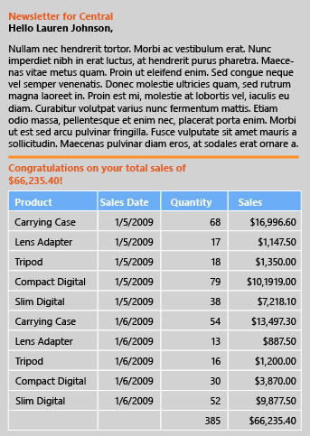  
  
##  <a name="Visualization"></a> 9. (Optional) Add Summary Data Visualization  
 Rectangles help you control how the report renders. Place a pie and column chart inside a rectangle to ensure that the report renders the way you want.  
  
#### To add a rectangle  
  
1.  Click **Design** to return to design view.  
  
2.  On the **Insert** tab of the ribbon, in the **Report Items** area click **Rectangle**, and then drag the rectangle inside the list, to the right of the table. Make the rectangle 2 inches wide and 4 inches tall.  
  
3.  Align the tops of the rectangle and the table.  
  
#### To add a pie chart  
  
1.  On the **Insert** tab of the ribbon, in the **Data Visualizations** area, click **Chart,** and then click **Chart Wizard**.  
  
2.  On the Choose a dataset page, click **ListDataset**, and then click **Next**.  
  
3.  Click **Pie**, and then click **Next**.  
  
4.  On the arrange chart fields page, drag Product to **Categories**.  
  
5.  Drag Quantity to **Values**, and then click **Next**.  
  
6.  On the **Choose a Style** page, in the **Styles** pane, select **Slate**.  
  
7.  Click **Finish**.  
  
8.  Resize the chart that appears in the upper left corner of the report, to be 1 1/2 inches tall and 2 inches wide.  
  
9. Drag the chart inside the rectangle.  
  
     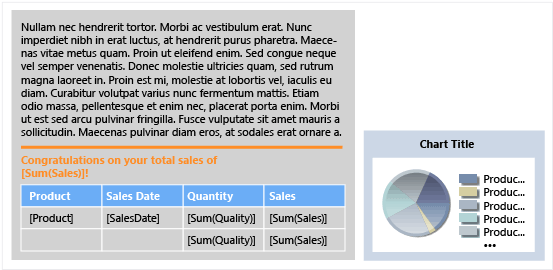  
  
10. Right-click the chart title, and then click **Title Properties**.  
  
11. In the **Chart Title Properties** dialog box, in Title text, type: **Product Quantities Sold**.  
  
12. Click the **Font** tab, and in the **Size** list, click **10pt**.  
  
13. [!INCLUDE[clickOK](../includes/clickok-md.md)]  
  
#### To add a column chart  
  
1.  On the **Insert** tab of the ribbon, in the **Data Visualizations** area, click **Chart,** and then click **Chart Wizard**.  
  
2.  On the **Choose a dataset** page, click **ListDataset**, and then click **Next**.  
  
3.  Click **Column**, and then click **Next**.  
  
4.  On the arrange chart fields page, drag the Product field to **Categories**.  
  
5.  Drag Sales to **Values,** and then click **Next**.  
  
     Values display on the vertical axis.  
  
6.  On the **Choose a Style** page, in the **Styles** pane, select **Slate**.  
  
7.  Click **Finish**.  
  
     A column chart is added to the upper left corner of the report.  
  
8.  Resize the chart to be 2 inches wide and 2 inches tall.  
  
9. Drag the chart inside the rectangle, below the pie chart.  
  
     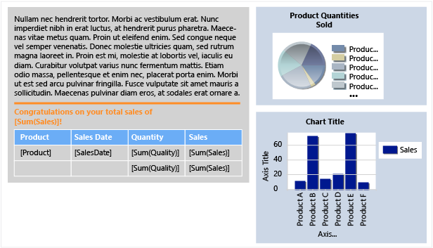  
  
10. Right-click the chart title and then click **Title Properties**.  
  
11. In the **Chart Title Properties** dialog box, in Title text, type: **Product Sales**.  
  
12. Click the **Font** tab, and in the **Size** list click **10pt**, and then click **OK**.  
  
13. In the column chart, right click the vertical axis, and then deselect **Show Axis Title**.  
  
14. Repeat step 13 for the horizontal axis.  
  
15. Right click the legend, and then click **Delete Legend**.  
  
    > [!NOTE]  
    >  Removing axis titles and the legend makes the chart more readable when it is a small size.  
  
 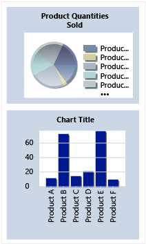  
  
#### To verify the charts are inside the rectangle  
  
1.  Click the rectangle you added earlier in this lesson.  
  
     In the Properties pane, the `Name` property displays the name of the rectangle.  
  
     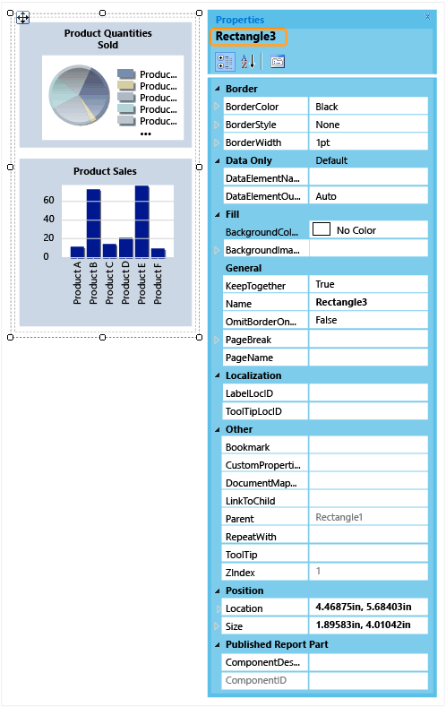  
  
2.  Click the pie chart.  
  
3.  In the **Properties** pane, verify that the `Parent` property contains the name of the rectangle.  
  
     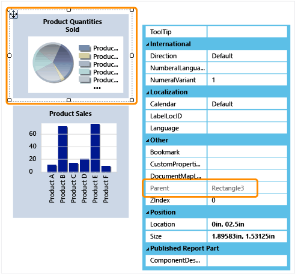  
  
4.  Click the column chart and repeat steps 2 and 3.  
  
    > [!NOTE]  
    >  If the charts are not inside the rectangle, the rendered report does not display the charts together.  
  
#### To make the charts the same size  
  
1.  Click the pie chart, press the Ctrl key, and then click the column chart.  
  
2.  With both charts selected, right-click, point to **Layout**, and then click **Make Same Width**.  
  
     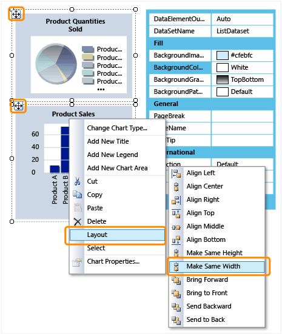  
  
    > [!NOTE]  
    >  The item you click first determines the width of all the selected items.  
  
3.  Click **Run** to preview the report.  
  
 The report now displays summary sales data in pie and column charts.  
  
 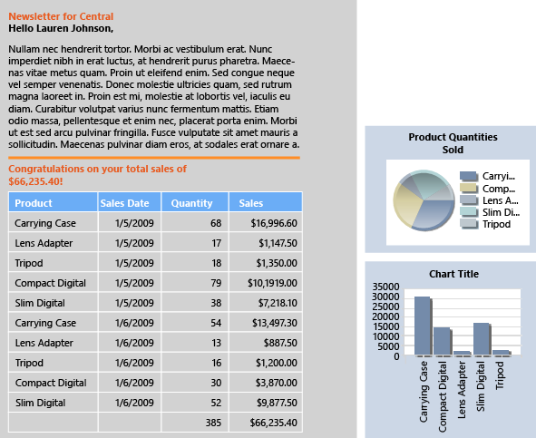  
  
## More Information  
 For more information about lists, see [Tables, Matrices, and Lists &#40;Report Builder and SSRS&#41;](report-design/tables-matrices-and-lists-report-builder-and-ssrs.md), [Lists &#40;Report Builder and SSRS&#41;](report-design/create-invoices-and-forms-with-lists-report-builder-and-ssrs.md), [Tablix Data Region Areas &#40;Report Builder and SSRS&#41;](report-design/tablix-data-region-areas-report-builder-and-ssrs.md), and [Tablix Data Region Cells, Rows, and Columns &#40;Report Builder&#41; and SSRS](report-design/tablix-data-region-cells-rows-and-columns-report-builder-and-ssrs.md).  
  
 For more information about query designers, see [Query Designers &#40;Report Builder&#41;](../../2014/reporting-services/query-designers-report-builder.md) and [Text-based Query Designer User Interface &#40;Report Builder&#41;](report-data/text-based-query-designer-user-interface-report-builder.md).  
  
## See Also  
 [Tutorials &#40;Report Builder&#41;](report-builder-tutorials.md)   
 [Report Builder in SQL Server 2014](report-builder/report-builder-in-sql-server-2016.md)  
  
  
