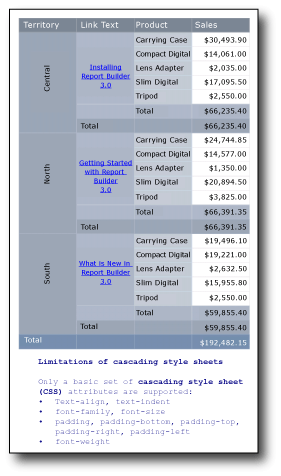

# Tutorial: Format Text (Report Builder)
  In this tutorial, you can practice formatting text in various ways. After you set up the blank report with the data source and dataset, you can pick and choose the steps that you want to explore.  
  
 The following illustration shows a report similar to the one you will create.  
  
   
  
 In one step, you make a mistake on purpose so you can see why it is a mistake. Then you correct the mistake to achieve the desired effect.  
  
 An enhanced version of the report you create in this tutorial is available as a sample [!INCLUDE[ssCurrent](../includes/sscurrent-md.md)] Report Builder report. For more information about downloading this sample report and others, see [Report Builder sample reports](https://go.microsoft.com/fwlink/?LinkId=184851).  
  
##  <a name="BackToTop"></a> What You Will Learn  
  
### Set Up the Report  
 1. [Create a Blank Report with a Data Source and Dataset](#CreateReport)  
  
 2. [Add a Field to the Report Design Surface (Incorrectly, then Correctly)](#AddField)  
  
 3. [Add a Table to the Report Design Surface](#AddTable)  
  
### Pick and Choose  
 [Add a Hyperlink to the Report](#AddHyperlink)  
  
 [Rotate Text in the Report](#RotateText)  
  
 [Displaying Text with HTML Formatting](#FormatHTML)  
  
 [Format Currency](#FormatCurrency)  
  
 [Save the Report](#Save)  
  
 Estimated time to complete this tutorial: 20 minutes.  
  
## Requirements  
 For more information about requirements, see [Prerequisites for Tutorials &#40;Report Builder&#41;](../reporting-services/report-builder-tutorials.md).  
  
##  <a name="CreateReport"></a> Create a Blank Report with a Data Source and Dataset  
  
#### To create a blank report  
  
1.  Click **Start**, point to **Programs**, point to [!INCLUDE[ssCurrentUI](../includes/sscurrentui-md.md)]**Report Builder**, and then click **Report Builder**.  
  
    > [!NOTE]  
    >  The **Getting Started** dialog box should appear. If it does not, from the Report Builder button, click **New**.  
  
2.  In the left pane of the **Getting Started** dialog box, verify that **New Report** is selected.  
  
3.  In the right pane, click **Blank Report**.  
  
#### To create a data source  
  
1.  In the Report Data pane, click **New**, and then click **Data Source**.  
  
2.  In the **Name** box, type: **TextDataSource**  
  
3.  Click **Use a connection embedded in my report**.  
  
4.  Verify that the connection type is Microsoft SQL Server, and then in the **Connection string** box type: **Data Source = \<servername>**  
  
    > [!NOTE]  
    >  The expression \<servername>, for example Report001, specifies a computer on which an instance of the SQL Server Database Engine is installed. This tutorial does not need specific data; it just needs a connection to a [!INCLUDE[ssCurrent](../includes/sscurrent-md.md)] database. If you already have a data source connection listed under **Data Source Connections**, you can select it and go to the next procedure, "To create a dataset." For more information, see [Alternative Ways to Get a Data Connection &#40;Report Builder&#41;](../reporting-services/alternative-ways-to-get-a-data-connection-report-builder.md).  
  
5.  [!INCLUDE[clickOK](../includes/clickok-md.md)]  
  
#### To create a dataset  
  
1.  In the Report Data pane, click **New**, and then click **Dataset**.  
  
2.  Verify that the data source is **TextDataSource**.  
  
3.  In the **Name** box, type: **TextDataset.**  
  
4.  Verify that the **Text** query type is selected, and then click **Query Designer**.  
  
5.  Click **Edit as Text**.  
  
6.  Paste the following query into the query pane:  
  
    ```  
    SELECT CAST('2009-01-05' AS date) as SalesDate, 'Lauren Johnson' as FullName,'Central' as Territory, 'Accessories' as Subcategory,'Carrying Case' as Product, CAST(16996.60 AS money) AS Sales, 68 as Quantity, 'Installing Report Builder' as LinkText, 'https://go.microsoft.com/fwlink/?LinkId=154882' AS URL  
    UNION SELECT CAST('2009-01-05' AS date) as SalesDate, 'Warren Pal' as FullName,'North' as Territory, 'Accessories' as Subcategory, 'Carrying Case' as Product, CAST(13747.25 AS money) AS Sales, 55 as Quantity, 'Getting Started with Report Builder' as Link, 'https://go.microsoft.com/fwlink/?LinkId=160556' AS URL  
    UNION SELECT CAST('2009-01-05' AS date) as SalesDate, 'Fernando Ross' as FullName,'South' as Territory, 'Accessories' as Subcategory,'Carrying Case' as Product, CAST(9248.15 AS money) As Sales, 37 as Quantity, 'What is New in Report Builder' as Link, 'https://go.microsoft.com/fwlink/?LinkId=165064' AS URL  
    UNION SELECT CAST('2009-01-05' AS date) as SalesDate, 'Lauren Johnson' as FullName,'Central' as Territory, 'Accessories' as Subcategory,'Tripod' as Product, CAST(1350.00 AS money) AS Sales, 18 as Quantity, 'Installing Report Builder' as LinkText, 'https://go.microsoft.com/fwlink/?LinkId=154882' AS URL  
    UNION SELECT CAST('2009-01-05' AS date) as SalesDate, 'Warren Pal' as FullName,'North' as Territory, 'Accessories' as Subcategory,'Tripod' as Product, CAST(1800.00 AS money) AS Sales, 24 as Quantity, 'Getting Started with Report Builder' as Link, 'https://go.microsoft.com/fwlink/?LinkId=160556' AS URL  
    UNION SELECT CAST('2009-01-05' AS date) as SalesDate, 'Fernando Ross' as FullName,'South' as Territory, 'Accessories' as Subcategory,'Tripod' as Product, CAST(1125.00 AS money) AS Sales, 15 as Quantity, 'What is New in Report Builder' as Link, 'https://go.microsoft.com/fwlink/?LinkId=165064' AS URL  
    UNION SELECT CAST('2009-01-05' AS date) as SalesDate, 'Lauren Johnson' as FullName,'Central' as Territory, 'Accessories' as Subcategory,'Lens Adapter' as Product, CAST(1147.50 AS money) AS Sales, 17 as Quantity, 'Installing Report Builder' as LinkText, 'https://go.microsoft.com/fwlink/?LinkId=154882' AS URL  
    UNION SELECT CAST('2009-01-05' AS date) as SalesDate, 'Warren Pal' as FullName,'North' as Territory, 'Accessories' as Subcategory,  'Lens Adapter' as Product, CAST(742.50 AS money) AS Sales, 11 as Quantity, 'Getting Started with Report Builder' as Link, 'https://go.microsoft.com/fwlink/?LinkId=160556' AS URL  
    UNION SELECT CAST('2009-01-05' AS date) as SalesDate, 'Fernando Ross' as FullName,'South' as Territory, 'Accessories' as Subcategory,'Lens Adapter' as Product, CAST(1417.50 AS money) AS Sales, 21 as Quantity, 'What is New in Report Builder' as Link, 'https://go.microsoft.com/fwlink/?LinkId=165064' AS URL  
    UNION SELECT CAST('2009-01-06' AS date) as SalesDate, 'Lauren Johnson' as FullName,'Central' as Territory, 'Accessories' as Subcategory, 'Carrying Case' as Product, CAST(13497.30 AS money) AS Sales, 54 as Quantity, 'Installing Report Builder' as LinkText, 'https://go.microsoft.com/fwlink/?LinkId=154882' AS URL  
    UNION SELECT CAST('2009-01-06' AS date) as SalesDate, 'Warren Pal' as FullName,'North' as Territory, 'Accessories' as Subcategory, 'Carrying Case' as Product, CAST(11997.60 AS money) AS Sales, 48 as Quantity, 'Getting Started with Report Builder' as Link, 'https://go.microsoft.com/fwlink/?LinkId=160556' AS URL  
    UNION SELECT CAST('2009-01-06' AS date) as SalesDate, 'Fernando Ross' as FullName,'South' as Territory, 'Accessories' as Subcategory, 'Carrying Case' as Product, CAST(10247.95 AS money) As Sales, 41 as Quantity, 'What is New in Report Builder' as Link, 'https://go.microsoft.com/fwlink/?LinkId=165064' AS URL  
    UNION SELECT CAST('2009-01-06' AS date) as SalesDate, 'Lauren Johnson' as FullName,'Central' as Territory, 'Accessories' as Subcategory, 'Tripod' as Product, CAST(1200.00 AS money) AS Sales, 16 as Quantity, 'Installing Report Builder' as LinkText, 'https://go.microsoft.com/fwlink/?LinkId=154882' AS URL  
    UNION SELECT CAST('2009-01-06' AS date) as SalesDate, 'Warren Pal' as FullName,'North' as Territory, 'Accessories' as Subcategory,'Tripod' as Product, CAST(2025.00 AS money) AS Sales, 27 as Quantity, 'Getting Started with Report Builder' as Link, 'https://go.microsoft.com/fwlink/?LinkId=160556' AS URL  
    UNION SELECT CAST('2009-01-06' AS date) as SalesDate, 'Fernando Ross' as FullName,'South' as Territory, 'Accessories' as Subcategory,'Tripod' as Product, CAST(1425.00 AS money) AS Sales, 19 as Quantity, 'What is New in Report Builder' as Link, 'https://go.microsoft.com/fwlink/?LinkId=165064' AS URL  
    UNION SELECT CAST('2009-01-06' AS date) as SalesDate, 'Lauren Johnson' as FullName,'Central' as Territory, 'Accessories' as Subcategory,'Lens Adapter' as Product, CAST(887.50 AS money) AS Sales, 13 as Quantity, 'Installing Report Builder' as LinkText, 'https://go.microsoft.com/fwlink/?LinkId=154882' AS URL  
    UNION SELECT CAST('2009-01-06' AS date) as SalesDate, 'Warren Pal' as FullName,'North' as Territory, 'Accessories' as Subcategory, 'Lens Adapter' as Product, CAST(607.50 AS money) AS Sales, 9 as Quantity, 'Getting Started with Report Builder' as Link, 'https://go.microsoft.com/fwlink/?LinkId=160556' AS URL  
    UNION SELECT CAST('2009-01-06' AS date) as SalesDate, 'Fernando Ross' as FullName,'South' as Territory, 'Accessories' as Subcategory,'Lens Adapter' as Product, CAST(1215.00 AS money) AS Sales, 18 as Quantity, 'What is New in Report Builder' as Link, 'https://go.microsoft.com/fwlink/?LinkId=165064' AS URL  
    UNION SELECT CAST('2009-01-05' AS date) as SalesDate,  'Lauren Johnson' as FullName,'Central' as Territory, 'Digital' as Subcategory,'Compact Digital' as Product, CAST(10191.00 AS money) AS Sales, 79 as Quantity, 'Installing Report Builder' as LinkText, 'https://go.microsoft.com/fwlink/?LinkId=154882' AS URL  
    UNION SELECT CAST('2009-01-05' AS date) as SalesDate,  'Warren Pal' as FullName,'North' as Territory, 'Digital' as Subcategory, 'Compact Digital' as Product, CAST(8772.00 AS money) AS Sales, 68 as Quantity, 'Getting Started with Report Builder' as Link, 'https://go.microsoft.com/fwlink/?LinkId=160556' AS URL  
    UNION SELECT CAST('2009-01-05' AS date) as SalesDate,  'Fernando Ross' as FullName,'South' as Territory, 'Digital' as Subcategory, 'Compact Digital' as Product, CAST(10578.00 AS money) AS Sales, 82 as Quantity, 'What is New in Report Builder' as Link, 'https://go.microsoft.com/fwlink/?LinkId=165064' AS URL  
    UNION SELECT CAST('2009-01-05' AS date) as SalesDate, 'Lauren Johnson' as FullName,'Central' as Territory,'Digital' as Subcategory, 'Slim Digital' as Product, CAST(7218.10 AS money) AS Sales, 38 as Quantity, 'Installing Report Builder' as LinkText, 'https://go.microsoft.com/fwlink/?LinkId=154882' AS URL  
    UNION SELECT CAST('2009-01-05' AS date) as SalesDate, 'Warren Pal' as FullName,'North' as Territory,'Digital' as Subcategory, 'Slim Digital' as Product, CAST(8357.80 AS money) AS Sales, 44 as Quantity, 'Getting Started with Report Builder' as Link, 'https://go.microsoft.com/fwlink/?LinkId=160556' AS URL  
    UNION SELECT CAST('2009-01-05' AS date) as SalesDate, 'Fernando Ross' as FullName,'South' as Territory,'Digital' as Subcategory,'Slim Digital' as Product, CAST(9307.55 AS money) AS Sales, 49 as Quantity, 'What is New in Report Builder' as Link, 'https://go.microsoft.com/fwlink/?LinkId=165064' AS URL  
    UNION SELECT CAST('2009-01-06' AS date) as SalesDate,  'Lauren Johnson' as FullName,'Central' as Territory, 'Digital' as Subcategory,'Compact Digital' as Product, CAST(3870.00 AS money) AS Sales, 30 as Quantity, 'Installing Report Builder' as LinkText, 'https://go.microsoft.com/fwlink/?LinkId=154882' AS URL  
    UNION SELECT CAST('2009-01-06' AS date) as SalesDate,  'Warren Pal' as FullName,'North' as Territory, 'Digital' as Subcategory,'Compact Digital' as Product, CAST(5805.00 AS money) AS Sales, 45 as Quantity, 'Getting Started with Report Builder' as Link, 'https://go.microsoft.com/fwlink/?LinkId=160556' AS URL  
    UNION SELECT CAST('2009-01-06' AS date) as SalesDate,  'Fernando Ross' as FullName,'South' as Territory, 'Digital' as Subcategory, 'Compact Digital' as Product, CAST(8643.00 AS money) AS Sales, 67 as Quantity, 'What is New in Report Builder' as Link, 'https://go.microsoft.com/fwlink/?LinkId=165064' AS URL  
    UNION SELECT CAST('2009-01-06' AS date) as SalesDate, 'Lauren Johnson' as FullName,'Central' as Territory, 'Digital' as Subcategory, 'Slim Digital' as Product, CAST(9877.40 AS money) AS Sales, 52 as Quantity, 'Installing Report Builder' as LinkText, 'https://go.microsoft.com/fwlink/?LinkId=154882' AS URL  
    UNION SELECT CAST('2009-01-06' AS date) as SalesDate, 'Warren Pal' as FullName,'North' as Territory, 'Digital' as Subcategory, 'Slim Digital' as Product, CAST(12536.70 AS money) AS Sales, 66 as Quantity, 'Getting Started with Report Builder' as Link, 'https://go.microsoft.com/fwlink/?LinkId=160556' AS URL  
    UNION SELECT CAST('2009-01-06' AS date) as SalesDate, 'Fernando Ross' as FullName,'South' as Territory, 'Digital' as Subcategory, 'Slim Digital' as Product, CAST(6648.25 AS money) AS Sales, 35 as Quantity, 'What is New in Report Builder' as Link, 'https://go.microsoft.com/fwlink/?LinkId=165064' AS URL  
    ```  
  
7.  Click Run (**!**) to run the query.  
  
     The query results are the data available to display in your report.  
  
8.  [!INCLUDE[clickOK](../includes/clickok-md.md)]  
  
##  <a name="AddField"></a> Add a Field to the Report Design Surface  
 If you want a field from your dataset to appear in a report, your first impulse may be to drag it directly to the design surface. This exercise points out why that doesn't work and what to do instead.  
  
#### To add a field to the report (and get the wrong result)  
  
1.  Drag the **FullName** field from the Report Data pane to the design surface.  
  
     Report Builder creates a text box with an expression in it, represented as \<Expr>.  
  
2.  Click **Run**.  
  
     Note that there is just one record, **Fernando Ross**, which is alphabetically the first record in the query. The field does not repeat to show the other records in that field.  
  
3.  Click **Design** to return to design view.  
  
4.  Select the expression \<Expr> in the text box.  
  
5.  In the Properties pane, for the **Value** property, you see the following (if you don't see the Properties pane, on the **View** tab, check **Properties**):  
  
    ```  
    =First(Fields!FullName.Value, "TextDataSet")  
    ```  
  
     The `First` function is designed to retrieve only the first value in a field, and that is what it has done.  
  
     Dragging the field directly to the design surface created a text box. Text boxes by themselves are not data regions, so they do not display data from a report dataset. Text boxes in data regions, such as tables, matrices, and lists, do display data.  
  
6.  Select the text box (if you have the expression selected, press ESC to select the text box), and press the DELETE key.  
  
#### To add a field to the report (and get the right result)  
  
1.  On the **Insert** tab of the ribbon, in the **Data Regions** area, click **List**. Click the design surface, and then drag to create a box that about two inches wide and one inch tall.  
  
2.  Drag the **FullName** field from the Report Data pane to the list box.  
  
     This time Report Builder creates a text box with the expression `[FullName]` in it.  
  
3.  Click **Run**.  
  
     Note that this time the box repeats to show all the records in the query.  
  
4.  Click **Design** to return to design view.  
  
5.  Select the expression in the text box.  
  
6.  In the Properties pane, for the **Value** property, you see the following:  
  
    ```  
    =Fields!FullName.Value  
    ```  
  
     By dragging the text box to the list data region, you display the data that is in the dataset.  
  
7.  Select the list box and press the DELETE key.  
  
##  <a name="AddTable"></a> Add a Table to the Report Design Surface  
 Create this table so that you'll have a place to put hyperlinks and rotated text.  
  
#### To add a table to the report  
  
1.  On the **Insert** menu, click **Table**, and then click **Table Wizard**.  
  
2.  On the **Choose a dataset** page of the New Table or Matrix wizard, click **Choose an existing dataset in this report or a shared dataset**, and click **TextDataset (in this Report)**, and then click **Next**.  
  
3.  On the **Arrange fields** page, drag the **Territory**, **LinkText**, and **Product** fields to **Row groups**, drag the **Sales** field to **Values**, and then click **Next**.  
  
4.  On the **Choose the layout** page, clear the **Expand/collapse groups** check box so you can see the whole table, and then click **Next**.  
  
5.  On the **Choose a style** page, click **Slate**, and then click **Finish**.  
  
6.  Drag the table so it is below the title block.  
  
7.  Click **Run**.  
  
     The table looks OK, but it has two Total rows. The **LinkText** field doesn't need a Total row.  
  
8.  Click **Design** to return to design view.  
  
9. Right-click the text box that contains `[LinkText]`, and click **Split Cells**.  
  
10. Select the empty cell below the `[LinkText]` cell, and then hold down the SHIFT key and select the two cells to its right: the **Total** cell in the **Product** column and the `[Sum(Sales)]` cell in the **Sales** column.  
  
11. With those three cells selected, right-click one of those cells and click **Delete Row**.  
  
12. Click **Run**.  
  
##  <a name="AddHyperlink"></a> Add a Hyperlink to the Report  
 In this section, you add a hyperlink to text in the table from the previous section.  
  
#### To add a hyperlink to the report  
  
1.  Click **Design** to return to design view.  
  
2.  Right-click in the cell containing `[LinkText]`, and click **Text Box Properties**.  
  
3.  In the **Text Box Properties** box, click **Action**.  
  
4.  Click **Go to URL**.  
  
5.  In the **Select URL** box, click **[URL]**, and then click **OK**.  
  
6.  Note that the text does not look any different. You need to make it look like link text.  
  
7.  Select `[LinkText]`.  
  
8.  In the **Font** section of the **Home** tab, click the **Underline** button, and then click the drop-down arrow next to the **Color** button, and click **Blue**.  
  
9. Click **Run**.  
  
     The text now looks like a link.  
  
10. Click a link. If the computer is connected to the Internet, a browser will open to a Report Builder Help topic.  
  
##  <a name="RotateText"></a> Rotate Text in the Report  
 In this section, you rotate some of the text in the table from the previous sections.  
  
#### To rotate text  
  
1.  Click **Design** to return to design view.  
  
2.  Click in the cell containing `[Territory].`  
  
3.  On the **Home** tab in the **Font** section, click the **Bold** button.  
  
4.  If the Properties pane is not open, on the **View** tab, select the **Properties** check box.  
  
5.  Locate the WritingMode property in the Properties pane.  
  
    > [!NOTE]  
    >  When the properties in the Properties pane are organized into categories, WritingMode is in the **Localization** category. Be sure you have selected the cell and not the text. WritingMode is a property of the text box, not of the text.  
  
6.  In the list box, click **Rotate270**.  
  
7.  On the **Home** tab in the **Paragraph** section, click the **Middle** and **Center** buttons to locate the text in the center of the cell both vertically and horizontally.  
  
8.  Click Run (**!**).  
  
 Now the text in the `[Territory]` cell runs vertically from the bottom to the top of the cells.  
  
##  <a name="FormatHTML"></a> Displaying Text with HTML Formatting  
  
#### To display text formatted as HTML  
  
1.  Click **Design** to switch to design view.  
  
2.  On the **Insert** tab, click **Text Box**, and then on the design surface, click and drag to create a text box under the table, about four inches wide and three inches tall.  
  
3.  Copy this text and paste it into the text box:  
  
    ```  
    <h4>Limitations of cascading style sheet attributes</h4>  
          <p>Only a basic set of <b>cascading style sheet (CSS)</b> attributes are defined:</p>  
          <ul><li>  
              text-align, text-indent  
            </li><li>  
              font-family, font-size  
            </li><li>  
              color  
            </li><li>  
              padding, padding-bottom, padding-top, padding-right, padding-left  
            </li><li>  
              font-weight  
            </li></ul>  
    ```  
  
4.  Select all of the text in the text box.  
  
     This is a property of the text, not the text box, so in one text box you could have a mixture of plain text and text that uses HTML tags as styles.  
  
5.  Right-click all of the selected text and click **Text Properties**.  
  
6.  On the **General** page, under **Markup type**, click **HTML - Interpret HTML tags as styles**.  
  
7.  Click **OK**.  
  
8.  Click Run (**!**) to preview the report.  
  
 The text in the text box is displayed as a heading, paragraph, and bulleted list.  
  
##  <a name="FormatCurrency"></a> Format Currency  
  
#### To format numbers as currency  
  
1.  Click **Design** to switch to design view.  
  
2.  Click the top table cell that contains `[Sum(Sales)]`, hold down the SHIFT key, and click the bottom table cell that contains `[Sum(Sales)]`.  
  
3.  On the **Home** tab, in the **Number** group, click the **Currency** button.  
  
4.  (Optional) On the **Home** tab, in the **Number** group, click the **Placeholder Styles** button and click **Sample Values** to see how the numbers will be formatted.  
  
5.  (Optional) On the **Home** tab, in the **Number** group, click the **Decrease Decimals** button twice to display dollar figures with no cents.  
  
6.  Click Run (**!**) to preview the report.  
  
 The report now displays formatted data and is easier to read.  
  
##  <a name="Save"></a> Save the Report  
 You can save reports to a report server, SharePoint library, or your computer.  
  
 In this tutorial, save the report to a report server. If you do not have access to a report server, save the report to your computer.  
  
#### To save the report on a report server  
  
1.  From the **Report Builder** button, click **Save As**.  
  
2.  Click **Recent Sites and Servers**.  
  
3.  Select or type the name of the report server where you have permission to save reports.  
  
     The message "Connecting to report server" appears. When the connection is complete, you see the contents of the report folder that the report server administrator specified as the default location for reports.  
  
4.  In **Name**, replace the default name with a name of your choosing.  
  
5.  Click **Save**.  
  
 The report is saved to the report server. The name of report server that you are connected to appears in the status bar at the bottom of the window.  
  
#### To save the report on your computer  
  
1.  From the **Report Builder** button, click **Save As**.  
  
2.  Click **Desktop**, **My Documents**, or **My computer**, and then browse to the folder where you want to save the report.  
  
3.  In **Name**, replace the default name with a name of your choosing.  
  
4.  Click **Save**.  
  
## Next Steps  
 There are many ways to format text in Report Builder [Tutorial: Creating a Free Form Report &#40;Report Builder&#41;](../reporting-services/tutorial-creating-a-free-form-report-report-builder.md) contains more examples.  
  
## See Also  
 [Tutorials &#40;Report Builder&#41;](report-builder-tutorials.md)   
 [Formatting Report Items &#40;Report Builder and SSRS&#41;](report-design/formatting-report-items-report-builder-and-ssrs.md)   
 [Report Builder in SQL Server 2014](report-builder/report-builder-in-sql-server-2016.md)  
  
  
