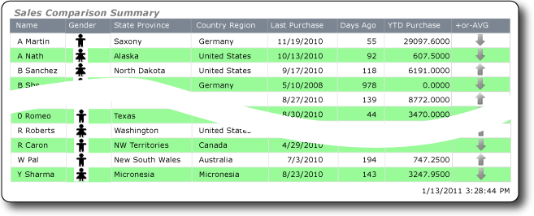

# Tutorial: Introducing Expressions
  Expressions help you create powerful and flexible reports. This tutorial teaches you to create and implement expressions that use common functions and operators. You will use the **Expression** dialog box to write expressions that concatenate name values, look up values in a separate dataset, display different pictures based on field values, and so on.  
  
 The report is a barred report with alternating row colors in white and a color. The report includes a parameter for selecting the color of the non-white rows.  
  
 The following illustration shows a report similar to the one you will create.  
  
   
  
##  <a name="BackToTop"></a> What You Will Learn  
 In this tutorial you will learn how to do the following:  
  
1.  [Create a Table Report and Dataset from the Table or Matrix Wizard](#Setup)  
  
2.  [Update Default Names of the Data Source and Dataset](#UpdateNames)  
  
3.  [Display First Name, Initial, and Last Name](#Concatenate)  
  
4.  [Use Images to Display Gender](#Gender)  
  
5.  [Look Up CountryRegion Name](#Lookup)  
  
6.  [Count Days Since Last Purchase](#Count)  
  
7.  [Use an Indicator to Show Sales Comparison](#Indicator)  
  
8.  [Make the Report a "Green Bar" Report](#GreenBar)  
  
### Other Optional Steps  
  
-   [Format Date Column](#DateFormat)  
  
-   [Add a Report Title](#Title)  
  
-   [Save the Report](#Save)  
  
 Estimated time to complete this tutorial: 30 minutes.  
  
## Requirements  
 For information about requirements, see [Prerequisites for Tutorials &#40;Report Builder&#41;](../reporting-services/report-builder-tutorials.md).  
  
##  <a name="Setup"></a> 1. Create a Table Report and Dataset from the Table or Matrix Wizard  
 Create a table report, a data source, and a dataset. When you lay out the table, you will include only a few fields. After you complete the wizard you will manually add columns. The wizard makes it easy for you to lay out the table and apply a style.  
  
> [!NOTE]  
>  In this tutorial, the query contains the data values, so that it does not need an external data source. This makes the query quite long. In a business environment, a query would not contain the data. This is for learning purposes only.  
  
> [!NOTE]  
>  In this tutorial, the steps for the wizard are consolidated into one procedure. For step-by-step instructions about how to browse to a report server, choose a data source, and create a dataset, see the first tutorial in this series: [Tutorial: Creating a Basic Table Report &#40;Report Builder&#41;](../reporting-services/tutorial-creating-a-basic-table-report-report-builder.md).  
  
#### To create a new table report  
  
1.  Click **Start**, point to **Programs**, click [!INCLUDE[ssCurrentUI](../includes/sscurrentui-md.md)]**Report Builder**, and then click **Report Builder**.  
  
     The **Getting Started** dialog box appears.  
  
    > [!NOTE]  
    >  If the **Getting Started** dialog box does not appear, from the **Report Builder** button, click **New**.  
  
    > [!NOTE]  
    >  If you prefer using the ClickOnce version of Report Builder, open Report Manager and click **Report Builder**, or go to a SharePoint site on which Reporting Services content types such as reports are enabled and click **Report Builder Report** on the **New Document** menu on the **Documents** tab of a shared documents library.  
  
2.  In the left pane, verify that **New Report** is selected.  
  
3.  In the right pane, click **Table or Matrix Wizard**.  
  
4.  On the **Choose a dataset** page, click **Create a dataset**.  
  
5.  Click **Next**.  
  
6.  On the **Choose a connection to a data source** page, select a data source that is type **SQL Server**. Select a data source from the list or browse to the report server to select one.  
  
7.  Click **Next**.  
  
8.  On the **Design a query** page, click **Edit as Text**.  
  
9. Paste the following query into the query pane:  
  
    ```  
    SELECT 'Lauren' AS FirstName,'Johnson' AS LastName, 'American Samoa' AS StateProvince, 1 AS CountryRegionID,'Unknown' AS Gender, CAST(9996.60 AS money) AS YTDPurchase, CAST('2010-6-10' AS date) AS LastPurchase  
    UNION SELECT'Warren' AS FirstName, 'Pal' AS LastName, 'New South Wales' AS StateProvince, 2 AS CountryRegionID, 'Male' AS Gender, CAST(5747.25 AS money) AS YTDPurchase, CAST('2010-7-3' AS date) AS LastPurchase  
    UNION SELECT 'Fernando' AS FirstName, 'Ross' AS LastName, 'Alberta' AS StateProvince, 3 AS CountryRegionID, 'Male' AS Gender, CAST(9248.15 AS money) AS YTDPurchase, CAST('2010-10-17' AS date) AS LastPurchase  
    UNION SELECT 'Rob' AS FirstName, 'Caron' AS LastName, 'Northwest Territories' AS StateProvince, 3 AS CountryRegionID, 'Male' AS Gender, CAST(742.50 AS money) AS YTDPurchase, CAST('2010-4-29' AS date) AS LastPurchase  
    UNION SELECT 'James' AS FirstName, 'Bailey' AS LastName, 'British Columbia' AS StateProvince, 3 AS CountryRegionID, 'Male' AS Gender, CAST(1147.50 AS money) AS YTDPurchase, CAST('2010-6-15' AS date) AS LastPurchase  
    UNION SELECT  'Bridget' AS FirstName, 'She' AS LastName, 'Hamburg' AS StateProvince, 4 AS CountryRegionID, 'Female' AS Gender, CAST(7497.30 AS money) AS YTDPurchase, CAST('2010-5-10' AS date) AS LastPurchase  
    UNION SELECT 'Alexander' AS FirstName, 'Martin' AS LastName, 'Saxony' AS StateProvince, 4 AS CountryRegionID, 'Male' AS Gender, CAST(2997.60 AS money) AS YTDPurchase, CAST('2010-11-19' AS date) AS LastPurchase  
    UNION SELECT 'Yolanda' AS FirstName, 'Sharma' AS LastName ,'Micronesia' AS StateProvince, 5 AS CountryRegionID, 'Female' AS Gender, CAST(3247.95 AS money) AS YTDPurchase, CAST('2010-8-23' AS date) AS LastPurchase  
    UNION SELECT 'Marc' AS FirstName, 'Zimmerman' AS LastName, 'Moselle' AS StateProvince, 6 AS CountryRegionID, 'Male' AS Gender, CAST(1200.00 AS money) AS YTDPurchase, CAST('2010-11-16' AS date) AS LastPurchase  
    UNION SELECT 'Katherine' AS FirstName, 'Abel' AS LastName, 'Moselle' AS StateProvince, 6 AS CountryRegionID, 'Female' AS Gender, CAST(2025.00 AS money) AS YTDPurchase, CAST('2010-12-1' AS date) AS LastPurchase  
    UNION SELECT 'Nicolas' as FirstName, 'Anand' AS LastName, 'Seine (Paris)' AS StateProvince, 6 AS CountryRegionID, 'Male' AS Gender, CAST(1425.00 AS money) AS YTDPurchase, CAST('2010-12-11' AS date) AS LastPurchase  
    UNION SELECT 'James' AS FirstName, 'Peters' AS LastName, 'England' AS StateProvince, 12 AS CountryRegionID, 'Male' AS Gender, CAST(887.50 AS money) AS YTDPurchase, CAST('2010-8-15' AS date) AS LastPurchase  
    UNION SELECT 'Alison' AS FirstName, 'Nath' AS LastName, 'Alaska' AS StateProvince, 7 AS CountryRegionID, 'Female' AS Gender, CAST(607.50 AS money) AS YTDPurchase, CAST('2010-10-13' AS date) AS LastPurchase  
    UNION SELECT 'Grace' AS FirstName, 'Patterson' AS LastName, 'Kansas' AS StateProvince, 7 AS CountryRegionID, 'Female' AS Gender, CAST(1215.00 AS money) AS YTDPurchase, CAST('2010-10-18' AS date) AS LastPurchase  
    UNION SELECT 'Bobby' AS FirstName, 'Sanchez' AS LastName, 'North Dakota' AS StateProvince, 7 AS CountryRegionID, 'Female' AS Gender, CAST(6191.00 AS money) AS YTDPurchase, CAST('2010-9-17' AS date) AS LastPurchase  
    UNION SELECT 'Charles' AS FirstName, 'Reed' AS LastName, 'Nebraska' AS StateProvince, 7 AS CountryRegionID, 'Male' AS Gender, CAST(8772.00 AS money) AS YTDPurchase, CAST('2010-8-27' AS date) AS LastPurchase  
    UNION SELECT 'Orlando' AS FirstName, 'Romeo' AS LastName, 'Texas' AS StateProvince, 7 AS CountryRegionID, 'Male' AS Gender, CAST(8578.00 AS money) AS YTDPurchase, CAST('2010-7-29' AS date) AS LastPurchase  
    UNION SELECT 'Cynthia' AS FirstName, 'Randall' AS LastName, 'Utah' AS StateProvince, 7 AS CountryRegionID, 'Female' AS Gender, CAST(7218.10 AS money) AS YTDPurchase, CAST('2010-1-11' AS date) AS LastPurchase  
    UNION SELECT 'Rebecca' AS FirstName, 'Roberts' AS LastName, 'Washington' AS StateProvince, 7 AS CountryRegionID, 'Female' AS Gender, CAST(8357.80 AS money) AS YTDPurchase, CAST('2010-10-28' AS date) AS LastPurchase  
    UNION SELECT 'Cristian' AS FirstName, 'Petulescu' AS LastName, 'Wisconsin' AS StateProvince, 7 AS CountryRegionID, 'Male' AS Gender, CAST(3470.00 AS money) AS YTDPurchase, CAST('2010-11-30' AS date) AS LastPurchase  
    UNION SELECT 'Cynthia' AS FirstName, 'Randall' AS LastName, 'Utah' AS StateProvince, 7 AS CountryRegionID, 'Female' AS Gender, CAST(7218.10 AS money) AS YTDPurchase, CAST('2010-1-11' AS date) AS LastPurchase  
    UNION SELECT 'Rebecca' AS FirstName, 'Roberts' AS LastName, 'Washington' AS StateProvince, 7 AS CountryRegionID, 'Female' AS Gender, CAST(8357.80 AS money) AS YTDPurchase, CAST('2010-10-28' AS date) AS LastPurchase  
    UNION SELECT 'Cristian' AS FirstName, 'Petulescu' AS LastName, 'Wisconsin' AS StateProvince, 7 AS CountryRegionID, 'Male' AS Gender, CAST(3470.00 AS money) AS YTDPurchase, CAST('2010-11-30' AS date) AS LastPurchase  
    ```  
  
     The query specifies column names that include a birth date, first name, last name, state or province, country/region identifier, gender, and year-to-date purchases.  
  
10. On the query designer toolbar, click **Run** (**!**). The result set displays 20 rows of data and includes the following columns: FirstName, LastName, StateProvince, CountryRegionID, Gender, YTDPurchase, and LastPurchase.  
  
11. Click **Next**.  
  
12. On the **Arrange fields** page, drag the following fields, in the specified order, from the **Available Fields** list to the **Values** list.  
  
    -   StateProvince  
  
    -   CountryRegionID  
  
    -   LastPurchase  
  
    -   YTDPurchase  
  
     Because the CountryRegionID and YTDPurchase contain numeric data, the SUM aggregate is applied to them by default.  
  
    > [!NOTE]  
    >  The FirstName and LastName fields are not included. You will add them in a later step.  
  
13. In the **Values** list, right-click `CountryRegionID` and click the **Sum** option.  
  
     Sum is no longer applied to CountryRegionID.  
  
14. In the **Values** list, right-click **YTDPurchase** and click the **Sum** option.  
  
     Sum is no longer applied to YTDPurchase.  
  
15. Click **Next**.  
  
16. On the **Choose the layout** page, click **Next**.  
  
17. On the **Choose a style** page, click **Slate**, and then click **Finish**.  
  
##  <a name="UpdateNames"></a> 2. Update Default Names of the Data Source and Dataset  
  
#### To update the default name of the data source  
  
1.  In the Report Data pane, expand **Data Sources**.  
  
2.  Right-click **DataSource1** and click **Data Source Properties.**  
  
3.  In the **Name** box, type **ExpressionsDataSource**  
  
4.  [!INCLUDE[clickOK](../includes/clickok-md.md)]  
  
#### To update the default name of the dataset  
  
1.  In the Report Data pane, expand **Datasets**.  
  
2.  Right-click **DataSet1** and click **Dataset Properties.**  
  
3.  In the **Name** box, type **Expressions**  
  
4.  [!INCLUDE[clickOK](../includes/clickok-md.md)]  
  
##  <a name="Concatenate"></a> 3. Display First Name, Initial, and Last Name  
 Use the **Left** function and the **Concatenate** (**&**) operator in an expression that evaluates to a name that includes an initial and a last name. You can build the expression step by step or skip ahead in the procedure and copy/paste the expression from the tutorial into the **Expression** dialog box.  
  
#### To add the Name column  
  
1.  Right-click the **StateProvince** column, point to **Insert Column**, and then click **Left**.  
  
     A new column is added to the left of the **StateProvince** column.  
  
2.  Click the title of the new column and type **Name**  
  
3.  Right-click the data cell for the **Name** column and click **Expression**.  
  
4.  In the **Expression** dialog box, expand **Common Functions**, and then click **Text**.  
  
5.  In the **Item** list, double-click **Left**.  
  
     The **Left** function is added to the expression.  
  
6.  In the **Category** list, click **Fields (Expressions)**.  
  
7.  In the **Values** list, double-click **FirstName**.  
  
8.  Type **, 1)**  
  
     This expression extracts one character from the **FirstName** value, counting from the left.  
  
9. Type **&" "&**  
  
10. In the **Values** list, double-click **LastName**.  
  
     The completed expression: `=Left(Fields!FirstName.Value, 1) &" "& Fields!LastName.Value`  
  
11. [!INCLUDE[clickOK](../includes/clickok-md.md)]  
  
12. Click **Run** to preview the report.  
  
##  <a name="Gender"></a> 4. Use Images to Display Gender  
 Use images to show the gender of a person, and identify unknown gender values by using a third image. You will add to the report three hidden images and a new column to display the images, and then determine the image that appears in the column based on the value of the Gender field.  
  
 To apply a color to the table cell that contains the image when you make the report a barred report, you will add a rectangle and then add the image to the rectangle. You need to use a rectangle because you can apply a background color to a rectangle, but not to an image.  
  
 The tutorial uses images that are installed with Windows, but you can use any images available to you. You will use embedded images, and they do not need to be installed on your local computer or the report server.  
  
#### To add images to the report body  
  
1.  Click **Design** to return to design view.  
  
2.  On the **Insert** tab of the ribbon, click **Image** and then click in the report body, below the table.  
  
     The **Image Properties** dialog box opens.  
  
3.  Click **Import** and navigate to C:\Users\Public\Public Pictures\Sample Pictures.  
  
4.  Click Penguins.JPG and click **Open**.  
  
     In the **Image Properties** dialog box, click **Visibility** and then click the **Hide** option.  
  
5.  [!INCLUDE[clickOK](../includes/clickok-md.md)]  
  
6.  Repeat steps 2 through 5, but choose Koala.JPG.  
  
7.  Repeat steps 2 through 5, but choose Tulips.JPG.  
  
#### To add the Gender column  
  
1.  Right-click the **Name** column, point to **Insert Column**, and then click **Right**.  
  
     A new column is added to the right of the **Name** column.  
  
2.  Click the title of the new column and type **Gender**  
  
#### To add a rectangle  
  
-   On the **Insert** tab of the ribbon, click **Rectangle** and then click in the data cell of the **Gender** column.  
  
     A rectangle is added to the cell.  
  
#### To add an image to the rectangle  
  
1.  Right-click in the rectangle, point to **Insert**, and then click **Image**.  
  
2.  In the **Image Properties** dialog box, click the down arrow beside **Use this image**, and select one of the images you added, for example, Penguins.JPG.  
  
3.  [!INCLUDE[clickOK](../includes/clickok-md.md)]  
  
#### To use images to show gender  
  
1.  Right-click the image in the data cell in the **Gender** column and click **Image Properties**.  
  
2.  In the **Image Properties** dialog box, click the expression **fx** button next to the **Use this image** text box.  
  
3.  In the **Expression** dialog box, expand **Common Functions** and click **Program Flow**.  
  
4.  In the **Item** list, double-click **Switch**.  
  
5.  In the **Category** list, click **Fields (Expressions)**.  
  
6.  In the **Values** list, double-click **Gender**.  
  
7.  Type **="Male", "Koala",**  
  
8.  In the **Values** list, double-click **Gender**.  
  
9. Type **="Female", "Penguins",**  
  
10. In the **Values** list, double-click **Gender**.  
  
11. Type **="Unknown", "Tulips")**  
  
     The completed expression: `=Switch(Fields!Gender.Value ="Male", "Koala",Fields!Gender.Value ="Female","Penguins",Fields!Gender.Value ="Unknown","Tulips")`  
  
12. [!INCLUDE[clickOK](../includes/clickok-md.md)]  
  
13. Click **OK** again to close the **Image Properties** dialog box.  
  
14. Click **Run** to preview the report.  
  
##  <a name="Lookup"></a> 5. Look Up CountryRegion Name  
 Create the CountryRegion dataset and use the **Lookup** function to display the name of a country/region instead of the identifier of the country/region.  
  
#### To create the CountryRegion dataset  
  
1.  Click **Design** to return to design view.  
  
2.  In the Report Data pane, click **New** and then click **Dataset**.  
  
3.  Click **Use a dataset embedded in my report**.  
  
4.  In the **Data source** list, select ExpressionsDataSource.  
  
5.  In the **Name** box, type **CountryRegion**  
  
6.  Verify that the **Text** query type is selected and click **Query Designer**.  
  
7.  Click **Edit as Text**.  
  
8.  Copy and paste the following query into the query pane:  
  
    ```  
    SELECT 1 AS ID, 'American Samoa' AS CountryRegion  
    UNION SELECT 2 AS CountryRegionID, 'Australia' AS CountryRegion  
    UNION SELECT 3 AS ID, 'Canada' AS CountryRegion  
    UNION SELECT 4 AS ID, 'Germany' AS CountryRegion  
    UNION SELECT 5 AS ID, 'Micronesia' AS CountryRegion  
    UNION SELECT 6 AS ID, 'France' AS CountryRegion  
    UNION SELECT 7 AS ID, 'United States' AS CountryRegion  
    UNION SELECT 8 AS ID, 'Brazil' AS CountryRegion  
    UNION SELECT 9 AS ID, 'Mexico' AS CountryRegion  
    UNION SELECT 10 AS ID, 'Japan' AS CountryRegion  
    UNION SELECT 10 AS ID, 'Australia' AS CountryRegion  
    UNION SELECT 12 AS ID, 'United Kingdom' AS CountryRegion  
    ```  
  
9. Click **Run** (**!**) to run the query.  
  
     The query results are the country/region identifiers and names.  
  
10. [!INCLUDE[clickOK](../includes/clickok-md.md)]  
  
11. Click **OK** again to close the **Dataset Properties** dialog box.  
  
#### To look up values in the CountryRegion dataset  
  
1.  Click the **Country Region ID** column title and delete the text: ID.  
  
2.  Right-click the data cell for the **Country Region** column and click **Expression**.  
  
3.  Delete the expression except the initial equal (=) sign.  
  
     The remaining expression is: `=`  
  
4.  In the **Expression** dialog box, expand **Common Functions** and click **Miscellaneous**.  
  
5.  In the **Item** list, double-click **Lookup**.  
  
6.  In the **Category** list, click **Fields (Expressions)**.  
  
7.  In the **Values** list, double-click `CountryRegionID`.  
  
8.  If the cursor is not already immediately after `CountryRegionID.Value`, place it there.  
  
9. Delete the right parenthesis and then type **,Fields!ID.value, Fields!CountryRegion.value, "CountryRegion")**  
  
     The completed expression: `=Lookup(Fields!CountryRegionID.Value,Fields!ID.value, Fields!CountryRegion.value, "CountryRegion")`  
  
     The syntax of the **Lookup** function specifies a lookup between CountryRegionID and ID in the CountryRegion dataset that returns the CountryRegion value, which is also in the CountryRegion dataset.  
  
10. [!INCLUDE[clickOK](../includes/clickok-md.md)]  
  
11. Click **Run** to preview the report.  
  
##  <a name="Count"></a> 6. Count Days Since Last Purchase  
 Add a column and then use the **Now** function or the `ExecutionTime` built-in global variable to calculate the number of days from today since a person's last purchases.  
  
#### To add the Days Ago column  
  
1.  Click **Design** to return to design view.  
  
2.  Right-click the **Last Purchase** column, point to **Insert Column**, and then click **Right**.  
  
     A new column is added to the right of the **Last Purchase** column.  
  
3.  In the column header, type **Days Ago**  
  
4.  Right-click the data cell for the **Days Ago** column and click **Expression**.  
  
5.  In the **Expression** dialog box, expand **Common Functions**, and then click **Date & Time**.  
  
6.  In the **Item** list, double-click **DateDiff**.  
  
7.  If the cursor is not already immediately after `DateDiff(`, place it there.  
  
8.  Type **"d",**  
  
9. In the **Category** list, click **Fields (Expressions)**.  
  
10. In the **Values** list, double-click **LastPurchase**.  
  
11. If the cursor is not already immediately after `Fields!LastPurchase.Value`, place it there.  
  
12. Type **,**  
  
13. In the **Category** list, click **Date & Time** again.  
  
14. In the **Item** list, double-click **Now**.  
  
    > [!WARNING]  
    >  In production reports you should not use the **Now** function in expressions that are evaluated multiple times as the report renders (for example, in the detail rows of a report). The value of **Now** changes from row to row and the different values affect the evaluation results of expressions, which leads to results that are subtly inconsistent. Instead, you should use the `ExecutionTime` global variable that [!INCLUDE[ssRSnoversion](../includes/ssrsnoversion-md.md)] provides.  
  
15. If the cursor is not already immediately after `Now(`, place it there.  
  
16. Delete the left parenthesis and then type **)**  
  
     The completed expression: `=DateDiff("d", Fields!LastPurchase.Value, Now)`  
  
17. [!INCLUDE[clickOK](../includes/clickok-md.md)]  
  
##  <a name="Indicator"></a> 7. Use an Indicator to Show Sales Comparison  
 Add a new column and use an indicator to show whether a person's year-to-date (YTD) purchases are above or below the average YTD purchases. The **Round** function removes decimals from values.  
  
 The configuration of the indicator and its states requires many steps. If you want to, in the "To configure the indicator" procedure, you can skip ahead and copy/paste the completed expressions from this tutorial into the **Expression** dialog box.  
  
#### To add the + or - AVG Sales column  
  
1.  Right-click the **YTD Purchase** column, point to **Insert Column**, and then click **Right**.  
  
     A new column is added to the right of the **YTD Purchase** column.  
  
2.  Click the title of the column and type **+ or - AVG Sales**  
  
#### To add an indicator  
  
1.  On the **Insert** tab of the ribbon, click **Indicator**, and then click the data cell for the **+ or - AVG Sales** column.  
  
     The **Select Indicator Type** dialog box opens.  
  
2.  In the **Directional** group of icon sets, click the set of three gray arrows.  
  
3.  [!INCLUDE[clickOK](../includes/clickok-md.md)]  
  
#### To configure the indicator  
  
1.  Right-click the indicator, click **Indicator Properties**, and then click **Value and States**.  
  
2.  Click the expression **fx** button next to the **Value** text box.  
  
3.  In the **Expression** dialog box, expand **Common Functions**, and then click **Math**.  
  
4.  In the **Item** list, double-click **Round**.  
  
5.  In the **Category** list, click **Fields (Expressions)**.  
  
6.  In the **Values** list, double-click **YTDPurchase**.  
  
7.  If the cursor is not already immediately after `Fields!YTDPurchase.Value`, place it there.  
  
8.  Type  **-**  
  
9. Expand **Common Functions** again and click **Aggregate**.  
  
10. In the **Item** list, double-click **Avg**.  
  
11. In the **Category** list, click **Fields (Expressions)**.  
  
12. In the **Values** list, double-click **YTDPurchase**.  
  
13. If the cursor is not already immediately after `Fields!YTDPurchase.Value`, place it there.  
  
14. Type **, "Expressions"))**  
  
     The completed expression: `=Round(Fields!YTDPurchase.Value - Avg(Fields!YTDPurchase.Value, "Expressions"))`  
  
15. [!INCLUDE[clickOK](../includes/clickok-md.md)]  
  
16. In the **States Measurement Unit** box, select **Numeric**.  
  
17. In the row with the down-pointing arrow, click the **fx** button to the right of the text box for the **Start** value.  
  
18. In the **Expression** dialog box, expand **Common Functions**, and then click **Math**.  
  
19. In the **Item** list, double-click **Round**.  
  
20. In the **Category** list, click **Fields (Expressions)**.  
  
21. In the **Values** list, double-click **YTDPurchase**.  
  
22. If the cursor is not already immediately after `Fields!YTDPurchase.Value`, place it there.  
  
23. Type  **-**  
  
24. Expand **Common Functions** again and click **Aggregate**.  
  
25. In the **Item** list, double-click **Avg**.  
  
26. In the **Category** list, click **Fields (Expressions)**.  
  
27. In the **Values** list, double-click **YTDPurchase**.  
  
28. If the cursor is not already immediately after `Fields!YTDPurchase.Value`, place it there.  
  
29. Type **, "Expressions")) < 0**  
  
     The completed expression: `=Round(Fields!YTDPurchase.Value - Avg(Fields!YTDPurchase.Value, "Expressions")) < 0`  
  
30. [!INCLUDE[clickOK](../includes/clickok-md.md)]  
  
31. In the text box for the **End** value, type **0**  
  
32. Click the row with the horizontal-pointing arrow and click **Delete**.  
  
33. In the row with the up-pointing arrow, in the **Start** box, type **0**  
  
34. Click the **fx** button to the right of the text box for the **End** value.  
  
35. In the **Expression** dialog box, create the expression: `=Round(Fields!YTDPurchase.Value - Avg(Fields!YTDPurchase.Value, "Expressions")) >0`  
  
36. [!INCLUDE[clickOK](../includes/clickok-md.md)]  
  
37. Click **OK** again to close the **Indicator properties** dialog box.  
  
38. Click **Run** to preview the report.  
  
##  <a name="GreenBar"></a> 8. Make the Report a "Green Bar" Report  
 Use a parameter to specify the color to apply to alternating rows in the report, making it a barred report.  
  
#### To add a parameter  
  
1.  Click **Design** to return to design view.  
  
2.  In the **Report Data** pane, right-click **Parameters** and click **Add Parameter**.  
  
     The **Report Parameter Properties** dialog box opens.  
  
3.  In **Prompt**, type **Choose color**  
  
4.  In **Name**, type **RowColor**  
  
5.  In the left pane, click **Available Values**.  
  
6.  Click **Specify values**.  
  
7.  Click **Add**.  
  
8.  In the **Label** box, type: **Yellow**  
  
9. In the **Value** box, type **Yellow**  
  
10. Click **Add**.  
  
11. In the **Label** box, type **Green**  
  
12. In the **Value** box, type **PaleGreen**  
  
13. Click **Add**.  
  
14. In the **Label** box, type **Blue**  
  
15. In the **Value** box, type **LightBlue**  
  
16. Click **Add**.  
  
17. In the **Label** box, type **Pink**  
  
18. In the **Value** box, type **Pink**  
  
19. [!INCLUDE[clickOK](../includes/clickok-md.md)]  
  
#### To apply alternating colors to detail rows  
  
1.  Click the **View** tab on the ribbon and verify that **Properties** is selected.  
  
2.  Click the data cell for the **Name** column and press the Shift key.  
  
3.  One by one, click the other cells in the row.  
  
4.  In the Properties pane, click **BackgroundColor**.  
  
     If your Properties pane lists properties by category, you will find the **BackgroundColor** under the **Fill** category.  
  
5.  Click the down arrow and then click **Expression**.  
  
6.  In the **Expression** dialog box, expand **Common Functions**, and then click **Program Flow**.  
  
7.  In the **Item** list, double-click **IIf**.  
  
8.  Expand **Common Functions** and click **Aggregate**.  
  
9. In the **Item** list, double-click **RunningValue**.  
  
10. In the **Category** list, click **Fields (Expressions)**.  
  
11. In the **Values** list, double-click **FirstName**.  
  
12. If the cursor is not already immediately after `Fields!FirstName.Value`, place it there and type **,**  
  
13. Expand **Common Functions** and click **Aggregate**.  
  
14. In the **Item** list, double-click **Count**.  
  
15. If the cursor is not already immediately after `Count(`, place it there.  
  
16. Delete the left parenthesis and then type **,"Expressions")**  
  
    > [!NOTE]  
    >  Expressions is the name of the dataset in which to count data rows.  
  
17. Expand **Operators** and click **Arithmetic**.  
  
18. In the **Item** list, double-click **Mod**.  
  
19. If the cursor is not already immediately after `Mod`, place it there.  
  
20. Type  **2 =0,**  
  
    > [!IMPORTANT]  
    >  Be sure you include a space before you type the number 2.  
  
21. Click **Parameters** and in the **Values** list, double-click **RowColor**.  
  
22. If the cursor is not already immediately after `Parameters!RowColor.Value`, place it there.  
  
23. Type **, "White")**  
  
     The completed expression: `=IIf(RunningValue(Fields!FirstName.Value,Count, "Expressions") Mod 2 =0, Parameters!RowColor.Value, "White")`  
  
24. [!INCLUDE[clickOK](../includes/clickok-md.md)]  
  
#### Run the Report  
  
1.  If not on the **Home** tab, click **Home** to return to design view.  
  
2.  Click **Run**.  
  
3.  In the **Choose color** drop-down list, select the color of the non-white bars on the report.  
  
4.  Click **View Report**.  
  
     The report renders and alternating rows have the background that you chose.  
  
##  <a name="DateFormat"></a> (optional) Format Date Column  
 Format the **Last Purchase** column, which contains dates.  
  
#### To format date column  
  
1.  Click **Design** to return to design view.  
  
2.  Right-click the data cell for the **Last Purchase** column and click **Text Box Properties**.  
  
3.  In the **Text Box Properties** dialog box, click **Number**, click **Date**, and then click the type **\*1/31/2000**.  
  
4.  [!INCLUDE[clickOK](../includes/clickok-md.md)]  
  
##  <a name="Title"></a> (optional) Add a Report Title  
 Add a title to the report.  
  
#### To add a report title  
  
1.  On the design surface, click **Click to add title**.  
  
2.  Type **Sales Comparison Summary**, and then click outside the text box.  
  
3.  Right-click the text box that contains **Sales Comparison Summary** and click **Text Box Properties**.  
  
4.  In the **Text Box Properties** dialog box, click **Font**.  
  
5.  In the **Size** list, select **18pt**.  
  
6.  In the **Color** list, select **Gray**.  
  
7.  Select  **Bold** and  **Italic**.  
  
8.  [!INCLUDE[clickOK](../includes/clickok-md.md)]  
  
##  <a name="Save"></a> (optional) Save the Report  
 You can save reports to a report server, SharePoint library, or your computer. For more information, see [Saving Reports &#40;Report Builder&#41;](report-builder/saving-reports-report-builder.md).  
  
 In this tutorial, save the report to a report server. If you do not have access to a report server, save the report to your computer.  
  
#### To save the report to a report server  
  
1.  From the **Report Builder** button, click **Save As**.  
  
2.  Click **Recent Sites and Servers**.  
  
3.  Select or type the name of the report server where you have permission to save reports.  
  
     The message "Connecting to report server" appears. When the connection is complete, you will see the contents of the report folder that the report server administrator specified as the default report location.  
  
4.  In **Name**, replace the default name with **Sales Comparison Summary**.  
  
5.  Click **Save**.  
  
 The report is saved to the report server. The name of report server that you are connected to appears in the status bar at the bottom of the window.  
  
#### To save the report to your computer  
  
1.  From the **Report Builder** button, click **Save As**.  
  
2.  Click **Desktop`, `My Documents**, or **My computer**, and then browse to the folder where you want to save the report.  
  
3.  In **Name**, replace the default name with **Sales Comparison Summary**.  
  
4.  Click **Save**.  
  
## See Also  
 [Expressions &#40;Report Builder and SSRS&#41;](report-design/expressions-report-builder-and-ssrs.md)   
 [Expression Examples &#40;Report Builder and SSRS&#41;](report-design/expression-examples-report-builder-and-ssrs.md)   
 [Indicators &#40;Report Builder and SSRS&#41;](report-design/indicators-report-builder-and-ssrs.md)   
 [Images, Text Boxes, Rectangles, and Lines &#40;Report Builder and SSRS&#41;](report-design/rectangles-and-lines-report-builder-and-ssrs.md)   
 [Tables &#40;Report Builder  and SSRS&#41;](report-design/tables-report-builder-and-ssrs.md)   
 [Add Data to a Report &#40;Report Builder and SSRS&#41;](report-data/report-datasets-ssrs.md)  
  
  
