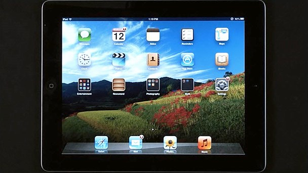

# View Reporting Services Reports on Microsoft Surface Devices and  Apple iOS Devices
  This article describes the [!INCLUDE[ssRSnoversion](../includes/ssrsnoversion-md.md)] features and workflows supported for Microsoft Surface devices, and devices with Apple iOS 6 and Apple Safari such as the iPad.  
  
## View and Interact With Reports  
 Starting with [!INCLUDE[ssSQL11SP1long](../includes/sssql11sp1long-md.md)], [!INCLUDE[ssRSnoversion](../includes/ssrsnoversion-md.md)] supports viewing and basic interactivity with reports on Microsoft Surface devices, and devices with Apple iOS 6 and Apple Safari browser such as the iPad. You can also publish reports using Microsoft Surface devices.  
  
   
Watch a demonstration of viewing reports on an iPad.  
  
 You can also view [!INCLUDE[ssRSnoversion](../includes/ssrsnoversion-md.md)] reports on a Windows Phone 8 device.  
  
 To utilize the features described in this topic, install one of the following:  
  
-   For a native mode report server, install [!INCLUDE[ssSQL11SP1long](../includes/sssql11sp1long-md.md)] or later.  
  
     [!INCLUDE[ssSQL11SP1long](../includes/sssql11sp1long-md.md)] is available for download from the [Microsoft Download Center](https://www.microsoft.com/download/details.aspx?id=35575).  
  
-   For a SharePoint mode report server, install [!INCLUDE[ssSQL11SP1long](../includes/sssql11sp1long-md.md)] or later of the [!INCLUDE[ssRSnoversion](../includes/ssrsnoversion-md.md)] add-in for SharePoint products.  
  
 **To view and interact with a report on an iPad device or Microsoft Surface device**  
  
1.  Make sure that you can connect to the report server or SharePoint site where the report resides.  
  
2.  Open the report by doing one of the following.  
  
    -   **Start from e-mail:** From an e-mail that is created by a [!INCLUDE[ssRSnoversion](../includes/ssrsnoversion-md.md)] subscription, tap the URL of the report. The report will open in the browser.  
  
    -   **Start from Report Server:** Browse the directory on the [!INCLUDE[ssRSnoversion](../includes/ssrsnoversion-md.md)] report server, and then tap the report name to open the report.  
  
    -   **Start from a SharePoint document library:** Browse to a SharePoint document library that contains [!INCLUDE[ssRSnoversion](../includes/ssrsnoversion-md.md)] reports, and then tap the report name. You can view and interact with the report.  
  
        > [!IMPORTANT]  
        >  For the iPad, ensure that the **Private Browsing** property for Safari is turned off.  
  
    -   **SharePoint web part:** If the web part has been added to a SharePoint page, you can view [!INCLUDE[ssRSnoversion](../includes/ssrsnoversion-md.md)] reports.  
  
3.  On your Microsoft Surface device, you can also open the report by using Report Manager. Browse the directory in [!INCLUDE[ssRSnoversion](../includes/ssrsnoversion-md.md)] Report Manager, and then tap the report name to open the report.  
  
    > [!IMPORTANT]  
    >  Viewing reports in Report Manager is not supported on an iPad.  
  
4.  Scroll and zoom by doing the following.  
  
    -   To scroll the report, drag your finger across the screen (up, down, left or right). This is the swipe gesture.  
  
    -   To zoom in, place two fingers on the screen and separate the fingers. To zoom out, place two fingers on the screen and move the fingers together. This is the pinch gesture.  
  
5.  Navigate and interact with the report by doing the following.  
  
    -   Collapse and expand report items, and rows and columns that are associated with groups, by taping the plus (+) sign to collapse and the minus (-) sign to expand.  
  
    -   Toggle between ascending and descending order for rows in a table or for rows and columns in a matrix, by tapping the sort button. The sort button is usually located in the column header.  
  
    -   Expand and collapse the parameter pane, by tapping the arrow button near the top of the report.  
  
    -   Select a parameter value by tapping the box or control next to the parameter. Tap **View Report** to apply the parameter value to the report.  
  
    -   Search the report content by taping the box next to **Find**, typing a search term, and then taping **Find**.  
  
    -   Navigate the report pages by tapping the navigation buttons, or tapping the text box next to the buttons and typing the page number.  
  
    -   Navigate to URLs by taping hyperlinks that have been added to report items such as text boxes, images, charts, and gauges.  
  
    -   Export the report by tapping the icon for the **Export drop down menu** and then tapping a file format.  
  
        -   If you're viewing the report on a Microsoft Surface device, you can export the report to one of the following formats.  
  
            -   XML file with report data  
  
            -   CSV (comma delimited)  
  
            -   PDF  
  
            -   MHTML (web archive)  
  
            -   Excel  
  
            -   TIFF  
  
            -   Word  
  
        -   If you're viewing the report on an iPad, you can export the report as a TIFF or PDF file.  
  
## Authentication  
 RSWindowsNTLM authentication and RSWindowsBasic authentication work with [!INCLUDE[ssRSnoversion](../includes/ssrsnoversion-md.md)] in native mode and the iPad.  
  
 In general, it is recommended that RSWindowsBasic is not used in non-https environments because this type of authentication provides no confidentiality for the transmitted credentials.  
  
 For more information about RSWindowsNTLM and RSWindowsBasic authentication, see [Authentication with the Report Server](security/authentication-with-the-report-server.md).  
  
## Uploading Reports  
 You can publish reports from a Microsoft Surface device using one of the following methods, if you have the appropriate permissions.  
  
> [!IMPORTANT]  
>  These methods are not supported on the iPad.  
  
-   Upload a report definition file (.rdl) to a SharePoint document library by opening the library and tapping **Upload Document**.  
  
-   Upload a report definition file to the report server database by opening Report Manager and tapping **Upload File**.  
  
## Additional Information  
 For more information on [!INCLUDE[ssRSnoversion](../includes/ssrsnoversion-md.md)] and supported browsers, see:  
  
-   [Planning for Reporting Services and Power View Browser Support &#40;Reporting Services 2014&#41;](../../2014/reporting-services/browser-support-for-reporting-services-and-power-view.md)  
  
 For more information on Microsoft Business Intelligence and Mobile devices, see the following:  
  
-   [Overview of mobile devices and SharePoint 2013](https://technet.microsoft.com/library/fp161351\(v=office.15\).aspx) (https://technet.microsoft.com/library/fp161351(v=office.15).aspx).  
  
-   [Supported mobile device browsers in SharePoint 2013](https://technet.microsoft.com/library/fp161353\(v=office.15\).aspx) (https://technet.microsoft.com/library/fp161353(v=office.15).aspx).  
  
-   [Viewing reports and scorecards on Apple iPad devices (SharePoint Server 2010)](https://technet.microsoft.com/library/hh697482.aspx) (https://technet.microsoft.com/library/hh697482.aspx).  
  
-   [Viewing Reporting Services Reports on an iPad (video)](https://technet.microsoft.com/sqlserver/jj873792.aspx) (https://technet.microsoft.com/sqlserver/jj873792.aspx).  
  
-   [Viewing Reporting Services Reports on a Microsoft Surface RT Device (video)](https://technet.microsoft.com/sqlserver/dn146017)  
  
  
