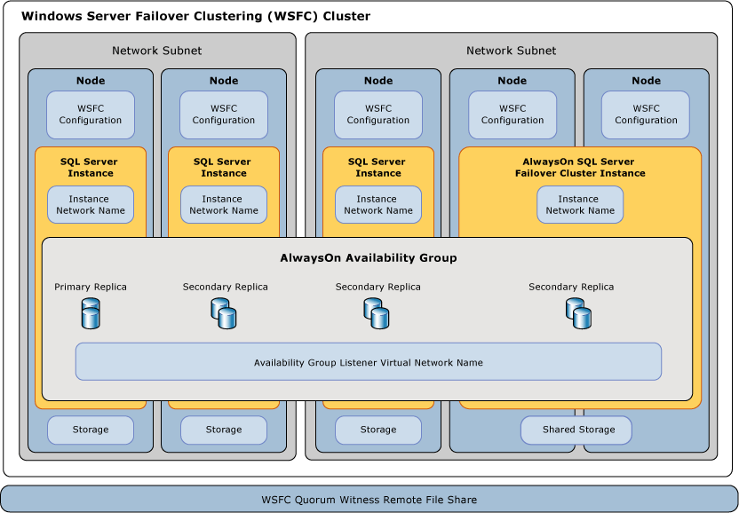

# Windows Server Failover Clustering (WSFC) with SQL Server
  A *Windows Server Failover Clustering* (WSFC) cluster is a group of independent servers that work together to increase the availability of applications and services. [!INCLUDE[ssCurrent](../../../includes/sscurrent-md.md)] takes advantage of WSFC services and capabilities to support [!INCLUDE[ssHADR](../../../includes/sshadr-md.md)] and [!INCLUDE[ssNoVersion](../../../includes/ssnoversion-md.md)] Failover Cluster Instances.  
  
 
  
##   Terms and Definitions  
 WSFC cluster  
 A Windows Server Failover Clustering (WSFC) cluster is a group of independent servers that work together to increase the availability of applications and services.  
  
 Failover cluster instance  
 An instance of a Windows service that manages an IP address resource, a network name resource, and additional resources that are required to run one or more applications or services. Clients can use the network name to access the resources in the group, similar to using a computer name to access the services on a physical server. However, because a failover cluster instance is a group, it can be failed over to another node without affecting the underlying name or address.  
  
 Node  
 A Microsoft Windows Server system that is an active or inactive member of a server cluster.  
  
 Cluster resource  
 A physical or logical entity that can be owned by a node, brought online and taken offline, moved between nodes, and managed as a cluster object. A cluster resource can be owned by only a single node at any point in time.  
  
 Resource group  
 A collection of cluster resources managed as a single cluster object. Typically a resource group contains all of the cluster resources that are required to run a specific application or service. Failover and failback always act on resource groups.  
  
 Resource dependency  
 A resource on which another resource depends. If resource A depends on resource B, then B is a dependency of A.  
  
 Network name resource  
 A logical server name that is managed as a cluster resource. A network name resource must be used with an IP address resource.  
  
 Preferred owner  
 A node on which a resource group prefers to run. Each resource group is associated with a list of preferred owners sorted in order of preference. During automatic failover, the resource group is moved to the next preferred node in the preferred owner list.  
  
 Possible owner  
 A secondary node on which a resource can run. Each resource group is associated with a list of possible owners. Resource groups can fail over only to nodes that are listed as possible owners.  
  
 Quorum mode  
 The quorum configuration in a failover cluster that determines the number of node failures that the cluster can sustain.  
  
 Forced quorum  
 The process to start the cluster even though only a minority of the elements that are required for quorum are in communication.  
  
 For more information, see: [Failover Cluster Glossary](/previous-versions/windows/desktop/MsCS/server-cluster-glossary)  
  
##   Overview of Windows Server Failover Clustering  
 Windows Server Failover Clustering provides infrastructure features that support the high-availability and disaster recovery scenarios of hosted server applications such as Microsoft [!INCLUDE[ssNoVersion](../../../includes/ssnoversion-md.md)] and Microsoft Exchange. If a cluster node or service fails, the services that were hosted on that node can be automatically or manually transferred to another available node in a process known as *failover*.  
  
 The nodes in the WSFC cluster work together to collectively provide these types of capabilities:  
  
-   **Distributed metadata and notifications.** WSFC service and hosted application metadata is maintained on each node in the cluster. This metadata includes WSFC configuration and status in addition to hosted application settings. Changes to a node's metadata or status are automatically propagated to the other nodes in the cluster.  
  
-   **Resource management.** Individual nodes in the cluster may provide physical resources such as direct-attached storage, network interfaces, and access to shared disk storage. Hosted applications register themselves as a cluster resource, and may configure startup and health dependencies upon other resources.  
  
-   **Health monitoring.** Inter-node and primary node health detection is accomplished through a combination of heartbeat-style network communications and resource monitoring. The overall health of the cluster is determined by the votes of a quorum of nodes in the cluster.  
  
-   **Failover coordination.** Each resource is configured to be hosted on a primary node, and each can be automatically or manually transferred to one or more secondary nodes. A health-based failover policy controls automatic transfer of resource ownership between nodes. Nodes and hosted applications are notified when failover occurs so that they may react appropriately.  
  
 For more information, see: [Failover Clusters in Windows Server 2008 R2](https://technet.microsoft.com/library/ff182338\(WS.10\).aspx)  
  
##   SQL Server AlwaysOn Technologies and WSFC  
 [!INCLUDE[ssCurrent](../../../includes/sscurrent-md.md)] *AlwaysOn* is a new high availability and disaster recovery solution that takes advantage of WSFC. AlwaysOn provides an integrated, flexible solution that increases application availability, provides better returns on hardware investments, and simplifies high availability deployment and management.  
  
 Both [!INCLUDE[ssHADR](../../../includes/sshadr-md.md)] and AlwaysOn Failover Cluster Instances use WSFC as a platform technology, registering components as WSFC cluster resources.  Related resources are combined into a *resource group*, which can be made dependent upon other WSFC cluster resources. The WSFC cluster service can then sense and signal the need to restart the [!INCLUDE[ssNoVersion](../../../includes/ssnoversion-md.md)] instance or automatically fail it over to a different server node in the WSFC cluster.  
  
> [!IMPORTANT]  
>  To take full advantage of [!INCLUDE[ssNoVersion](../../../includes/ssnoversion-md.md)] AlwaysOn technologies, you should apply several WSFC-related prerequisites.  
>   
>  For more information, see: [Prerequisites, Restrictions, and Recommendations for AlwaysOn Availability Groups &#40;SQL Server&#41;](../../../database-engine/availability-groups/windows/prereqs-restrictions-recommendations-always-on-availability.md)  
  
### Instance-level High Availability with AlwaysOn Failover Cluster Instances  
 An AlwaysOn *Failover Cluster Instance* (FCI) is a [!INCLUDE[ssNoVersion](../../../includes/ssnoversion-md.md)] instance that is installed across nodes in a WSFC cluster. This type of instance has resource dependencies on shared disk storage (via Fibre Channel or iSCSI SAN) and on a virtual network name. The virtual network name has a resource dependency on one or more virtual IP addresses, each in a different subnet. The SQL Server service and the SQL Server Agent service are registered as resources, and both are made dependent upon the virtual network name resource.  
  
 In the event of a failover, the WSFC service transfers ownership of instance's resources to a designated failover node. The [!INCLUDE[ssNoVersion](../../../includes/ssnoversion-md.md)] instance is then re-started on the failover node, and databases are recovered as usual. At any given moment, only a single node in the cluster can host the FCI and underlying resources.  
  
> [!NOTE]  
>  An AlwaysOn Failover Cluster Instance requires symmetrical shared disk storage such as a storage area network (SAN) or SMB file share.  The shared disk storage volumes must be available to all potential failover nodes in the WSFC cluster.  
  
 For more information, see: [AlwaysOn Failover Cluster Instances](always-on-failover-cluster-instances-sql-server.md)  
  
### Database-level High Availability with [!INCLUDE[ssHADR](../../../includes/sshadr-md.md)]  
 An *availability group* is a set of user databases that fail over together. An availability group consists of a primary *availability replica* and one to four secondary replicas that are maintained through SQL Server log-based data movement for data protection without the need for shared storage. Each replica is hosted by an instance of [!INCLUDE[ssNoVersion](../../../includes/ssnoversion-md.md)] on a different node of the WSFC cluster. The availability group and a corresponding virtual network name are registered as resources in the WSFC cluster.  
  
 An *availability group listener* on the primary replica's node responds to incoming client requests to connect to the virtual network name, and based on attributes in the connection string, it redirects each request to the appropriate [!INCLUDE[ssNoVersion](../../../includes/ssnoversion-md.md)] instance.  
  
 In the event of a failover, instead of transferring ownership of shared physical resources to another node, WSFC is leveraged to reconfigure a secondary replica on another [!INCLUDE[ssNoVersion](../../../includes/ssnoversion-md.md)] instance to become the availability group's primary replica. The availability group's virtual network name resource is then transferred to that instance.  
  
 At any given moment, only a single [!INCLUDE[ssNoVersion](../../../includes/ssnoversion-md.md)] instance may host the primary replica of an availability group's databases, all associated secondary replicas must each reside on a separate instance, and each instance must reside on separate physical nodes.  
  
> [!NOTE]  
>  [!INCLUDE[ssHADR](../../../includes/sshadr-md.md)] do not require deployment of a Failover Cluster Instance or use of symmetric shared storage (SAN or SMB).  
>   
>  A Failover Cluster Instance (FCI) may be used together with an availability group to enhance the availability of an availability replica. However, to prevent potential race conditions in the WSFC cluster, automatic failover of the availability group is not supported to or from an availability replica that is hosted on a FCI.  
  
 For more information, see: [Overview of AlwaysOn Availability Groups &#40;SQL Server&#41;](../../../database-engine/availability-groups/windows/overview-of-always-on-availability-groups-sql-server.md)  
  
##   WSFC Health Monitoring and Failover  
 High availability for an AlwaysOn solution is accomplished though proactive health monitoring of physical and logical WSFC cluster resources, together with automatic failover onto and re-configuration of redundant hardware.  A system administrator can also initiate a *manual failover* of an availability group or [!INCLUDE[ssNoVersion](../../../includes/ssnoversion-md.md)] instance from one node to another.  
  
### Failover Policies for Nodes, Failover Cluster Instances, and Availability Groups  
 A *failover policy* is configured at the WSFC cluster node, the [!INCLUDE[ssNoVersion](../../../includes/ssnoversion-md.md)] Failover Cluster Instance (FCI), and the availability group levels.  These policies, based on the severity, duration, and frequency of unhealthy cluster resource status and node responsiveness, can trigger a service restart or an *automatic failover* of cluster resources from one node to another, or can trigger the move of an availability group primary replica from one [!INCLUDE[ssNoVersion](../../../includes/ssnoversion-md.md)] instance to another.  
  
 Failover of an availability group replica does not affect the underlying [!INCLUDE[ssNoVersion](../../../includes/ssnoversion-md.md)] instance.  Failover of a FCI moves the hosted availability group replicas with the instance.  
  
 For more information, see: [Failover Policy for Failover Cluster Instances](failover-policy-for-failover-cluster-instances.md)  
  
### WSFC Resource Health Detection  
 Each resource in a WSFC cluster node can report its status and health, periodically or on-demand. A variety of circumstances may indicate resource failure; e.g. power failure, disk or memory errors, network communication errors, or non-responsive services.  
  
 WSFC cluster resources such as networks, storage, or services can be made dependent upon one another. The cumulative health of a resource is determined by successively rolling up its health with the health of each of its resource dependencies.  
  
### WSFC Inter-node Health Detection and Quorum Voting  
 Each node in a WSFC cluster participates in periodic heartbeat communication to share the node's health status with the other nodes. Unresponsive nodes are considered to be in a failed state.  
  
 A *quorum* node set is a majority of the voting nodes and witnesses in the WSFC cluster. The overall health and status of a WSFC cluster is determined by a periodic *quorum vote*. The presence of a quorum means that the cluster is healthy and able to provide node-level fault tolerance.  
  
 A *quorum mode* is configured at the WSFC cluster level that dictates the methodology used for quorum voting and when to perform an automatic failover or take the cluster offline.  
  
> [!TIP]  
>  It is best practice to always have an odd number of quorum votes in a WSFC cluster.  For the purposes of quorum voting, [!INCLUDE[ssNoVersion](../../../includes/ssnoversion-md.md)] does not have to be installed on all nodes in the cluster. An additional server can act as a quorum member, or the WSFC quorum model can be configured to use a remote file share as a tie-breaker.  
>   
>  For more information, see: [WSFC Quorum Modes and Voting Configuration &#40;SQL Server&#41;](wsfc-quorum-modes-and-voting-configuration-sql-server.md)  
  
### Disaster Recovery Through Forced Quorum  
 Depending upon operational practices and WSFC cluster configuration, you can incur both automatic and manual failovers, and still maintain a robust, fault-tolerant [!INCLUDE[ssNoVersion](../../../includes/ssnoversion-md.md)] AlwaysOn solution. However, if a quorum of the eligible voting nodes in the WSFC cluster cannot communicate with one another, or if the WSFC cluster otherwise fails health validation, then the WSFC cluster may go offline.  
  
 If the WSFC cluster goes offline because of an unplanned disaster, or due to a persistent hardware or communications failure, then manual administrative intervention is required to *force a quorum* and bring the surviving cluster nodes back online in a non-fault-tolerant configuration.  
  
 Afterwards, a series of steps must also be taken to reconfigure the WSFC cluster, recover the affected database replicas, and to re-establish a new quorum.  
  
 For more information, see: [WSFC Disaster Recovery through Forced Quorum &#40;SQL Server&#41;](wsfc-disaster-recovery-through-forced-quorum-sql-server.md)  
  
##   Relationship of SQL Server AlwaysOn Components to WSFC  
 Several layers of relationships exist between [!INCLUDE[ssNoVersion](../../../includes/ssnoversion-md.md)] AlwaysOn and WSFC features and components.  
  
 AlwaysOn availability groups are hosted on [!INCLUDE[ssNoVersion](../../../includes/ssnoversion-md.md)] instances.  
 A client request that specifies a logical availability group listener network name to connect to a primary or secondary database is redirected to the appropriate instance network name of the underlying [!INCLUDE[ssNoVersion](../../../includes/ssnoversion-md.md)] instance or [!INCLUDE[ssNoVersion](../../../includes/ssnoversion-md.md)] Failover Cluster Instance (FCI).  
  
 SQL Server instances are actively hosted on a single node.  
 If present, a stand-alone [!INCLUDE[ssNoVersion](../../../includes/ssnoversion-md.md)] Instance always resides on a single Node with a static instance network name.  If present, a [!INCLUDE[ssNoVersion](../../../includes/ssnoversion-md.md)] FCI is active on one of two or more possible failover nodes with a single virtual Instance Network Name.  
  
 Nodes are members of a WSFC cluster.  
 WSFC configuration metadata and status for all nodes is stored on each node. Each server may provide asymmetric storage or shared storage (SAN) volumes for user or system databases. Each server has at least one physical network interface on one or more IP subnets.  
  
 The WSFC service monitors health and manages configuration for a group of servers.  
 The Windows Server Failover Cluster (WSFC) service propagates changes to WSFC Configuration metadata and status to all nodes in the cluster. Partial metadata and status may be stored on a WSFC quorum-witness remote file share. Two or more active nodes or witnesses constitute a quorum to vote on the health of the WSFC cluster.  
  
 [!INCLUDE[ssHADR](../../../includes/sshadr-md.md)] registry keys are subkeys of the WSFC cluster.  
 If you delete and re-create a WSFC cluster, you must disable and re-enable the [!INCLUDE[ssHADR](../../../includes/sshadr-md.md)] feature on each server instance that was enabled for [!INCLUDE[ssHADR](../../../includes/sshadr-md.md)] on the original WSFC cluster. For more information, see [Enable and Disable AlwaysOn Availability Groups &#40;SQL Server&#41;](../../../database-engine/availability-groups/windows/enable-and-disable-always-on-availability-groups-sql-server.md).  
  
   
  
##   Related Tasks  
  
-   [View Cluster Quorum NodeWeight Settings](view-cluster-quorum-nodeweight-settings.md)  
  
-   [Configure Cluster Quorum NodeWeight Settings](configure-cluster-quorum-nodeweight-settings.md)  
  
-   [Force a WSFC Cluster to Start Without a Quorum](force-a-wsfc-cluster-to-start-without-a-quorum.md)  
  
##   Related Content  
  
-   [Windows Server Technologies:  Failover Clusters](https://technet.microsoft.com/library/cc732488\(v=WS.10\).aspx)  
  
-   [Failover Clusters in Windows Server 2008 R2](https://technet.microsoft.com/library/ff182338\(WS.10\).aspx)  
  
-   [View Events and Logs for a Failover Cluster](https://technet.microsoft.com/library/cc772342\(WS.10\).aspx)  
  
-   [Get-ClusterLog Failover Cluster Cmdlet](https://technet.microsoft.com/library/ee461045.aspx)  
  
## See Also  
 [AlwaysOn Failover Cluster Instances (SQL Server)](always-on-failover-cluster-instances-sql-server.md)   
 [Overview of AlwaysOn Availability Groups &#40;SQL Server&#41;](../../../database-engine/availability-groups/windows/overview-of-always-on-availability-groups-sql-server.md)   
 [WSFC Quorum Modes and Voting Configuration &#40;SQL Server&#41;](wsfc-quorum-modes-and-voting-configuration-sql-server.md)   
 [Failover Policy for Failover Cluster Instances](failover-policy-for-failover-cluster-instances.md)   
 [WSFC Disaster Recovery through Forced Quorum &#40;SQL Server&#41;](wsfc-disaster-recovery-through-forced-quorum-sql-server.md)  
  
  
