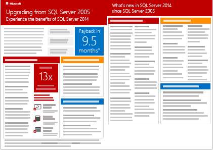
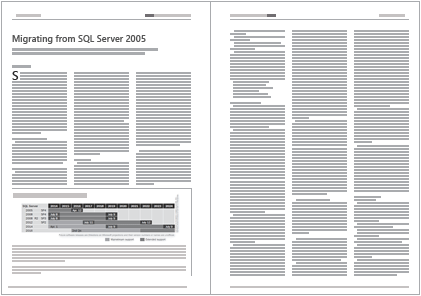

# Are you upgrading from SQL Server 2005?
  The end of extended support for SQL Server 2005 is one reason to upgrade now to a newer version of SQL Server and to Azure SQL Database. Upgrading enables you to maintain security and compliance, achieve breakthrough performance, and optimize your data platform infrastructure.  
  
 For more info, guidance, and tools to plan and automate your upgrade or migration, see [SQL Server 2005 end of support](https://www.microsoft.com/en-us/server-cloud/products/sql-server-2005/).  
  
## Why upgrade?  
  
> [!IMPORTANT]  
>  Extended support for SQL Server 2005 ends on April 12, 2016. If you're still running SQL Server 2005 after April 12, 2016, you'll no longer receive security updates.  
  
 To get the data sheet in PDF format about upgrading from SQL Server 2005, [click here](https://info.microsoft.com/rs/157-GQE-382/images/EN-CNTNT-Infographic-UpgradeSQL2005Datasheet.pdf) (not on the thumbnail image below).  
  
   
  
## Choose your upgrade option  
 If you're upgrading relational databases from SQL Server 2005, here are your options for relational storage on the Microsoft platform.  
  
 To see a more comprehensive analysis of these options, [click here](http://sql05upgrade.azurewebsites.net/).  
  
|Relational storage option|Benefits|Other factors to consider|  
|-------------------------------|--------------|-------------------------------|  
|**SQL Server on premises**   Consider this option for database applications of any kind, from transactional systems to data warehouses.   For more info, see [SQL Server 2014](https://www.microsoft.com/EN-US/server-cloud/products/sql-server/).|You have the most control over features and scalability because you manage both hardware and software.   If you're upgrading from SQL Server 2005, this is the most similar environment.|You have to make the biggest up-front investment and provide the most ongoing management, because you have to buy, maintain, and manage your own hardware and software.|  
|**SQL Server hosted on Azure virtual machines**   Consider this option if you want the following things. -Benefits of migrating to a hosted environment. -Control over the operating environment. -Familiar feature set of SQL Server.   For more info, see [SQL Server on Azure Virtual Machines overview](https://azure.microsoft.com/documentation/articles/virtual-machines-sql-server-infrastructure-services/).   For info about migrating, see [Migrate a database to SQL Server on an Azure VM](https://azure.microsoft.com/documentation/articles/virtual-machines-migrate-onpremises-database/).|You can deploy quickly from a library of virtual machine images.   You get the full SQL Server feature set.   You save the cost of hardware and of server software. You pay only for hourly usage.|You have to configure and manage both the SQL Server and the operating system software.|  
|**Azure SQL Database hosted database service**   Consider this option if you want a lower-cost solution with less maintenance.   This option is particularly well suited for apps that don't require the same capacity at all times, or that have to provide external access.   For more info, see [SQL Database](https://azure.microsoft.com/services/sql-database/).   For info about migrating, see [Migrating a SQL Server database to Azure SQL Database](https://azure.microsoft.com/documentation/articles/sql-database-cloud-migrate/).|You can deploy quickly and scale up easily.   You pay only for hourly usage.   The cost of the service includes not only storage, but high availability and automated backups.|Azure SQL Database lacks some SQL Server features that are not applicable in a hosted cloud environment. For more info, see [Azure SQL Database Transact-SQL information](https://azure.microsoft.com/documentation/articles/sql-database-transact-sql-information/).   Azure SQL Database also has a maximum database size of 500 GB, compared to 524 PB for SQL Server.|  
  
 You may also want to consider a non-relational or NoSQL solution for certain data and applications.  
  
|Non-relational solution|Benefits|  
|------------------------------|--------------|  
|**Azure DocumentDB**   Consider this option for modern, scalable, mobile and web applications that use JSON data and require a combination of robust querying and transactional data processing.   For more info, see [DocumentDB](https://azure.microsoft.com/en-us/services/documentdb/).|Your documents are indexed and you can use familiar SQL syntax to query them.   The database is schema-free.   You can add properties to documents without having to rebuild indexes.   You get JSON and JavaScript support right inside the database engine.   You get native support for geospatial data and integration with other Azure Services including Azure Search, HDInsight, and Data Factory.   You get low latency, high performance storage with reserved throughput levels.|  
|**Azure table storage**   Consider this option to store petabytes of semi-structured data in a cost-effective solution.   For more info, see [Table Storage](https://azure.microsoft.com/services/storage/tables/).|You can evolve your apps and your table schema without taking the data offline.   You can scale up without sharding your dataset.   You get geo-redundant storage that replicates data across multiple regions.|  
  
 To download the report "Migrating from SQL Server 2005" by Directions on Microsoft, which contains more details about the upgrade options, [click here](https://info.microsoft.com/CO-SQL-CNTNT-FY16-09Sep-14-ModernizationDirOnMFST-Register.html) (not on the thumbnail image below).  
  
   
  
## Plan your upgrade  
  
-   Read about how to plan your upgrade in the following series of blog posts from the SQL Server team.  
  
    -   [Planning an efficient upgrade from SQL Server 2005: Step 1 of 3](http://blogs.technet.com/b/dataplatforminsider/archive/2015/12/10/planning-an-efficient-upgrade-from-sql-server-2005-step-1-of-3.aspx)  
  
    -   [Planning an efficient upgrade from SQL Server 2005: Step 2 of 3](http://blogs.technet.com/b/dataplatforminsider/archive/2015/12/15/planning-an-efficient-upgrade-from-sql-server-2005-step-2-of-3.aspx)  
  
    -   [Planning an efficient upgrade from SQL Server 2005: Step 3 of 3](http://blogs.technet.com/b/dataplatforminsider/archive/2015/12/17/planning-an-efficient-upgrade-from-sql-server-2005-step-3-of-3.aspx)  
  
-   Review the requirements and considerations under [Planning a SQL Server Installation](../../../2014/sql-server/install/planning-a-sql-server-installation.md), including the [Hardware and Software Requirements for Installing SQL Server 2014](hardware-and-software-requirements-for-installing-sql-server.md).  
  
-   Read about how to upgrade.  
  
    -   Review the available upgrade methods and learn how to plan and test in the topic [Upgrade Database Engine](../../database-engine/install-windows/upgrade-database-engine.md).  
  
        > [!IMPORTANT]  
        >  You can't upgrade a SQL Server 2005 server to a SQL Server 2014 server in place. You have to install SQL Server 2014, then migrate your SQL Server 2005 databases to the new installation.  
  
    -   To get the more detailed "Technical Upgrade Guide"  in PDF format, [click here](https://download.microsoft.com/download/7/1/5/715BDFA7-51B6-4D7B-AF17-61E78C7E538F/SQL_Server_2014_Upgrade_technical_guide.pdf).  
  
-   For more info, guidance, and tools to plan and automate your upgrade or migration, see [SQL Server 2005 end of support](https://www.microsoft.com/en-us/server-cloud/products/sql-server-2005/).  
  
## Get SQL Server 2014  
 To download an evaluation copy of SQL Server 2014, [click here](https://www.microsoft.com/en-us/evalcenter/evaluate-sql-server-2014).  
  
## See Also  
 [SQL Server 2014](https://www.microsoft.com/en-us/server-cloud/products/sql-server/default.aspx)   
 [SQL Server 2005 end of support](https://www.microsoft.com/en-us/server-cloud/products/sql-server-2005/)   
 [Upgrade from SQL Server 2005 to SQL Server 2016](https://msdn.microsoft.com/library/mt168847.aspx)  
  
  
