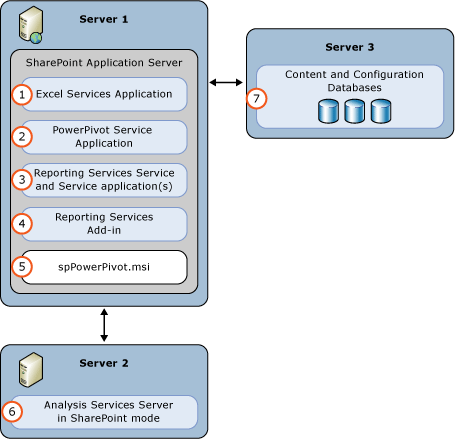
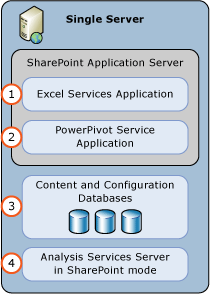
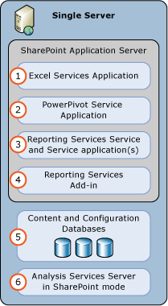
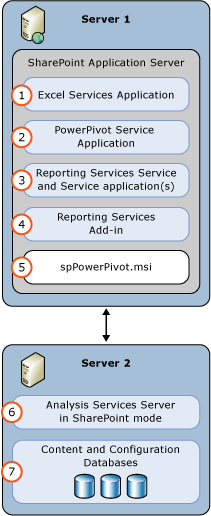
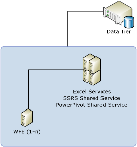
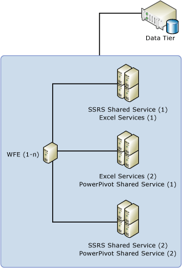

# Deployment Topologies for SQL Server BI Features in SharePoint
  This topic describes common topologies for installing the SQL Server Business Intelligence features [!INCLUDE[ssRSnoversion](../../includes/ssrsnoversion-md.md)] and [!INCLUDE[ssGeminiShortvnext](../../includes/ssgeminishortvnext-md.md)] in SharePoint 2010 and SharePoint 2013 environments. For example single server and three tier installations.  
  
||  
|-|  
|**[!INCLUDE[applies](../../includes/applies-md.md)]**  SharePoint 2013 &#124; SharePoint 2010|  
  
 **In this topic:**  
  
-   [SharePoint 2013 Example Deployment Topologies](#bkmk_example_deployments_2013)  
  
    -   [PowerPivot for SharePoint 2013 and Reporting Services Three Server Deployment](#bkmk_bi_Sharepoint2013_3tier)  
  
    -   [PowerPivot for SharePoint 2013 Single Server Deployment](#bkmk_powerpivot_sharepoint2013_1server)  
  
    -   [PowerPivot for SharePoint 2013 Two Server Deployment](#bkmk_powerpivot_sharepoint2013_2server)  
  
    -   [PowerPivot for SharePoint 2013 Three Server Deployment](#bkmk_powerpivot_sharepoint2013_3server)  
  
    -   [PowerPivot for SharePoint 2013 and Reporting Services Single Server Deployment](#bkmk_powerpivot_ssrs_sharepoint2013_1server)  
  
    -   [PowerPivot for SharePoint 2013 and Reporting Services Two Server Deployment](#bkmk_powerpivot_ssrs_sharepoint2013_2server)  
  
-   [SharePoint 2010 Example Deployment Topologies](#bkmk_example_deployments_2010)  
  
    -   [Single Server Deployments](#bkmk_sharepoint2010_1server)  
  
    -   [Two-Tier Deployment](#bkmk_sharepoint2010_2server)  
  
    -   [Three-Tier Deployment](#bkmk_sharepoint2010_3server)  
  
    -   [Three-Tier Scale-Out Deployment](#bkmk_sharepoint2010_scaleserver)  
  
##   SharePoint 2013 Example Deployment Topologies  
 The SQL Server setup option **PowerPivot for SharePoint** has no dependencies on SharePoint. It does not use the SharePoint object model or interfaces to support integration. Therefore, [!INCLUDE[ssASnoversion](../../includes/ssasnoversion-md.md)] can be installed on any computer running Windows Server 2008 R2 or later version. It can be but does not have to be an application server in a SharePoint farm. One of the configuration steps is to point Excel Services to the server running [!INCLUDE[ssASnoversion](../../includes/ssasnoversion-md.md)]. For load balancing and fault tolerance, it is recommended to install and register multiple [!INCLUDE[ssASnoversion](../../includes/ssasnoversion-md.md)] servers running in SharePoint mode.  
  
 **[!INCLUDE[ssRSnoversion](../../includes/ssrsnoversion-md.md)] SharePoint mode** requires SharePoint server 2013 and utilizes the SharePoint Service Application architecture.  
  
 The following sections illustrate typical deployment topologies:  
  
###   PowerPivot for SharePoint 2013 and Reporting Services Three Server Deployment  
 In the following three-server deployment, the SQL Server Database Engine, [!INCLUDE[ssASnoversion](../../includes/ssasnoversion-md.md)] server running in SharePoint mode, and SharePoint, each run on a separate server. The [!INCLUDE[ssGeminiShortvnext](../../includes/ssgeminishortvnext-md.md)] 2013 installer package (**spPowerPivot.msi**) must be run on the SharePoint server.  
  
   
  
|||  
|-|-|  
|**(1)**|Excel Service Application. The service application is created as part of the SharePoint installation.|  
|**(2)**|[!INCLUDE[ssGemini](../../includes/ssgemini-md.md)] Service Application. Default name is **Default PowerPivot Service Application**.|  
|**(3)**|[!INCLUDE[ssRSnoversion](../../includes/ssrsnoversion-md.md)] service application.|  
|**(4)**|Install the reporting services add-in for SharePoint from either the [!INCLUDE[ssCurrent](../../includes/sscurrent-md.md)] installation media or the [!INCLUDE[ssCurrent](../../includes/sscurrent-md.md)] feature pack.|  
|**(5)**|Run the **spPowerPivot.msi** to install data providers, the [!INCLUDE[ssGemini](../../includes/ssgemini-md.md)] configuration tool, [!INCLUDE[ssGemini](../../includes/ssgemini-md.md)] Gallery, and schedule data refresh.|  
|**(6)**|[!INCLUDE[ssASnoversion](../../includes/ssasnoversion-md.md)] Server in SharePoint Mode. Configure the Excel Services Application **Data Model Settings** to use this server.|  
|**(7)**|The SharePoint content, configuration, and service application databases.|  
  
  [Submit feedback and contact information through Microsoft SQL Server Connect](https://connect.microsoft.com/SQLServer/Feedback) (https://connect.microsoft.com/SQLServer/Feedback).  
  
###   PowerPivot for SharePoint 2013 Single Server Deployment  
 A single server deployment is useful for testing purposes but it is not recommended for production deployments.  
  
 The following diagram illustrates the components that are part of a single server [!INCLUDE[ssASnoversion](../../includes/ssasnoversion-md.md)] deployment.  
  
   
  
|||  
|-|-|  
|**(1)**|Excel Service Application. The service application is created as part of the SharePoint installation.|  
|**(2)**|[!INCLUDE[ssGemini](../../includes/ssgemini-md.md)] Service Application. Default name is **Default PowerPivot Service Application**.|  
|**(3)**|The SharePoint content, configuration, and service application databases.|  
|**(4)**|An [!INCLUDE[ssASnoversion](../../includes/ssasnoversion-md.md)] Server in SharePoint Mode. Configure the Excel Services Application **Data Model Settings** to use this server.|  
  
###   PowerPivot for SharePoint 2013 Two Server Deployment  
 In the following two-server deployment, the SQL Server Database Engine and [!INCLUDE[ssASnoversion](../../includes/ssasnoversion-md.md)] in SharePoint mode run on a separate server than SharePoint. For SharePoint 2013, the [!INCLUDE[ssGeminiLongvnext](../../includes/ssgeminilongvnext-md.md)] installer package (**spPowerPivot.msi**) is installed on the SharePoint server.  
  
 [!INCLUDE[ssGeminiShortvnext](../../includes/ssgeminishortvnext-md.md)] extends SharePoint Server 2013 to add server-side data refresh processing, data providers, [!INCLUDE[ssGemini](../../includes/ssgemini-md.md)] Gallery, and management support for [!INCLUDE[ssGemini](../../includes/ssgemini-md.md)] workbooks and Excel workbooks with advanced data models.  
  
 The installer package is available as part of the [!INCLUDE[ssSQL14](../../includes/sssql14-md.md)] feature pack. The feature pack can be downloaded from the [!INCLUDE[msCoName](../../includes/msconame-md.md)] download center at [Microsoft® SQL Server® 2014 PowerPivot® for Microsoft® SharePoint®](https://go.microsoft.com/fwlink/?LinkID=296473) ( HYPERLINK "<https://go.microsoft.com/fwlink/?LinkID=296473>" \t "_blank" <https://go.microsoft.com/fwlink/?LinkID=296473>).  
  
   
  
|||  
|-|-|  
|**(1)**|Excel Service Application. The service application is created as part of the SharePoint installation.|  
|**(2)**|[!INCLUDE[ssGemini](../../includes/ssgemini-md.md)] Service Application. Default name is **Default PowerPivot Service Application**.|  
|**(3)**|RUN the **spPowerPivot.msi** to install data providers, the [!INCLUDE[ssGemini](../../includes/ssgemini-md.md)] configuration tool, [!INCLUDE[ssGemini](../../includes/ssgemini-md.md)] Gallery, and schedule data refresh.|  
|**(4)**|An [!INCLUDE[ssASnoversion](../../includes/ssasnoversion-md.md)] Server in SharePoint Mode. Configure the Excel Services Application **Data Model Settings** to use this server.|  
|**(5)**|The SharePoint content, configuration, and service application databases.|  
  
###   PowerPivot for SharePoint 2013 Three Server Deployment  
 In the following three-server deployment, the SQL Server Database Engine, [!INCLUDE[ssASnoversion](../../includes/ssasnoversion-md.md)] server running in SharePoint mode, and SharePoint, each run on a separate server. The [!INCLUDE[ssGeminiShort](../../includes/ssgeminishort-md.md)] 2013 installer package (spPowerPivot.msi) must be installed on the SharePoint server.  
  
   
  
|||  
|-|-|  
|**(1)**|Excel Service Application. The service application is created as part of the SharePoint installation.|  
|**(2)**|[!INCLUDE[ssGemini](../../includes/ssgemini-md.md)] Service Application. Default name is **Default PowerPivot Service Application**.|  
|**(3)**|RUN the spPowerPivot.msi to install data providers, the [!INCLUDE[ssGemini](../../includes/ssgemini-md.md)] configuration tool, [!INCLUDE[ssGemini](../../includes/ssgemini-md.md)] Gallery, and schedule data refresh.|  
|**(4)**|An [!INCLUDE[ssASnoversion](../../includes/ssasnoversion-md.md)] Server in SharePoint Mode. Configure the Excel Services Application **Data Model Settings** to use this server.|  
|**(5)**|The SharePoint content, configuration, and service application databases.|  
  
###   PowerPivot for SharePoint 2013 and Reporting Services Single Server Deployment  
 A single server deployment is useful for testing purposes but it is not recommended for production deployments.  
  
   
  
|||  
|-|-|  
|**(1)**|Excel Service Application. The service application is created as part of the SharePoint installation.|  
|**(2)**|PowerPivot Service Application. Default name is **Default PowerPivot Service Application**.|  
|**(3)**|[!INCLUDE[ssRSnoversion](../../includes/ssrsnoversion-md.md)] service application.|  
|**(4)**|Install the reporting services add-in for SharePoint from either the [!INCLUDE[ssCurrent](../../includes/sscurrent-md.md)] installation media or the [!INCLUDE[ssCurrent](../../includes/sscurrent-md.md)] feature pack.|  
|**(5)**|The SharePoint content, configuration, and service application databases.|  
|**(6)**|[!INCLUDE[ssASnoversion](../../includes/ssasnoversion-md.md)] Server in SharePoint Mode. Configure the Excel Services Application **Data Model Settings** to use this server.|  
  
###   PowerPivot for SharePoint 2013 and Reporting Services Two Server Deployment  
 In the following two-server deployment, the SQL Server Database Engine and Analysis Services server running in SharePoint mode run on a separate server from SharePoint. The PowerPivot for SharePoint 2013 installer package **(spPowerPivot.msi)** must be run on the SharePoint server.  
  
   
  
|||  
|-|-|  
|**(1)**|Excel Service Application. The service application is created as part of the SharePoint installation.|  
|**(2)**|PowerPivot Service Application. Default name is **Default PowerPivot Service Application**.|  
|**(3)**|[!INCLUDE[ssRSnoversion](../../includes/ssrsnoversion-md.md)] service application.|  
|**(4)**|Install the reporting services add-in for SharePoint from either the [!INCLUDE[ssCurrent](../../includes/sscurrent-md.md)] installation media or the [!INCLUDE[ssCurrent](../../includes/sscurrent-md.md)] feature pack.|  
|**(5)**|RUN the **spPowerPivot.msi** to install data providers, the PowerPivot configuration tool, PowerPivot Gallery, and schedule data refresh.|  
|**(6)**|[!INCLUDE[ssASnoversion](../../includes/ssasnoversion-md.md)] Server in SharePoint Mode. Configure the Excel Services Application **Data Model Settings** to use this server.|  
|**(7)**|The SharePoint content, configuration, and service application databases.|  
  
##   SharePoint 2010 Example Deployment Topologies  
 The following diagram shows which services and providers run on each tier. Notice that the diagram includes several built-in services; these services are required for some SQL Server BI scenarios. Excel Services, Secure Store Services, and the Claims to Windows Token Service are either required by or recommended for a PowerPivot for SharePoint or Reporting Services deployment in SharePoint. Additionally, the MSOLAP OLE DB providers and ADO.NET Services are required for some PowerPivot data access scenarios. Optionally, you can install Analysis Services on the data tier, if you want to build [!INCLUDE[ssCrescent](../../includes/sscrescent-md.md)] reports based on tabular model databases that are hosted outside of SharePoint.  
  
   
  
##   Single Server Deployments  
 You can install all server components, including the data tier, on a single computer. This deployment configuration is useful if you are evaluating the software or developing custom applications that include Reporting Services in SharePoint mode. This deployment is the simplest to configure. Because all the components are installed on the same computer, it also uses the least amount of licenses. [!INCLUDE[ssRSnoversion](../../includes/ssrsnoversion-md.md)], [!INCLUDE[ssGeminiShort](../../includes/ssgeminishort-md.md)], and the [!INCLUDE[ssDE](../../includes/ssde-md.md)] are installed as a single licensed copy of [!INCLUDE[ssNoVersion](../../includes/ssnoversion-md.md)].  
  
 To install all features on a single server, you install [!INCLUDE[ssRSnoversion](../../includes/ssrsnoversion-md.md)] and [!INCLUDE[ssGeminiShort](../../includes/ssgeminishort-md.md)] sequentially, on the same physical server. For instructions on a standalone server configuration, see [Deployment Checklist: Reporting Services, Power View, and PowerPivot for SharePoint](deployment-checklist-reporting-services-power-view-power-pivot-for-sharepoint.md).  
  
##   Two-Tier Deployment  
 A two-tier deployment is typically SharePoint Server 2010 on one computer and the SQL Server Database Engine on the second computer. Moving the data tier to a dedicated server is the most common configuration for a 2-computer farm. In a two-tier farm, you install both [!INCLUDE[ssRSnoversion](../../includes/ssrsnoversion-md.md)] and [!INCLUDE[ssGeminiShort](../../includes/ssgeminishort-md.md)] on the SharePoint server. All web services on the front-end and shared services in the application tier run on the same physical server. Installation steps for a 2-tier deployment are very similar to a standalone deployment, in that you install [!INCLUDE[ssRSnoversion](../../includes/ssrsnoversion-md.md)] and [!INCLUDE[ssGeminiShort](../../includes/ssgeminishort-md.md)] sequentially, on the same physical server.  
  
##   Three-Tier Deployment  
 A three-tier deployment typically separates web front-end services from processing or memory-intensive applications. On this topology, you install [!INCLUDE[ssRSnoversion](../../includes/ssrsnoversion-md.md)] and [!INCLUDE[ssGeminiShort](../../includes/ssgeminishort-md.md)] on just the application server. Web services that run on the web front-end are installed via solutions that are deployed to applications in the farm, during server configuration, as a post-installation task. The following diagram illustrates a 3-tier deployment.  
  
   
  
##   Three-Tier Scale-Out Deployment  
 This topology illustrates a scale-out deployment that runs the same shared service on multiple servers, servicing a larger volume of requests and providing greater processing power for PowerPivot data or Reporting Services reports. In the diagram below, there are three application server clusters, each running a different combination of shared services. In a SharePoint environment, service discovery and availability is built into the farm. Load balancing across multiple physical servers running the same shared service application is part of the shared service architecture.  
  
 When deploying a multi-server farm, be sure to follow the instructions in this SharePoint article: [Multiple Servers for a three-tier farm (SharePoint Server 2010)](https://go.microsoft.com/fwlink/?linkID=219834).  
  
   
  
## See Also  
 [Reporting Services SharePoint Mode Installation &#40;SharePoint 2010 and SharePoint 2013&#41;](../../reporting-services/install-windows/install-reporting-services-sharepoint-mode.md)   
 [PowerPivot for SharePoint 2013 Installation](../../analysis-services/instances/install-windows/install-analysis-services-in-power-pivot-mode.md)   
 [PowerPivot for SharePoint 2010 Installation](../../../2014/sql-server/install/powerpivot-for-sharepoint-2010-installation.md)  
  
  
