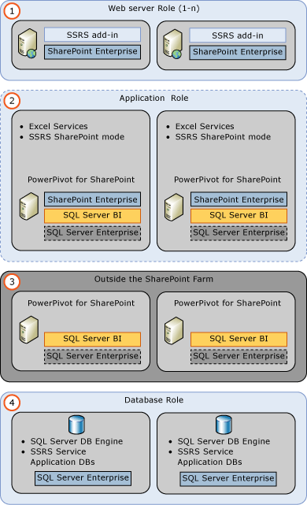
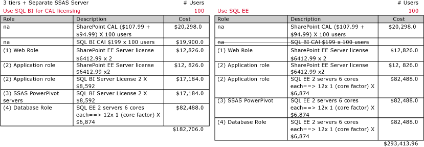
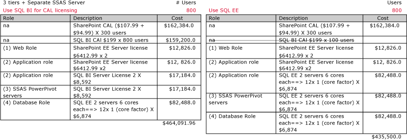
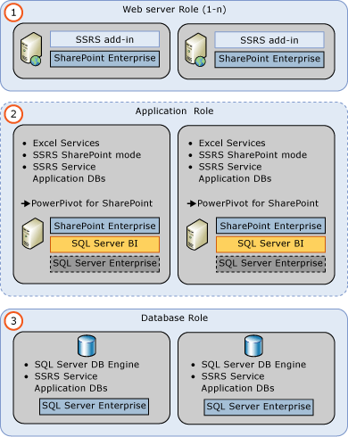
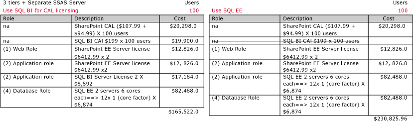
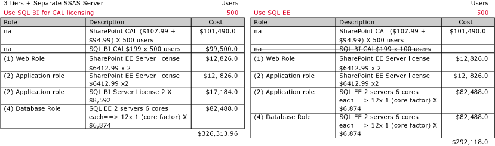
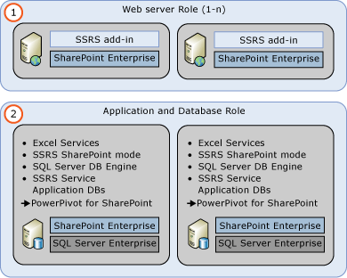
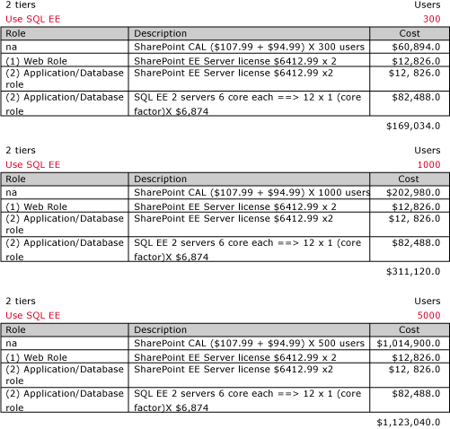

# Example License Topologies and Costs for SQL Server 2014 Self-Service Business Intelligence

This topic illustrates high-level considerations for selecting the [!INCLUDE[ssNoVersion](../../includes/ssnoversion-md.md)] Business Intelligence edition or the [!INCLUDE[ssNoVersion](../../includes/ssnoversion-md.md)] Enterprise edition. The topic includes several sample on-premises Microsoft self-service Business Intelligence (BI) topologies. The examples include the editions and licenses you can utilize to optimize the balance between cost and performance. The topologies, number of servers and, licensing cost are provided **only as examples**. Microsoft [!INCLUDE[ssSQL11](../../includes/sssql11-md.md)] and Microsoft SharePoint 2013 introduced several changes in licensing that provide more options in how you can license your servers, users, and devices. [!INCLUDE[ssCurrent](../../includes/sscurrent-md.md)] Licensing supports the same Business Intelligence related scenarios.  
  
[!INCLUDE[ssCurrent](../../includes/sscurrent-md.md)] is available in the Business Intelligence edition and offers per core licensing for some editions of [!INCLUDE[ssNoVersion](../../includes/ssnoversion-md.md)].  
  
 **In this topic:**  
  
- [SQL Server Business Intelligence components](#bkmk_bi_components)
  
- [SQL Server 2014 Licensing Summary](#bkmk_sql_server_license)
  
- [SharePoint 2013 Licensing Summary](#bkmk_sharepoint_license)  
  
- [3 Tier Topology with Separate PowerPivot Servers](#bkmk_3tier_powerpivot)
  
- [3 Tier Topology](#bkmk_3tier)
  
- [2 Tier Topology](#bkmk_2tier)
  
- [Reference and community content](#bkmk_reference)
  
##   SQL Server Business Intelligence components

This topic focuses on SQL Server and SharePoint server technologies. The costs and examples do not specifically illustrate Microsoft Windows Server or Microsoft Office components you require for a full client and server solution. The SQL Server Business Intelligence components covered in this topic are SQL Server Reporting Services running in SharePoint mode and PowerPivot for SharePoint. The components include the following features:  
  
- Interactive PowerPivot workbooks in the browser.  
  
- Interactive [!INCLUDE[ssCrescent](../../includes/sscrescent-md.md)] reports in SharePoint.  
  
- [!INCLUDE[ssGemini](../../includes/ssgemini-md.md)] Gallery, Schedule Data refresh, Management Dashboard.  
  
- Reporting Services in SharePoint mode, including Data Alerts.  
  
 For more information, see the table of features in [Install SQL Server BI Features with SharePoint &#40;PowerPivot and Reporting Services&#41;](../../../2014/sql-server/install/install-sql-server-bi-features-sharepoint-powerpivot-reporting-services.md).  
  
## License Summary

 This section summarizes licensing requirements for SQL Server and SharePoint. The information is a high-level summary and only covers the scenarios used in the topology diagrams and cost examples in this document. Review as noted the content links for more detailed license details. Example prices are based on Microsoft Open License Program (MOLP) prices.  
  
 A common practice is to use the **Enterprise Edition** for servers that run SQL Server Database Engine and the **Business Intelligence Edition** for servers that run Reporting Services or PowerPivot for SharePoint. However, the **number of users** and **number of server cores** in your deployment affect cost and your decision on what edition to use.  
  
###   SQL Server 2014 Licensing Summary  
  
- The SQL Server Enterprise Edition uses core based licensing. Core-based licenses are sold in **two-core** packs.  
  
- The SQL Server BI edition uses both Server licenses and Client Access Licenses (CAL).  
  
- CAL licenses are based on each user or device connected to [!INCLUDE[ssNoVersion](../../includes/ssnoversion-md.md)], regardless of the number of the servers they connect to.  
  
- Core licensing requires all the cores in the server to be covered by a license. There is a minimum of **four** core licenses required for each physical processor in the server.  
  
 The following table summarizes the license details used for deployment design and license cost estimation. **NOTE:**  Pricing shown is for demonstrative purposes only.  
  
|SQL Server Editions|SQL Server License + Client Access License (CAL)|SQL Server Core Based License|  
|-------------------------|---------------------------------------------------------|-----------------------------------|  
|Enterprise|Not applicable|**(Yes)** $6874 X [# of cores] X [core factor]|  
|Business Intelligence|**(Yes)** $8592 + $199 per CAL|Not applicable|  
|Standard|**(Yes)**|**(Yes)**|  
  
 For more information on sample [!INCLUDE[ssNoVersion](../../includes/ssnoversion-md.md)] license prices, see:  
  
- [Licensing for Virtual Environments](http://www.microsoft.com/licensing/about-licensing/virtualization.aspx) (http://www.microsoft.com/licensing/about-licensing/virtualization.aspx).  
  
- [SQL Server 2014 Licensing Datasheet - Microsoft Home Page](http://download.microsoft.com/download/6/6/F/66FF3259-1466-4BBA-A505-2E3DA5B2B1FA/SQL_Server_2014_Licensing_Datasheet.pdf) (http://download.microsoft.com/download/6/6/F/66FF3259-1466-4BBA-A505-2E3DA5B2B1FA/SQL_Server_2014_Licensing_Datasheet.pdf).  
  
- [SQL server 2014 editions and licensing](http://www.microsoft.com/licensing/about-licensing/sql2014.aspx#tab=2)  
  
1. **SQL Server Assumptions and more licensing information:**  
  
2. The diagrams in this topic use the Enterprise Edition of SQL Server for database servers so that the full set of high availability features is available, for example, AlwaysOn Availability Groups. For more information, see [Features Supported by the Editions of SQL Server 2014](../../../2014/getting-started/features-supported-by-the-editions-of-sql-server-2014.md).  
  
3. Servers in this example are all 2 Intel Xeon 6-core processors, therefore there is a **SQL Server Core factor** of **1** when calculating license costs. For more information on core factors and licensing costs, see [SQL Server Core Factor Table](http://download.microsoft.com/download/9/B/F/9BF63163-D8F9-4339-90AA-EBC9AAFC49AD/SQL2012_CoreFactorTable_Mar2012.pdf) (http://download.microsoft.com/download/0/C/8/0C85665B-11EA-4FF5-B37C-8CC21CF95AC4/BizTalk%202013_CoreFactorTable_**3.19.2013**.v4.pdf).  
  
###   SharePoint 2013 Licensing Summary  

The following list summarizes the license model used for deployment design and license cost estimation. Pricing shown is for demonstrative purposes only.  
  
1. A SharePoint server license is required for each instance of Microsoft SharePoint Server.  
  
2. To license SharePoint Enterprise, for each end user or end device, purchase a Microsoft SharePoint Server 2013 **Standard CAL license** in addition to a Microsoft SharePoint Server 2013 **Enterprise CAL license**.  
  
3. SharePoint CAL licenses are purchased one per user or device that access SharePoint servers. You do not need to purchase CAL licenses for each server.  
  
 For example if your environment consisted of 2 instances used by 100 users, and your quoted costs where the following:  
  
- Microsoft SharePoint Server 2013 Standard CAL license: **$107.99**  
  
- Microsoft SharePoint Server 2013 Enterprise CAL license: **$94.99**  
  
- Microsoft SharePoint Server 2013 license: **$6,412.99**  
  
 The cost would be: **$33,123.98**  
  
- CAL License: ($107.99 +$94.99) X 100) =$20,298.00  
  
- Server License: ($6,412.99 X 2) =$12,825.98  
  
 **SharePoint Assumptions and more licensing information:**  
  
 The sample deployments are all intranet environments, therefore SharePoint CAL licensing is required.  
  
- [SharePoint full list of Licensing](http://technet.microsoft.com/en-in/library/jj819267.aspx#bkmk_FeaturesOnPremise) (http://technet.microsoft.com/en-in/library/jj819267.aspx#bkmk_FeaturesOnPremise).
  
- [How to Buy SharePoint](http://sharepoint.microsoft.com/en-in/Pages/buy.aspx) (http://sharepoint.microsoft.com/en-in/Pages/buy.aspx).
  
##   3 Tier Topology with Separate [!INCLUDE[ssGemini](../../includes/ssgemini-md.md)] Servers  

This example illustrates that with 800 or less users, it is least expensive to use the SQL Server BI edition for the SharePoint application servers and [!INCLUDE[ssGemini](../../includes/ssgemini-md.md)] for SharePoint servers. However when there are 800 users or more, SQL Server Enterprise Edition is less expensive. Core licensing is independent of the number of users, and therefore there is a cost threshold point when you compare core and CAL license costs and the number of user’s increases. From the threshold point onwards the Enterprise Edition is the least expensive solution. To determine the cost threshold, compare costs based on the number of cores to be licensed versus the number of end-user or end device CALs to be licensed.  
  
- This example is an intranet deployment; therefore SharePoint CAL licensing applies for SharePoint 2013.  
  
- The Application role (2) includes SQL Server Reporting Services installed in SharePoint mode.  
  
     The SharePoint service application databases run on database role (4) servers.  
  
- [!INCLUDE[ssGemini](../../includes/ssgemini-md.md)] for SharePoint runs on separate servers (3). [!INCLUDE[ssCurrent](../../includes/sscurrent-md.md)] [!INCLUDE[ssGemini](../../includes/ssgemini-md.md)] for SharePoint 2013 runs outside the SharePoint farm and can be installed on servers that do not include a SharePoint installation, improving performance.  
  
- The Database role (4) uses SQL Server Enterprise so that [!INCLUDE[ssNoVersion](../../includes/ssnoversion-md.md)] feature, AlwaysOn Availability Groups, is available.  
  
   
  
 With 100 users, the SQL Server BI edition is less expensive.
  
   
  
 However with 300 users, using SQL Server Enterprise Edition is less expensive.
  
 
  
##   3 Tier Topology

This example illustrates that with 100 or less users, it is less expensive to use SQL BI edition for servers that run SQL Server BI functionality. However when there are 500 users or more, SQL Server Enterprise Edition is less expensive.
  
- This example is an intranet deployment; therefore SharePoint CAL licensing applies for SharePoint 2016.
  
- Analysis Services in PowerPivot mode (2) runs outside the farm but PowerPivot is running **on the same physical** servers in the other application role.
  
- The Database role (3) uses SQL Server Enterprise so that the [!INCLUDE[ssNoVersion](../../includes/ssnoversion-md.md)] feature, AlwaysOn Availability Groups is available.
  
   
  
 With 100 users, the SQL Server BI edition is less expensive.  
  
   
  
 However with 500 users, the SQL Server Enterprise Editions is less expensive.  
  
   
  
##   2 Tier Topology

 With only 2 tiers, the SQL Server Enterprise Edition is used so that the [!INCLUDE[ssNoVersion](../../includes/ssnoversion-md.md)] feature AlwaysOn Availability Groups is available for the SQL Server Database Engine. Therefore there are not cost differences to compare between SQL Server editions. The only variable is SharePoint CAL pricing based on the number of users.  
  
- This example is an intranet deployment; therefore SharePoint CAL licensing applies for SharePoint 2016.
  
- Analysis Services in PowerPivot mode runs outside the farm but PowerPivot is running on the same physical servers (2) as the SQL server Database Engine.  
  
 
  
 
  
##   Reference and community content  
  
### License Tools  
  
- [Microsoft License Advisor](http://mla.microsoft.com/default.aspx).
  
### Microsoft License information  
  
- [About Licensing: Client Access Licenses and Management Licenses](http://www.microsoft.com/licensing/about-licensing/client-access-license.aspx).
  
- [About Licensing: Product Licensing Search](http://www.microsoftvolumelicensing.com/default.aspx).
  
### Community Content  
  
- [SQL Server 2014 Developer Edition Licensing](http://sqlmag.com/sql-server-2014/sql-server-2014-developer-edition-licensing).
  
- [SQL Server 2014 Licensing Changes](http://www.brentozar.com/archive/2014/04/sql-server-2014-licensing-changes).
  
- [Licensing Changes for SQL Server 2014](https://www.directionsonmicrosoft.com/sites/default/files/PDFs/Licensing_Changes_for_SQL_Server_2014.pdf).
  
- [Microsoft Volume Licensing Customer Community](http://www.microsoft.com/licensing/existing-customers/community.aspx).