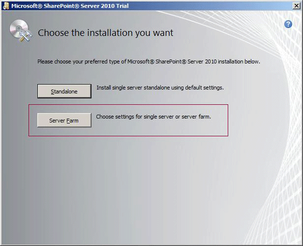
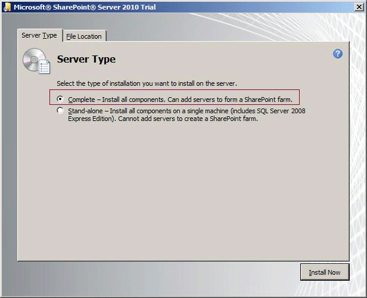
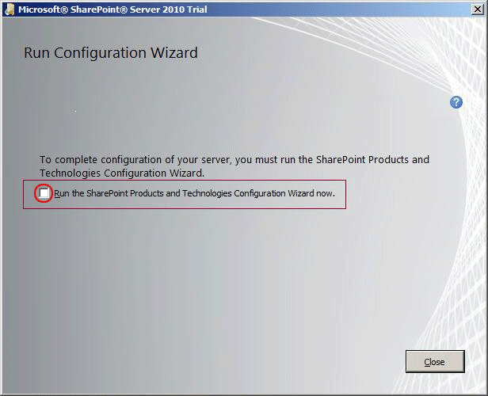

# Guidance for Using SQL Server BI Features in a SharePoint 2010 Farm
  This topic summarizes feature availability based on the versions and editions of the software you are using. It also explains SharePoint 2010 installation requirements for using specific SQL Server features. For information related to SharePoint 2013, see [Deployment Topologies for SQL Server BI Features in SharePoint](deployment-topologies-for-sql-server-bi-features-in-sharepoint.md).  
  
 In this topic:  
  
-   [General SharePoint 2010 Requirements](#bkmk_generalsharepoint)  
  
-   [SharePoint 2010 Service Pack 1 (SP1)](#bkmk_sp1)  
  
-   [SharePoint Editions and BI Feature support](#bkmk_vers)  
  
-   [SharePoint 2010 Products Preparation Tool](#bkmk_prereq)  
  
-   [Requirements and suggestions for running the SharePoint installation](#bkmk_install)  
  
##   General SharePoint 2010 Requirements  
  
-   SharePoint 2010 products are 64-bit only. If you have a 32-bit installation of a previous version of SharePoint and [!INCLUDE[ssRSnoversion](../../includes/ssrsnoversion-md.md)] installed in SharePoint integrated mode, you will not be able to upgrade to SharePoint 2010. For more information, review the SharePoint documentation.  
  
-   Reporting Services includes an add-in for SharePoint products. Supported configurations for the add-in and report server are available at a more granular level than what is indicated here. For more information, see [Supported Combinations of SharePoint and Reporting Services Server and Add-in &#40;SQL Server 2014&#41;](../../reporting-services/install-windows/supported-combinations-of-sharepoint-and-reporting-services-server.md).  
  
-   SharePoint developer tools only support a SharePoint standalone configuration.  For more information, see the SharePoint documentation: [Requirements for Developing SharePoint Solutions](https://msdn.microsoft.com/library/ee231582.aspx).  
  
##   SharePoint Editions and BI Feature support  
 Some [!INCLUDE[ssCurrent](../../includes/sscurrent-md.md)] Business Intelligence features are only supported on specific editions of SharePoint products.  
  
|Supported Features|SharePoint Product|  
|------------------------|------------------------|  
|[!INCLUDE[ssCrescent](../../includes/sscrescent-md.md)], a feature of [!INCLUDE[ssCurrent](../../includes/sscurrent-md.md)][!INCLUDE[ssRSnoversion](../../includes/ssrsnoversion-md.md)] Add-in for [!INCLUDE[msCoName](../../includes/msconame-md.md)][!INCLUDE[SPS2010](../../includes/sps2010-md.md)] Enterprise Edition.   [!INCLUDE[ssRSnoversion](../../includes/ssrsnoversion-md.md)] Data Alerts.   [!INCLUDE[ssGemini](../../includes/ssgemini-md.md)].|[!INCLUDE[SPS2010](../../includes/sps2010-md.md)] Enterprise Edition.|  
|General [!INCLUDE[ssRSnoversion](../../includes/ssrsnoversion-md.md)] report viewing and   feature integration with SharePoint.|[!INCLUDE[SPS2010](../../includes/sps2010-md.md)] Standard and Enterprise Editions.   [!INCLUDE[SPF2010](../../includes/spf2010-md.md)].|  
  
 For more information, see [Features Supported by the Editions of SQL Server 2012](https://go.microsoft.com/fwlink/?linkid=232473).  
  
##   SharePoint 2010 Service Pack 1 (SP1)  
 It is recommended you update your SharePoint 2010 installation to SharePoint 2010 Service Pack 1 (SP1). SharePoint SP1 is required in the following cases:  
  
-   You want use [!INCLUDE[ssSQL11](../../includes/sssql11-md.md)] version of the database engine for the SharePoint content databases or [!INCLUDE[ssRSnoversion](../../includes/ssrsnoversion-md.md)] catalog databases.  
  
-   You want to use [!INCLUDE[ssGemini](../../includes/ssgemini-md.md)] and the [!INCLUDE[ssGemini](../../includes/ssgemini-md.md)] configuration tool.  
  
 One of the primary reasons SP1 is required for SharePoint installations running with [!INCLUDE[ssSQL11](../../includes/sssql11-md.md)] is the database engine feature **sp_dboption**, that was deprecated in a previous release, is discontinued in the [!INCLUDE[ssSQL11](../../includes/sssql11-md.md)] release. For more information, see [Discontinued Database Engine Functionality in SQL Server 2014](../../database-engine/discontinued-database-engine-functionality-in-sql-server-2016.md)  
  
### SharePoint 2010 SP1 Installation Guidance  
 [Download SharePoint Server 2010 SP1](https://go.microsoft.com/fwlink/?LinkID=219697) and apply it on all servers in the farm.  
  
> [!NOTE]  
>  On an existing farm, you will need to use one of the following **additional** steps to complete the SharePoint SP1 upgrade. For more information, see [Known issues when you install Office 2010 SP1 and SharePoint 2010 SP1](https://support.microsoft.com/kb/2532126) and [Description of SharePoint Server 2010 SP1](https://support.microsoft.com/kb/2460045):  
  
-   **SharePoint Products Configuration Wizard:** Run the wizard to complete the SP1 upgrade and configuration.  
  
-   **Complete the upgrade with psconfig:** Run the command `psconfig -upgrade` to complete the SP1 upgrade  
  
 For more information, see the "upgrade" section of [(SharePoint Server 2010)](https://technet.microsoft.com/library/cc263093.aspx) and [Resource center: Updates for SharePoint 2010 Products](https://technet.microsoft.com/sharepoint/ff800847.aspx)  
  
## SharePoint Installation with SQL Server BI Features  
  
###   SharePoint 2010 Products Preparation Tool  
 The SharePoint Products Preparation Tool enables server roles in the operating system and installs other prerequisite software required by a SharePoint installation. The following table identifies additional steps to configure your server for [!INCLUDE[ssCurrent](../../includes/sscurrent-md.md)].  
  
|Component|Action|  
|---------------|------------|  
|Reporting Services Add-in|The SharePoint 2010 Products Preparation tool installs the [!INCLUDE[ssKilimanjaro](../../includes/sskilimanjaro-md.md)] version of the Reporting Services add-in. [!INCLUDE[ssCurrent](../../includes/sscurrent-md.md)] includes a newer version of the add-in that is required for [!INCLUDE[ssCurrent](../../includes/sscurrent-md.md)] features. The add-in can be installed using the [!INCLUDE[ssNoVersion](../../includes/ssnoversion-md.md)] installation wizard as well as downloaded from MSDN. For more information on where to get the current version of the add-in and how to install it, see [Where to find the Reporting Services add-in for SharePoint Products](../../reporting-services/install-windows/where-to-find-the-reporting-services-add-in-for-sharepoint-products.md) and [Install or Uninstall the Reporting Services Add-in for SharePoint &#40;SharePoint 2010 and SharePoint 2013&#41;](../../reporting-services/install-windows/install-or-uninstall-the-reporting-services-add-in-for-sharepoint.md).|  
|Analysis Services OLE DB Provider (MSOLAP)|SharePoint 2010 installs the SQL Server 2008 version of the OLE DB provider as part of an Excel Services deployment. This version does not support [!INCLUDE[ssGemini](../../includes/ssgemini-md.md)] data access. You should install later versions of the provider on SharePoint servers that support [!INCLUDE[ssGemini](../../includes/ssgemini-md.md)] data connections. For more information, see [Install the Analysis Services OLE DB Provider on SharePoint Servers](../../../2014/sql-server/install/install-the-analysis-services-ole-db-provider-on-sharepoint-servers.md)|  
|ADO.NET Services|SharePoint 2010 lists ADO.NET services in the list of prerequisites, but the Prerequisite installer does not install it. To add ADO.NET services, you must install it manually. Installing ADO.NET services is required if you want to use SharePoint lists as data feeds to [!INCLUDE[ssGemini](../../includes/ssgemini-md.md)] workbooks or Reporting Services reports. For instructions, see [Install ADO.NET Data Services to support data feed exports of SharePoint lists](../../../2014/sql-server/install/install-ado-net-data-services-to-support-data-feed-exports-of-sharepoint-lists.md).|  
  
###   Requirements and suggestions for running the SharePoint installation  
 Which [!INCLUDE[ssCurrent](../../includes/sscurrent-md.md)] features you install and the installation order of those features will determine what levels of integration with SharePoint are possible. For example, while some level of feature integration is available through Reporting Services on a SharePoint server that uses a built-in database, most feature integration scenarios require a farm installation of SharePoint, because only a farm installation provides the infrastructure required for some BI features.  
  
 A SharePoint farm can be a single server or multiple servers. What sets a farm apart from a standalone installation is the presence of additional infrastructure, such as the Claims to Windows Token Service.  
  
 A farm is enabled when you choose the **Server Farm** option in SharePoint setup. You must have a farm installation if you want to use [!INCLUDE[ssGemini](../../includes/ssgemini-md.md)] for SharePoint or [!INCLUDE[ssCrescent](../../includes/sscrescent-md.md)]. The Standalone SharePoint installation is supported and common for development environments of [!INCLUDE[ssRSnoversion](../../includes/ssrsnoversion-md.md)]. However a SharePoint farm installation is recommended for a production environment.  
  
   
  
 A complete server installation is also required for [!INCLUDE[ssGemini](../../includes/ssgemini-md.md)] for SharePoint or the [!INCLUDE[ssRSnoversion](../../includes/ssrsnoversion-md.md)] shared service.  
  
   
  
 The last page of the setup wizard prompts you to configure the farm and optionally configure a default web application and root site collection. Most setup users follow this installation path. If for some reason you do not configure the farm, you can use the farm configuration option in the [!INCLUDE[ssGemini](../../includes/ssgemini-md.md)] Configuration Tool to configure the farm.  
  
 In previous releases, leaving the farm un-configured was recommended for installing [!INCLUDE[ssGemini](../../includes/ssgemini-md.md)] because it reduced the steps needed when if you used SQL Server installation options to install [!INCLUDE[ssGemini](../../includes/ssgemini-md.md)] for SharePoint in a ready-to-use state. In this release, it is no longer important. You can use the [!INCLUDE[ssGemini](../../includes/ssgemini-md.md)] Configuration Tool to tune an existing farm so that it uses settings recommended for a [!INCLUDE[ssGemini](../../includes/ssgemini-md.md)] for SharePoint installation.  
  
 [!INCLUDE[ssRSnoversion](../../includes/ssrsnoversion-md.md)] can be installed into an existing SharePoint farm. You can install [!INCLUDE[ssRSnoversion](../../includes/ssrsnoversion-md.md)] or SharePoint in any order, but the configuration of [!INCLUDE[ssRSnoversion](../../includes/ssrsnoversion-md.md)] will vary depending on the order. For more information, see [Add an Additional Report Server to a Farm &#40;SSRS Scale-out&#41;](../../reporting-services/install-windows/add-an-additional-report-server-to-a-farm-ssrs-scale-out.md) and [Install Reporting Services SharePoint Mode for SharePoint 2010](../../../2014/sql-server/install/install-reporting-services-sharepoint-mode-for-sharepoint-2010.md)  
  
   
  
## See Also  
 [Installation and Deployment for SharePoint Server 2010](https://technet.microsoft.com/sharepoint/ee518643.aspx)   
 [Multiple Servers for a three-tier farm (SharePoint Server 2010)](https://go.microsoft.com/fwlink/?linkID=219834)  
  
  
