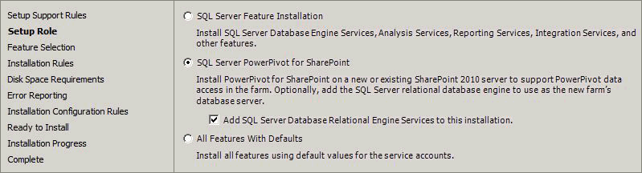
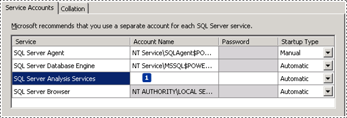

# Install PowerPivot for SharePoint 2010
  [!INCLUDE[ssGeminiShort](../../includes/ssgeminishort-md.md)] is a collection of middle-tier and backend services that provide PowerPivot data access in a SharePoint 2010 farm. If your organization uses the client application, [!INCLUDE[ssGemini](../../includes/ssgemini-md.md)] for Excel 2010, to create workbooks that contain analytical data, you must have [!INCLUDE[ssGeminiShort](../../includes/ssgeminishort-md.md)] to access that data in a server environment. This topic walks you through the basic installation process and it links you additional topics to help you configure PowerPivot.  
  
||  
|-|  
|**[!INCLUDE[applies](../../includes/applies-md.md)]**  SharePoint 2010|  
  
 
  
 For instructions on how to install [!INCLUDE[ssGemini](../../includes/ssgemini-md.md)] and [!INCLUDE[ssRSnoversion](../../includes/ssrsnoversion-md.md)] on the same server, see [Deployment Checklist: Reporting Services, Power View, and PowerPivot for SharePoint](deployment-checklist-reporting-services-power-view-power-pivot-for-sharepoint.md).  
  
## Prerequisites  
  
1.  You must be a local administrator to run SQL Server Setup.  
  
2.  SharePoint Server 2010 enterprise edition is required for [!INCLUDE[ssGeminiShort](../../includes/ssgeminishort-md.md)]. You can also use the evaluation enterprise edition.  
  
3.  SharePoint Server 2010 SP2 must be installed. Without it, you cannot configure the farm to use [!INCLUDE[ssCurrent](../../includes/sscurrent-md.md)] features.  
  
4.  The computer must be joined to a domain.  
  
5.  You must have a domain user account to provision [!INCLUDE[ssASnoversion](../../includes/ssasnoversion-md.md)]. In a [!INCLUDE[ssGeminiShort](../../includes/ssgeminishort-md.md)] installation, the Analysis Services service account must be a domain user account so that you can manage it from Central Administration. You will type the account and credentials on the **Server Configuration** page as part of the steps in this document.  
  
6.  The [!INCLUDE[ssGemini](../../includes/ssgemini-md.md)] instance name must be available. You cannot have an existing [!INCLUDE[ssGemini](../../includes/ssgemini-md.md)] named instance on the computer on which you are installing PowerPivot for SharePoint.  
  
7.  The [!INCLUDE[ssGeminiShort](../../includes/ssgeminishort-md.md)] instance cannot be part of a SQL Server Failover Cluster. Use high availability features of the SharePoint Product. For example, Excel Services manages load balancing of PowerPivot for SharePoint servers. For more information, see [Manage Excel Services data model settings (SharePoint Server 2013)](https://technet.microsoft.com/library/jj219780.aspx) (https://technet.microsoft.com/library/jj219780.aspx).  
  
8.  If you are installing [!INCLUDE[ssGeminiShort](../../includes/ssgeminishort-md.md)] on an existing farm, you must have one or more SharePoint web applications that are configured for classic mode authentication. [!INCLUDE[ssGemini](../../includes/ssgemini-md.md)] data access will only work if the web application supports classic mode authentication. For more information about classic mode requirements, see [PowerPivot Authentication and Authorization](../../analysis-services/power-pivot-sharepoint/power-pivot-authentication-and-authorization.md).  
  
9. Review the following additional topics to understand system and version requirements:  
  
    -   [Guidance for Using SQL Server BI Features in a SharePoint 2010 Farm](../../../2014/sql-server/install/guidance-for-using-sql-server-bi-features-in-a-sharepoint-2010-farm.md)  
  
##   Step 1: Install PowerPivot for SharePoint  
 In this step, you run SQL Server Setup to install [!INCLUDE[ssGeminiShort](../../includes/ssgeminishort-md.md)]. In a subsequent step, you will configure the server as a post-installation task.  
  
1.  Insert the installation media or open a folder that contains the setup files for SQL Server and then double-click **setup.exe**.  
  
2.  Click **Installation** in the left navigation pane.  
  
3.  Click **New SQL Server stand-alone installation or add features to an existing installation**.  
  
4.  On the **Product Key** page, specify the evaluation edition or enter a product key for a licensed copy of the enterprise edition.  
  
     Click **Next**.  
  
5.  Accept the Microsoft Software License Terms of agreement and We appreciate it if you also turn on the customer experience and error reporting. Click **Next**.  
  
6.  Update the setup files if you are prompted to do so.  
  
7.  On the **Install Rules** page, setup identifies any problems that might prevent it from installing. Review the list to determine whether Setup detected potential problems on the system.  
  
    > [!NOTE]  
    >  Because Windows Firewall is enabled, you will be warned to open ports to enable remote access. This warning is generally not applicable to [!INCLUDE[ssGemini](../../includes/ssgemini-md.md)] installations. Connections to [!INCLUDE[ssGemini](../../includes/ssgemini-md.md)] services and data files are made using the SharePoint ports that are already open for SharePoint service-to-service communication.  
  
     Click **Next**. Wait while SQL Server Setup program files are installed on the server.  
  
8.  On the **Setup Role** page, select **SQL Server PowerPivot for SharePoint**.  
  
9. Optionally, you can add an instance of the Database Engine to your installation. You might do this if you are setting up a new farm and need a database server to run the farm's configuration and content databases. If you add the Database Engine, it will be installed as a PowerPivot named instance. Whenever you need to specify a connection to this instance (for example, in the farm configuration wizard if you are using that wizard to configure the farm), enter the database name in this format: <`servername`>\PowerPivot.  
  
       
  
10. Click **Next**.  
  
11. On the **Feature Selection** page, a read-only list of the features that will be installed is displayed for informational purposes. You cannot add or remove items that are preselected for this role. Click **Next**.  
  
12. On the **Feature Rules** page, click **Next**. The page may be skipped.  
  
13. On the **Instance Configuration** page, a read-only instance name of 'PowerPivot' is displayed for informational purposes. This instance name of **POWERPIVOT** is **required and cannot be modified**. However, you can enter a unique Instance ID to specify a descriptive directory name and registry keys. Click **Next**.  
  
14. On the **Server Configuration** page, type desired account information.  
  
     For SQL Server Analysis Services, you must specify a domain user account. Do not specify a built-in account. Domain accounts are required for managing the Analysis Services service account as a *managed account* in SharePoint Central administration.  
  
       
  
     If you added the SQL Server Database Engine and SQL Server Agent, you can configure the services to run under domain user accounts or under the default virtual account.  
  
     Never use your own domain user account to provision any service. Doing so grants the server the same permissions that you have to the resources in your network. If the server is compromised by a malicious user, that user will be logged in under your domain credentials, with the ability to download or use the same data and applications that you do.  
  
15. Click **Next**.  
  
16. If you are installing the Database Engine, the Database Engine Configuration page appears. In Database Engine Configuration, click **Add Current User** to grant your user account administrator permissions on the Database Engine instance. Click **Add** to add additional accounts. Click **Next**.  
  
17. On the **Analysis Services Configuration** page, click **Add Current User** to grant your user account administrative permissions. You will need administrative permission to configure the server after Setup is finished.  
  
18. On the same page, add the Windows user account of any person who also requires administrative permissions. For example, any user who wants to connect to the [!INCLUDE[ssGeminiSrv](../../includes/ssgeminisrv-md.md)] instance in SQL Server Management Studio to troubleshoot database connection problems or get version information must have system administrator permissions on the server. Add the user account of any person who might need to troubleshoot or administer the server now.  
  
19. Click **Next**.  
  
20. Click **Next** on each of the remaining pages until you get to the Ready to Install page.  
  
21. Click **Install**.  
  
> [!TIP]  
>  If you need to trouble shoot the SQL Server installation, see [View and Read SQL Server Setup Log Files](../../database-engine/install-windows/view-and-read-sql-server-setup-log-files.md).  
  
##   Step 2: Configure the Server  
  
> [!IMPORTANT]  
>  SharePoint 2010 SP2 must be installed before you can configure [!INCLUDE[ssGeminiShort](../../includes/ssgeminishort-md.md)] or a SharePoint farm that uses a [!INCLUDE[ssCurrent](../../includes/sscurrent-md.md)] database server. If you have not yet installed the service pack, do so now before you begin configuring the server.  
  
 Installation is not complete until the server is configured. In this release, server configuration is always performed as post-installation task, using one of the following approaches: [!INCLUDE[ssGemini](../../includes/ssgemini-md.md)] Configuration Tool, Central Administration, or PowerShell. To continue, choose one of the following approaches:  
  
-   [Configure or Repair PowerPivot for SharePoint 2010 &#40;PowerPivot Configuration Tool&#41;](../../../2014/analysis-services/configure-repair-powerpivot-sharepoint-2010.md)  
  
-   [PowerPivot Server Administration and Configuration in Central Administration](../../analysis-services/power-pivot-sharepoint/power-pivot-server-administration-and-configuration-in-central-administration.md)  
  
-   [PowerPivot Configuration using Windows PowerShell](../../analysis-services/power-pivot-sharepoint/power-pivot-configuration-using-windows-powershell.md)  
  
 **Connecting to the Database Engine Instance.** When you installed [!INCLUDE[ssGeminiShort](../../includes/ssgeminishort-md.md)], SQL Server Setup gave you the option of adding an instance of the Database Engine to your installation. You might have added a Database Engine instance to your installation if you are setting up a new farm and need a database server to run the farm's configuration and content databases. If you added the Database Engine, it was installed as a [!INCLUDE[ssGemini](../../includes/ssgemini-md.md)] named instance. Whenever you need to specify a connection to this instance (for example, in the farm configuration wizard if you are using that wizard to configure the farm), remember to enter the database name in this format: <`servername`>\PowerPivot.  
  
##   Step 3: Install Analysis Services OLE DB providers on Excel Services Application Servers  
 Additional installation steps are required if you run Excel Calculation Services and [!INCLUDE[ssGemini](../../includes/ssgemini-md.md)] on separate application servers. On the application servers running Excel Calculation Services, install the appropriate version of the Analysis Services OLE DB (MSOLAP) provider.  
  
-   The [!INCLUDE[ssCurrent](../../includes/sscurrent-md.md)] version of MSOLAP is included in SQL Server Setup, therefore explicitly installing the [!INCLUDE[ssCurrent](../../includes/sscurrent-md.md)] version of MSOLAP is only required if your application server is not a PowerPivot application server.  
  
    > [!NOTE]  
    >  The Excel Calculation Services application server also needs an instance of the file **Microsoft.AnalysisServices.Xmla.dll** in the global assembly. To install the .dll on the application server, install [!INCLUDE[ssManStudioFull](../../includes/ssmanstudiofull-md.md)]. Select the "Management Tools - Complete" on the **Feature Selection** page of the SQL Server Setup wizard.  
  
-   If you want the application server to support older [!INCLUDE[ssGemini](../../includes/ssgemini-md.md)] workbooks, you need to install the SQL Server 2008 R2 version of MSOLAP.  
  
 For more information about installing the provider, including verification steps, see [Install the Analysis Services OLE DB Provider on SharePoint Servers](../../../2014/sql-server/install/install-the-analysis-services-ole-db-provider-on-sharepoint-servers.md)  
  
##   Step 4: Verify the Installation  
 In this last step, you will verify that both SharePoint 2010 and [!INCLUDE[ssGeminiShort](../../includes/ssgeminishort-md.md)] are fully functional. For instructions, see [Verify a PowerPivot for SharePoint Installation](../../analysis-services/instances/install-windows/verify-a-power-pivot-for-sharepoint-installation.md).  
  
## See Also  
 [PowerPivot for SharePoint 2010 Installation](../../../2014/sql-server/install/powerpivot-for-sharepoint-2010-installation.md)   
 [Deployment Checklist: Reporting Services, Power View, and PowerPivot for SharePoint](deployment-checklist-reporting-services-power-view-power-pivot-for-sharepoint.md)   
 [Deployment Checklist: Scale-out by adding PowerPivot Servers to a SharePoint 2010 farm](../../../2014/sql-server/install/deployment-checklist-scale-out-adding-powerpivot-servers-sharepoint-2010-farm.md)   
 [Deployment Checklist: Multi-Server Installation of PowerPivot for SharePoint 2010](../../../2014/sql-server/install/deployment-checklist-multiserver-installation-powerpivot-sharepoint-2010.md)  
  
  
