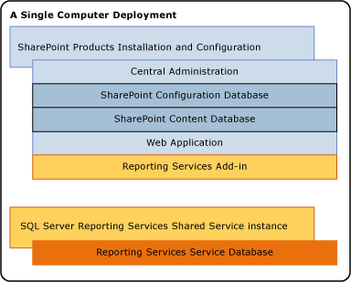
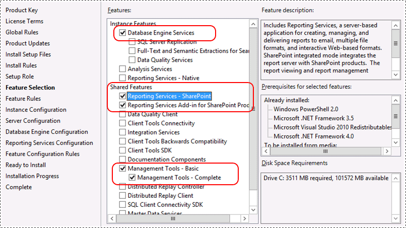
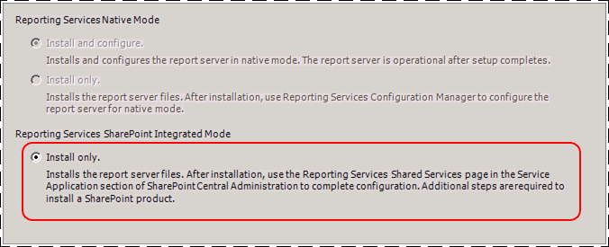

# Install Reporting Services SharePoint Mode for SharePoint 2010
  The procedures in this topic guide you through a single server installation of a Reporting Services report server in SharePoint mode. The steps include running the SQL Server installation wizard as well as additional configuration tasks that use SharePoint 2010 central administration. The topic can also be used for individual procedures for an existing installation, for example to create a [!INCLUDE[ssRSnoversion](../../includes/ssrsnoversion-md.md)] service application. For information on adding additional [!INCLUDE[ssRSnoversion](../../includes/ssrsnoversion-md.md)] servers to an existing farm, see [Add an Additional Report Server to a Farm &#40;SSRS Scale-out&#41;](../../reporting-services/install-windows/add-an-additional-report-server-to-a-farm-ssrs-scale-out.md) and [Add an Additional Reporting Services Web Front-end to a Farm](../../reporting-services/install-windows/add-an-additional-reporting-services-web-front-end-to-a-farm.md).  
  
||  
|-|  
|**[!INCLUDE[applies](../../includes/applies-md.md)]**  SharePoint 2010|  
  
 A single server installation is useful for development and testing scenarios but is not recommended for production environments.  
  
> [!NOTE]  
>  For information on upgrading and existing [!INCLUDE[ssRSnoversion](../../includes/ssrsnoversion-md.md)] SharePoint mode installation to [!INCLUDE[ssCurrent](../../includes/sscurrent-md.md)], see [Upgrade and Migrate Reporting Services](../../reporting-services/install-windows/upgrade-and-migrate-reporting-services.md).  
  

  
##  <a name="bkmk_prereq"></a> Prerequisites  
  
-   > [!IMPORTANT]  
    >  The [!INCLUDE[ssRSnoversion](../../includes/ssrsnoversion-md.md)] Configuration Manager is no longer required or supported to configure and administer [!INCLUDE[ssRSnoversion](../../includes/ssrsnoversion-md.md)] SharePoint mode. Use SharePoint Central Administration to configure a report server in SharePoint mode. For more information, see [Manage a Reporting Services SharePoint Service Application](../../../2014/reporting-services/manage-a-reporting-services-sharepoint-service-application.md).  
  
-   Review the following topics for requirements, including SharePoint 2010 products:  
  
    -   [Online Release Notes](https://msdn.microsoft.com/library/dn169381.aspx)
  
    -   [Guidance for Using SQL Server BI Features in a SharePoint 2010 Farm](../../../2014/sql-server/install/guidance-for-using-sql-server-bi-features-in-a-sharepoint-2010-farm.md)  
  
-   This topic does no cover the installation of SharePoint 2010 Products. For more information, see [Guidance for Using SQL Server BI Features in a SharePoint 2010 Farm](../../../2014/sql-server/install/guidance-for-using-sql-server-bi-features-in-a-sharepoint-2010-farm.md).  
  
-   These procedures are intended for configuring a [!INCLUDE[ssCurrent](../../includes/sscurrent-md.md)] report server and do not work for previous versions of report server. Previous versions of report server did not use the SharePoint Shared Service architecture. For example, SQL Server 2008 [!INCLUDE[ssRSnoversion](../../includes/ssrsnoversion-md.md)] report servers and SQL Server 2008 R2 [!INCLUDE[ssRSnoversion](../../includes/ssrsnoversion-md.md)] report servers.  
  
-   Verify the **SharePoint 2010 Administration** service is started in Windows Server Manager.  
  
   
  
### Database Considerations for a Single Server Configuration  
  
-   Both Reporting Services and SharePoint products and technologies use SQL Server relational databases to store application data.  
  
-   [!INCLUDE[ssRSCurrent](../../includes/ssrscurrent-md.md)] requires a compatible SQL Server evaluation edition instance of the SQL Engine.  
  
-   SharePoint products can use an existing database instance. If an instance of Database Engine is not installed, the SharePoint Products Setup program installs SQL Server Express Edition for the SharePoint application databases.  
  
-   The report server instance cannot use the SQL Server Express Edition for its database. However, the SQL Server Express Edition instance that is installed by the SharePoint product can exist side-by-side with other Database Engine editions.  
  

  
##  <a name="bkmk_install_SSRS"></a> Install Reporting Services Report Server in SharePoint mode  
  
1.  Run the SQL Server Installation Wizard.  
  
2.  Click **Installation** in the left side of the wizard and then click **New SQL Server stand-alone installation or add features to an existing installation**.  
  
3.  Click **OK** on the **Setup Support Rules** page, assuming all rules passed.  
  
4.  Click **Install** on the **Setup Support Files** page.  
  
5.  Click **Next** after the support files have completed installing and the support rules show a status of **passed**. Review any warnings or blocking issues.  
  
6.  On the **Product Key** page, type your key or accept the default of the 'Enterprise Evaluation' edition.  
  
     Click **Next**.  
  
7.  Review and accept the license terms. Microsoft appreciates you clicking to agree to send feature usage data to help improve product features and support.  
  
     Click **Next**.  
  
8.  Select **SQL Server Feature Installation** on the **Setup Role** page.  
  
     Click **Next**  
  
       
  
9. Select the following on the **Feature Selection** page:  
  
    -   **Reporting Services - SharePoint**  
  
    -   **Reporting Services add-in for SharePoint 2010 products**. The installation wizard option for installing the add-in is new with the [!INCLUDE[ssCurrent](../../includes/sscurrent-md.md)] release.  
  
    -   If you do not already have an instance of SQL Server [!INCLUDE[ssDE](../../includes/ssde-md.md)], you could also select **Database Engine Services** and **Management Tools Complete** for a complete environment.  
  
     Click **Next**.  
  
       
  
10. Click **Next** on the **Installation Rules** page. Review any warnings or blocking issues.  
  
11. If you selected the Database Engine services, accept the default instance of **MSSQLSERVER** on the **Instance Configuration** page and click **Next**. The Reporting Services shared service architecture is not based on a SQL Server "instance" was the previous Reporting Services architecture.  
  
12. Review the **Disk Space Requirements** page and click **Next**.  
  
13. On the **Server Configuration** page type appropriate credentials. If you want to use the [!INCLUDE[ssRSnoversion](../../includes/ssrsnoversion-md.md)] data alerting or subscription features, you need to change the **Startup Type** for SQL Server Agent to **Automatic**.  
  
     Click **Next**.  
  
14. If you selected the Database Engine services, you will see the **Database Engine Configuration** page, add appropriate accounts to the list of SQL Administrators and click **Next**.  
  
15. On the **Reporting Services Configuration** page you should see the **Install only** option is selected. This option installs the report server files, and does not configure the SharePoint environment for [!INCLUDE[ssRSnoversion](../../includes/ssrsnoversion-md.md)].When the SQL Server installation is complete, follow the other sections of this topic to configure the SharePoint environment. This Includes installing the [!INCLUDE[ssRSnoversion](../../includes/ssrsnoversion-md.md)] shared service and creating [!INCLUDE[ssRSnoversion](../../includes/ssrsnoversion-md.md)] service applications.  
  
       
  
16. Help Microsoft improve SQL Server features and services by clicking the check box to send error reports on the **Error Reporting** page.  
  
     Click **Next**.  
  
17. Review any warnings and then click **Next** on the **Installation Configuration Rules** page.  
  
18. On the **Ready to Install** page, review the installation summary and then click **Next**. The summary will include a **Reporting Services** node that will include the installation mode value of **SharePointFilesOnlyMode** as well as the account information.  
  

  
##  <a name="bkmk_install_SSRS_sharedservice"></a> Install and Start the Reporting Services SharePoint Service  
   
  
> [!NOTE]  
>  If you are installing into an existing SharePoint farm, **you do not need to** complete the steps in this section. The [!INCLUDE[ssRSnoversion](../../includes/ssrsnoversion-md.md)] SharePoint service was installed and started when you ran the SQL Server installation wizard in the previous section.  
  
 The necessary files were installed as part of the SQL Server installation wizard, but the services need to be registered into the SharePoint farm. The [!INCLUDE[ssCurrent](../../includes/sscurrent-md.md)] release introduces PowerShell support for [!INCLUDE[ssRSnoversion](../../includes/ssrsnoversion-md.md)] in SharePoint mode. The following steps guide you through opening the SharePoint Management Shell and running cmdlets:  
  
1.  Click the **Start** button  
  
2.  Click the **Microsoft SharePoint 2010 Products** group.  
  
3.  Right-click **SharePoint 2010 Management Shell** click **Run as administrator**.  
  
4.  Run the following PowerShell command to install the SharePoint service. A successful completion of the command displays a new line in the management shell. No message is returned to the management shell when the command completes successfully:  
  
    ```  
    Install-SPRSService  
    ```  
  
5.  Run the following PowerShell command to install the service proxy:  
  
    ```  
    Install-SPRSServiceProxy  
    ```  
  
6.  Run the following PowerShell command to start the service or see the following notes for instructions to start the service from SharePoint Central administration:  
  
    ```  
    get-spserviceinstance -all |where {$_.TypeName -like "SQL Server Reporting*"} | Start-SPServiceInstance  
    ```  
  
 You can also start the service from SharePoint central Administration rather than running the third PowerShell command. The following steps are also useful to verify that the service is running.  
  
1.  In SharePoint Central Administration, click **Manage Services on Server** in the **System Settings** group.  
  
2.  Find **SQL Server Reporting Services Service** and click **Start** in the Action column.  
  
3.  The status of the Reporting Services service will change from **Stopped** to **Started**. If the Reporting Services service is not in the list, use PowerShell to install the service.  
  
    > [!NOTE]  
    >  If the Reporting Services service stays in the **Starting** status and does not change to **Started**, verify the 'SharePoint 2010 Administration' service is started in Windows Server Manager.  
  

  
##  <a name="bkmk_create_serrviceapplication"></a> Create a Reporting Services Service Application  
 This section provides the steps to create a service application and a description of the properties, if you are reviewing an existing service application.  
  
1.  In SharePoint Central Administration, in the **Application Management** group, click **Manage Service Applications**.  
  
2.  In the SharePoint ribbon, click the **New** button.  
  
3.  In the New menu, click **SQL Server Reporting Services Service Application.**.  
  
    > [!WARNING]  
    >  If the [!INCLUDE[ssRSnoversion](../../includes/ssrsnoversion-md.md)] option does not appear in the list, it is an **indication that the [!INCLUDE[ssRSnoversion](../../includes/ssrsnoversion-md.md)] shared service is not installed**. Review the previous section on how to use PowerShell cmdlts to install the [!INCLUDE[ssRSnoversion](../../includes/ssrsnoversion-md.md)] service.  
  
4.  In the **Create SQL Server Reporting Services Service Application** page, enter a name for the application. If you are creating multiple Reporting Services service applications, a descriptive name or naming convention helps you organize your administration and management operations.  
  
5.  In **Application Pool** section, create a new application pool for the application (recommended). Using the same name for the new application pool as the service application, makes ongoing administration easier.  
  
     Select or create a managed account for the application pool. Be sure to specify a domain user account. A domain user account enables the use of the SharePoint managed account feature, which lets you update passwords and account information in one place. Domain accounts are also required if you plan to scale out the deployment to include additional service instances that run under the same identity.  
  
6.  In the **Database Server**, you can use the current server or choose a different SQL Server.  
  
7.  In **Database Name** the default value is `ReportingService_<guid>`, which is a unique database name. If you type a new value, type a unique value.  
  
8.  In **Database Authentication**, the default is Windows Authentication. If you choose **SQL Authentication**, refer to the SharePoint administrator guide for best practices on how to use this authentication type in a SharePoint deployment.  
  
9. In the **Web Application Association** section, select the Web Application to be provisioned for access by the current Reporting Services Service Application. You can associate one Reporting Services service application to one web application. If all of the current web applications are already associated with a Reporting Services service application, you see a warning message.  
  
10. Click **OK**.  
  
11. The process to create a service application could take several minutes to complete. When it is complete, you will see a confirmation message and a link to a **Provision Subscriptions and Alerts** page. Complete the provision step if you want to use the [!INCLUDE[ssRSnoversion](../../includes/ssrsnoversion-md.md)] subscriptions and alerts features. For more information, see [Provision Subscriptions and Alerts for SSRS Service Applications](../../reporting-services/install-windows/provision-subscriptions-and-alerts-for-ssrs-service-applications.md).  
  
  For information on using PowerShell to create a [!INCLUDE[ssRSnoversion](../../includes/ssrsnoversion-md.md)] service application, see [To create a Reporting Services Service Application using PowerShell](../../../2014/reporting-services/reporting-services-sharepoint-service-and-service-applications.md#bkmk_powershell_create_ssrs_serviceapp).  
  

  
##  <a name="bkmk_powerview"></a> Activate the Power View Site Collection Feature.  
 [!INCLUDE[ssCrescent](../../includes/sscrescent-md.md)], a feature of [!INCLUDE[ssCurrent](../../includes/sscurrent-md.md)][!INCLUDE[ssRSnoversion](../../includes/ssrsnoversion-md.md)] Add-in for [!INCLUDE[msCoName](../../includes/msconame-md.md)][!INCLUDE[SPS2010](../../includes/sps2010-md.md)] Enterprise Edition, is a site collection feature. The feature is activated automatically for root site collections and site collections created after the [!INCLUDE[ssRSnoversion](../../includes/ssrsnoversion-md.md)] add-in is installed. If you plan to use [!INCLUDE[ssCrescent](../../includes/sscrescent-md.md)], verify that the feature is activated.  
  
 If you install the [!INCLUDE[ssRSnoversion](../../includes/ssrsnoversion-md.md)] add-in for SharePoint 2010 Products after the installation of the SharePoint 2010 product, then the Report Server integration feature and the Power View integration feature will only be activated for root site collections. For other site collections, manually activate the features.  
  
#### To Activate the Power View Feature  
  
1.  Open your browser to the desired SharePoint site.  
  
2.  Click **Site Actions**.  
  
3.  Click **Site Settings**.  
  
4.  Click **Site Collection Features** in the Site Collection Administration Group.  
  
5.  Find **Power View Integration Feature** in the list.  
  
6.  Click **Activate**.  
  
 This procedure is completed per site collection. For more information, see [Activate the Report Server and Power View Integration Features in SharePoint](../../reporting-services/activate-the-report-server-and-power-view-integration-features-in-sharepoint.md)  .  
  
##  <a name="bkmk_additional_config"></a> Additional Configuration  
 This section describes additional configuration steps that are important in most SharePoint deployments.  
  
###  <a name="bkmk_provision_agent"></a> Provision Subscriptions and Alerts  
 The [!INCLUDE[ssRSnoversion](../../includes/ssrsnoversion-md.md)] subscription and data alert features may require the configuration of SQL Server Agent permissions. If you see an error message that indicates SQL Server Agent is required and you have verified SQL Server Agent is running, update the permissions. You can click the link **Provision Subscriptions and Alerts** on the create service application success page to go to another page for provisioning SQL Server Agent. The provision step is needed if your deployment crosses machine boundaries, for example when the SQL Server database instance is on a different machine. For more information, see [Provision Subscriptions and Alerts for SSRS Service Applications](../../reporting-services/install-windows/provision-subscriptions-and-alerts-for-ssrs-service-applications.md)  
  

  
### Configure e-mail for a service application  
 The [!INCLUDE[ssRSnoversion](../../includes/ssrsnoversion-md.md)] data alerts feature sends alerts in e-mail messages. To send e-mail you may need to configure your [!INCLUDE[ssRSnoversion](../../includes/ssrsnoversion-md.md)] service application and you may need to modify the e-mail delivery extension for the service application. If you plan to use the e-mail delivery extension for the [!INCLUDE[ssRSnoversion](../../includes/ssrsnoversion-md.md)] subscription feature, the e-mail settings are required. For more information, see [Configure E-mail for a Reporting Services Service Application &#40;SharePoint 2010 and SharePoint 2013&#41;](../../reporting-services/install-windows/configure-e-mail-for-a-reporting-services-service-application.md)  
  

  
### Add Reporting Services Content Types  
 [!INCLUDE[ssRSnoversion](../../includes/ssrsnoversion-md.md)] provides predefined content types that are used to manage shared data source (.rsds) files, report models (.smdl), and Report Builder report definition (.rdl) files. Adding a **Report Builder Report**, **Report Model**, and **Report Data Source** content type to a library enables the **New** command so that you can create new documents of that type. For more information, see [Add Report Server Content Types to a Library &#40;Reporting Services in SharePoint Integrated Mode&#41;](../../../2014/reporting-services/add-reporting-services-content-types-to-a-sharepoint-library.md).  
  

  
### Activate the File sync feature  
 If users will frequently upload published report items directly to SharePoint document libraries, the report server file sync feature will be beneficial. The file sync feature will synchronize the report server catalog with items in document libraries on a more frequent basis. For more information, see [Activate the Report Server File Sync Feature in SharePoint Central Administration](../../../2014/reporting-services/activate-report-server-file-sync-feature-sharepoint-central-administration.md).  
  
## See Also  
 [PowerShell cmdlets for Reporting Services SharePoint Mode](../../../2014/reporting-services/powershell-cmdlets-for-reporting-services-sharepoint-mode.md)   
 [Features Supported by the Editions of SQL Server 2012](https://go.microsoft.com/fwlink/?linkid=232473)   
 [Reporting Services SharePoint Service and Service Applications](../../../2014/reporting-services/reporting-services-sharepoint-service-and-service-applications.md)  
  
  
