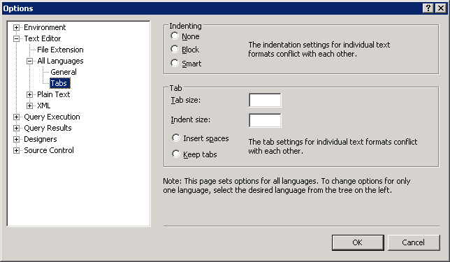

# Adding Indentation
  Query Editor allows you to indent large sections of code with a single step, and you can change the amount of the indentation.  
  
## Indenting Code  
  
#### To indent multiple lines of code  
  
1.  On the toolbar, click **New Query**.  
  
2.  Create a second query that selects the **BusinessEntityID**, FirstName, **MiddleName**, and **LastName** columns from the **Person** table of the **Person** schema. Place each column on a separate line so the code looks like this:  
  
    ```  
    -- Search for a contact  
    SELECT   
    BusinessEntityID,  
    FirstName,   
    MiddleName,   
    LastName  
    FROM Person.Person  
    WHERE LastName = 'Sanchez';  
    GO  
    ```  
  
3.  Select all text from `BusinessEntityID` to `LastName`.  
  
4.  On the **SQL Editor** toolbar, click **Increase Indent** to indent all the lines at once.  
  
#### To change the default indentation  
  
1.  On the **Tools** menu, click **Options**.  
  
2.  Expand **Text Editor**, expand **All Languages**, and click **Tabs** , and set indentation values as appropriate. Note that you can change the size of the indent as well as the size of tabs, and whether tabs are converted to spaces.  
  
       
  
3.  Click **OK**.  
  
## Next Task in Lesson  
 [Maximizing Query Editor](lesson-2-3-maximizing-query-editor.md)  
  
  
