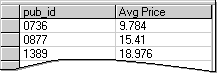
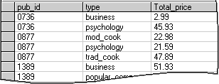

# Group Rows in Query Results (Visual Database Tools)
  If you want to create subtotals or show other summary information for subsets of a table, you create groups using an aggregate query. Each group summarizes the data for all the rows in the table that have the same value.  
  
 For example, you might want to see the average price of a book in the `titles` table, but break the results down by publisher. To do so, you group the query by publisher (for example, `pub_id`). The resulting query output might look like this:  
  
   
  
 When you group data, you can display only summary or grouped data, such as:  
  
-   The values of the grouped columns (those that appear in the GROUP BY clause). In the example above, `pub_id` is the grouped column.  
  
-   Values produced by aggregate functions such as SUM( ) and AVG( ). In the example above, the second column is produced by using the AVG( ) function with the `price` column.  
  
 You cannot display values from individual rows. For example, if you group only by publisher, you cannot also display individual titles in the query. Therefore, if you add columns to the query output, the [Query and View Designer](visual-database-tools.md) automatically adds them to the GROUP BY clause of the statement in the [SQL pane](sql-pane-visual-database-tools.md). If you want a column to be aggregated instead, you can specify an aggregate function for that column.  
  
 If you group by more than one column, each group in the query shows the aggregate values for all grouping columns.  
  
 For example, the following query against the `titles` table groups by publisher (`pub_id`) and also by book type (`type`). The query results are ordered by publisher and show summary information for each different type of book that the publisher produces:  
  
```  
SELECT pub_id, type, SUM(price) Total_price  
FROM titles  
GROUP BY pub_id, type  
```  
  
 The resulting output might look like this:  
  
   
  
### To group rows  
  
1.  Start the query by adding the tables you want to summarize to the Diagram pane.  
  
2.  Right-click the background of the Diagram pane, then choose **Add Group By** from the shortcut menu. The Query and View Designer adds a **Group By** column to the grid in the Criteria pane.  
  
3.  Add the column or columns you want to group to the Criteria pane. If you want the column to appear in the query output, be sure that the **Output** column is selected for output.  
  
     The Query and View Designer adds a GROUP BY clause to the statement in the SQL pane. For example, the SQL statement might look like this:  
  
    ```  
    SELECT pub_id  
    FROM titles  
    GROUP BY pub_id  
    ```  
  
4.  Add the column or columns you want to aggregate to the Criteria pane. Be sure that the column is marked for output.  
  
5.  In the **Group By** grid cell for the column that is going to be aggregated, select the appropriate aggregate function.  
  
     The Query and View Designer automatically assigns a column alias to the column you are summarizing. You can replace this automatically generated alias with a more meaningful one. For more details, see [Create Column Aliases &#40;Visual Database Tools&#41;](create-column-aliases-visual-database-tools.md).  
  
       
  
     The corresponding statement in the **SQL** pane might look like this:  
  
    ```  
    SELECT   pub_id, SUM(price) AS Totalprice  
    FROM     titles  
    GROUP BY pub_id  
    ```  
  
## See Also  
 [Sort and Group Query Results &#40;Visual Database Tools&#41;](sort-and-group-query-results-visual-database-tools.md)  
  
  
