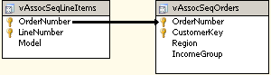

# Adding a Data Source View with Nested Tables (Intermediate Data Mining Tutorial)
  To create a market basket model, you must use a data source view that supports associative data. This data source view will also be used for the sequence clustering scenario.  
  
 This data source view is different from others that you may have worked with because it contains a *nested table*. A *nested table* is a table that contains multiple rows of information about a single row in the case table. For example, if your model analyzes the purchasing behavior of customers, you would typically use a table that has a unique row for each customer as the case table. However, each customer might make multiple purchases, and you might want to analyze the sequence of purchases, or products that are frequently purchased together. To logically represent these purchases in your model, you add another table to the data source view that lists the purchases for each customer.  
  
 This nested purchases table is related to the customer table by a many-to-one relationship. The nested table might contain many rows for each customer, each row containing a single product that was purchased, perhaps with additional information about the order that the purchases were made, the price at the time of the order, or any promotions that applied. You can use the information in the nested table as inputs to the model, or as the predictable attribute.  
  
 In this lesson, you do the following tasks:  
  
-   You add a data source view to the [!INCLUDE[ssAWDWsp](../includes/ssawdwsp-md.md)] data source.  
  
-   You add the case and nested tables to this view.  
  
-   You specify the many-to-one relationship between the case and nested table.  
  
    > [!NOTE]  
    >  . It is important that you follow the described procedure exactly, to correctly specify the relationship between the case table and the nested table and to avoid errors when you process the model.  
  
-   You define how the columns of data are used in the model.  
  
 For more information about working with case and nested tables, and how to choose a nested table key, see [Nested Tables &#40;Analysis Services - Data Mining&#41;](../../2014/analysis-services/data-mining/nested-tables-analysis-services-data-mining.md).  
  
### To add a data source view  
  
1.  In Solution Explorer, right-click **Data Source Views**, and then select **New Data Source View**.  
  
     The Data Source View Wizard opens.  
  
2.  On the **Welcome to the Data Source View Wizard** page, click **Next**.  
  
3.  On the **Select a Data Source** page, under **Relational data sources**, select the [!INCLUDE[ssAWDWsp](../includes/ssawdwsp-md.md)] data source that you created in the Basic Data Mining Tutorial. Click **Next**.  
  
4.  On the **Select Tables and Views** page, select the following tables, and then click the right arrow to include them in the new data source view:  
  
    -   `vAssocSeqOrders`  
  
    -   `vAssocSeqLineItems`  
  
5.  Click **Next**.  
  
6.  On the **Completing the Wizard** page, by default the data source view is named [!INCLUDE[ssAWDWsp](../includes/ssawdwsp-md.md)]. Change the name to `Orders`, and then click **Finish**.  
  
     Data Source View Designer opens and the `Orders` data source view appears.  
  
### To create a relationship between tables  
  
1.  In Data Source View Designer, position the two tables so that the tables are aligned horizontally, with the vAssocSeqLineItems table on the left side and the vAssocSeqOrders table on the right side.  
  
2.  Select the **OrderNumber** column in the vAssocSeqLineItems table.  
  
3.  Drag the column to the vAssocSeqOrders table, and put it on the **OrderNumber** column.  
  
    > [!IMPORTANT]  
    >  Make sure to drag the **OrderNumber** column from the vAssocSeqLineItems nested table, which represents the many side of the join, to the vAssocSeqOrders case table, which represents the one side of the join.  
  
     A new *many-to-one relationship* now exists between the vAssocSeqLineItems and vAssocSeqOrders tables. If you have joined the tables correctly, the data source view should appear as follows:  
  
       
  
## Next Task in Lesson  
 [Creating a Market Basket Structure and Model &#40;Intermediate Data Mining Tutorial&#41;](../../2014/tutorials/creating-a-market-basket-structure-and-model-intermediate-data-mining-tutorial.md)  
  
## See Also  
 [Intermediate Data Mining Tutorial &#40;Analysis Services - Data Mining&#41;](../../2014/tutorials/intermediate-data-mining-tutorial-analysis-services-data-mining.md)   
 [Mining Structures &#40;Analysis Services - Data Mining&#41;](../../2014/analysis-services/data-mining/mining-structures-analysis-services-data-mining.md)   
 [Mining Models &#40;Analysis Services - Data Mining&#41;](../../2014/analysis-services/data-mining/mining-models-analysis-services-data-mining.md)  
  
  
