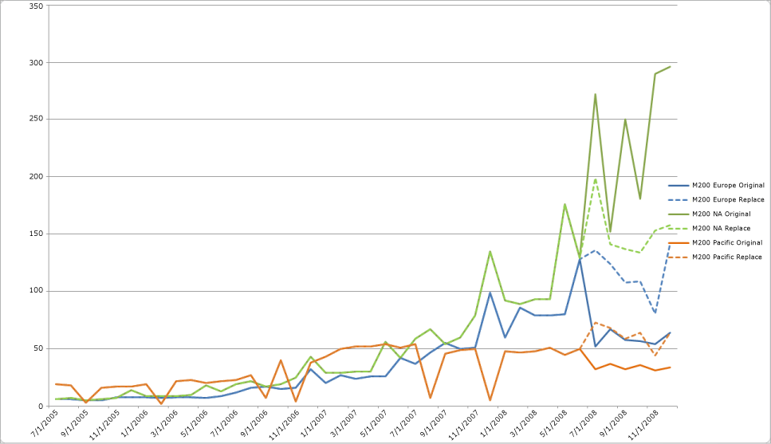

# Comparing Predictions for Forecasting Models (Intermediate Data Mining Tutorial)
  In the previous steps of this tutorial, you created multiple time series models:  
  
-   Predictions for each combination of region and model, based only on data for the individual model and region.  
  
-   Predictions for each region, based on updated data.  
  
-   Predictions for all models on a worldwide basis, based on aggregated data.  
  
-   Predictions for the M200 model in the North America region, based on the aggregated model.  
  
 To summarize the features for time series predictions, you will review the changes to see how the use of the options to extend or replace data affected forecasting results.  
  
 [EXTEND_MODEL_CASES](#bkmk_EXTEND)  
  
 [REPLACE_MODEL_CASES](#bkmk_REPLACE)  
  
##   Comparing the Original Results with Results after Adding Data  
 Let's look at the data for just the M200 product line in the Pacific region, to see how updating the model with new data affects the results. Remember that the original data series ended in June 2004, and we obtained new data for July, August, and September.  
  
-   The first column shows the new data that was added.  
  
-   The second column shows the forecast for July and later based on the original data series.  
  
-   The third column shows the forecast based on the extended data.  
  
|**M200 Pacific**|Updated real sales data|Forecast before data was added|Extended prediction|  
|----------------------|-----------------------------|------------------------------------|-------------------------|  
|7-25-2008|**65**|32|**65**|  
|8-25-2008|**54**|37|**54**|  
|9-25-2008|**61**|32|**61**|  
|10-25-2008|No data|36|32|  
|11-25-2008|No data|31|41|  
|12-25-2008|No data|34|32|  
  
 You will note that the forecasts using the extended data (shown here in bold) repeat the real data points exactly. The repetition is by design. As long as there are real data points to use, the prediction query will return the actual values, and output new prediction values only after the new actual data points have been used up.  
  
 In general, the algorithm weights the changes in the new data more strongly than data from the beginning of the model data. However, in this case, the new sales figures represent an increase of only 20-30 percent over the previous period, so there only was a slight uptick in projected sales, after which the sales projections drop again, more in line with the trend in the months before the new data.  
  
##   Comparing the Original and Cross-Prediction Results  
 Remember that the original mining model revealed big differences between regions and between product lines. For example, sales for the M200 model were very strong, while sales for the T1000 model were fairly low across all regions. Moreover, some series didn't have much data. Series were ragged, meaning they didn't have the same starting point.  
  
   
  
 So how did the predictions change when you made your projections based on the general model, which was based on world-wide sales, rather than the original data sets? To assure yourself that you have not lost any information or skewed the predictions, you can save the results to a table, join the table of predictions to the table of historical data, and then graph the two sets of historical data and predictions.  
  
 The following diagram is based on just one product line, the M200. The graph compares the predictions from the initial mining model against the predictions using the aggregated mining model.  
  
   
  
 From this diagram, you can see that the aggregated mining model preserves the overall range and trends in values while minimizing the fluctuations in the individual data series.  
  
## Conclusion  
 You have learned how to create and to customize a time series model that can be used for forecasting.  
  
 You have learned to update your time series models without having to reprocess them, by adding new data and creating predictions using the parameter, EXTEND_MODEL_CASES.  
  
 You have learned to create models that can be used for cross-prediction, by using the REPLACE_MODEL_CASES parameter and applying the model to a different data series.  
  
## See Also  
 [Intermediate Data Mining Tutorial &#40;Analysis Services - Data Mining&#41;](../../2014/tutorials/intermediate-data-mining-tutorial-analysis-services-data-mining.md)   
 [Time Series Model Query Examples](../../2014/analysis-services/data-mining/time-series-model-query-examples.md)  
  
  
