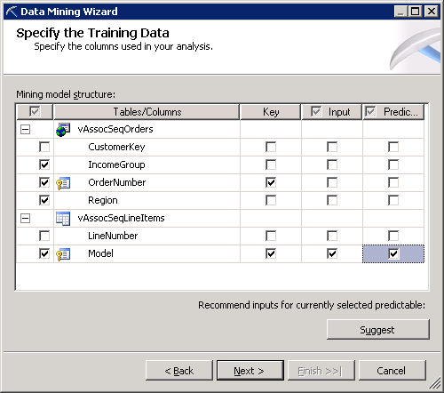

# Creating a Market Basket Structure and Model (Intermediate Data Mining Tutorial)
  Now that you have created a data source view, you will use the Data Mining Wizard to create a new mining structure. In this task, you will create a mining structure and a mining model that is based on the [!INCLUDE[msCoName](../includes/msconame-md.md)] Association algorithm.  
  
> [!NOTE]  
>  If you encounter an error stating that vAssocSeqLineItems cannot be used as a nested table, return to the previous task in the lesson, and be sure to create the many-to-one join by dragging from the vAssocSeqLineItems table (the many side) to the vAssocSeqOrders table (the one side). You can also edit the relationship between the tables by right-clicking the join line.  
  
### To create an association mining structure  
  
1.  In Solution Explorer in [!INCLUDE[ssBIDevStudioFull](../includes/ssbidevstudiofull-md.md)], right-click **Mining Structures** and select **New Mining Structure** to open the Data Mining Wizard.  
  
2.  On the **Welcome to the Data Mining Wizard** page, click **Next**.  
  
3.  On the **Select the Definition Method** page, verify that **From existing relational database or data warehouse** is selected, and then click **Next**.  
  
4.  On the **Create the Data Mining Structure** page, under **Which data mining technique do you want to use?**, select **Microsoft Association Rules** from the list, and then click **Next**. The **Select Data Source View** page appears.  
  
5.  Select **Orders**under **Available data source views**, and then click **Next**.  
  
6.  On the **Specify Table Types** page, in the row for the vAssocSeqLineItems table, select the **Nested** check box, and in the row for the nested table vAssocSeqOrders, select the **Case** check box. Click **Next**.  
  
7.  On the **Specify the Training Data** page, clear any boxes that might be checked. Set the key for the case table, vAssocSeqOrders, by selecting the **Key** check box next to OrderNumber.  
  
     Because the purpose of the market basket analysis is to determine which products are included in a single transaction, you do not have to use the **CustomerKey** field.  
  
8.  Set the key for the nested table, vAssocSeqLineItems, by selecting the **Key** check box next to Model. The **Input** check box is also automatically selected when you do this. Select the **Predictable** check box for `Model` as well.  
  
     In a market basket model, you do not care about the sequence of products in the shopping basket, and therefore you should not include **LineNumber** as a key for the nested table. You would use **LineNumber** as a key only in a model where the sequence is important. You will create a model that uses the [!INCLUDE[msCoName](../includes/msconame-md.md)] Sequence Clustering algorithm in Lesson 4.  
  
9. Select the check box to the left of IncomeGroup and Region,but do not make any other selections. Checking the leftmost column adds the columns to the structure for later reference, but the columns will not be used in the model. Your selections should look like the following:  
  
       
  
10. Click **Next**.  
  
11. On the **Specify Columns' Content and Data Type**page, review the selections, which should be as shown in the following table, and then click **Next**.  
  
    |Columns|Content Type|Data Type|  
    |-------------|------------------|---------------|  
    |IncomeGroup|Discrete|Text|  
    |Order Number|Key|Text|  
    |Region|Discrete|Text|  
    |vAssocSeqLineItems|||  
    |Model|Key|Text|  
  
12. On the **Create testing set** page, the default value for the option **Percentage of data for testing** is 30 percent. Change this to **0**. Click **Next**.  
  
    > [!NOTE]  
    >  [!INCLUDE[ssASnoversion](../includes/ssasnoversion-md.md)] provides different charts for measuring model accuracy. However, some accuracy chart types, such as the lift chart and cross-validation report, are designed for classification and estimation. They are not supported for associative prediction.  
  
13. On the **Completing the Wizard** page, in **Mining structure name**, type `Association`.  
  
14. In **Mining model name**, type `Association`.  
  
15. Select the option **Allow drill through**, and then click **Finish**.  
  
     Data Mining Designer opens to display the `Association` mining structure that you just created.  
  
## Next Task in Lesson  
 [Modifying and Processing the Market Basket Model &#40;Intermediate Data Mining Tutorial&#41;](../../2014/tutorials/modify-process-market-basket-model-intermediate-data-mining-tutorial.md)  
  
## See Also  
 [Microsoft Association Algorithm](../../2014/analysis-services/data-mining/microsoft-association-algorithm.md)   
 [Content Types &#40;Data Mining&#41;](../../2014/analysis-services/data-mining/content-types-data-mining.md)  
  
  
