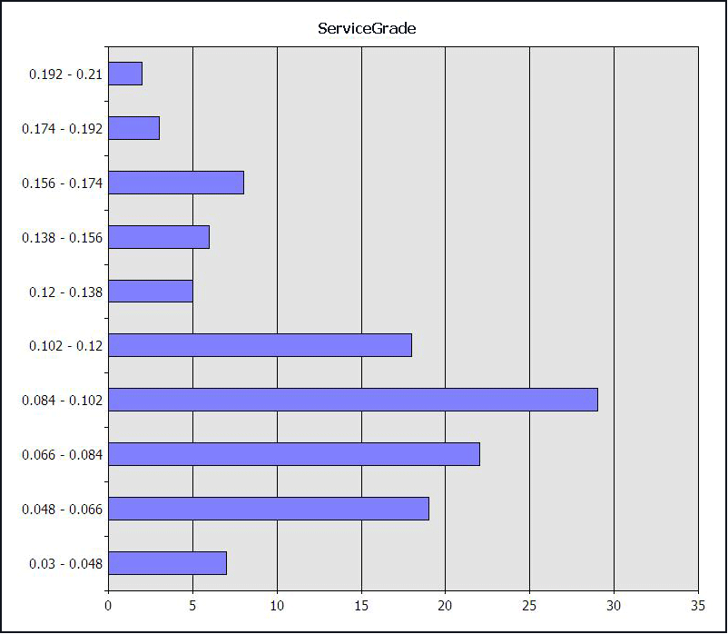

# Creating a Neural Network Structure and Model (Intermediate Data Mining Tutorial)
  To create a data mining model, you must first use the Data Mining Wizard to create a new mining structure based on the new data source view. In this task you will use the wizard to create a mining structure, and at the same time create an associated mining model that is based on the [!INCLUDE[msCoName](../includes/msconame-md.md)] Neural Network algorithm.  
  
 Because neural networks are extremely flexible and can analyze many combinations of inputs and outputs, you should experiment with several ways of processing the data to get the best results. For example, you might want to customize the way that the numerical target for service quality is *binned*, or grouped, to target specific business requirements. To do this, you will add a new column to the mining structure that groups numerical data in a different way, and then create a model that uses the new column. You will use these mining models to do some exploration.  
  
 Finally, when you have learned from the neural network model which factors have the greatest impact for your business question, you will build a separate model for prediction and scoring. You will use the [!INCLUDE[msCoName](../includes/msconame-md.md)] Logistic Regression algorithm, which is based on the neural networks model but is optimized for finding a solution based on specific inputs.  
  
 **Steps**  
  
 [Create the default mining structure and model](#bkmk_defaul)  
  
 [Use discretization to bin the predictable column](#bkmk_ColumnCopy)  
  
 [Copy the column and change the discretization method for a different model](#bkmk_Alias)  
  
 [Create an alias for the predictable column so that you can compare models](#bkmk_Alias2)  
  
 [Process all models](#bkmk_SeedProcess)  
  
## Create the Default Call Center Structure    
  
1.  In Solution Explorer in [!INCLUDE[ssBIDevStudioFull](../includes/ssbidevstudiofull-md.md)], right-click **Mining Structures** and select **New Mining Structure**.  
  
2.  On the **Welcome to the Data Mining Wizard** page, click **Next**.  
  
3.  On the **Select the Definition Method** page, verify that **From existing relational database or data warehouse** is selected, and then click **Next**.  
  
4.  On the **Create the Data Mining Structure** page, verify that the option **Create mining structure with a mining model** is selected.  
  
5.  Click the dropdown list for the option **Which data mining technique do you want to use?**, then select **Microsoft Neural Networks**.  
  
     Because the logistic regression models are based on the neural networks, you can reuse the same structure and add a new mining model.  
  
6.  Click **Next**.  
  
     The **Select Data Source View** page appears.  
  
7.  Under **Available data source views**, select `Call Center`, and click **Next**.  
  
8.  On the **Specify Table Types** page, select the **Case** check box next to the **FactCallCenter** table. Do not select anything for **DimDate**. Click **Next**.  
  
9. On the **Specify the Training Data** page, select **Key** next to the column **FactCallCenterID.**  
  
10. Select the `Predict` and **Input** check boxes.  
  
11. Select the **Key**, **Input**, and `Predict` check boxes as shown in the following table:  
  
    |Tables/Columns|Key/Input/Predict|  
    |---------------------|-------------------------|  
    |AutomaticResponses|Input|  
    |AverageTimePerIssue|Input/Predict|  
    |Calls|Input|  
    |DateKey|Do not use|  
    |DayOfWeek|Input|  
    |FactCallCenterID|Key|  
    |IssuesRaised|Input|  
    |LevelOneOperators|Input/Predict|  
    |LevelTwoOperators|Input|  
    |Orders|Input/Predict|  
    |ServiceGrade|Input/Predict|  
    |Shift|Input|  
    |TotalOperators|Do not use|  
    |WageType|Input|  
  
     Note that multiple predictable columns have been selected. One of the strengths of the neural network algorithm is that it can analyze all possible combinations of input and output attributes. You wouldn't want to do this for a large data set, as it could exponentially increase processing time..  
  
12. On the **Specify Columns' Content and Data Type** page, verify that the grid contains the columns, content types, and data types as shown in the following table, and then click **Next**.  
  
    |Columns|Content Type|Data Types|  
    |-------------|------------------|----------------|  
    |AutomaticResponses|Continuous|Long|  
    |AverageTimePerIssue|Continuous|Long|  
    |Calls|Continuous|Long|  
    |DayOfWeek|Discrete|Text|  
    |FactCallCenterID|Key|Long|  
    |IssuesRaised|Continuous|Long|  
    |LevelOneOperators|Continuous|Long|  
    |LevelTwoOperators|Continuous|Long|  
    |Orders|Continuous|Long|  
    |ServiceGrade|Continuous|Double|  
    |Shift|Discrete|Text|  
    |WageType|Discrete|Text|  
  
13. On the **Create testing set** page, clear the text box for the option, **Percentage of data for testing**. Click **Next**.  
  
14. On the **Completing the Wizard** page, for the **Mining structure name**, type `Call Center`.  
  
15. For the **Mining model name**, type `Call Center Default NN`, and then click **Finish**.  
  
     The **Allow drill through** box is disabled because you cannot drill through to data with neural network models.  
  
16. In Solution Explorer, right-click the name of the data mining structure that you just created, and select **Process**.  
  
## Use Discretization to Bin the Target Column  
 By default, when you create a neural network model that has a numeric predictable attribute, the Microsoft Neural Network algorithm treats the attribute as a continuous number. For example, the ServiceGrade attribute is a number that theoretically ranges from 0.00 (all calls are answered) to 1.00 (all callers hang up). In this data set, the values have the following distribution:  
  
   
  
 As a result, when you process the model the outputs might be grouped differently than you expect. For example, if you use clustering to identify the best groups of values, the algorithm divides the values in ServiceGrade into ranges such as this one: 0.0748051948 - 0.09716216215. Although this grouping is mathematically accurate, such ranges might not be as meaningful to business users.  
  
 In this step, to make the result more intuitive, you'll group the numerical values differently, creating copies of the numerical data column.  
  
### How Discretization Works  
 Analysis Services provides a variety of methods for binning or processing numerical data. The following table illustrates the differences between the results when the output attribute ServiceGrade has been processed three different ways:  
  
-   Treating it as a continuous number.  
  
-   Having the algorithm use clustering to identify the best arrangement of values.  
  
-   Specifying that the numbers be binned by the Equal Areas method.  
  
 Default model (continuous)  
  
|VALUE|SUPPORT|  
|-----------|-------------|  
|Missing|0|  
|0.09875|120|  
  
 Binned by clustering  
  
|VALUE|SUPPORT|  
|-----------|-------------|  
|\< 0.0748051948|34|  
|0.0748051948 - 0.09716216215|27|  
|0.09716216215 - 0.13297297295|39|  
|0.13297297295 - 0.167499999975|10|  
|>= 0.167499999975|10|  
  
 Binned by equal areas  
  
|VALUE|SUPPORT|  
|-----------|-------------|  
|\< 0.07|26|  
|0.07 - 0.00|22|  
|0.09 - 0.11|36|  
|>= 0.12|36|  
  
> [!NOTE]  
>  You can obtain these statistics from the marginal statistics node of the model, after all the data has been processed. For more information about the marginal statistics node, see [Mining Model Content for Neural Network Models &#40;Analysis Services - Data Mining&#41;](../../2014/analysis-services/data-mining/mining-model-content-for-neural-network-models-analysis-services-data-mining.md).  
  
 In this table, the VALUE column shows you how the number for ServiceGrade has been handled. The SUPPORT column shows you how many cases had that value, or that fell in that range.  
  
-   **Use continuous numbers (default)**  
  
     If you used the default method, the algorithm would compute outcomes for 120 distinct values, the mean value of which is 0.09875. You can also see the number of missing values.  
  
-   **Bin by clustering**  
  
     When you let the Microsoft Clustering algorithm determine the optional grouping of values, the algorithm would group the values for ServiceGrade into five (5) ranges. The number of cases in each range is not evenly distributed, as you can see from the support column.  
  
-   **Bin by equal areas**  
  
     When you choose this method, the algorithm forces the values into buckets of equal size, which in turn changes the upper and lower bounds of each range. You can specify the number of buckets, but you want to avoid having two few values in any bucket.  
  
 For more information about binning options, see [Discretization Methods &#40;Data Mining&#41;](../../2014/analysis-services/data-mining/discretization-methods-data-mining.md).  
  
 Alternatively, rather than using the numeric values, you could add a separate derived column that classifies the service grades into predefined target ranges, such as **Best** (ServiceGrade \<= 0.05), **Acceptable** (0.10 > ServiceGrade > 0.05), and **Poor** (ServiceGrade >= 0.10).  
  
###   Create a Copy of a Column and Change the Discretization Method  
 You'll make a copy of the mining column that contains the target attribute, ServiceGrade and change the way the numbers are grouped. You can create multiple copies of any column in a mining structure, including the predictable attribute.  
  
 For this tutorial, you will use the Equal Areas method of discretization, and specify four buckets. The groupings that result from this method are fairly close to the target values of interest to your business users.  
  
####   To create a customized copy of a column in the mining structure  
  
1.  In Solution Explorer, double-click the mining structure that you just created.  
  
2.  In the Mining Structure tab, click **Add a mining structure column**.  
  
3.  In the **Select column** dialog box, select ServiceGrade from the list in **Source column**, then click **OK**.  
  
     A new column is added to the list of mining structure columns. By default, the new mining column has the same name as the existing column, with a numerical postfix: for example, ServiceGrade 1. You can change the name of this column to be more descriptive.  
  
     You will also specify the discretization method.  
  
4.  Right-click ServiceGrade 1 and select **Properties**.  
  
5.  In the **Properties** window, locate the **Name** property, and change the name to **Service Grade Binned** .  
  
6.  A dialog box appears asking whether you want to make the same change to the name of all related mining model columns. Click **No**.  
  
7.  In the **Properties** window, locate the section **Data Type** and expand it if necessary.  
  
8.  Change the value of the property `Content` from `Continuous` to `Discretized`.  
  
     The following properties are now available. Change the values of the properties as shown in the following table:  
  
    |Property|Default value|New value|  
    |--------------|-------------------|---------------|  
    |`DiscretizationMethod`|`Continuous`|`EqualAreas`|  
    |`DiscretizationBucketCount`|No value|4|  
  
    > [!NOTE]  
    >  The default value of <xref:Microsoft.AnalysisServices.ScalarMiningStructureColumn.DiscretizationBucketCount%2A> is actually 0, which means that the algorithm automatically determines the optimum number of buckets. Therefore, if you want to reset the value of this property to its default, type 0.  
  
9. In Data Mining Designer, click the **Mining Models** tab.  
  
     Notice that when you add a copy of a mining structure column, the usage flag for the copy is automatically set to `Ignore`. Usually, when you add a copy of a column to a mining structure, you would not use the copy for analysis together with the original column, or the algorithm will find a strong correlation between the two columns that might obscure other relationships.  
  
##   Add a New Mining Model to the Mining Structure  
 Now that you have created a new grouping for the target attribute, you need to add a new mining model that uses the discretized column. When you are done, the CallCenter mining structure will have two mining models:  
  
-   The mining model, Call Center Default NN, handles the ServiceGrade values as a continuous range.  
  
-   You will create a new mining model, Call Center Binned NN, that uses as its target outcomes the values of the ServiceGrade column, distributed into four buckets of equal size.  
  
#### To add a mining model based on the new discretized column  
  
1.  In Solution Explorer, right-click the mining structure that you just created, and select **Open**.  
  
2.  Click the **Mining Models** tab.  
  
3.  Click **Create a related mining model**.  
  
4.  In the **New Mining Model** dialog box, for **Model name**, type `Call Center Binned NN`. In the **Algorithm name** dropdown list, select **Microsoft Neural Network**.  
  
5.  In the list of columns contained in the new mining model, locate ServiceGrade, and change the usage from `Predict` to `Ignore`.  
  
6.  Similarly, locate ServiceGrade Binned, and change the usage from `Ignore` to `Predict`.  
  
##   Create an Alias for the Target Column  
 Ordinarily you cannot compare mining models that use different predictable attributes. However, you can create an alias for a mining model column. That is, you can rename the column, ServiceGrade Binned, within the mining model so that it has the same name as the original column. You can then directly compare these two models in an accuracy chart, even though the data is discretized differently.  
  
###   To add an alias for a mining structure column in a mining model  
  
1.  In the **Mining Models** tab, under **Structure**, select ServiceGrade Binned.  
  
     Note that the **Properties** window displays the properties of the object, ScalarMiningStructure column.  
  
2.  Under the column for the mining model, ServiceGrade Binned NN, click the cell corresponding to the column ServiceGrade Binned.  
  
     Note that now the **Properties** window displays the properties for the object, MiningModelColumn.  
  
3.  Locate the **Name** property, and change the value to `ServiceGrade`.  
  
4.  Locate the **Description** property and type **Temporary column alias**.  
  
     The **Properties** window should contain the following information:  
  
    |Property|Value|  
    |--------------|-----------|  
    |**Description**|Temporary column alias|  
    |**ID**|ServiceGrade Binned|  
    |**Modeling Flags**||  
    |**Name**|Service Grade|  
    |**SourceColumn ID**|Service Grade 1|  
    |**Usage**|Predict|  
  
5.  Click anywhere in the **Mining Model** tab.  
  
     The grid is updated to show the new temporary column alias, `ServiceGrade`, beside the column usage. The grid containing the mining structure and two mining models should look like the following:  
  
    |Structure|Call Center Default NN|Call Center Binned NN|  
    |---------------|----------------------------|---------------------------|  
    ||Microsoft Neural Network|Microsoft Neural Network|  
    |AutomaticResponses|Input|Input|  
    |AverageTimePerIssue|Predict|Predict|  
    |Calls|Input|Input|  
    |DayOfWeek|Input|Input|  
    |FactCallCenterID|Key|Key|  
    |IssuesRaised|Input|Input|  
    |LevelOneOperators|Input|Input|  
    |LevelTwoOperators|Input|Input|  
    |Orders|Input|Input|  
    |ServceGrade Binned|Ignore|Predict (ServiceGrade)|  
    |ServiceGrade|Predict|Ignore|  
    |Shift|Input|Input|  
    |Total Operators|Input|Input|  
    |WageType|Input|Input|  
  
## Process All Models  
 Finally, to ensure that the models you have created can be easily compared, you will set the seed parameter for both the default and binned models. Setting a seed value guarantees that each model starts processing the data from the same point.  
  
> [!NOTE]  
>  If you do not specify a numeric value for the seed parameter, SQL Server Analysis Services will generate a seed based on the name of the model. Because the models always have different names, you must set a seed value to ensure that they process data in the same order.  
  
###   To specify the seed and process the models  
  
1.  In the **Mining Model** tab, right-click the column for the model named Call Center - LR, and select **Set Algorithm Parameters**.  
  
2.  In the row for the HOLDOUT_SEED parameter, click the empty cell under **Value**, and type `1`. Click **OK**. Repeat this step for each model associated with the structure.  
  
    > [!NOTE]  
    >  The value that you choose as the seed does not matter, as long as you use the same seed for all related models.  
  
3.  In the **Mining Models** menu, select **Process Mining Structure and All Models**. Click **Yes** to deploy the updated data mining project to the server.  
  
4.  In the **Process Mining Model** dialog box, click **Run**.  
  
5.  Click **Close** to close the **Process Progress** dialog box, and then click **Close** again in the **Process Mining Model** dialog box.  
  
 Now that you have created the two related mining models, you will explore the data to discover relationships in the data.  
  
## Next Task in Lesson  
 [Exploring the Call Center Model &#40;Intermediate Data Mining Tutorial&#41;](../../2014/tutorials/exploring-the-call-center-model-intermediate-data-mining-tutorial.md)  
  
## See Also  
 [Mining Structures &#40;Analysis Services - Data Mining&#41;](../../2014/analysis-services/data-mining/mining-structures-analysis-services-data-mining.md)  
  
  
