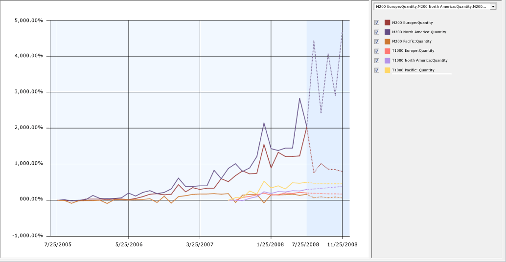

# Exploring the Forecasting Model (Intermediate Data Mining Tutorial)
  Now that you have built the forecasting mining model, you can explore the results by using the **Mining Model Viewer** tab of Data Mining Designer. The [!INCLUDE[msCoName](../includes/msconame-md.md)] Time Series Viewer contains two tabs: **Charts** and **Model**.  
  
 Additionally, you can use the Microsoft Generic Tree Viewer with all models. Each view presents a slightly different picture of the information in the time series model.  
  
-   [Charts Tab](#bkmk_Charts)  
  
-   [Model Tab](#bkmk_Model)  
  
-   [Microsoft Generic Content Viewer](#bkmk_Content)  
  
##   Charts Tab  
 The **Charts** tab of the [!INCLUDE[msCoName](../includes/msconame-md.md)] Time Series Viewer graphically shows you each of the series, including historical data and predictions. Each line in the time series graph represents a unique combination of product, region, and predictable attribute.  
  
 The legend on the right side of the viewer lists the time series that available, based on the selections in the drop-down list. You can select and clear the check boxes in the legend to control which time series displays in the graph.  
  
 You can also change the display options, such as the colors used for each time series, or whether values are displayed at points in the chart.  
  
#### To select a time series  
  
1.  Click the **Charts** tab of the **Mining Model Viewer** tab, if it is not visible.  
  
2.  Click the drop-down list to the right of the chart view, and select all the check boxes. [!INCLUDE[clickOK](../includes/clickok-md.md)]  
  
     The chart should now contain 24 different series lines.  
  
3.  In the check boxes to the right of the chart, clear the boxes to temporarily hide the lines for all series that are based on Amount.  
  
     Now, clear the check boxes related to the R750 and R250 bicycles.  
  
     The chart now contains just the following six series lines, so that can you more easily compare trends for the M200 and T1000 bicycles.  
  
    -   **M200 Europe: Quantity**  
  
    -   **M200 North America: Quantity**  
  
    -   **M200 Pacific: Quantity**  
  
    -   **T1000 Europe: Quantity**  
  
    -   **T1000 North America: Quantity**  
  
    -   **T1000 Pacific: Quantity**  
  
   
  
 The chart that is displayed in this viewer includes both historical and predicted data. Predicted data is shaded to differentiate it from historical data. To make it easier to compare different series, you can also change the colors associated with each line in the graph. For more information, see [Change the Colors Used in the Data Mining Viewer](../../2014/analysis-services/data-mining/change-the-colors-used-in-the-data-mining-viewer.md).  
  
 From the trend lines, you can see that total sales for all regions are generally increasing, with a peak every 12 months in December. From the chart, you can also see that the data for the T1000 bicycle starts much later than the data for the other product series. That is because it is a newer product, but because this series is based on much less data, the predictions might not be as accurate.  
  
 By default, five prediction steps are shown for each time series, displayed as dotted lines. You can change this value to view more or fewer predictions. You can also graphically view the standard deviation for the predictions by adding error bars to the chart.  
  
#### To change prediction and display options in the Chart view  
  
1.  Try changing the value for **Prediction Steps** gradually, increasing it from **5** to **10**, and then back to **6**.  
  
     When the historical data has large fluctuations, the fluctuations tend to be repeated or even amplified as you increase the number of predictions. You probably need to do some research at this point, to understand the cause of the big increase in the historical data and then decide whether to accept these results, seek some kind of correction in the source data, or apply some kind of smoothing in the model.  
  
2.  Select the **Show Deviations** check box.  
  
     This option displays the estimated error for each predicted value.  
  
3.  Note the scale of the X-axis. The changes over both historical and predicted data are always expressed as a percentage, but the actual values are adjusted automatically to fit all values onto the graph. Therefore you need to be careful when comparing models to not rely on visuals alone. To get the exact value, or the percentage increase and value for predictions, pause the mouse over the dotted line or solid lines, or click the lines to view the values in the **Mining Legend**.  
  
     **Tip**: If the **Mining Legend** is not visible, switch to **Model** view, right-click any node, and select **Show Legend**.  
  
 From looking at these trends, you are concerned about the lack of data for some of the series, and wonder if you might get more reliable predictions by averaging sales by model, or perhaps averaging sales by region. You will explore this approach in a later lesson in this tutorial.  
  
 [Back to Top](#bkmk_Charts)  
  
##   Model Tab  
 The **Model** tab of the [!INCLUDE[msCoName](../includes/msconame-md.md)] Time Series Viewer in Data Mining Designer lets you view the forecasting model in the form of a tree graph.  
  
 First, notice that because your data describes two different measures (Amount and Quantity) for sales of multiple product lines (T1000, etc.) in three different regions (Europe, North America, and Pacific), the model that you built actually contains 24 different trees, each tree representing a model of the sales patterns for a different combination of region, product, and predictable attribute.  
  
 You can choose which combination of product line, region, and sales metric you want to view by selecting a series from the **Tree** dropdown list on the **Model** tab.  
  
 So what can you learn from viewing the model as a tree? As an example, let's compare two models, one that has several levels in the tree, and one that has a single node.  
  
-   When a tree graph contains a single node, it means the trend found in the model is mostly homogenous over time. You can use this single node, labeled **All**, to view the formula that describes the relationship between the input variables and the outcome.  
  
-   When a tree graph for a time series has multiple branches, it means the time series that was detected is too complex to be represented as a single equation. Instead, the tree graph might contain multiple branches, each branch labeled with the conditions that caused the tree to *split*. When the tree splits, each branch represents a different segment of time, inside which the trend can be described as a single equation.  
  
     For example, if you look at the chart graph and see a sudden jump in sales volume starting sometime in September and continuing through a year-end holiday, you can switch to the **Model** view to see the exact date where the trend changed. The branches in the tree that represent "before September" and "after September" would contain different formulas: one formula that mathematically describes the sales trends up to the split, and another formula that describes sales trends for September through the year-end holiday.  
  
#### To explore the decision tree for a time series model  
  
1.  In the **Tree** list on the **Model** tab of the viewer, select the **T1000 Europe: Amount** series.  
  
     Click the node labeled **All**.  
  
     For an **All** node, the ToolTip that appears includes information such as, the number of cases in the entire series, and time series equations derived from analysis of the data.  
  
2.  If the **Mining Legend** is not visible, right-click the node and select **Show Legend**.  
  
     The **Mining Legend** provides much the same information that is in the Tooltip. If any of your independent variables are discrete, you will also see a histogram that shows the distribution of variables in the node.  
  
3.  Now select a different time series to view. Using the **Tree** list on the **Model** tab of the viewer, select the **M200 North America: Amount** series.  
  
     The tree graph now contains an **All** node and two child nodes. By looking at the labels on the child nodes, you can understand at what point the trend line changed.  
  
     For each child node, the description in the **Mining Legend** also includes the count of cases in each branch of the tree.  
  
 The following list describes some additional features in the tree viewer:  
  
-   You can change the variable that is represented in the chart by using the **Background** control. By default, nodes that are darker contain more cases, because the value of **Background** is set to **Population**. To see just how many cases there are in a node, pause the mouse over a node and view the ToolTip that appears, or click the node and view the numbers in the **Node Legend** window.  
  
-   The regression formula for the node can also be viewed in the ToolTip, or by clicking the node. If you have created a mixed model, you can see two formulas, one for ARTXP (in the leaf nodes) and one for ARIMA (in the root node of the tree).  
  
-   The little diamonds are used in nodes that represent continuous numbers. The range of the attributes is shown in the bar on which the diamond rests. The diamond is centered on the mean for the node, and the width of the diamond represents the variance of the attribute at that node.  
  
 [Back to Top](#bkmk_Charts)  
  
##   (Optional) Generic Content Tree Viewer  
 In addition to the custom viewer for time series, [!INCLUDE[ssASnoversion](../includes/ssasnoversion-md.md)] provides the **MicrosoftGeneric Content Tree Viewer** for use with all data mining models. This viewer provides some advantages:  
  
-   **Microsoft Time Series Viewer**: This view merges the results of the two algorithms. Although you can view each series separately, you cannot determine how the results of each algorithm were combined. Also, in this view, the Tooltips and Mining Legend show only the most important statistics.  
  
-   **Generic Content Tree Viewer**: Lets you browse and view all of the data series that were used in the model at one time, and if you have created a mixed model, both the ARIMA and ARTXP trees are displayed in the same graph.  
  
     You can use this viewer to get all the statistics from both algorithms, as well as distributions of the values.  
  
     Recommended for expert users of data mining who want to know more about the ARIMA and ARTXP analyses.  
  
#### To view details for a particular data series in the generic content viewer  
  
1.  In the **Mining Model Viewer** tab, select **Microsoft Generic Content Tree Viewer** from the **Viewer** drop-down list.  
  
2.  In the **Node Caption** pane, click the topmost (All) node.  
  
3.  In the **Node Details** pane, view the value for ATTRIBUTE_NAME.  
  
     This value shows you which series, or combination of product and region, is contained in this node. In the AdventureWorks example, the topmost node is for the M200 Europe series.  
  
4.  In the **Node Caption** pane, locate the first node that has child nodes.  
  
     If a series node has children, the tree view that appears on the **Model** tab of the Microsoft Time Series Viewer will also have a branching structure.  
  
5.  Expand the node and click one of the child nodes.  
  
     The NODE_DESCRIPTION column of the schema contains the condition that caused the tree to split.  
  
6.  In the **Node Caption** pane, click the topmost ARIMA node, and expand the node until all child nodes are visible.  
  
7.  In the **Node Details** pane, view the value for ATTRIBUTE_NAME.  
  
     This value tells you which time series is contained in this node. The topmost node in the ARIMA section should match the topmost node in the (All) section. In the AdventureWorks example, this node contains the ARIMA analysis for the series, M200 Europe.  
  
 For more information, see [Mining Model Content for Time Series Models &#40;Analysis Services - Data Mining&#41;](../../2014/analysis-services/data-mining/mining-model-content-for-time-series-models-analysis-services-data-mining.md).  
  
 [Back to Top](#bkmk_Charts)  
  
## Next Task in Lesson  
 [Creating Time Series Predictions &#40;Intermediate Data Mining Tutorial&#41;](../../2014/tutorials/creating-time-series-predictions-intermediate-data-mining-tutorial.md)  
  
## See Also  
 [Time Series Model Query Examples](../../2014/analysis-services/data-mining/time-series-model-query-examples.md)   
 [Microsoft Time Series Algorithm Technical Reference](../../2014/analysis-services/data-mining/microsoft-time-series-algorithm-technical-reference.md)  
  
  
