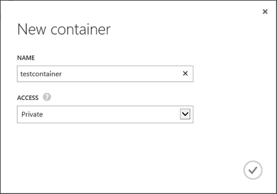

# Lesson 1: Create Windows Azure Storage Account and Container
  Before you can start storing SQL Server data files in Windows Azure Storage, you must first create a Windows Azure Storage account and a blob container, and a shared access signature. Lesson 1 walks you through the steps of logging into the Windows Azure Management Portal, creating a storage account, a blob container, and a shared access signature.  
  
 By default, only the owner of the storage account may access blobs, tables, and queues within that account. To be able to access these resources using this new SQL Server enhancement without sharing the storage account access key, you are required to do these:  
  
-   Set the container's permissions to private.  
  
-   Create a shared access signature. It enables you to delegate restricted access to a container, blob, table, or queue resource by specifying the interval for which the resources are available and the permissions that a client will have to it.  
  
-   Use a stored access policy to manage shared access signatures for a container or its blobs. The stored access policy gives you an additional measure of control over your shared access signatures and also provides a straightforward means to revoke them.  
  
 For more information, see [Manage Access to Windows Azure Storage Resources](https://msdn.microsoft.com/library/windowsazure/ee393343.aspx).  
  
## Create Storage Account  
 To create a storage account on the Windows Azure Management Portal, follow these steps:  
  
1.  Log in to the [Windows Azure Management Portal](https://manage.windowsazure.com) using your account. If you do not have a Windows Azure account, visit [Windows Azure free trial](http://www.windowsazure.com/pricing/free-trial/).  
  
       
  
2.  Use the step by step instructions to [create a storage account](http://azure.microsoft.com/documentation/articles/storage-create-storage-account/). Note that when creating a storage account to be used for the SQL Server Data Files in Windows Azure feature, you should unselect or disable the geo-replication. This is because write order is not guaranteed for multiple blobs participating in geo-replication. If a storage account is geo-replicated and recovery is required, a corruption occurs.  
  
       
  
## Create a Blob container  
 In Windows Azure, a container provides a grouping of a set of blobs. All blobs must be in a container. A storage account can contain an unlimited number of containers, but must have at least one container. A container can store an unlimited number of blobs. For most up-to-date information on storage size limits, see [How to use the Windows Azure Blob Storage Service in .NET](http://www.windowsazure.com/develop/net/how-to-guides/blob-storage/).  
  
 To create a container in Windows Azure, follow these steps:  
  
1.  Log in to the [Windows Azure Management Portal](https://manage.windowsazure.com).  
  
2.  Select the storage account, click the **CONTAINERS** tab and click **ADD CONTAINER** at the bottom of the screen, which opens a new dialog box.  
  
3.  Enter a name for the container.  
  
4.  Select **Private** for **Access Type**. When you set the access to private, the container and blob data can be read by the Windows Azure account owner only.  
  
       
  
> [!NOTE]  
>  To create a container programmatically, you can also use REST APIs. For more information, see [Create Container](https://msdn.microsoft.com/library/windowsazure/dd179468.aspx) and also [Windows Azure Storage Services REST API Reference](https://msdn.microsoft.com/library/windowsazure/dd179355.aspx).  
  
 **Next Lesson:**  
  
 [Lesson 2. Create a policy on container and generate a Shared Access Signature &#40;SAS&#41; key](../relational-databases/lesson-1-create-stored-access-policy-and-shared-access-signature.md)  
  
  
