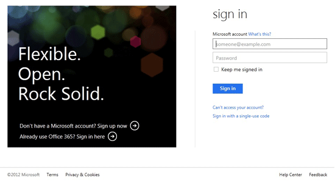
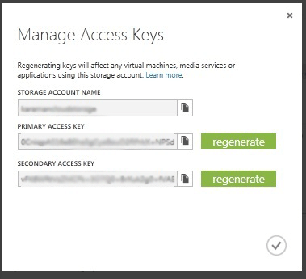
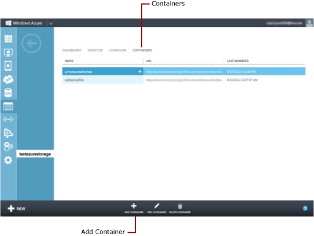

# Lesson 1: Create Windows Azure Storage Objects
  Before you can create [!INCLUDE[ssNoVersion](../includes/ssnoversion-md.md)] backups on cloud storage, you must first create a storage account, and then a blob container. Lesson 1 walks you through the steps of Logging into the Windows Azure Management Portal, creating a storage account and a blob container.  
  
## Create a storage Account  
 To create a storage account from the Windows Azure Management Portal, use the following steps:  
  
1.  Log in to the Windows Azure Management Portal using your account. If you do not have a Windows Azure account, [visit Windows Azure 3-Month free trial](https://go.microsoft.com/fwlink/?LinkId=271927).  
  
       
  
2.  Use the step by step instructions detailed [here](https://go.microsoft.com/fwlink/?LinkId=271926), to create a storage account.  
  
3.  Browse to the storage account you created in previous step. From the bottom center of the web page, click **MANAGE KEYS**. The account information is displayed. Copy the storage account name, and the Access Keys. This information is required to create SQL Stored Credentials. [!INCLUDE[ssNoVersion](../includes/ssnoversion-md.md)] uses this information to access the storage account and create backups.  
  
       
  
    > [!NOTE]  
    >  You can also create a storage account programmatically using REST APIs. For more information, see [Create Storage Account](https://go.microsoft.com/fwlink/?LinkId=271928).  
  
### Create a Blob Container  
 A container provides a grouping of a set of blobs. All blobs must be in a container. An account can contain an unlimited number of containers, but must have at least one container. A container can store an unlimited number of blobs.  
  
 To create a Container, use the following steps:  
  
1.  Select the storage account, click the **CONTAINERS** tab and click **ADD CONTAINER** at the bottom of the screen which opens a new dialog box.  
  
       
  
2.  Enter the name for the container. Make a note of the container name you specified. This information is used in the URL (path to backup file) in the T-SQL statements in lesson 3 and 4.  
  
3.  Select Private for **Access Type**. We recommend creating private containers for securing your backup files.  
  
       
  
    > [!NOTE]  
    >  Authentication to the storage account is required for [!INCLUDE[ssNoVersion](../includes/ssnoversion-md.md)] backup and restore even if you choose to create a public container.  
    >   
    >  You can also create a container programmatically using REST APIs. For more information, see [Create Container](https://go.microsoft.com/fwlink/?LinkId=271946).  
  
### Next Lesson  
 [Lesson 2: Create a SQL Server Credential](../../2014/tutorials/lesson-2-create-a-sql-server-credential.md).  
  
  
