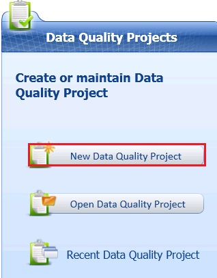
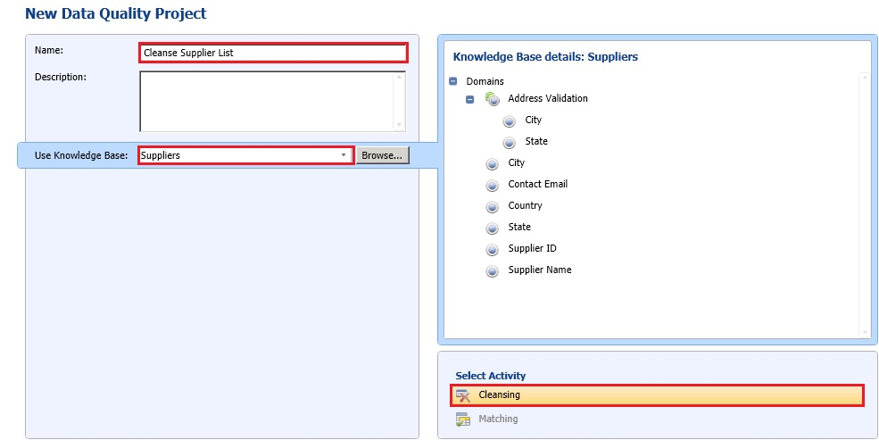

# Task 1: Creating a Data Quality Project
  In this task, you create a Data Quality Project for cleansing the supplier data in an Excel file against the Suppliers knowledge base you created earlier in this tutorial.  
  
1.  In the **Data Quality Project** pane on the main page, click **New Data Quality Project**.  
  
       
  
2.  Type **Cleanse Supplier List** for the **name** of project.  
  
3.  Select **Suppliers** for the **Use Knowledge Base** field. You will be cleansing input supplier data against the Suppliers knowledge base you created earlier in this tutorial.  
  
4.  Ensure that **Cleansing** is selected as the **activity** at the bottom of the right pane and click **Next**.  
  
       
  
## Next Step  
 [Task 2: Mapping Excel Columns to DQS Domains](../../2014/tutorials/task-2-mapping-excel-columns-to-dqs-domains.md)  
  
  
