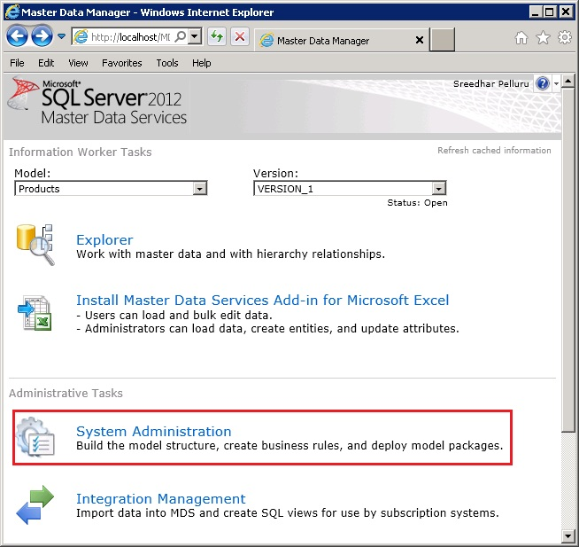
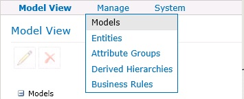
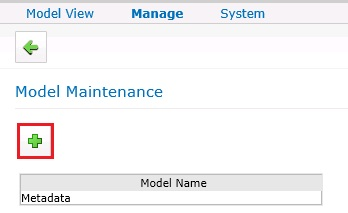
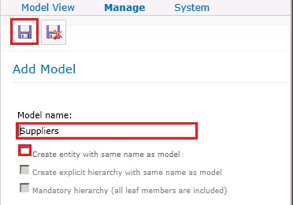

# Task 1: Creating Suppliers Model using Master Data Manager
  In this task, you create a model named **Suppliers** in MDS using **Master Data Manager**.  
  
1.  Navigate to [http://localhost/mds](http://localhost/mds) to launch **Master Data Manager**. Replace the URL if you have configured Web Application with a different name or on a different a web site.  
  
       
  
2.  Click **System Administration** in the **Administrative Tasks** section.  
  
3.  If you do not see the **Add Model** page, hover mouse over **Manage** on the menu bar, click **Models**, and then click **Add Model (+)** toolbar button to create a model.  
  
       
  
       
  
4.  Enter **Suppliers** for **Model name**.  
  
5.  Clear **Create entity with same name as model** option. You will create an entity later using the **MDS Add-in for Excel**.  
  
       
  
6.  Click **Save Model** button on the toolbar.  
  
## Next Step  
 [Task 2: Uploading Supplier Data to MDS using MDS Add-in for Excel](../../2014/tutorials/task-2-uploading-supplier-data-to-mds-using-mds-add-in-for-excel.md)  
  
  
