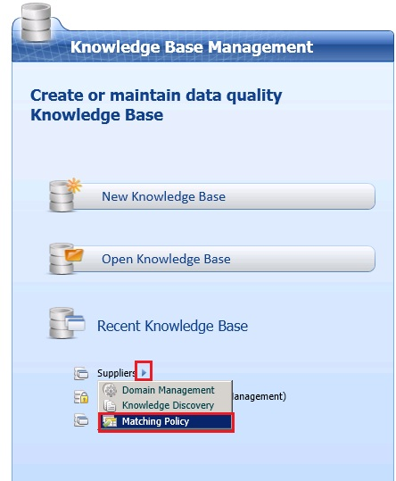
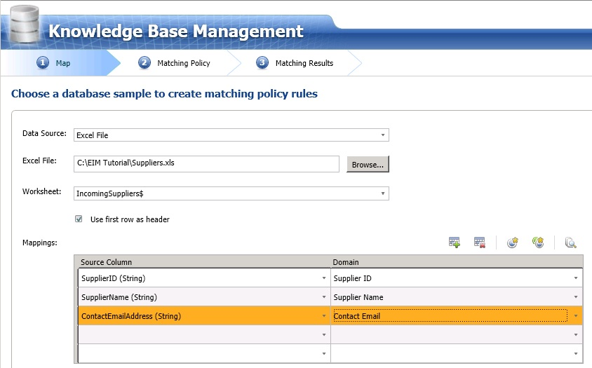
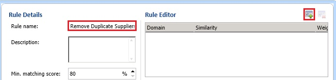
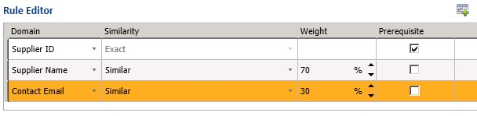

# Task 1: Defining a Matching Policy
  In this task, you create a matching policy with one rule in it. The rule will have one prerequisite: **Supplier ID**, which means that the Supplier IDs must match before using the other domains in the rule. The rule uses two other domains: **Supplier Name** with **Similarity** value set to **70%** and **Contact Email** with **Similarity** value set to **30%**.  
  
1.  In the main page of **DQS Client**, click **right-arrow** next to **Suppliers** knowledge base, and select **Matching Policy**.  
  
       
  
2.  On the **Map** page, select **Excel File** for **Data Source**.  
  
3.  Click **Browse**, ensure that filter is set to **Excel Workbook**, and select **Cleansed Supplier List.xls** file that you exported after you perform the cleansing activity.  
  
    > [!NOTE]  
    >  At the end of this activity, you cannot export results because this activity is primarily focused on defining a matching policy. You will create a Data Quality Project for the Matching activity and run it to remove duplicates from the supplier list by using this matching policy in the next lesson.  
  
4.  Map **SupplierID** column to **Supplier ID** domain, **Supplier Name** column to **Supplier Name** domain, **ContactEmailAddress** column to **Contact Email** domain. You only need to map source columns to domains that you want to use in defining the matching policy. In this case, you are making the Supplier ID, Supplier Name, and Contact Email domains available for the matching policy activity.  
  
       
  
5.  Click **Next** to move to the **Matching Policy** page where you will be defining a matching policy with one rule in it.  
  
6.  Click **Create a matching rule** button on the toolbar to create a rule in the policy.  
  
       
  
7.  In the **Rule Details** pane on the right, enter **Remove Duplicate Suppliers** for the **Rule name**.  
  
8.  Click **Add a new domain element** in the toolbar in the right pane.  
  
       
  
9. Select **Supplier ID** for the **domain** and select the **Prerequisite** check box. Notice that **Similarity** is automatically set to **Exact**. By setting **Supplier ID** as the **Prerequisite**, you specify that the values for this field in the two records must return a 100% match, else the records are not considered a match and the other clauses in the rule are disregarded.  
  
       
  
10. Click **Add a new domain element** from the toolbar again.  
  
11. Select **Supplier Name** domain, select **Similar** for **Similarity**, and Type **70** for the **Weight**.  Here, you are specifying that supplier names do not need to be identical but can be similar for the records to be considered as a match. The weight indicates the contribution of this field's score to the overall matching score.  
  
12. Repeat previous two steps to add **Contact Email** domain with **30** for the **Weight**.  
  
13. Notice that the **min matching score** is set to **80%**, which is the value you see in the **General** tab of the **Configuration** page of **DQS Administration**. You can only increase this score above this threshold value here.  
  
14. Notice that **Overlapping Clusters** option is selected. With this option, a record can show up in multiple clusters. If you change the setting to Non-Overlapping Clusters, the clusters that have common records are combined into one single cluster.  
  
15. The **Start** button on this page allows you to test each rule in the policy separately, whereas, the Start button in the next page allows you to test entire policy (all the rules in the policy).  
  
16. Click **Next** to switch to the **Matching Results** page.  
  
## Next Step  
 [Task 2: Testing and Publishing the Matching Policy](../../2014/tutorials/task-2-testing-and-publishing-the-matching-policy.md)  
  
  
