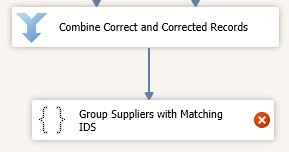
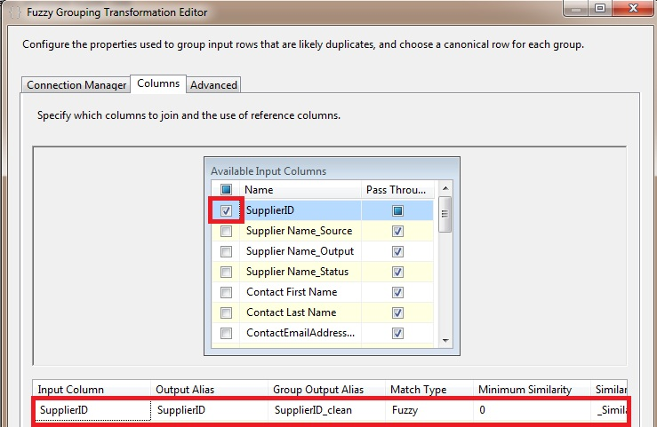

# Task 10: Adding Fuzzy Group Transform to Identify Duplicates
  In this task, you add a Fuzzy Group Transform to the data flow. The Fuzzy Group transformation can help identify duplicates in the source data. See [Fuzzy Grouping Transformation](../integration-services/data-flow/transformations/fuzzy-grouping-transformation.md) for more details.  
  
1.  Drag-drop **Fuzzy Group** transform in **Other Transforms** on the **SSIS Toolbox** to the **Data Flow** tab under **Combine Correct and Corrected Records**.  
  
2.  Right-click **Fuzzy Group** Transform in the **Data Flow** tab, and click **Rename**. Type **Group Suppliers with matching IDs** and press **ENTER**.  
  
3.  Connect **Combine Correct and Corrected Records** to **Group Suppliers with matching IDs** using the blue connector.  
  
       
  
4.  Double-click **Group Suppliers with matching IDs**.  
  
5.  In the **Fuzzy Group Transformation Editor**, click **New** next to **OLE DB Connection Manager drop-down list** to launch **Configure OLE DB Connection Manager** dialog box.  
  
6.  In the dialog box, click **New** to launch **Connection Manager** dialog box.  
  
7.  Type **(local)** or **period** (.) for the Server name.  
  
8.  Select **MDS** for **Select or enter a database name** field. You will use the MDS database as the temporary storage for the **Fuzzy Group Transform**. The **Fuzzy Grouping** transformation requires a connection to an instance of SQL Server to create the temporary SQL Server tables that the transformation algorithm requires to do its work. You can create a database or use another existing database for this purpose.  
  
9. Click **Test Connection** to test the connection and click **OK** on the message box.  
  
10. In the **Connection Manager** dialog box, click **OK**.  
  
11. Select **(local).MDS** (or **localhost.MDS**) from the **list of Data Connections** and click **OK**.  
  
12. In the **Fuzzy Grouping Transformation Editor**, confirm that **(local).MDS** or **localhost.MDS** is selected for the **OLE DB Connection Manager**.  
  
13. Switch to the **Columns** tab.  
  
14. Select (check box) **SupplierID_Output** from the list of **Available Input Columns**. To configure the transformation, select the input columns to use when identifying duplicates. To keep it simple, you only use the SupplierID in this step.  
  
       
  
15. Click **OK** to close the **Fuzzy Group Transformation Editor**.  
  
## Next Step  
 [Task 11: Adding Conditional Split Transform to Filter Duplicates](../../2014/tutorials/task-11-adding-conditional-split-transform-to-filter-duplicates.md)  
  
  
