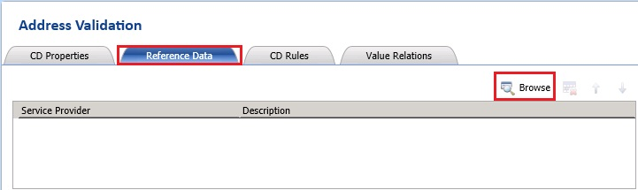
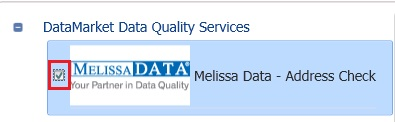
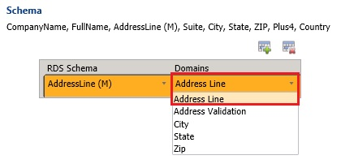
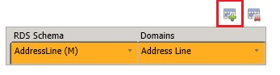
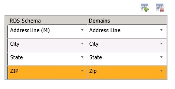

# Task 10: Configuring Composite Domain to Use Reference Data Service
  In this task, you configure the **Address Validation** composite domain to use the **Melissa Data - Address Check** service. At runtime, during cleansing activity, DQS passes the values of domains in the Address Validation domain to the service for cleansing. See [Map Domain/Composite Domain to Reference Data](https://msdn.microsoft.com/library/hh213030.aspx) for more details.  
  
1.  In the main page of **DQS Client**, click **Suppliers (Domain Management)** under **Recent Knowledge Bases** to launch the **Domain Management** page.  
  
2.  Select the **Address Validation** composite domain in the **list of domains**.  
  
3.  In the right pane, switch to the **Reference Data** tab.  
  
       
  
4.  Click **Browse** button on the toolbar.  
  
5.  On the **Online Reference Data Providers Catalog** dialog box, select **check box** next to **Melissa Data - Address Check**.  
  
       
  
6.  In the right pane, in the **Schema** section, map **Address Line** domain to the **Address Line (M)** schema item by using the drop-down list.  
  
       
  
7.  Click **Add Schema Entry (+)** button on the toolbar to create an entry in the list.  
  
       
  
8.  Map the following DQS domains by using the drop-down lists as shown in the following picture.  
  
       
  
9. Click **OK** to close the dialog box.  
  
## Next Step  
 [Task 11: Publishing the Knowledge Base](../../2014/tutorials/task-11-publishing-the-knowledge-base.md)  
  
  
