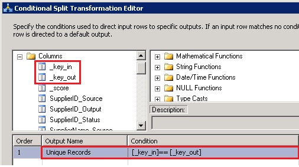

# Task 11: Adding Conditional Split Transform to Filter Duplicates
  In this task, you add the Conditional Split Transform to the data flow. This transform helps you filter duplicates from the incoming record set. The Fuzzy Group transform groups the records that it finds to be matches and picks one of the records as a pivot record. All the records in a group have the same _key_out value. The pivot record in the group has _key_in same as the _key_out value. The other records in the group have different values for _key_in and _key_out. Therefore, when you filter using the condition _key_in==_key_out, you only get the pivot row in the group.  
  
1.  Drag-drop **Conditional Split** Transform from **Common** section in the **SSIS Toolbox** to the **Data Flow** tab.  
  
2.  Right-click **Conditional Split Transform** in the **Data Flow** tab, and click **Rename**. Type **Filter Duplicates** and press **ENTER**.  
  
3.  Connect **Group Suppliers with Matching IDs** to **Filter Duplicates**.  
  
4.  Double-click **Filter Duplicates** to launch the **Conditional Split Transform Editor** dialog box.  
  
5.  Expand **Columns** in the top-left pane.  
  
6.  Drag-drop **_key_in** to the **Condition** column.  
  
7.  Type == (equals to) next to **_key_in** and drag-drop **_key_out**.  
  
8.  Click **Case 1** in the **Output Name** column, type **Unique Records**, and press **ENTER**.  
  
       
  
9. Click **OK** to close the **Conditional Split Transformation Editor** dialog box.  
  
## Next Step  
 [Task 12: Adding Derived Column Transform to Add Columns Required by MDS](../../2014/tutorials/task-12-adding-derived-column-transform-to-add-columns-required-by-mds.md)  
  
  
