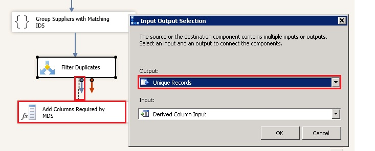
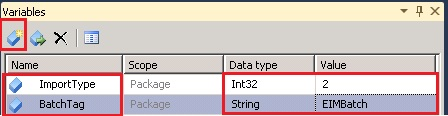
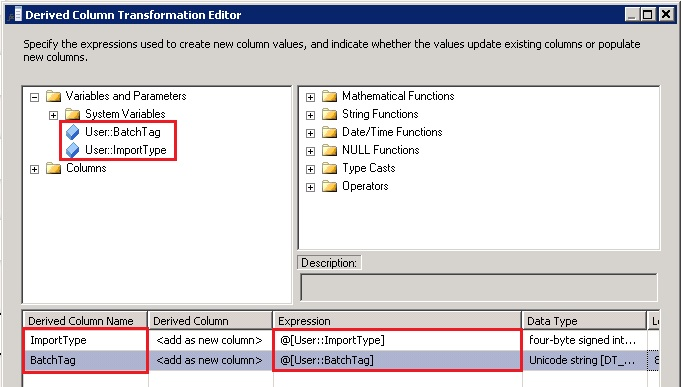

# Task 12: Adding Derived Column Transform to Add Columns Required by MDS
  In this task, you add the Derive Column Transform to the data flow. You add two derived columns, **ImportType** and **BatchTag**, to the records passed to this transform. You should add these columns before uploading the data to staging tables in MDS. These two are required columns for the staging tables in MDS. See [Leaf Member Staging Tables](../master-data-services/leaf-member-staging-table-master-data-services.md) for more details.  
  
1.  Drag-drop **Derived Column transform** from **Common** section in the **SSIS Toolbox** to the **Data Flow** tab.  
  
2.  Right-click **Derived Column** Transform in the **Data Flow** tab, and click **Rename**. Type **Add Columns Required by MDS** and press **ENTER**.  
  
3.  Connect **Filter Duplicates** to **Add Columns Required by MDS** using the blue connector. You should see the **Input Output Selection** dialog box.  
  
4.  In the **Input Output Selection** dialog box, select **Unique Records**, and click **OK**.  
  
       
  
5.  Click **SSIS** on the menu bar and click **Variables**.  
  
6.  In the **Variables** window, click **Add Variable** button on the toolbar.  
  
       
  
7.  Type **ImportType** for the **Name** and **2** for the **value**. You specify the value as 2 because you want to add new members to an entity in MDS. For details about this parameter, see [Leaf Member Staging Table](../master-data-services/leaf-member-staging-table-master-data-services.md).  
  
8.  Click **Add Variable** toolbar button again.  
  
9. Type **BatchTag** for the **Name**, select **String** for the **Data type**, and **EIMBatch** for the **Value**. **BatchTag** is just a unique name for the batch you will be submitting to MDS.  
  
10. In the **Data Flow** tab, double-click **Add Columns Required by MDS**.  
  
11. In the **Derived Column Transformation Editor** dialog box, in the **list box in the bottom pane**, type **ImportType** for the **Derived Column Name**.  
  
12. Expand **Variables and Parameters** in the top-left pane, drag-drop **User::ImportType** to the **Expression** column.  
  
       
  
13. Type **BatchTag** in the next row for the **Derived Column Name**.  
  
14. Drag-drop **User::BatchTag** from **Variables and Parameters** to the **Expression** column.  
  
15. Click **OK** to close the **Derived Column Transformation** dialog box.  
  
## Next Step  
 [Task 13: Adding OLE DB Destination to Write Data to MDS Staging Table](../../2014/tutorials/task-13-adding-ole-db-destination-to-write-data-to-mds-staging-table.md)  
  
  
