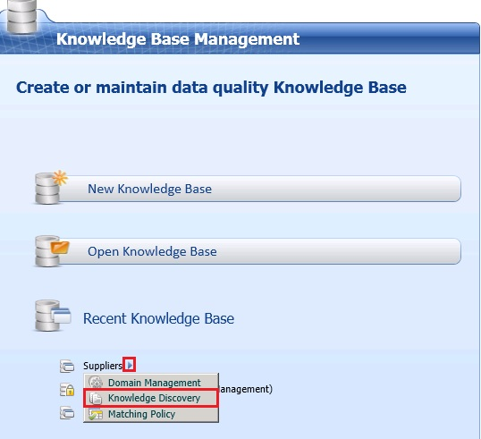
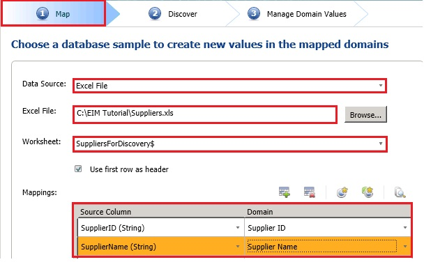
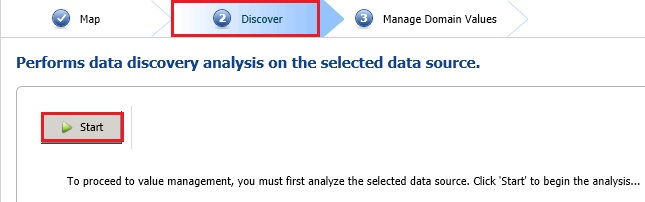
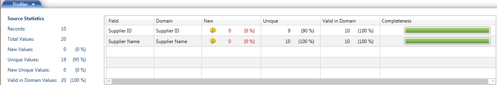
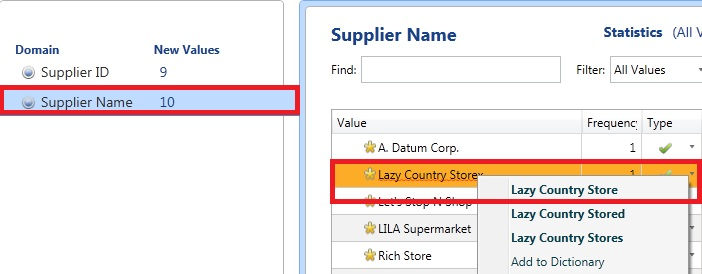
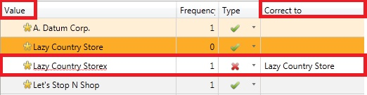

# Task 12: Discovering Knowledge (Knowledge Discovery)
  In this task, you perform the **Knowledge Discovery** activity on **Supplier ID** and **Supplier Name** domains. In this scenario, the knowledge discovery process mainly imports values for these two domains.  
  
 In this tutorial, you started building knowledge base from scratch. You can also start creating a knowledge base by performing a knowledge discovery activity. When you click **Create a Knowledge Base** in the main page, DQS client takes you to a page with **Domain Management** activity selected for the activity. You can change the **activity** to **Knowledge Discovery** and then in the next page you can create domains as part of the knowledge discovery process. See [Perform Knowledge Discovery](https://msdn.microsoft.com/library/hh510398.aspx) for more details.  
  
1.  In the main page of DQS Client, in the **Recent Knowledge Base** section, click **right-arrow** next to the **Suppliers** knowledge base and click **Knowledge Discovery**. Alternatively, you can click **Open Knowledge Base**, select **Suppliers** from the **list of knowledge bases**, select **Knowledge Discovery** as **activity** and click **Next**.  
  
       
  
2.  Select **Excel File** for **Data Source**.  
  
3.  Click **Browse**, navigate and select **Suppliers.xls**, and click **Open**.  
  
4.  Select **Suppliers for Discovery** for **Worksheet**.  
  
5.  In the **Mappings** section, map **SupplierID** column from the **Excel** file to the **Supplier ID** domain and **Supplier Name** column to the **Supplier Name** domain by using **drop-down lists**. The Excel file has sample data for the **Supplier ID** and **Supplier Name** domains. In the discovery process, you can select the domains for which you want to discover the values. You can create domains on this page and then map the source columns to those domains. It is not uncommon to create domains during knowledge discovery activity instead of creating domains during domain management activity.  
  
       
  
6.  Click **Next** to switch to the **Discover** page.  
  
7.  On the **Discover** page, click **Start** to start the discovery process. Discovery is performed on the columns **SupplierID** and **Supplier Name** in the **Suppliers.xls** file. The **Supplier ID** and **Supplier Name** domains should be populated with the knowledge drawn from the discovery.  
  
       
  
8.  After the analysis has completed, review the **Source Statistics** in the **Profiler tab** at the bottom of the page. Notice that 10 new records with total 20 values (**SupplierID** and **Supplier Name** values from the **Excel worksheet**) were discovered. You will also see how many of the values are new, unique, new and unique, and valid. In the list box to the right, you can see more details for each domain involved in the discovery process. If you hover the mouse over the status bar in the Completeness column, you can see if there are any missing values in the columns in the source.  
  
       
  
9. Click **Next** to switch to the **Manage Domain Values** page.  
  
10. In the **Manage Domain Values** page, click **Supplier Name** domain from the list of domains.  
  
11. In the right pane, right-click **Lazy Country Storex** (notice 'x' at the end), and select **Lazy Country Store**. DQS suggests this change after running the spell checker on the domain. By default, speller is enabled on the domains you create.  
  
       
  
12. In the domain values list, confirm that the value **Lazy Country Storex** is set as an error (red **X** mark) with **Lazy Country Store** as the correction and also the **Lazy Country Store** is also added as a valid value.  
  
       
  
13. Click **Finish**.  
  
14. On **SQL Server Data Quality Services** dialog box, click **Publish**.  
  
15. Click **OK** on the success message box.  
  
     You have completed the first lesson of the tutorial.  
  
## Next Step  
 [Lesson 2: Cleansing Supplier Data using the Suppliers Knowledge Base](../../2014/tutorials/lesson-2-cleansing-supplier-data-using-the-suppliers-knowledge-base.md)  
  
  
