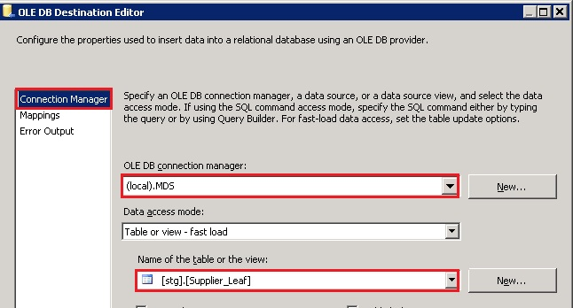
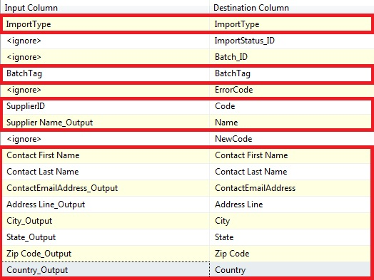
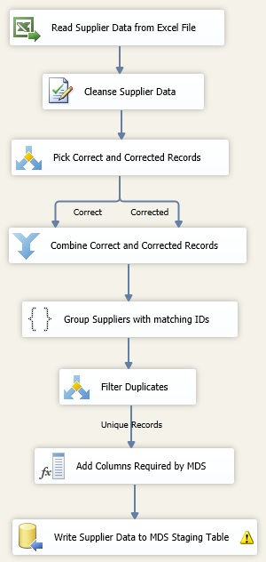

# Task 13: Adding OLE DB Destination to Write Data to MDS Staging Table
  Now that you have added **ImportType** and **BatchTag** values to all records, you are ready to send them over to MDS for staging. In this task, you use the OLE DB Destination to write the data into **stg.supplier_Leaf** staging table.  
  
1.  Drag **OLE DB Destination** from **Other Destinations** section in the **SSIS Toolbox** to the **Data Flow** tab and drop it under **Add Columns Required by MDS**.  
  
2.  Right-click **OLE DB Destination** in the **Data Flow** tab, and click **Rename**. Type **Write Supplier Data to MDS Staging Table** and press **ENTER**.  
  
3.  Connect the **Add Columns Required by MDS** to **Write Supplier Data to MDS Staging Table** using the blue connector.  
  
4.  Double-click **Write Supplier Data to MDS Staging Table** in the **Data Flow** tab.  
  
5.  In the **OLE DB Destination Editor** Dialog box, make sure that **(local).MDS** (or **localhost.MDS**) is selected for the **OLE DB Connection Manager** field.  
  
6.  Select **stg.Supplier_Leaf** table from the list of **Name of the table or the view**.  
  
       
  
7.  Switch to the **Mappings** page by clicking **Mapping** on the menu on left.  
  
8.  Map **input** and **destination** columns as shown in the following table.  
  
       
  
9. Confirm that you are using **_Output** columns for Input Columns, not the **_Status** or **_Source** columns. **_Output** columns contain the output values from DQS Cleansing.  
  
10. Click **OK** to close the **OLE DB Destination Editor** dialog box.  
  
11. The data flow should like the following image.  
  
       
  
## Next Step  
 [Task 14: Adding Execute SQL Task to Control Flow to Run the Stored Procedure for MDS](../../2014/tutorials/task-14-add-execute-to-control-flow-run-mds-stored-procedure.md)  
  
  
