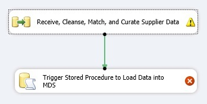
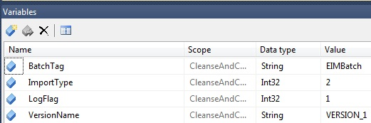
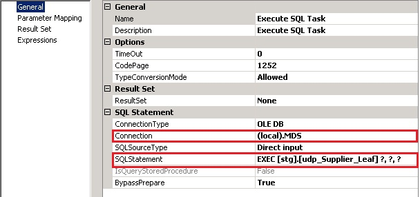
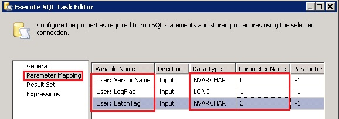

# Task 14: Adding Execute SQL Task to Control Flow to Run the Stored Procedure for MDS
  After loading data into the staging tables of MDS, you run a stored procedure associated with that table to load the data from staging into the appropriate tables in the MDS database. This stored procedure has two required parameters that you need to pass: LogFlag and VersionName. LogFlag specifies whether transactions are logged during the staging process and VersionName represents the version of the model. See [Staged Stored Procedure](https://msdn.microsoft.com/library/hh231028.aspx) topic for more details.  
  
 In this task, you add the Execute SQL Task to the control flow to invoke the stored procedure to load the staged data into appropriate MDS tables.  
  
1.  Now, switch to the **Control Flow** tab.  
  
2.  Drag-drop **Execute SQL Task** from the **SSIS Toolbox** to the **Control Flow** tab.  
  
3.  Right-click **Execute SQL Task** in the **Control Flow** tab, and click **Rename**. Type **Trigger Stored Procedure to Load Data into MDS** and press **ENTER**.  
  
4.  Connect **Receive, Cleanse, Match, and Curate Supplier Data** to **Trigger Stored Procedure to Load Data** using the green connector.  
  
       
  
5.  Using the **Variables** window, add two new variables with the following settings. If you do not see the **Variables** window, click **SSIS** on the menu bar and click **Variables**.  
  
    |Name|Data Type|Value|  
    |----------|---------------|-----------|  
    |LogFlag|Int32|1|  
    |VersionName|String|VERSION_1|  
  
       
  
6.  Double-click **Trigger Stored Procedure to Load Data into MDS**.  
  
7.  In the **Execute SQL Task Editor** dialog box, select **(local).MDS** (or **localhost.MDS**) for **Connection**.  
  
8.  Type **EXEC [stg].[udp_Supplier_Leaf] ?, ?, ?** for **SQL Statement**. You can verify the name by using SQL Server Management Studio.  
  
       
  
9. Click **Parameter Mapping** from the menu on left.  
  
10. In the **Parameter Mapping** page, click **Add** to add a mapping. Maximize the window and resize columns so that you can see values in drop-down lists properly.  
  
11. Select **User::VersionName** from the drop-down list for the **Variable Name**.  
  
12. Select **NVARCHAR** for **Data Type**.  
  
13. Type **0** (zero) for **Parameter Name**.  
  
14. Repeat the previous four steps to add two more variables.  
  
    |Variable Name|Data Type (important)|Parameter Name|  
    |-------------------|-----------------------------|--------------------|  
    |User::LogFlag|LONG|1|  
    |User::BatchTag|NVARCHAR|2|  
  
       
  
15. Click **OK** to close the **Execute SQL Editor** dialog box.  
  
## Next Step  
 [Task 15: Building and Running the SSIS Project](../../2014/tutorials/task-15-building-and-running-the-ssis-project.md)  
  
  
